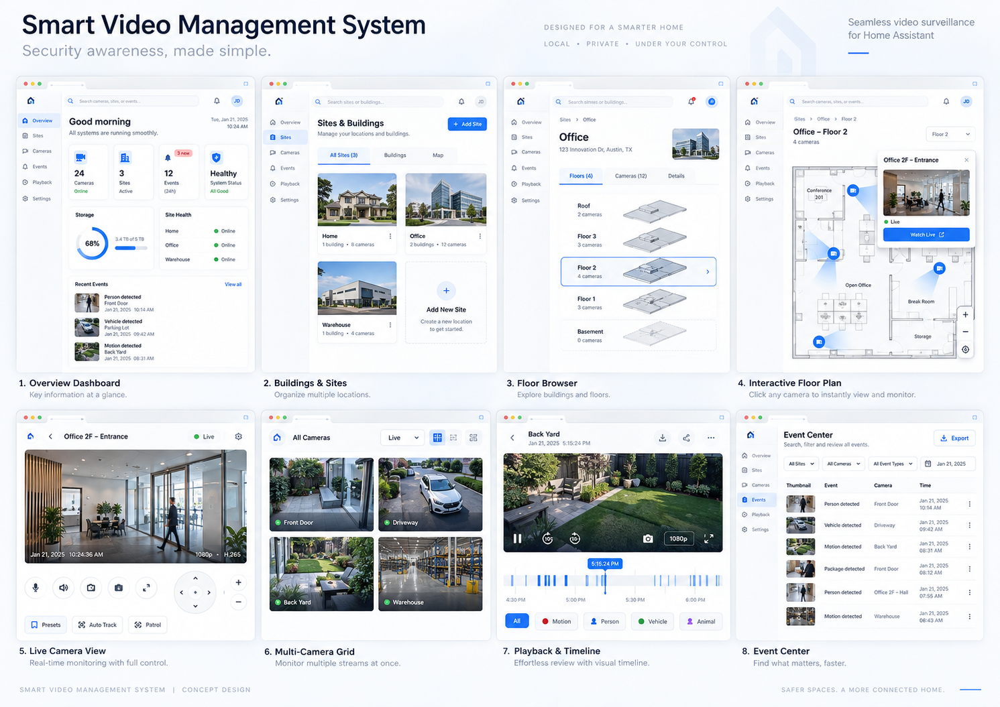
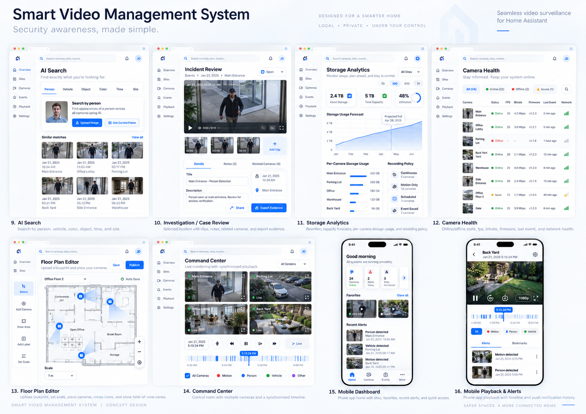
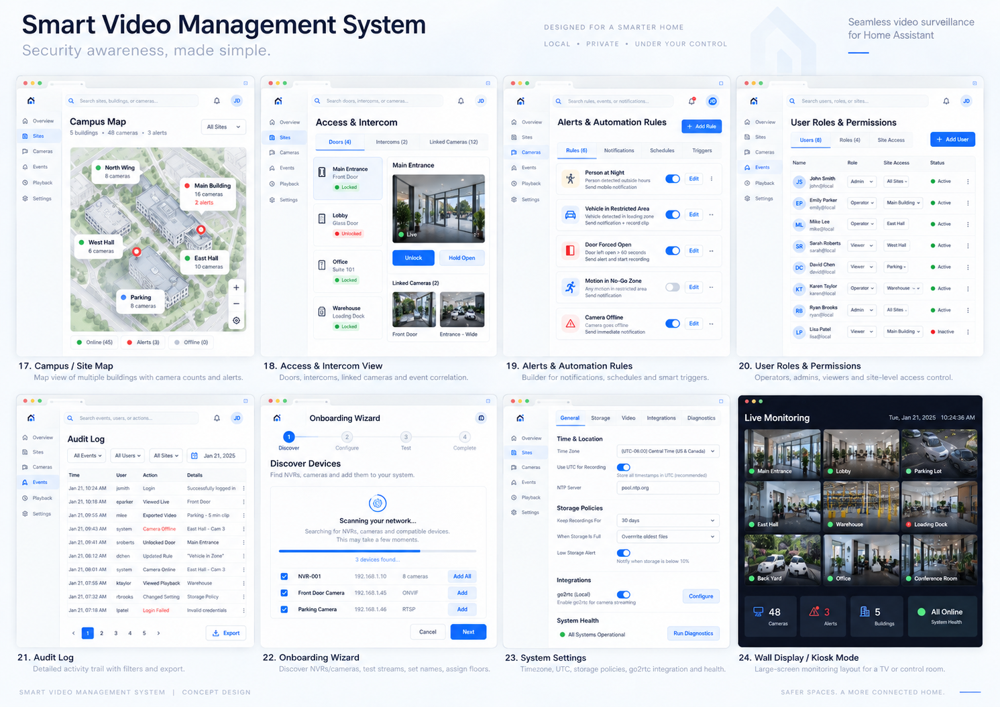

# SMPLWISE VMS — Master Development Specification

**Version:** 1.1.0-planning | **Date:** 14.09.2026 | **Language:** Hebrew

> מפרט ותיק ניהול פיתוח. אין כאן מימוש VMS, התחברות לציוד או דו״ח בדיקות שעברו.

> **עדכון 1.1:** זהות משתמשים מ־HA ותפקידי VMS עצמאיים בהיקף מוגדר הם P0 בפיילוט. פרק 40 וחוזה האבטחה המקושר מחדדים כל אזכור ישן של ״הרשאות בסיס״. מהדורת Word/PDF 1.0 נשמרה בארכיון; Markdown זה הוא המפרט המאוחד העדכני.

## תוכן העניינים

- 01 | מטרת המערכת והסכם העבודה
- 02 | החלטות מחייבות והנחות שדורשות אימות
- 03 | למידה מהמערכת הישנה
- 04 | מעבר מדורג ללא פגיעה במערכת הפעילה
- 05 | מה לומדים מ־UniFi Protect
- 06 | גרסאות, עדיפויות ויעדי מסירה
- 07 | ארכיטקטורה וגבולות אחריות
- 08 | פריסה, גישה ואבטחת המערכת
- 09 | מודל הנתונים
- 10 | המפות: היררכיה ושימוש יומיומי
- 11 | ייבוא תוכניות אדריכליות
- 12 | עורך מפות ומיקומי ציוד
- 13 | מפה חיה, צפייה ופעולות מהירות
- 14 | ייבוא כל ישויות Home Assistant
- 15 | סנכרון מצבים ופקודות בטוחות
- 16 | מפה היסטורית וחקירה מרחבית
- 17 | AI לתוכניות: שפה אחידה ללא המצאת גאומטריה
- 18 | תיקוף גאומטריה ופרומפטים
- 19 | Hikvision Core ו־Capability Matrix
- 20 | זמן, UTC וגבולות שעון קיץ
- 21 | go2rtc ונתיבי המדיה
- 22 | Live, תצוגות שמורות ופקדי מצלמה
- 23 | חיפוש הקלטות, Timeline ו־Cache
- 24 | מנוע Playback ו־Seek
- 25 | Playback מסונכרן של כמה מצלמות
- 26 | אירועים, Review ו־Spotlights
- 27 | תיקים, יצוא ושימור ראיות
- 28 | התראות, אוטומציות וקורלציה עם המבנה
- 29 | יכולות AI מתקדמות והגבולות שלהן
- 30 | בריאות, אחסון ותפעול
- 31 | שפת עיצוב ובדיקות חזותיות
- 32 | API פנימי ואירועי WebSocket
- 33 | ביצועים ודרישות לא פונקציונליות
- 34 | תוכנית בדיקות ושערי שחרור
- 35 | ניהול פיתוח, משימות ו־Definition of Done
- 36 | עבודה עם Codex, מודלים ותקציב
- 37 | ספרינט ראשון בן שבעה ימי עבודה
- 38 | סיכונים, תלות ואחריות החלטה
- 39 | תחזוקה, שיפור והעברת הפרויקט
- 40 | משתמשי HA, קבוצות ותפקידי VMS — הרחבת 1.1 מחייבת

---

## 01 | מטרת המערכת והסכם העבודה
*מוצר אחד: מצלמות, הקלטות וישויות מבנה על מפה חיה*

SMPLWISE VMS היא מערכת מקומית לניהול וידאו ומבנה, המיועדת לפעול לצד Home Assistant. מפה של אתר, מבנה וקומה היא משטח העבודה המרכזי; ממנה צופים במצלמה, חוזרים להקלטה, בודקים אירוע ומפעילים ישות מורשית. ה־Hikvision NVR נשאר אחראי להקלטה הרציפה ולאחסון המקור. המוצר אינו מחליף את מנגנוני הבטיחות או האבטחה של הציוד.

### מסלול הערך הראשי

אתר ← מבנה ← קומה ← תוכנית ← בחירת מצלמה או ישות ← פעולה בהקשר. המשתמש לא נדרש להכיר RTSP, מזהי Track, XML, YAML או הפרשי UTC. מעבר בין מפה, וידאו וחקירה שומר תמיד את המצלמות שנבחרו, הזמן והאזור.

### כללי יסוד מחייבים

המפות והעיצוב נבנים יחד עם ה־Backend, לא לאחריו. לומדים מהמערכת הישנה לפני החלפת קוד עובד. כל יכולת תלויה בראיות מהציוד ובבדיקות קבלה. כל נתון שאינו ידוע מוצג כלא ידוע; אין להציג וידאו מדומה, זמן משוער או מצב דלת משוער כאילו אומתו.

יש ארבעה אזורי ניווט בלבד: Live, Explore, Investigate, System. ברירת המחדל באתר עם תוכניות היא Explore. מסכי משנה, מגירות פעולה ועורכים אינם הופכים לפריטי תפריט ראשי נוספים. עברית ו־RTL נדרשות מההתחלה; התמיכה באנגלית נשמרת באמצעות מפתחות תרגום.

### מעמד החבילה

זהו מפרט פיתוח מחייב ברמת היעד, לא הצהרה שהמערכת כבר מומשה. קובצי ניהול המשימות, הדרישות והבדיקות מאפשרים לעקוב אחרי ההתקדמות. קוד המערכת הישנה והציוד עצמם לא נבדקו בהרצה במסגרת הכנת המסמך; חמשת קובצי האפיון ההיסטוריים שאותרו מצורפים כידע קודם בלבד.

> הצלחה אינה מספר המסכים שנבנו: היא היכולת לפתוח קומה, לראות מצב אמיתי, לצפות בהקלטה בזמן הנכון ולבצע פעולה מורשית בלי לאבד הקשר.


---

## 02 | החלטות מחייבות והנחות שדורשות אימות
*מונעים מהנחות מוקדמות להפוך לבאגים בארכיטקטורה*

| נושא | החלטת המפרט |
| --- | --- |
| צורת המוצר | Add-on ייעודי עם ממשק Web; go2rtc חיצוני; אינטגרציית HA דקה וקלפי Lovelace בהמשך. |
| מערכת ישנה | Reuse-first. אין Rewrite כולל ללא מיפוי, בדיקות השוואה והחלטת ADR מנומקת. |
| מנוע וידאו | go2rtc מעביר מדיה. מנוע Playback, ניהול זמן, חיפוש וסנכרון הם אחריות המוצר. |
| נתוני זמן | UTC פנימי; אזור זמן IANA בתצוגה. התנהגות כל endpoint של כל Firmware נבדקת בנפרד. |
| ישויות HA | ייבוא קטלוג מותר ורחב; הצבה על המפה ויכולת שליטה הן הרשאות נפרדות. |
| שבוע ראשון | יעד Pilot מותנה בבדיקות. אין התחייבות ל־V1 מלאה, Enterprise או כל יכולות AI בשבעה ימים. |
| עיצוב | שלוש לוחות ההדמיה המצורפים הם מקור השפה החזותית; אינם 24 מסכים מפורטים ומאושרים לפיתוח. |

### תיקונים חשובים לתפיסה ההנדסית

שינוי מקור Stream קיים אינו מוכיח שהדפדפן המחובר יעבור אליו ללא ניתוק. API של go2rtc עשוי לשמור שינויים בקובץ ההגדרות; אין להניח שכל Stream הוא זמני בזיכרון. הפרדת go2rtc מפחיתה אחריות להפצתו אך אינה מבטלת צורך לבדוק תאימות API, אבטחה וגרסאות. [S08–S09]

הדפדפן לא מקבל סיסמאות NVR או API ניהול של go2rtc. עם זאת, מדיית WebRTC עשויה לעבור ישירות בין הדפדפן למנוע המדיה באמצעות ICE. API אחיד אינו אומר שכל חבילות הווידאו עוברות דרך Home Assistant. Ingress תומך ב־HTTP וב־WebSocket; הוא אינו פתרון אוטומטי לנתיב מדיה UDP. [S07–S08]

Hash ליצוא מוכיח שקובץ תואם ל־Hash שנשמר, לא שהצילום אותנטי מאז המצלמה. תוצאת AI או מסלול בין מצלמות היא השערה עד לאימות. חיבור למודלים לפי שמות תצוגה אינו תחליף לאימות מזהי המודלים וההרשאות בפועל.

**משימות מקושרות:** T008


---

## 03 | למידה מהמערכת הישנה
*שלב G0: לשמר ידע מוכח לפני פיתוח התחליף*

נמצאו וצורפו CODEX_PROMPT.md, CODEX_PROMPT_V2.md, API_MAPPING_V2.md, UX_RESEARCH_NOTES_V2.md ו־DESIGN_SYSTEM_V2.md. הם מתארים תצוגות שמורות, כינויים מקומיים, מיפוי ערוצים, Playback, אירועים ופקדים מותני־יכולת. הם אינם הוכחה שהקוד המותקן מממש את כל הסעיפים. [L01–L05]

### חומרי הקלט הנדרשים לבדיקת הקוד

עותק Repository או ZIP של הגרסה הפעילה, Commit מדויק, הוראות הפעלה, גרסאות Dependencies, מבנה מסד נתונים, הגדרות ללא סודות, דגם ו־Firmware של NVR, מיפוי ערוצים ו־go2rtc, רשימת תקלות מוכרות ודוגמאות אנונימיות של בקשות ותשובות. זהות המקור הישן תירשם במפורש; אין לבלבל בינו לבין פרויקט האינטרקומים.

| פעולה | תוצר נדרש |
| --- | --- |
| הקפאה | Tag או Snapshot של הגרסה העובדת + Hash; גיבוי הגדרות ונתונים לפני כל שינוי. |
| מיפוי | LEGACY_AUDIT: מודולים, תלויות, API, סכמות, סודות, נתיבי וידאו ונקודות כשל. |
| הקלטת התנהגות | Fixtures מצונזרים: חיפוש, עימוד, URI, אירוע, שינוי זמן, ניתוק ושגיאת הרשאה. |
| מיון | לכל רכיב: reuse / wrap / refactor / replace; עם סיבה וראיית בדיקה. |
| השוואה | אותה מצלמה ואותו טווח זמן במערכת הישנה והחדשה; השוואת תוצאות ופריימים. |
| רישום ידע | KNOWN_QUIRKS: דגם, Firmware, תנאי שחזור, פתרון, בדיקה שמונעת חזרה. |

### כלל מיזוג

אין למחוק Client ISAPI עובד בגלל העדפה אסתטית. עוטפים אותו ב־Adapter עם חוזה ברור ומחליפים בהדרגה רק רכיבים שבדיקות מראות צורך לשנות. אם הרישיון או מקור קטע קוד אינם ברורים, מבודדים אותו עד לבירור ואינם מפרסמים אותו.

> Gate G0 לא נסגר על סמך מסמך היסטורי: נדרשת הרצה חוזרת של המסלולים הקריטיים על המקור הישן. בהיעדר קוד ניתן לקדם עיצוב וחוזים, אך לא להצהיר ש־Reuse הושלם.

**משימות מקושרות:** T001, T003, T004, T005, T070


---

## 04 | מעבר מדורג ללא פגיעה במערכת הפעילה
*Shadow mode, הגבלת משאבים ואפשרות חזרה*

### אסטרטגיית מעבר

הגרסה החדשה מופעלת לצד הישנה במצב קריאה בלבד. היא משתמשת במסד נתונים משלה, namespace משלה לזרמים ומזהים מקומיים יציבים. בתחילה משווים מצלמה אחת, לאחר מכן קבוצת Pilot, ורק לאחר בדיקות מעבר מרחיבים את הכמות. התקנת החדש אינה משנה שמות מצלמות, לוחות הקלטה, שעון NVR או ישויות קיימות אוטומטית.

### חוזה שמירת נתונים

מצלמות נקשרות לפי זהות מקור יציבה ומיפוי מפורש: recorder ID, channel ID, stream ID ו־track ID. display_name נפרד מהשם ב־NVR. שינוי כינוי אינו שינוי OSD. מייבאים תצוגות ומיקומים ב־Dry run, מציגים התנגשויות, וביצוע מאושר יוצר דו״ח מיגרציה עם before/after וגרסת סכימה.

### חיים משותפים עם go2rtc

המוצר שולט רק בזרמים הרשומים בבעלותו. אסור לערוך או למחוק Stream קיים של המערכת הישנה, של אינטרקום או של אינטגרציה אחרת. הגדרות go2rtc נשמרות לפני ניסוי; יצירה ומחיקה של זרם בודד נבדקות גם מול קובץ ההגדרות. תהליכי וידאו זמניים מקבלים lease, תקרת כמות ו־janitor. [S09]

### ניהול מגבלות הציוד

מכסת חיבורי RTSP ו־ISAPI נמדדת בפועל. הפעלה כפולה של הישנה והחדשה עלולה להעמיס גם כאשר CPU השרת נמוך. מנהל משאבים מקצה עדיפות ל־Live פעיל, Playback של משתמש, חיפוש אינטראקטיבי, ולבסוף thumbnails וניתוח רקע. עבודה נסתרת אינה פותחת עשרות זרמים ללא צורך.

| תרחיש | תגובה מחייבת |
| --- | --- |
| גרסה חדשה נכשלת | עוצרים רק אותה; ה־NVR ממשיך להקליט והמערכת הישנה נשארת זמינה. |
| מיגרציה נכשלה | אין שינוי חלקי שקט; משחזרים Snapshot לפי נוהל שנבדק. |
| חסר נתון היסטורי | משאירים Unknown ורושמים פער; לא ממלאים באמצעות נתון נוכחי. |
| הרחבת Pilot | נדרשים דו״ח עומס, תוצאות השוואה ויכולת Rollback מאומתת. |

> Exit criterion: השבתה או Restart של המוצר החדש אינם עוצרים הקלטה ב־NVR ואינם שוברים זרמים בבעלות אחרת.

**משימות מקושרות:** T001, T004, T070


---

## 05 | מה לומדים מ־UniFi Protect
*אימוץ מסלולי עבודה, לא העתקת מוצר או הבטחת יכולות חומרה*

| רעיון מתועד | יישום ב־SMPLWISE | שלב |
| --- | --- | --- |
| Multi-camera scrubbing [S01] | זמן חקירה משותף ומצב נפרד לכל מצלמה; הצגת פער או Buffering. | Beta |
| Find Anything [S02] | חיפוש אחד לפי זמן, אתר, קומה, אזור, מצלמה וסוג אירוע; AI רק עם מקור נתונים. | Pilot / V2 |
| Case Manager [S03] | קיבוץ קטעים, הערות וציר זמן; יצוא חבילה עם Manifest ומסמך. | Beta / V1 |
| Alarm Manager [S04] | Trigger + Scope + Schedule + Action; בדיקה יבשה, השתקה ומניעת כפילויות. | Beta |
| Zones [S05] | הפרדה בין אזור בתמונת מצלמה, אזור במפה ומסכת פרטיות אמיתית. | V1 |
| Vantage Point [S06] | קטלוג ותצוגות משותפים למספר NVR; מיפוי זהויות ואזורי זמן לכל מקור. | Beta / V1 |
| Spotlights ואודיט [S01] | סיכום אירועים חשובים עם מקור ברור ורישום גישה, הורדה ושינוי. | Pilot / Beta |

### התוספת הייחודית שלנו

תוכנית המבנה משותפת לווידאו ול־HA: מעבר מהתראה לחדר, פתיחת המצלמות הסמוכות, הצגת מצב דלת ותאורה והצעת מסלול חקירה לפי קשרים שהוגדרו במפה. אין לייחס את המימוש הזה ל־UniFi; זו הרחבת מוצר שלנו.

### הבחנות שמונעות הבטחות שווא

יכולת AI ב־UniFi אינה ניתנת להעברה ל־Hikvision באמצעות ISAPI בלבד. כל פילטר חכם במוצר מותנה בנתון שה־NVR מספק או בשירות ניתוח שנוסיף. אין להציג זיהוי צבע, פנים, לוחית או חיפוש טקסטואלי כפעיל רק מפני שיש כפתור בהדמיה. [S02]

תמונות המקור ב־Design Reference הן השראה עיצובית שנוצרה בשיחה. תוכנות UniFi אינן מקור להעתקת קוד. Advanced Camera Card הוא מקור לימוד נפרד; כל שימוש בקוד מחייב שמירת תנאי הרישיון והייחוס של הגרסה שנלקחה. אין חובה לבצע Fork או להוסיף Hikvision Engine לכרטיס כתנאי להשקת המוצר. [S10]

**משימות מקושרות:** T007, T075


---

## 06 | גרסאות, עדיפויות ויעדי מסירה
*שומרים את כל החזון, אך לא דוחסים הכול לאותה גרסה*

| שלב | תכולה מחייבת | תנאי מעבר |
| --- | --- | --- |
| G0 — בדיקת יסודות | Audit ישן, גישה מוגבלת למעבדה, הוכחת Live/Playback/זמן, חוזים ועיצוב בסיס. | ראיות חומרה + אין חסם קריטי לא פתור. |
| Pilot — יעד ספרינט ראשון | אתר וקומות, העלאת מפה, מצלמות וישויות על המפה, Live, Playback יחיד, Timeline, הרשאות בסיס. | מסלולי P0 עוברים על הציוד המוגדר; התקנה, גיבוי ו־Rollback. |
| Beta | סנכרון 4 מצלמות, חקירה מרחבית, Event Review, יצוא ו־Cases בסיסיים, התראות ועורך עשיר. | בדיקות חוזרות, עומס ותקלות רשת; אין חסם חקירה מהותי. |
| V1 | RBAC מלא, מיגרציות, אודיט, ריבוי NVR, תפעול, נרמול תוכניות AI באישור, פרטיות, נגישות ופריסה מאושרת. | בדיקות קבלה מלאות ו־Soak; מטריצת תמיכה מאומתת. |
| V2 — Intelligence | חיפוש סמנטי, הצעות מסלול, יבוא CAD וחומרי ראיות מתקדמים. | בדיקות דיוק, מקור, פרטיות ותקציב לכל יכולת. |

### מה אסור לדחות גם בפיילוט

אימות זהות, הרשאות בצד שרת, שמירת סודות, הפרדת מצב חי והיסטורי, טיפול בזמן, הגנה על ההקלטה הישנה, מיגרציה בטוחה וחיווי שגיאה אמיתי הם P0. אין ״נוסיף אבטחה בסוף״. תכונה שאינה גמורה מוסתרת או מסומנת בבירור כלא זמינה; היא אינה מציגה הצלחה מדומה.

### יעד של שבוע

היעד הוא Pilot מצומצם אך מלוטש על NVR מזוהה וסביבת HA אחת, ולא תחליף VMS מוסמך לכל עסק. שבעת ימי הספרינט הם סדר עבודה מוצע; אינם התחייבות לזמן סיום. אם Playback או הרשאות לא עוברים Gate, מצמצמים תכולה או דוחים שחרור ולא משנים את הגדרת הצלחה.

> התקציב של עד $500 שהוצע בשיחה הוא תקרת תכנון אפשרית לספרינט, לא מחירון מאומת, לא הצעת מחיר ולא אישור לבצע חיובים. קוד ישן וגישה למעבדה הם תנאים לתכנון מדויק יותר.


---

## 07 | ארכיטקטורה וגבולות אחריות
*שרת יישום אחד, מנוע מדיה חיצוני ו־HA כשותף*

```text
Web UI / Lovelace wrapper
        | HTTPS + authenticated WebSocket
SMPLWISE VMS add-on
  API + authorization + spatial model + jobs
  Hikvision adapter | HA bridge | stream provider
        |                 |              |
    Hikvision NVR    Home Assistant    go2rtc
        |                                |
        +---------- RTSP media ----------+
                                         |
                              browser media transport
```

הצעה טכנית: Backend אסינכרוני ב־Python עם API מובנה־סכימות; Frontend ב־TypeScript עם רכיבים משותפים; מסד SQLite במצב WAL ו־single-writer לפיילוט; תור עבודות עמיד באותו שירות. הבחירה המדויקת ב־Frameworks ובגרסאות ננעלת אחרי Audit, לא לפי אופנה. מעבר עתידי ל־PostgreSQL אפשרי דרך שכבת Repository, ללא הקמת Microservices שאינם נדרשים.

| רכיב | אחריות |
| --- | --- |
| Hikvision Core | אימות, יכולות, ערוצים, חיפוש, אירועים ופרופילי זמן; ללא תלות ב־Lovelace. |
| Spatial Core | אתרים, קומות, גרסאות תוכנית, חדרים, עוגנים, שכבות וקשרים. |
| Media Orchestrator | זכאות לצפייה, Sessions, מספור Seek, בחירת Transport ומכסות. |
| HA Bridge | קטלוג, מצבים, History מורשה, פעולות מותרות ושמירת זהות משתמש. |
| Jobs / Evidence | יצוא, thumbnails, ניתוח תוכניות, ביטול, Retry בטוח ומעקב. |
| HA Integration | חשיפת ישויות המוצר, Deep links, אירועים ופקודות; לא שכפול לוגיקת NVR. |

Add-on מותקן ממאגר ה־Apps/Add-ons של HA; האינטגרציה והכרטיסים יכולים להיות מופצים דרך HACS. אין להבטיח התקנת כל רכיבי המערכת דרך HACS בלבד. Frontend מלא משמש גם דרך Ingress וגם בהטמעה דקה, ולא מתפצל לשני מוצרים. [S07]

**משימות מקושרות:** T008, T009, T056, T058


---

## 08 | פריסה, גישה ואבטחת המערכת
*מפרידים בין אימות HA, הרשאות מוצר ומדיה*

פריסת הייחוס היא HAOS עם Add-on ו־go2rtc נפרד. פיתוח מתבצע במחשב מקומי או VM עם גישה מצומצמת ל־NVR/HA/go2rtc; אין צורך לפרסם את NVR או API הניהול באינטרנט. גרסת amd64 היא יעד אימות ראשון; aarch64 נתמכת רק אחרי Build והרצה אמיתיים.

### Ingress וכניסה חיצונית

Ingress מספק כניסה מאומתת דרך HA ותומך ב־HTTP וב־WebSocket. שרת ה־Ingress חייב לקבל רק בקשות מה־Proxy המורשה לפי סביבת ההתקנה. אמון בכותרת משתמש מותר רק כאשר ה־Proxy מזוהה וחוסם זיוף. כניסה ישירה, אם תתווסף, מחייבת זרימת אימות HA מאומתת נפרדת ולא חשבונות וסיסמאות VMS; חסימת פורט אינה תחליף לבדיקת הרשאות למשאב. [S07]

### הרשאות ברמת מוצר

זהויות משתמשים נשאבות מ־HA; role/group/scope של VMS נשמרים במוצר. משתמש HA רגיל יכול להיות עורך או מנהל קומה בלי להפוך למנהל HA או VMS גלובלי. גשר הזהות וניהול הקבוצות המובנות כלולים כבר ב־Pilot. פרק 40 הוא החוזה המחייב.

לכל בקשה יש principal מאומת. כל camera, floor, case, export, entity action ו־subscription נבדקים בצד השרת. הרשאות נשמרות גם בעת חידוש Session, הורדת thumbnail, פתיחת URL חתום ושינוי אתר. משתמש ללא גישה לקומה אינו מקבל גם שמות ישויות, מיקומים או אירועים של אותה קומה.

### פעולות Home Assistant

האינטגרציה הדקה שומרת Context ומבצעת בדיקת הרשאות לפעולות HA. מפתח שירות פנימי אינו מייצג אוטומטית את המשתמש שבדפדפן. אם לא ניתן למפות זהות ורשות באופן אמין, הפעולה נחסמת; לא משתמשים ב־Admin token כדי לעקוף את הבעיה. [S11–S13]

### סודות ומדיה

סודות נשמרים בצד השרת, אינם מופיעים ב־Git, בהדמיות, ב־Task, ב־RTSP URL שמוחזר למשתמש או ב־Logs. URLs למדיה מוגבלים בזמן ובמשאב; ביטול הרשאה מבטל Session. הקלטות, תוכניות ו־thumbnails הם מידע רגיש ומוגנים באותה רמת גישה.

> אין מצב default של ״Full access לכולם״. ב־Pilot נבדקים לפחות מנהל מזוהה ומשתמש צפייה מוגבל; אין להשאיר API פתוח כקיצור דרך.

**משימות מקושרות:** T002, T005, T009, T011, T055, T056, T069


---

## 09 | מודל הנתונים
*מזהים יציבים, מקור נתון וגרסאות במקום קשרים לפי שמות*

| ישות | שדות ומדיניות עיקריים |
| --- | --- |
| Site / Building / Floor | UUID, שם, הורה, sort_order, timezone באתר; מפלס ו־floor transform. |
| PlanAsset / PlanVersion | קובץ מקורי, Hash, דף, crop/rotation, מידות, transform, schema/prompt versions, סטטוס אישור. |
| Room / Zone / Anchor | קואורדינטות normalized; סוג, קשר HA, target ID, גרסת תוכנית ו־effective period. |
| Camera / Recorder | מזהים יציבים; channel/track/main/sub מופרדים; כינוי מקומי; capability evidence. |
| EntityBinding / EntityState | HA instance + registry ID אם קיים; entity_id, domain, source time, observed time, quality. |
| RecordingSegment / PlaybackSession | UTC start/end, opaque media handle, מקור/שלמות; Session, generation, transport, media anchor. |
| Event / Review / Case | מקור, סוג, confidence אם קיים, occurrence/receipt; קישור ראיות ולא שיוך זהות אוטומטי. |
| Job / Audit / Rule | סטטוס עמיד, owner, progress, error; actor והחלטת הרשאה; גרסאות Rule ותזמון. |

### יחסים וכללי עקביות

מצלמה יכולה להופיע בכמה מפות ותצוגות בלי שכפול המצלמה עצמה. אותו ציוד HA יכול להחזיק כמה ישויות וכמה עוגנים. לא מסיקים floor לפי substring בשם entity. שיוך HA Area הוא קישור מפורש לחדר או לקומה, ואינו מחליף היררכיה עסקית של אתר ומבנה.

מחיקת מפה אינה מוחקת מצלמה, ישות HA או הקלטה ב־NVR. שומרים tombstone כשמקור נעלם כדי לא לאבד היסטוריה. מעבר תוכנית לגרסה חדשה אינו משנה עוגנים קיימים עד שנבדקה התאמה. עדכונים מקבילים משתמשים ב־revision/ETag; מחלוקת מחזירה Conflict ולא דריסה שקטה.

### תקן זמן ומקור

שדות זמן עסקיים הם RFC3339 עם offset ברור ומנורמלים ל־UTC; בדפדפן ניתן לייצגם ב־epoch milliseconds. כל תצפית שומרת source_timestamp ו־received_at. ערך חסר הוא null/unknown, לא אפס ולא false. לצד תוצאה נגזרת נשמר algorithm_version ומקור הנתונים.

**משימות מקושרות:** T008, T019


---

## 10 | המפות: היררכיה ושימוש יומיומי
*המפה היא מרכז המוצר*

### אתר → מבנה → קומה

עץ מפורש של אתרים, מבנים, קומות, חדרים ואזורים. המשתמש רואה באותה שפה מספר מצלמות זמינות, חריגות פעילות וכיסוי שמופה. סיכום בריאות אינו מסתיר קומה שאין בה חיבור או נתונים. בורר קומה נשאר זמין בעת Preview; החזרה לקומה משחזרת Zoom, בחירה ושכבות.

### כניסות למסלול

ניתן להיכנס למפה מדף הבית, מצלמה, ישות, התראה או Case. חיפוש גלובלי מאתר שם ידידותי, alias, חדר, תג או מזהה; תוצאה ממקדת את המפה ומסמנת את הפריט בלי לפתוח חלונות רבים. לחיצה על קומה ללא תוכנית מציעה העלאה או תצוגת רשימה שימושית.

### שכבות וקריאות

שכבות נפרדות למצלמות, דלתות, אינטרקומים, אבטחה, תאורה, אקלים, חיישנים ואזורים. אפשר לסנן לפי domain, מצב, חריגה, תג, קבוצת משתמשים או מקור NVR. בזום רחב מבצעים clustering והסתרת תוויות; בחירה תמיד גלויה. לא מריצים Live לכל הסמנים על המפה.

### אחידות בין קומות

שומרים כיוון צפון, נקודות ייחוס ו־transform בין קומות כדי שמדרגות ומעליות יהיו בקשר עקבי. מטרים נקבעים רק לאחר כיול. מצב 3D או מחסנית איזומטרית הוא תוספת ולא תלות ב־Pilot. גם תוכנית פשוטה כרקע עם עוגנים מדויקים היא חוויה מבצעית טובה.

### נגישות

לכל סמן יש שם, סוג, מצב וחיווי מקור. אפשר להגיע אליו במקלדת או דרך רשימה מקבילה. אין תכונה שזמינה רק ב־hover, ב־double-click או בגרירה. במובייל Preview נפתח ב־bottom sheet שאינו מסתיר את כל המפה.

> קריטריון קבלה: משתמש חדש מוצא קומה, בוחר מצלמה וצופה בה ללא עריכת קוד; החלפת קומה וחזרה שומרות את ההקשר.

**משימות מקושרות:** T019, T022, T037, T039, T058


---

## 11 | ייבוא תוכניות אדריכליות
*שומרים מקור נאמן ומציעים שיפור בלי לשנות את המציאות*

| קלט | טיפול נדרש |
| --- | --- |
| PNG / JPG | בדיקת MIME אמיתי, מידות, orientation והגבלת פיקסלים; שמירת מקור וגרסת תצוגה. |
| PDF | בחירת דפים; preview לכל דף; שיוך לקומות; Rasterization בתהליך מבודד עם מכסת משאבים. |
| SVG | Sanitization; חסימת script, external references, foreignObject ומקורות רשת לא מאושרים. |
| DXF / DWG | מסלול המרה עתידי או העלאת PDF שהופק בתוכנת מקור. אין הצהרת תמיכה מלאה ב־Pilot. |
| קובץ גדול / סריקה | יצירת tiles או רמות רזולוציה; אין טעינת תמונה ענקית לזיכרון הדפדפן בבת אחת. |

### תהליך הייבוא

בחירת קובץ → Preview → בחירת דף → חיתוך שוליים וסיבוב → שם קומה → כיול אופציונלי → שמירת Draft. אפשר לפרסם תוכנית כרקע בלי AI, ואז להציב מצלמות וישויות. משתמש אינו נאלץ להמתין לניתוח סמנטי כדי להשתמש במפה.

### בטיחות ואיכות

כל upload מוגבל בנפח, מספר דפים, גודל תמונה, זמן עיבוד ותיקיית פלט. קלט מזוהה באמצעות תוכנו ולא רק הסיומת. שמות הקבצים אינם מסלולי מערכת. אין גישה לרשת בזמן רינדור PDF/SVG. קבצים מקוריים נשמרים בלי שינוי; תצוגה נגזרת ניתנת לשחזור ומקושרת ל־Hash.

### כיול ורישום

שתי נקודות ומרחק ידוע קובעים קנה מידה, עם אפשרות ״לא מכויל״. ארבע נקודות או יותר יכולות לתקן פרספקטיבה בצילום בהליך מאושר. בהחלפת תוכנית מציגים overlay ישן/חדש ודורשים התאמה לפני פרסום; עוגנים אינם נודדים אוטומטית למיקום מומצא.

> כיתוב, שרטוט או מסמך בתוך קובץ הם נתונים בלבד, גם אם הם כוללים הוראות ל־AI. אסור ל־Parser או למודל לפעול לפי הוראות מוטמעות בקלט.

**משימות מקושרות:** T020, T038, T065, T069


---

## 12 | עורך מפות ומיקומי ציוד
*עריכה מדויקת בלי להפוך לתוכנת CAD*

### פקדים בסיסיים

בחירה, Pan/Zoom, גרירת סמן, הזנת מיקום מספרית, שינוי גודל, סיבוב, שכבה, נעילה, Undo/Redo וריבוי בחירה. מצלמות וישויות מוצעות מחיפוש בקטלוג, עם סינון לפי HA Area ו־NVR. הצבה במפה יוצרת Binding בלבד ואינה משנה את תצורת המקור.

### חוזה גאומטריה

קואורדינטות נשמרות בתחום 0–1 ביחס לקנבס המקורי, ראשית בפינה שמאלית־עליונה; angle לפי מוסכמה מתועדת. Zoom ומיקום מסך אינם חלק מהגאומטריה. RTL חל על פקדי הממשק, לא על צירי המפה, צפון או תמונת המצלמה. שינוי רזולוציית התצוגה לא מזיז סמן.

### שדה ראייה

למצלמה ניתן להגדיר כיוון, זווית, מרחק והסתרת cone. קונוס מצויר הוא מידע תכנוני משוער אלא אם כויל; הוא אינו מבטיח היעדר שטח מת. PTZ משתמש בכיוון ידני או בפוזיציה מאומתת. כשאין נתוני PTZ אמינים מציגים זאת ולא מסובבים את הקונוס אוטומטית.

### חדרים, קשרים ושכבות

העורך תומך בפוליגון חדר/אזור, דלת, מדרגות, מעלית וקישור בין קומות. ניתן לקשר קבוצת מצלמות לחדר או לכניסה. חיבור HA Area לחדר הוא אפשרות נפרדת, עם תצוגת השפעות ואישור לפני שינוי ב־HA. קווי adjacency אינם טענה שמישהו עבר ביניהם.

### שמירה ופרסום

Autosave שומר Draft; Publish יוצר PlanVersion מאושרת. עריכה מקבילה משתמשת בנעילה אופטימית. המשתמש מקבל diff של פריטים שהוזזו, נוספו או נמחקו. כל Publish נרשם באודיט ונשמרת אפשרות לחזור לגרסה קודמת.

| מקרה קבלה | תוצאה |
| --- | --- |
| Zoom ×4 ואז שמירה | לא משתנים x/y normalized. |
| מעבר RTL/LTR | המפה והסמנים אינם משתקפים. |
| שינוי תמונת רקע | נדרשת בדיקת רישום; Binding המקורי נשמר. |
| Conflict בין שני עורכים | לא מאבדים שינוי שקט; המשתמש בוחר איך למזג. |

**משימות מקושרות:** T021, T037, T038


---

## 13 | מפה חיה, צפייה ופעולות מהירות
*פעולה אחת בהקשר במקום מסך הגדרות גדול*

### מצלמה

לחיצה יחידה פותחת Preview עם שם, קומה, חיווי Live/Recorded, מקור זמן ואיכות. ״הגדל״ פותח צפייה מלאה ו״הקלטות״ עובר לזמן החקירה הנבחר. ניתן להצמיד Preview ולבחור עוד מצלמות. החלון אינו חושף RTSP credentials. כשל בוידאו מציג סיבה ואפשרות fallback; תמונת Snapshot מסומנת כצילום סטטי עם זמן הצילום.

### ישות HA

לחיצה על סמן פותחת Popover לפי domain: מתג, דימר, תריס, תרמוסטט, חיישן או דלת. פעולה לא מבוצעת מעצם לחיצה על סמן. מאפיינים מתקדמים מופיעים במגירה; ישות לא נתמכת מקבלת תצוגת מצב כללית וקישור למסך HA מורשה.

### חריגות והתראות

אירוע מסמן את המצלמה/הדלת/האזור, לא צובע את כל המבנה באדום. ניתן להשתיק אנימציה בלי להעלים אירוע. badge מייצג אירועים פעילים/לא טופלו, לא כל ספירת היסטוריה. צבע מלווה בטקסט ובסמל; צבע לבדו אינו נושא מידע קריטי.

### פעולות מרובות

בחירת 2–4 מצלמות במפה יכולה ליצור תצוגת Live או חקירה מסונכרנת. בחירת ישויות לצורך פעולה קבוצתית מחייבת Preview של רשימת היעדים ואישור. אין פעולה מעורבת שעלולה לפתוח דלת בעת כיבוי תאורה. מציגים הצלחה או כישלון לכל יעד, לא Success כולל כשחלק נכשלו.

### פרטיות במרחב

תוויות אזורים רגישים, תמונות Preview ומיקומי דלתות כפופים להרשאות. Kiosk מקבל תפקיד קריאה מוגבל ונועל את אפשרויות השליטה. אין סימון Offline שמסתיר קשר בין camera לבין NVR; Diagnostics נגיש בהקשר ובגבולות הרשאה.

**משימות מקושרות:** T022, T025, T037, T043


---

## 14 | ייבוא כל ישויות Home Assistant
*קטלוג רחב, תצוגה גנרית ושליטה לפי יכולת*

הייבוא כולל את כל הישויות שהחיבור והמשתמש מורשים לקרוא. מקבלים states ונתוני registry זמינים, devices, areas, floors ו־labels לפי גרסת HA ויכולות ה־API. ישויות disabled או ללא state מופיעות רק אם ה־registry חושף אותן, עם סיבה ברורה. אין ליצור כפילויות ב־HA רק כדי להציג ישות על המפה. [S11–S13]

| קבוצת ישויות | התנהגות |
| --- | --- |
| camera | Binding לווידאו דרך provider מתאים; לא להניח שכל מצלמת HA מספקת RTSP. |
| sensor / binary_sensor | ערך, יחידה, device_class, state time ואיכות; History אם זמין. |
| light / switch / fan | פקדים לפי supported_features ופעולות מאושרות; לא להמציא יכולת דימר. |
| climate / cover | מצבים ויעדי טמפרטורה/מיקום לפי יכולות; הצגת pending עד אימות מצב. |
| lock / alarm_control_panel | פעולות רגישות מוגבלות, אישור מפורש ואודיט; ברירת מחדל קריאה בלבד. |
| media_player / select / number / button | פקד מותאם רק עם schema מאומת; button יכול להיות רגיש גם ללא domain מסוכן. |
| script / scene / automation / אחרים | תצוגת קטלוג כללית; הפעלה רק מרשימת Allowlist שהמנהל אישר. |

### זהות ושינוי שמות

שומרים HA instance ID, registry identifier כאשר זמין, entity_id נוכחי ו־original_id. שינוי שם אינו מנתק סמן אם הזהות נשמרה. אם אין registry ID יציב, נדרש reconcile ולא התאמה לפי שם בלבד. היעלמות ישות מסומנת כ־unavailable/tombstone ושומרת מיקום לצורך תיקון.

### גבול ברור

״כל הישויות״ אינו ״כל הפעולות״ ואינו ״כל ההיסטוריה״. שדות רגישים מוסתרים, היסטוריה מוגבלת להרשאות ולשמירה בפועל, וה־UI משתמש בכרטיס גנרי בטוח לכל domain שעדיין אין לו רכיב ייעודי.

> חוויית הייבוא היא בחירה וסינון, לא הצפה: מציגים קטלוג מלא, אך מסמנים על המפה רק את מה שהמשתמש בחר.

**משימות מקושרות:** T023, T025, T040, T054


---

## 15 | סנכרון מצבים ופקודות בטוחות
*לא להציג מצב מיושן כאמת ולא לשחזר פקודות מסוכנות*

### זרימת מידע

ה־Bridge מבצע Snapshot התחלתי של מצבים ואז Subscription לשינויים. לכל חיבור יש sequence/version, heartbeat ו־last_seen. בניתוק כל המצבים מאבדים חיווי ״חי״; בחיבור מחדש מתבצע Snapshot מפייס לפני חזרה לשגרה. תורי אירועים מוגבלים וממזגים עדכוני חיישנים תכופים בלי לאבד התראות קריטיות. [S11]

### אמת לעומת פעולה שביקשנו

בקשת הפעלה יוצרת status=pending ולא משנה מיד את המצב הנמדד. קבלת תשובת API היא אישור בקשה, לא אישור שהדלת נפתחה או שהמזגן הגיע ליעד. תוצאה מסתיימת ב־confirmed, failed או unknown לפי עדכון מקור ובדיקת זמן. מצב relay, מצב מנעול ומגע דלת הם שלושה נתונים שונים.

### הרשאות ו־Idempotency

כל פעולה מקבלת command ID, יעד, פרמטרים מאומתים, principal, זמן תפוגה ומדיניות סיכון. פעולות אינן שירות HA חופשי שמגיע מהדפדפן. retries אוטומטיים מותרים רק לפעולות שהוגדרו בטוחות; unlock, alarm disarm ופקודות מכניות לא נשלחים שוב בגלל Timeout. אין תור Offline שיפתח דלת כשחיבור יחזור.

### גישה היסטורית

לחקירה אפשר לקרוא History מה־HA או מיומן מקומי מצומצם של Bindings נבחרים. מקור, כיסוי ורגע אחרון ידוע מוצגים במפורש. הייבוא אינו יוצר היסטוריה רטרואקטיבית. תוצאת state_before_time יכולה להיות Unknown אם חל פער; אין להחליף אותה במצב הנוכחי.

### זמינות

אם HA אינו זמין, המפות והווידאו יכולים להמשיך לפעול ומצבי HA מסומנים מיושנים. אם ה־NVR אינו זמין, ניתן עדיין לראות חיישנים ולהפעיל פעולות מורשות. אבחנת תלות מונעת דף שגיאה כללי שמעלים את כל המוצר.

> בדיקה מחייבת: ניתוק בזמן unlock לא גורם לפתיחה נוספת אחרי reconnect. חיווי ״נשלח״ אינו הופך לבד לחיווי ״הדלת פתוחה״.

**משימות מקושרות:** T011, T024, T025, T040, T055


---

## 16 | מפה היסטורית וחקירה מרחבית
*אותו מקום, אותו זמן, מקור ברור לכל שכבה*

### מצבי עבודה מפורשים

מצב Live מציג עכשיו. מצב Investigate מציג timestamp נבחר ופס קבוע ״צפייה היסטורית״. Preview של מצלמה על המפה נפתח באותו זמן; חזרה ל־Live מחייבת פעולה ברורה. במצב היסטורי פקדי שליטה מושבתים כברירת מחדל, כדי שלא לפתוח דלת נוכחית מתוך חקירת אירוע ישן.

### שכבות בזמן

בזמן הנבחר מוצגים מקטעי הקלטה, אירועי מצלמות ומצבי ישויות ככל שההיסטוריה זמינה. נתון היסטורי חסר מקבל Unknown. מצב עדכני נפרד ניתן להצגה רק באזור מסומן היטב. גם PlanVersion ומיקומי ציוד מקבלים effective dates; כשהגרסה של אותו תאריך אינה ידועה מוצג שהמפה הנוכחית משמשת רק כרקע.

### בחירה מרחבית

בחירת חדר או פוליגון מפה מסננת מצלמות מקושרות, אירועי חיישנים ו־ReviewItems. ״מצלמות קרובות״ מחושב מקשרים שנערכו במפה, שדות ראייה וקשרים בין קומות. אין להניח שכל מצלמה קרובה פיזית רואה את אותו אדם.

### שחזור אירוע חכם

מהתראת כניסה ניתן להציע לפתוח לובי, מסדרון ומעלית בחלון זמן מתאים. תוצאה מסומנת ״מצלמות מוצעות לחקירה״. זיהוי חוזר של אדם או רכב הוא יכולת AI נפרדת; לפני אימות אנושי אין קביעה ״זה אותו אדם״. מפה לבדה אינה מודל Re-identification.

### מקרי קבלה

חיפוש ״אתמול 18:00״ מקפיא את כל שכבות החקירה לאותו זמן, תוך המרה לפי timezone האתר. שינוי קומה אינו מחזיר ל־Live. מצלמה שאין לה הקלטה מציגה פער, לא תמונה חיה. ישות ללא History אינה מציגה את הערך הנוכחי בתור ערך היסטורי.

> יתרון המוצר אינו עוד תרשים; הוא מעבר מאירוע למקום, לזמן ולראיות רלוונטיות באותו מסלול עבודה.

**משימות מקושרות:** T030, T038, T039, T041, T043, T053, T064


---

## 17 | AI לתוכניות: שפה אחידה ללא המצאת גאומטריה
*AI מנתח; מנוע הרינדור שלנו קובע את העיצוב*

```text
Original plan -> deterministic conversion -> optional AI extraction
             -> canonical geometry JSON -> validation
             -> human comparison -> approved PlanVersion
             -> SMPLWISE renderer + design tokens
```

### שני מסלולים מלאים

מסלול A: מעלים תוכנית ושומרים כרקע; מציבים ציוד ומשתמשים מיד. מסלול B: שולחים עותק נגזר לניתוח AI בהסכמה מפורשת, ומקבלים קירות, פתחים, חדרים, מדרגות ותוויות כסכימה מובנית. שני המסלולים שומרים אותו מקור ואותה מערכת עוגנים. אף פיצ׳ר של מפה לא תלוי בהצלחת AI.

### הפרומפט הקבוע

הפרומפט נשמר ב־prompts/PLAN_NORMALIZER_V1.md עם גרסה ו־Hash. הוא דורש פלט JSON בלבד, קואורדינטות ביחס לתמונה שסופקה, קישור למקור ולמידות התמונה, אי־השלמת פרטים חסרים ואיסור שינוי טופולוגיה. uncertainty היא אינדיקציה לסקירה, לא ציון דיוק מדעי שהמודל המציא.

### Style lock

עובי קיר, קווי דלת, צבע חדר, אייקונים, טיפוגרפיה ושכבות נקבעים ב־design tokens וברכיבי renderer. שמירת פרומפט קבוע לבדה אינה מבטיחה תוצאה זהה; לכן גם גאומטריה, מודל, פרמטרים, גרסת Parser וגרסת tokens נשמרים. אותה גאומטריה חייבת להפיק את אותו סגנון.

### אישור אנושי ופרטיות

העורך מציג מקור ותוצאה זה לצד זה או ב־overlay, מדגיש פרטים לא ודאיים ומאפשר תיקון. AI לא מפרסם תוכנית, לא משייך מצלמות ולא מפעיל ישויות. לפני ענן מוצגים הקובץ, הספק, מטרת העיבוד ומגבלות שמירה ידועות; סודות, כתובות והקלטות אינם נשלחים כברירת מחדל.

> תמונה מעוצבת שנוצרה ב־AI יכולה להיות Preview שיווקי בלבד. היא אינה תוכנית מדידה, מקור מיקומי ציוד או תחליף לאישור של אדם.

**משימות מקושרות:** T059, T060, T061, T069


---

## 18 | תיקוף גאומטריה ופרומפטים
*הפלט נקלט רק אחרי בדיקות מבניות ובדיקת התאמה למקור*

### סכימת פלט

schema_version, source_hash, page, source_dimensions, coordinate_system, transform_to_original, walls, doors, windows, rooms, connectors, labels ו־uncertain_regions. לכל אובייקט ID, גאומטריה תקינה, מקור וסטטוס בדיקה. חדר הוא פוליגון, דלת היא פתח מקושר לקיר כשניתן, וחיבור בין קומות אינו נוצר בלי מידע מפורש.

### בדיקות אוטומטיות

בודקים תחום קואורדינטות, פוליגונים סגורים, חיתוכים עצמיים, IDs כפולים, קישורים שבורים, עובי קיר בלתי אפשרי ומספר אובייקטים חריג. טקסט נשמר כ־text, לא HTML. הערכים נבדקים מול JSON Schema ומכסות; תוצאה חלקית נשמרת כ־Draft עם דוח שגיאות ולא מושלכת או מפורסמת בשקט.

### בדיקות אנושיות

קירות חיצוניים, פתחים, מדרגות ומיקום מעלית נבדקים מול המקור. לא נקבע סף דיוק מספרי כללי לפני שבונים Dataset מאושר של תוכניות אמיתיות. לכיול מגדירים סט נקודות ידועות, שגיאת מיקום מותרת ותהליך תיקון; אין להמיר משטח שרטוט למטרים אם לא בוצע כיול.

### Regression וגרסאות

לכל שינוי Prompt או מודל מריצים שוב סט תוכניות בדיקה, כולל סריקה מטושטשת, עברית, מספר קומות, מידות קטנות, ריהוט צפוף ותוכנית ללא Scale. Compare מציג שינוי גאומטרי ולא רק תמונה יפה יותר. יש אפשרות לשחזר גרסה קודמת בלי לנתק Bindings.

### תפעול ותקציב

עבודת AI מקבלת job ID, מכסת עמודים, estimate לפני שליחה, deadline, cancellation וסטטוס מפורט. ניסיון כושל אינו גורר לולאה בלתי מוגבלת של חיובים. ניתוח חדש לא מוחק את התוצאה המאושרת האחרונה.

**משימות מקושרות:** T059, T060, T061, T065, T075


---

## 19 | Hikvision Core ו־Capability Matrix
*ISAPI לפי ראיות, לא לפי נוסחת מספרי ערוצים*

ה־Core מטפל ב־Digest, timeouts, cancellation, XML namespaces, JSON, תשובות שגיאה, עימוד, reconnect ואיסוף מדידות. יש API פנימי אחיד; תגובות מקור נשמרות כ־fixtures מצונזרים. כל יכולת מסומנת unknown / supported / unsupported / forbidden / temporarily_unavailable עם דגם, Firmware וראיית בדיקה.

| יכולת | נתיב מועמד לבדיקה במערכת הישנה |
| --- | --- |
| מידע וזמן | GET /ISAPI/System/deviceInfo ; GET /ISAPI/System/time |
| גילוי | GET /ISAPI/ContentMgmt/InputProxy/channels ; GET /ISAPI/Streaming/channels |
| מסלולי הקלטה | GET /ISAPI/ContentMgmt/record/tracks |
| חיפוש | POST /ISAPI/ContentMgmt/search |
| אירועים | GET /ISAPI/Event/notification/alertStream |
| תמונה ויכולות PTZ | picture / PTZCtrl capabilities לפי הערוץ שנמצא |
| יצוא | ContentMgmt/download וה־capabilities; method/body לפי ראיית מקור וציוד |

הרשימה היא רשימת מועמדים מתוך הידע הקודם, לא Contract אוניברסלי של Hikvision. בפרט, במסמך הישן download הופיע כ־GET; אין להעתיק זאת בלי לאמת method, request body, Content-Type וסוג המכולה מול הגרסה העובדת והציוד. דחיית הרשאה אינה ״לא נתמך״. [L01–L03]

### מיפוי זהויות

מפרידים inputProxyId, streamingChannelId, recordingTrackId ו־PTZ channel. אין הנחה ש־camera N שווה תמיד N×100+1. כינויים, סדר ותצוגה נשמרים אצלנו; שינוי OSD או לוח הקלטה הוא כתיבה מפורשת ומוגנת.

### בטיחות בדיקה

בדיקת יכולות מתחילה בקריאה בלבד. אין Probe שמאתחל דיסק, מפסיק הקלטה, משנה משתמשים או שעון. Live audio/PTZ/manual recording נחשפים רק לאחר אימות נפרד. דוח תאימות מציג בדיוק אילו דגמים ו־Firmware נבדקו.

**משימות מקושרות:** T003, T012, T013, T046


---

## 20 | זמן, UTC וגבולות שעון קיץ
*זמן מדויק הוא חלק מליבת המוצר, לא תיקון UI*

### TimeAdapter לפי מקור

כל זמן פנימי הוא Instant ב־UTC. הזמן שמוצג למשתמש נגזר מ־IANA timezone של האתר; ברירת המחדל המקומית היא Asia/Jerusalem. אזור הזמן של המחשב הצופה אינו משנה את משמעות החיפוש. זמני קיץ וחורף נקבעים לפי התאריך המבוקש, לא לפי offset של היום.

### התנהגות NVR מחייבת אימות

יש לתעד לכל endpoint אם הוא מקבל/מחזיר Z, offset מפורש או זמן ללא אזור. נתון ללא אזור אינו UTC אוטומטית. אם Firmware מסוים מסמן זמן באופן שגוי, workaround נשמר כפרופיל תחום־דגם ו־endpoint עם fixture; אין תיקון גלובלי של ״הוסף שלוש שעות״.

### ימים מיוחדים

טווח ״יום מקומי״ מחושב משתי חצות מקומיות ומומר ל־UTC; אורכו יכול להיות 23 או 25 שעות. שעה כפולה במעבר לחורף דורשת offset או בחירת המופע. שעה שאינה קיימת במעבר לקיץ נדחית או מוצעת לתיקון מפורש. אסור normalize שקט שמקפיץ את ההקלטה לשעה אחרת.

### Clock drift ומקור וידאו

משווים קריאת שעון NVR לשרת עם מדידת latency ואי־ודאות. חיווי תקלה נפרד מהמרת timezone. זמן Session מבוקש, זמן תחילת מקטע, זמן פריים בפועל וזמן צריבת OSD אינם אותו שדה. המערכת מציגה known / estimated / unknown לגבי דיוק העוגן למדיה.

| בדיקה | תוצאה מחייבת |
| --- | --- |
| תאריך קיץ ותאריך חורף | Round-trip זהה לאותו Instant ללא offset קבוע. |
| הקלטה שחוצה חצות | קיים רצף UTC תקין ושמות יום מקומי נכונים. |
| שעה כפולה / חסרה | אין בחירה שקטה של זמן אחר. |
| לקוח באזור זמן אחר | האתר והחיפוש שומרים את אותה משמעות. |
| מקטע מתחיל ב־keyframe מוקדם | actual start שונה מ־requested ומוצג/מפוצה במפורש. |

**משימות מקושרות:** T003, T006, T014


---

## 21 | go2rtc ונתיבי המדיה
*Controller מוגבל, לא Proxy פתוח*

go2rtc נשאר תהליך/תוסף חיצוני שניתן לשדרג בנפרד. ה־Provider אצלנו בודק גרסה, יכולות, Health, API authentication והתנהגות יצירה/מחיקה. אין תלות במופע go2rtc פנימי שאינו בשליטת המוצר. שם Host ופורטים הם הגדרות מאומתות, לא מחרוזת קבועה כגון go2rtc:1984 בכל התקנה. [S08]

### שליטה בזרמים

Live משתמש בשמות יציבים בבעלות המוצר. Playback מקבל Session פרטי ו־generation; מחזור החיים שלו נבדק מול ה־API והקובץ בפועל. במימוש go2rtc שנבדק בקוד, PUT ו־DELETE של Streams עשויים לבצע PatchConfig. לכן יש לבדוק נתיב transient אמיתי או להשתמש במאגר מוגבל/אסטרטגיה חלופית; לא לשמור אלפי זרמים בהגדרות. [S09]

### גבול אבטחה

הדפדפן מקבל רק media handle או URL קצר־תוקף. השרת מאשר stream source מתוך מצלמות מאושרות; אין קלט חופשי של exec, echo, ffmpeg arguments או URLs זרים. אין Generic proxy לכל /api של go2rtc. credentials של NVR יגיעו למנוע המדיה רק בערוץ שרת מאובטח, עם צנזור Logs. [S08]

### WebRTC לעומת MSE/HLS

API, אותות WebRTC והמדיה עצמה נבדקים בנפרד. הצלחת MSE אינה הוכחה ל־ICE מוצלח. נתיב Ingress/Cloudflare יכול להצליח ב־HTTPS ועדיין להיכשל ב־UDP. בפיילוט נמדדים LAN ונתיב VPN קיים, ומציעים fallback HTTPS כשאפשר. לא פותחים פורטים ציבוריים אוטומטית.

### אין קסם של החלפת Producer

Seek יוצר generation חדש ומחבר מחדש צרכן כאשר נדרש; hot-swap מותר רק אחרי בדיקה שמוכיחה פריימים מהזמן החדש. Cleanup סוגר Consumers, producer/worker ונתוני Session, ולא רק מוחק שם Stream.

> Restart של go2rtc חייב להתאושש בלי למחוק הגדרות של משתמשים אחרים ובלי להשאיר וידאו ישן שמסומן כ־Live.

**משימות מקושרות:** T006, T015, T016, T017


---

## 22 | Live, תצוגות שמורות ופקדי מצלמה
*חוויית NVR יומיומית ולא רשימת תמונות*

### קיר מצלמות

תצוגות 1, 2, 4, 6, 9, 12, 16 ו־custom; גרירה, שינוי סדר, camera focus, pin ותצוגות אישיות/משותפות. לכל SavedView גרסת desktop ו־mobile עם העדפת stream. תצוגה של 16 מצלמות אינה מכריחה 16 Main streams במקביל. רעיונות אלה נשמרו גם במסמכי V2 הישנים. [L02, L04–L05]

### איכות לפי צורך

Auto בוחר Sub במטריצה ו־Main במיקוד, לפי יכולות ודפדפן. H.264 הוא נתיב בדיקה ראשון; H.265 נתמך רק לפי יכולות שרשרת המדיה והלקוח. המרת Codec נעשית רק כשנדרש ובמכסה מוגבלת; אין הבטחה ש־Remux יפתור Codec לא נתמך.

### פקדים מותני־יכולת

Snapshot, bookmark, פתיחת Playback, יצוא 15/30/60 שניות אחרונות מתוך הקלטה קיימת, PTZ/presets, digital zoom, audio, talk ו־auxiliary outputs. Digital zoom אינו PTZ מכני. microphone נפתח רק במחוות משתמש ובהרשאה. שיחת אינטרקום קיימת אינה נקטעת כדי להתחיל talk חדש ללא ניהול בעלות.

### הקלטה ידנית ושינוי מקור

Manual recording הוא מצב אמיתי ב־NVR ורק כאשר נתמך. הכפתור אינו מחקה הקלטה באמצעות החלפת badge. Start/Stop ושינוי לוח הקלטה הם פעולות רגישות עם אימות מצב; עצירת הקלטה אינה קיצור מקלדת מסוכן ללא אישור. שינוי OSD מופיע בנפרד מכינוי מקומי.

### התנהגות לקוח

סגירת טאב, מעבר מצלמה או מזעור מפסיקים זרמים שאינם נדרשים. Failed, stale frame, muted, snapshot fallback, disconnected ו־recorded מוצגים באופן שונה. Kiosk יכול לדלג בין SavedViews אך אינו מקבל הרשאות ניהול.

> אין UI יפה עם כפתורים שאינם עושים דבר: יכולת שלא נתמכת מוסתרת או מסבירה למה אינה זמינה.

**משימות מקושרות:** T013, T017, T018, T045, T046, T057, T075


---

## 23 | חיפוש הקלטות, Timeline ו־Cache
*להבחין בין אין הקלטה, לא נבדק ושגיאה*

### חוזה חיפוש

החיפוש מקבל camera IDs וטווח UTC חצי־פתוח [start,end), עם optional event type. ה־Adapter מתרגם לגבולות API המקור. מחזירים מקטעים עם התחלה, סוף, source, quality ו־coverage status; URI המקור נשאר פנימי. עימוד ממשיך עד סוף אמיתי או תקרת זמן/פריטים שמסומנת partial.

### שלמות התוצאה

אין להחזיר ״אין הקלטות״ כאשר הרשאה חסרה, timeout, cursor נשבר או cache לא נטען. coverage כולל complete / partial / unknown ו־uncovered_ranges. מקטעים חופפים מנורמלים בלי לאבד מטא־דאטה. חיפוש מבוטל כשמשתמש משנה טווח, ותוצאה ישנה אינה דורסת חדשה.

### Timeline

ציר הזמן מציג רצף הקלטה, gaps ואירועים בשכבות שונות. Zoom משעה ליום ומדקה לשנייה אינו שולח חיפוש מחדש בכל פיקסל. Preview בזמן גרירה יכול להיות thumbnail שמסומן ככזה; Seek סופי נשלח בשחרור או בקצב מוגבל. זמן הטווח נשמר בעת מעבר מצלמות/קומות.

### Cache ומגבלות

Cache מחולק recorder/camera/time bucket עם כיסוי ואורך חיים. נתונים מהיום נבדקים מחדש בתדירות גבוהה יותר מעבר ישן; retention שמוחק הקלטות מבטל Cache בהתאם. Negative cache קצר בלבד. אין לטעון שנת הקלטות למערכת רק כדי להראות Timeline של שעה.

### Thumbnails

תמונת Live אינה thumbnail של אירוע עבר. כשה־NVR אינו מספק thumbnail נדרשת הפקה ממקטע וידאו, במכסה וב־Job queue. אם אין מקור, מציגים Placeholder מוסבר. Thumb נושא source timestamp ואותה הרשאת גישה כמו הווידאו.

> בדיקת קבלה: חיפוש שחוזר בחמישה עמודים מתאחד ללא כפילויות; Timeout בעמוד הרביעי מסומן Partial ולא Complete.

**משימות מקושרות:** T014, T027, T029, T044


---

## 24 | מנוע Playback ו־Seek
*יחידת העבודה היא Session עם זמן מדיה, לא כתובת RTSP בלבד*

### בחירת מסלול

ב־G0 בודקים שני נתיבים: Playback RTSP דרך go2rtc, ויצוא/משיכת מקטע מוגבל והגשת קובץ או מקטעי מדיה ברי־Seek. משתמשים בנתיב הישן המוכח כאשר הוא טוב. בוחרים דרך ADR לפי זמן התחלה, דיוק Seek, pause, export, עלות CPU ויכולת דפדפן; אין הנחה ששני הנתיבים נתמכים בכל Firmware.

### Session contract

Session מכיל owner, camera, requested_at_utc, source_start, actual_first_frame_time כשידוע, media_time_anchor, transport, expires_at, capabilities ו־generation. frontend אינו מסיק שהפריים המוצג הוא הזמן המבוקש רק מכיוון שהבקשה נשלחה. עוגן unknown מונע תווית ״סנכרון מדויק״.

```text
requested -> searching -> preparing -> buffering -> playing
                                       |           |
                                     failed      paused
                                                   |
                            seeking (generation + 1)
                                                   |
                                             ended / closed
```

### פעולת Seek

כל Seek מקבל sequence חדש. מבטלים הכנות קודמות, מפנים צרכנים ישנים, מכינים מקור חדש ומחכים לפריים מתאים. הצרכן מתעלם מתוצאות generation ישן. קפיצה ל־keyframe מוקדם יכולה לדרוש decode/trim או להציג actual start; היא אינה מתוקנת באמצעות עדכון כיתוב בלבד.

### Pause, מהירות ו־Gap

ב־stream חי־מחדש Pause עשוי לא לשמר Buffer לאורך זמן. resume יכול לדרוש Session חדש מהזמן שנעצר. מהירות, frame-step ו־reverse מוצגים רק אם הנתיב תומך בהם. Gap יכול לעצור או לדלג לפי הגדרה; לא מחליפים ל־Live כדי להסתיר חוסר הקלטה.

> Gate מחייב: 20 פעולות Seek רצופות ו־Seek מהיר כפול אינם מציגים פריים מהבקשה הקודמת ואינם משאירים Streams יתומים.

**משימות מקושרות:** T003, T006, T014, T016, T028, T029, T066


---

## 25 | Playback מסונכרן של כמה מצלמות
*זמן משותף, מציאות נפרדת לכל זרם*

### Scope ראשוני

ה־Beta מתחילה ב־2–4 מצלמות על NVR שנבדק. אחר כך בודקים 8/16 וריבוי NVR לפי משאבים. API מאפשר קבוצה, אך יכולת מקסימלית נמדדת בפועל. אין להסיק שקיר 16 מצלמות Live תומך גם ב־16 Playback מסונכרנים.

### Session group

לקבוצה reference time אחיד ו־generation; לכל מצלמה Session עצמאי עם ready/buffering/gap/error/unsupported. פעולות Seek ו־Pause מופצות עם barrier ו־deadline. אם מקור אחד לא מוכן, הממשק מציג אותו במפורש ומאפשר המשך בשאר המקורות בלי להעמיד פנים שכולם מסונכרנים.

### מדידה ותיקון

סנכרון נמדד על זמן המדיה המוצגת, לא רק על הזמן שבו נשלחו בקשות. כאשר אין קשר מאומת בין PTS ל־UTC, המצב נקרא ״Best effort״. יעד הנדסי ראשוני: סטייה עד שנייה ב־95% מדגימות בדיקה של ארבעה מקורות מכוילים; זהו יעד להוכחה, לא נתון ביצוע קיים. פרופיל מדויק יותר דורש תוצאות מבחן.

### התנהגות במפה

בחירה מרובה על המפה פותחת קבוצה באותו timestamp ושומרת שכבת סימון על המפה. אפשר להצמיד מצלמה מובילה ולעבור לקומה אחרת בלי לאבד את הזמן. פער הקלטה מציג פסים/Placeholder על אותו ציר. אין הצגת frame קפוא לצד badge של Playing.

### מהירויות

1× היא חובה כאשר נתיב Playback פעיל; 0.5×, 2×, 4× ומעבר נחשפים רק כאשר כל מקור מאשר יכולת או מוצגת שונות. שליטה ב־HTML playbackRate אינה הוכחה שה־NVR מספק וידאו מוקלט במהירות אחרת.

> לפני הכרזה על ״מסונכרן״: בדיקה עם אירוע חזותי משותף שנראה בכמה מצלמות, לא רק השוואת שעונים בתוכנה.

**משימות מקושרות:** T006, T042, T043, T066


---

## 26 | אירועים, Review ו־Spotlights
*מוצאים מה חשוב בלי להטביע את המשתמש בהתראות*

### מקורות ופורמט

אירוע יכול להגיע מ־NVR, מצלמה, HA, אינטרקום או מנגנון ניתוח. שומרים raw type, normalized type, camera/entity/zone, occurrence time, received time, source confidence ו־provenance. אירוע inferred לעולם אינו מוצג כאירוע חומרה שנמדד.

### קליטה אמינה

Parser של alertStream מטפל ב־multipart, heartbeats, attachments, reconnect ואירועים שאינם מוכרים. state active/inactive ו־dedup key מונעים ספירה כפולה. לאחר ניתוק מסמנים חלון ללא כיסוי; אירועים היסטוריים נמשכים רק כשיש API מאומת, לא מתוך הנחה ש־Live stream מאפשר Backfill.

### Event center

סינון זמן, אתר, קומה, אזור, מקור, סוג וחומרה; thumbnails כאשר זמינים; מיון לפי occurrence והצגת איחור כשהיה. כל אירוע מוביל למפה, להקלטה או להסבר מדוע אין הקלטה. שמירת פילטר בשם מאפשרת חזרה מהירה למשימות יומיות.

### Review items

מקבצים אירועים קרובים לחלון Review עם primary camera וקשרים נוספים, אך שומרים גישה לכל האירועים המקוריים. מצבים: חדש, בבדיקה, טופל, false positive. דוח הטיפול שומר משתמש, סיבה וזמן. תיוג False positive אינו מוחק את הראיה המקורית.

### Spotlights שלנו

סיכום קצר של אירועים שלא נבדקו, תקלות הקלטה ודלתות שנותרו פתוחות לפי נתון אמיתי. בשלב ראשון חוקים דטרמיניסטיים, לא סיכום AI חופשי. לכל כרטיס סיבה ״למה זה מוצג״. מסננים חומרה והקשר כדי להימנע מהצגת כל Motion כאירוע קריטי. השראת מסלול הסיכום וה־Review נלקחת מ־UniFi, אך כל הלוגיקה אצלנו מפורשת. [S01–S04]

**משימות מקושרות:** T031, T032, T047, T062


---

## 27 | תיקים, יצוא ושימור ראיות
*קישור להקלטה אינו שימור הקלטה*

### Case lifecycle

Case מכיל כותרת, סטטוס, בעלים, משתתפים, תיאור, רשימת קטעים, אירועים, תמונות והערות. הוספה מתבצעת מתוך Playback, מפה או Event. סדר הקטעים נגזר מזמן מקור UTC, עם תצוגת זמן האתר. Close נועל גרסה; עריכה מאוחרת דורשת Reopen מאומת ורישום באודיט. [S03]

### שימור לטווח ארוך

ה־NVR עשוי למחוק הקלטות לפי retention. לכן Bookmark או playbackURI אינם הבטחת שימור. כדי לסמן Evidence preserved צריך להעתיק קובץ לאחסון ראיות נפרד, לאמת שההעתקה מלאה ולרשום Hash. אחסון הראיות אינו מחליף את ה־NVR ואינו נכלל בהבטחת ״אחסון יחיד״ לראיות מיוצאות.

### Export job

בחירת מצלמות וטווח → חישוב משוער של נפח → אישור → תור עמיד → הורדה/Remux לפי צורך → בדיקת פלט → קובץ או ZIP. התהליך מציג progress, ביטול, status לכל מקור ושגיאה עניינית. Export חלקי אינו מסומן Success מלא. קובץ שמוגש לדפדפן נבדק לפי Container/Codec ויכולת Seek.

### Manifest וחבילת ראיות

החבילה כוללת clips, notes, camera IDs, requested/actual ranges, timezone, מקור, export pipeline version, Hash לכל קובץ ודו״ח קריא. שומרים הבדל בין מקור למוצר נגזר: trim/transcode/redaction/watermark מתועדים. חתימה על Manifest היא הרחבה נפרדת שמחייבת ניהול מפתחות.

### הגבלות

אין להציג ״Original verified״ רק בגלל SHA-256. בדיקת שלמות מאז היצוא אינה אימות מול המצלמה ואינה קובעת קבילות משפטית. אין שיתוף ציבורי כברירת מחדל; קישור שיתוף, ככל שיפותח, מוגבל הרשאה, זמן ואפשרות ביטול.

**משימות מקושרות:** T048, T049, T050, T055, T067


---

## 28 | התראות, אוטומציות וקורלציה עם המבנה
*מנגנון חוקים שקוף ומבוקר*

### Rule model

כל Rule מורכב מ־Trigger, Scope, Conditions, Schedule, Action, Cooldown וגרסה. Trigger יכול להיות אירוע NVR או שינוי HA; Scope הוא אתר/קומה/אזור/מצלמה/ישות. תנאי זמן משתמש ב־timezone האתר. מנוע החוקים לא משכפל אוטומציות HA קיימות בלי שהמשתמש בחר בכך. [S04]

### תצוגה ובדיקה

לפני הפעלה אפשר לבדוק Rule על אירועים שמורים, לראות מה היה מפעיל אותו ולשלוח הודעת Test בטוחה. אין להפעיל דלת, אזעקה או ציוד מכני ב־Preview. לוג ההסבר מציג תנאים שעברו/נכשלו, cooldown וה־Action שנבחר.

### קורלציה מרחבית

למשל אדם זוהה בכניסה ומגע דלת נפתח בתוך חלון זמן מוגדר. התוצאה נקראת ״אירועים סמוכים בזמן ובאזור״ ולא הוכחה סיבתית שהאדם פתח את הדלת. חלון הסובלנות מתחשב באיחור שעון וב־received time ומדווח על אי־ודאות.

### תגובות

שלב ראשון: התראה בתוך המוצר, HA event/deep link ופתיחת תצוגת מצלמות מוצעת. הודעות Push נשלחות באמצעות יעד HA שאושר, עם קישור שממשיך למפה/וידאו. שליטה אוטומטית היא Opt-in לפי Allowlist; unlock או disarm אינם מופעלים על בסיס תוצאת AI בלבד.

### מניעת לולאות וחשיפה

לכל אירוע correlation ID וסימון origin. פעולה שהולידה אירוע חדש אינה מפעילה אותה Rule לנצח. Webhooks מוגבלים ליעדים מאושרים, headers סודיים בצד שרת, rate limit ו־retry policy. מונעים SSRF ואינם מאפשרים למודל להמציא URL יעד.

> התראות צריכות לעזור להגיב; הן אינן תחליף למערכת אש, מערכת בטיחות או נוהל אבטחה מאושר.

**משימות מקושרות:** T052, T053, T054


---

## 29 | יכולות AI מתקדמות והגבולות שלהן
*חיפוש חכם דורש אינדקס אמיתי ותקציב מדוד*

### רמות מודולריות

רמה 0: חיפוש מטא־דאטה קיימת כגון Motion, Person, Vehicle, intrusion ו־line crossing כאשר ה־NVR מדווח. רמה 1: enrichment אופציונלי ל־thumbnails/קטעים מאושרים. רמה 2: חיפוש סמנטי לפי תיאור. רמה 3: הצעות התאמה בין מצלמות. כל רמה מותנית בנתונים, חומרה, תקציב והערכת דיוק.

### Find Anything שלנו

ממשק אחד יכול לחפש לפי ״אדם בקומת מחסנים אתמול״ גם בלי מנוע Vision חדש, כאשר התרגום הוא לפילטרים מאומתים. חיפוש ״רכב אדום״ נפתח רק אם צבע נותח ונשמר. תוצאות מציגות למה התאימו, timestamp, confidence אם אמיתי, גרסת מודל וכיסוי האינדקס. הרעיון נלמד מ־UniFi, לא מועתק כתלות בשירות שלה. [S02]

### כיסוי וטעויות

אין תוצאות מלפני מועד האינדוקס אלא אם עבד Backfill. משתמש רואה איזה טווח נסרק ואילו מצלמות אינן נכללות. תוצאה אינה ודאית וניתנת לתיקון; Feedback משמש להערכת איכות ולא משנה ראיות מקור. אין שמירת תווי פנים או זיהוי זהות כברירת מחדל.

### שחזור מסלול

מפה מציעה סדר מצלמות אפשרי לפי קשרים; AI יכול לדרג התאמות אך לא לקבוע זהות ודאית. אדם מאשר צירוף ל־Case. אין ״מעקב אדם״ שממציא תחנות כאשר אין מצלמה או מידע.

### עלויות ופרטיות

הניתוח אינו מצלם או מזרים כל הזמן לענן ללא הסכמה. קובעים מה נשלח, אילו מצלמות, נפח, רזולוציה, retention ותקרה; הגדרות יכולות להשאיר את הכל מקומי. לפני הרחבת תכונה נדרש Dataset מאושר, מדידת false positives/negatives והסבר למגבלות.

**משימות מקושרות:** T062, T063, T064


---

## 30 | בריאות, אחסון ותפעול
*אבחנה מדויקת במקום נורת ״הכול תקין״*

### Health model

Recorder health, camera connectivity, recording coverage, stream health, HA bridge, job queue, disk/cache ו־auth הם מצבים נפרדים. מצלמה שמספקת Live אינה בהכרח מקליטה. NVR שמשיב ל־HTTP אינו בהכרח מסוגל לייצא. חיווי Operational דורש ראיות לכל רכיב קריטי ולא רק Ping.

### אחסון

מפרידים אחסון הקלטות NVR, Cache זמני, thumbnails ואחסון Evidence. Retention מוצג כנתון שנמדד או אומדן מסומן. ״ימים שנותרו״ על NVR במצב overwrite אינו תחזית פשוטה של דיסק שמתמלא; מוצג גם מועד הקלטה ישנה ביותר בפועל. לא מציגים usage לכל מצלמה בלי נתון או אומדן מוצהר.

### מדיניות הקלטה

קריאת policy, לוח שבועי, pre/post-event ושינוי stream נתמכים רק לפי יכולת. עריכת מדיניות היא פעולה מנהלית עם Preview של שינוי, גיבוי ובדיקת חזרה. מחיקת דיסק, format ושינוי RAID אינם חלק מה־V1 של המוצר.

### Observability

Logs מובנים כוללים request/session/job ID בלי סודות; מדדים כוללים latency, queue depth, source errors, reconnects, active streams, dropped frames ו־cache coverage. Diagnostic bundle מצונזר נוצר בהסכמה; אינו כולל וידאו או תוכניות כברירת מחדל.

### Recovery

Restart משחזר קטלוג, מפות ועבודות עמידות; Sessions לצפייה נבנים מחדש ואינם נשמרים כאילו עדיין פעילים. Job שהתבצע חלקית נבדק לפני Retry. גיבוי כולל DB, מקור תוכניות, גרסאות גאומטריה, עוגנים, Rules והגדרות; סודות וראיות דורשים מדיניות גיבוי מפורשת.

> תקרת CPU, RAM, דיסק וזרמים חלה גם על עבודות עזר. ניתוח AI, thumbnail batch או Export לא רשאים לחנוק צפייה חיה.

**משימות מקושרות:** T026, T033, T051, T068, T071


---

## 31 | שפת עיצוב ובדיקות חזותיות
*השפה בהדמיות נשמרת בכל פיצ׳ר*

ה־Design Reference כולל שלושה לוחות עם 24 רעיונות למסכים. הם מקור לסגנון ולהיררכיה, לא טקסט טכני מדויק ולא הוכחה ליכולות. שמות, תאריכים, ערכי KPI ומתגים שצוירו בהם הם נתוני הדמיה. קטלוג הפיתוח מרחיב אותם ל־32 מסכים/מצבים, אך לא נוצרו כאן 32 הדמיות חדשות.

### Tokens מחייבים

משטחים לבנים ואפורים בהירים, טקסט כהה, כחול מאופק לפעולות, Radius מתון, צל קל וריווח עקבי. אין KPI cards בכל מסך, gradients כבדים או סרגלים קבועים שמקטינים את הווידאו והמפה.

### מרכיבים משותפים

AppShell, Site/FloorSwitcher, CameraTile, MapMarker, EntityPopover, Timeline, EventChip, StateBadge, FilterBar, InspectorDrawer, JobProgress ו־Empty/Error states. מסך System יכול להיות צפוף יותר, אך ברירת המחדל של המפה נשארת אוורירית. על המפתח להשתמש ב־tokens ולא בערכי CSS אקראיים לכל מסך.

### RTL ונגישות

טקסט וכיוון ניווט תומכים בעברית; תאריכים, מזהי API וכתובות מוצגים בבידוד LTR. מפה, וידאו וגאומטריה אינם משתקפים. Desktop, tablet ו־mobile נבדקים ברוחבי ייחוס; מובייל משתמש ב־bottom sheets ולא בטבלת desktop מכווצת. פוקוס מקלדת, reduced motion, ניגודיות ושמות נגישים נבדקים.

### Definition of Done חזותי

לכל PR של UI מצורפים Screenshot ברוחבי desktop/mobile, מזהי מסכים, reference board ואישור חריגות. בדיקות Screenshot רצות על Fixtures קבועים, לא על וידאו משתנה. מסכים נבדקים גם ב־loading, empty, error, no-permission, stale ו־offline. אישור עיצוב הוא על Build עובד, לא רק על תמונה.

> לא מאחדים UI לא גמור רק כי ה־Backend עובד. מצד שני, תמונה יפה אינה עוברת קבלה אם נתוניה מדומים או כפתוריה אינם מחוברים.

**משימות מקושרות:** T007, T018, T034, T057, T074


---

## 32 | API פנימי ואירועי WebSocket
*חוזים מפורשים מאפשרים עבודה מקבילית בלי ניחושים*

כל הנתיבים בפרק זה הם API מתוכנן של SMPLWISE, לא endpoints קיימים ב־Hikvision או ב־HA. OpenAPI ו־JSON Schemas מצורפים לחבילה ונבדקים סטטית; אינם שרת שכבר פועל. Prefix גרסאי /api/v1 מאפשר מיגרציה מבוקרת.

| משאב | דוגמאות פעולה |
| --- | --- |
| קטלוג ומרחב | GET sites / floors / cameras / entities; POST plan-assets; PATCH anchors עם revision. |
| תוכניות | יצירת PlanVersion, בקשת normalize job, compare ואישור publish מפורש. |
| הקלטות | GET recordings/segments עם start/end/camera; coverage ו־cursor בתגובה. |
| מדיה | POST playback-sessions; POST session/seek; pause/resume/close; capabilities בתגובה. |
| שליטה | POST entity-actions עם action מאושר, expiry ואישור לפעולות רגישות. |
| חקירה | GET events/reviews; POST cases; POST export-jobs; הורדה מאומתת לפי asset ID. |
| תפעול | GET health/capabilities/jobs; subscriptions scoped לפי permissions. |

### חוזה תגובות

שגיאה כוללת code, user_message, retryable, correlation_id ופרטים לא רגישים. קודי מצב מפרידים forbidden, unsupported, timeout, no_recording, partial_coverage, stale_revision ו־resource_exhausted. פעולות ארוכות מחזירות Job, לא HTTP שממתין ללא גבול.

### WebSocket

הודעות נשאות version, type, sequence, subscription_id, occurred_at ו־payload. סוגים: entity_state_changed, event_added, camera_health_changed, session_state_changed, job_progress, plan_published. Subscription נבדק בעת יצירה ובשינוי הרשאה; reconnect מבצע resume כשהכיסוי ידוע או Snapshot חדש.

### כללי אבטחה

לא מחזירים playbackURI של המקור עם סודות; משתמשים ב־opaque handle. כל endpoint כפוף לאותה מדיניות גישה, כולל Lists ו־thumbnails. דפדפן אינו שולח שם שירות HA חופשי או source URL חופשי. API שאינו ממומש לא מחזיר Success דמה.

**משימות מקושרות:** T008, T011


---

## 33 | ביצועים ודרישות לא פונקציונליות
*יעדי בדיקה מוצעים, לא תוצאות מדודות*

| מדד בתצורת ייחוס | יעד ראשוני לקבלה |
| --- | --- |
| פתיחת קומה שכבר נטענה | p95 עד 1 שנייה, ללא חיבור וידאו לכל הסמנים. |
| תגובה לגרירת מפה/סמן | ממשק רציף ללא קפיאות ארוכות; מדידת frame time במכשיר ייחוס. |
| Live בלן | p95 לפריים ראשון עד 3 שניות בתצורה שנבדקה; fallback מוסבר. |
| Seek יחיד | p95 עד 5 שניות בתצורת הייחוס, עם זמן פריים אמיתי או חיווי דיוק מוגבל. |
| חיפוש מה־Cache | p95 עד 300ms לתשובת שרת עבור טווח שכבר כוסה. |
| סנכרון ארבעה מקורות | יעד סטייה עד שנייה ב־p95 כאשר time mapping מאומת. |
| קטלוג מול ניגון | יעד בדיקת קטלוג: 100 מצלמות ו־1,000 ישויות; אינו הבטחת 100 זרמים במקביל. |
| מפת קומה | בדיקת 500 עוגנים עם clustering/virtualization והעמסה הדרגתית. |

### תצורת ייחוס והוכחה

המספרים ננעלים אחרי G0 עם מפרט מחשב, NVR/Firmware, Codec, bitrate, כמות viewers, דפדפן ורשת. דו״ח ביצועים שומר p50/p95, cold/warm start ותנאי תקלות. אי־עמידה גוררת profiling ושינוי תצורה או עדכון יעד מאושר, לא הסתרת המדידה.

### עקרונות משאבים

Lazy loading, virtual lists, request coalescing, debounce ל־Seek, token bucket לכל NVR, תור מוגבל, timeouts ותקרת export/transcode. שום תכונה אינה צורכת משאבים ביחס לכל מצלמות האתר כאשר המשתמש צופה בארבע בלבד.

### זמינות וגיבוי

פעולת הבסיס של המוצר אינה תלויה בענן. ניתוק אינטרנט לא עוצר מפות, Live מקומי או פעולות HA מקומיות. ניתוק מקור מוצג ספציפית. גיבוי ושחזור נבדקים בפועל; אין RPO/RTO מסחרי מוצהר לפני מבחן התאוששות.

> מספר המצלמות בקטלוג אינו מספר הזרמים הפעילים. צפייה, ניתוח והמרה סימולטניים נמדדים בנפרד לפי החומרה בפועל.

**משימות מקושרות:** T035, T068


---

## 34 | תוכנית בדיקות ושערי שחרור
*PASS דורש ראיה, לא סיכום של Agent*

| משפחה | דוגמאות חובה |
| --- | --- |
| Unit / Property | UTC round-trip, DST fold/gap, mapping IDs, intervals, map transforms, authorization. |
| Contract / Fixtures | XML namespaces, pagination, partial coverage, unsupported ו־forbidden, schema drift. |
| Integration | NVR search/playback/export; go2rtc restart/cleanup; HA sync/actions/reconnect. |
| End-to-end | תוכנית → מצלמה → Live → זמן עבר → אירוע → Case; entity action עם הרשאה. |
| Visual / Accessibility | Desktop/mobile, RTL, focus, empty/error/stale; לא Snapshot של וידאו משתנה. |
| Fault / Security | הרשאה שהוסרה, Upload מזיק, SSRF, ניתוק בזמן פקודה, דיסק Cache מלא. |
| Legacy parity | אותם קלטים במקור הישן ובחדש; כיסוי הקלטות וזהות הפריים. |
| Soak / Load | מספר משתמשים, עומס Jobs ו־Streams; אין דליפה או עצירת הקלטת NVR. |

### קריטריוני Pilot

כל דרישות P0 של Pilot עם בדיקות שהוגדרו; פריסת ייחוס אחת מאומתת; מצלמה אמיתית על מפה ו־Playback בזמן הנכון; HA state אמיתי ולפחות פעולה בטוחה אחת; סודות לא נחשפים; Restart/restore; אין חסם אבטחה או השחתת נתונים. הרשאת Operator מוגבלת נבדקת גם אם המשתמש הראשי הוא Admin.

### תוצאות מוכרות

הסטטוסים הם NOT_RUN, PASS, FAIL, BLOCKED ו־NOT_APPLICABLE עם נימוק. Skipped אינו PASS. כל תוצאה מקושרת ל־Commit, סביבה, פקודת בדיקה, קובץ ראיה ותאריך. שינוי קוד רלוונטי מבטל תוצאת קבלה ישנה עד להרצה חוזרת.

### ניהול פגמים

P0: חשיפה, הרשאה, פגיעה בהקלטה, זמן שגוי שמטעה חקירה או פקודה מסוכנת. P1: מסלול משתמש קריטי שבור. P2: אי־נוחות מהותית או ביצועים. P3: ליטוש. אין Release כאשר P0/P1 פתוחים בתחום הגרסה; החרגה תיעשה רק בהסרה מפורשת של התכונה ובהודעה.

> החבילה כוללת קטלוג בדיקות מתוכנן. הוא לא דו״ח שהבדיקות כבר הורצו מול NVR או HA.

**משימות מקושרות:** T004, T011, T035, T036, T068, T069, T072


---

## 35 | ניהול פיתוח, משימות ו־Definition of Done
*מקור אמת ב־Git וקשר מלא בין דרישה למסירה*

### מבנה ניהול

management/tasks.json הוא מקור הסטטוס. לכל משימה יש ID, שלב, priority, owner role, dependencies, דרישות, מסכים, model policy, acceptance, בדיקות ותוצרים. כרטיסי Markdown הם עזר לביצוע. requirements.json ו־test_catalog.json מאפשרים עקיבות. שינוי סטטוס נעשה רק במקור הקנוני ולא בטבלאות שנוצרו ממנו.

### מחזור משימה

Backlog → Ready → In progress → Review → Validation → Done. אפשר Blocked בכל שלב עם סיבה, אחראי והפעולה הבאה. Ready דורש dependencies סגורות וחוזה מוסכם. Done דורש קוד, בדיקות, ראיות, Design review כאשר רלוונטי, עדכון תיעוד ו־Rollback.

### PR ואישור

Branch למשימה או Worktree מבודד. PR מציין דרישות, קבצים, breaking changes, migration, בדיקות, Screenshots ומגבלות. ה־Reviewer בוחן diff וראיות ולא מאשר לפי טקסט ה־Agent בלבד. שינויים בהרשאות, מחיקות, פעולות פיזיות ופריסה לציוד פעיל דורשים אישור אנושי ייעודי.

### שיפור עקבי

כל באג מייצר regression test. החלטת ארכיטקטורה מתועדת ב־ADR עם חלופות והשלכות. שינוי תכולה מקושר לדרישה ולגרסה, ולא מוחק יעד מהחזון. מדדי ההתקדמות הם דרישות שאומתו, חסמים ותוצאות שימוש, לא כמות שורות קוד או מספר שיחות.

### כלי ניהול מצורפים

scripts/project_status.py בודק קישורים, מחזורי תלות ושלמות כרטיסים, ומייצר STATUS ו־TRACEABILITY. הוא אינו מפעיל Codex, אינו נוגע ב־NVR ואינו מסמן בדיקות כאילו עברו. תבניות ADR, Bug, PR, Daily report ו־Release checklist מצורפות.

> לא קוראים לכל משימה ״סבב״: משימת פיתוח אחת יכולה לדרוש כמה הרצות מודל, Review ובדיקה מול חומרה.

**משימות מקושרות:** T009, T010, T073


---

## 36 | עבודה עם Codex, מודלים ותקציב
*Routing מפורש והרשאות מינימליות*

### חלוקת תפקידים

Implementer מממש חוזה; Reviewer בודק אותו; Hardware validator מפעיל בדיקות על הציוד; Design reviewer בוחן Build מצולם. יכולים להיות Agents שונים, אך הפרדה בשמות אינה מבטיחה עצמאות ביקורת. במקומות קריטיים נדרשות בדיקות אובייקטיביות ואישור בעל המערכת.

### מדיניות מודלים

Sol/Astra הם כינויי מדיניות בפרויקט: balanced ליישום שוטף, deep לארכיטקטורה, Playback, אבטחה ודיבוג קשה. המיפוי למזהי מודל אמיתיים נבדק בסביבה המותקנת ובחשבון. אין hardcode של מחיר, מכסה או ID שלא אומתו. אין יחס חיסכון מובטח.

### מה אוטומטי ומה לא

טקסט במשימה שאומר ״השתמש ב־Astra״ אינו מחליף מודל בסשן קיים. Runner מקומי עתידי יכול לקרוא metadata, לפתוח הרצת codex exec נפרדת עם model/effort מאומתים, לשמור JSONL ולבצע review run נפרד. התיעוד הרשמי מספק mode לא אינטראקטיבי והגדרות model/effort; חיבור אוטומטי מלא הוא רכיב לפיתוח, לא יכולת שכבר מותקנת כאן. [S14–S15]

### עצירה והסלמה

לא מסלימים מודל על כל test failure: קודם מבחינים בין באג, תשתית לא זמינה, הרשאה חסרה ו־fixture שגוי. מותרות לכל היותר שתי לולאות תיקון אוטומטיות לפני סיכום והחלטה. לכל הרצה timeout, תקרת הוצאה ו־allowed paths. אין recursive agent loops או חיובים ללא גבול.

### מקביליות

במקביל ניתן לפתח מפות/עיצוב, Backend ו־tests לאחר שננעלו חוזים. שינויים בסכמת DB וב־API מרכזי עוברים בעלים אחד. אין להפעיל ארבעה Agents על אותה חומרה בו־זמנית ללא תור משאבים. אין skip approvals או גישה מלאה למארח כדי לחסוך הקמה.

> ניהול מתוך השיחה אינו תהליך רקע שמפעיל את המחשב שלך. ההרצות מבוצעות בסביבת פיתוח מורשית שהוקמה לכך, עם מעקב ו־stop control.

**משימות מקושרות:** T010, T073


---

## 37 | ספרינט ראשון בן שבעה ימי עבודה
*סדר עבודה מוצע עם Gate יומי, לא התחייבות למסירה*

| יום | Backend / Hardware | Maps / UI / QA |
| --- | --- | --- |
| 1 | Audit המקור הישן, fixture וחיבור read-only; מיפוי Playback/זמן. | App shell, tokens, מסך מפה ובדיקת RTL; נעילת חוזים. |
| 2 | מיפוי ערוצים, Live וסודות; הוכחת seek מוקדמת. | אתר/מבנה/קומה, upload והצבת מצלמה. |
| 3 | חיפוש מקטעים, time adapter, Session יחיד ו־error model. | Preview חי, Timeline ו־Playback עם נתונים אמיתיים. |
| 4 | HA catalog/state sync והרשאות בסיס. | ישות על המפה, מצב אמיתי ופעולה בטוחה מאושרת. |
| 5 | אירועים בסיסיים, restore ו־diagnostics. | מסלול קצה־לקצה; mobile; error/stale states. |
| 6 | ניתוקים, cleanup, legacy parity ובאגים. | ליטוש לפי ההדמיות ו־visual review; לא הוספת פיצ׳רים חדשים. |
| 7 | בדיקות קבלה, גיבוי, התקנה ו־Rollback. | Demo על ציוד אמיתי ודו״ח Go/No-Go. |

### התאמה למצב הקוד הישן

כבר ביום הראשון מציגים מה ניתן למחזר ומה חסום. אם Playback ישן מוכח, עוטפים ומקדמים UI. אם הוא לא מוכח, זהו הסיכון הראשון ולא משהו שמגלים ביום השביעי. אפשר לפתח מפות על fixtures במקביל, אך לא לקרוא לכך מוצר מבצעי.

### תכולה שנשמרת ב־Backlog ולא נדחפת בכוח

סנכרון רב־מצלמתי מלא, AI search, AI plan normalization, Cases מלאים, multi-site enterprise, frame-by-frame וחתימות ראיות. שלד נתונים וחוזים עבורם נבנה מוקדם, אך מימוש אינו נכנס על חשבון דיוק זמן, הרשאות או חוויית מפה בסיסית.

### החלטת סוף הספרינט

Go רק לתצורת Pilot שנבדקה והוגדרה. Conditional go מחייב להסיר או לכבות יכולת לא מוכנה ולתעד מגבלה. No-go במקרה פגיעה בהקלטה, הרשאות לא תקינות, זליגת סודות, זמן שגוי או מסלול צפייה קריטי שבור. לא משנים תווית ״Beta״ ל־״Production״ כדי לעמוד בתאריך.

**משימות מקושרות:** T035, T036


---

## 38 | סיכונים, תלות ואחריות החלטה
*כל חסם מקבל בעלים וראיה נדרשת*

| סיכון | הפחתה / ראיית סגירה |
| --- | --- |
| קוד ישן לא נמסר | T001 חסומה עד Snapshot פעיל. מסמכי עבר אינם תחליף לקוד. |
| ISAPI שונה לפי Firmware | Capability matrix ו־fixtures לכל דגם; אין endpoints מומצאים. |
| UTC/זמן מקור לא תקין | פרופיל TimeAdapter ו־visual parity מול המקור הישן. |
| Seek לא מדויק | הוכחת media anchor; נתיב bounded clip חלופי; חיווי estimated. |
| עומס או דליפת Streams | Lease, cleanup ובדיקת resource budget; שמירת זרמים זרים. |
| הרשאות HA לא ממופות | Principal ו־server checks; deny כברירת מחדל. |
| AI שינה תוכנית | מקור בלתי משתנה, compare ואישור אנושי לפני Publish. |
| עיצוב מתדרדר תוך פיתוח | Tokens, Screenshot gates ומזהי מסכים בכל משימת UI. |
| הרחבת תכולה בספרינט | Priority ושלבי מסירה; כל שינוי עובר Change request. |
| מכסה/עלות מודל | מדידה לפי משימה, stop threshold ומיפוי זמין מקומי; לא הסתמכות על תוכנית $200. |

### החלטות של בעל המערכת

אישור גישה למעבדה ולמקור הישן; פעולות כתיבה בציוד; שיוך הרשאות משתמשים; העלאת תוכניות לענן; תכולת Pilot; מדיניות retention וראיות; מיתוג ושינויי עיצוב מהותיים; שחרור גרסה לסביבה פעילה. Agent רשאי להציע אך לא לאשר את עצמו.

### שאלות שייסגרו ב־G0 בלי לחסום את כתיבת המפרט

Commit הישן והוראות ההרצה; דגם/Firmware ו־codec; מספר ערוצים פעילים; endpoint יצוא מוכח; יכולת go2rtc transient; source time behavior; זהות והרשאות HA בפועל; נתיבי גישה LAN/VPN/Ingress; מקום אחסון ראיות. מידע ידוע מהשיחה אינו נשאל מחדש, אך כתובות פעילות נבדקות בזמן ההקמה.

**משימות מקושרות:** T002


---

## 39 | תחזוקה, שיפור והעברת הפרויקט
*המערכת חייבת להמשיך להיות ניתנת לניהול גם אחרי ההשקה*

### ניהול גרסאות

גרסת מוצר, גרסת API, DB schema, Prompt ו־Design tokens נפרדות ומתועדות. כל Release כולל Changelog, Breaking changes, מינימום גרסאות שנבדקו, migration plan ו־Rollback. שדרוג go2rtc או HA אינו מוכרז תואם עד שנבדקו fixtures ומסלולי Live/Playback/Actions.

### תיעוד למפעיל ולמפתח

מדריך התקנה, onboarding, מפת הרשאות, הוספת NVR, הוספת תוכנית, הצבת ישות, חקירת אירוע, יצוא, גיבוי ואבחון תקלה. המדריך מציין מתי נתון חסר/משוער ואילו פעולות רגישות. למפתח נשמרים חוזים, ADR, Known quirks, test fixtures ופקודות שחזור.

### מדדי מוצר

זמן למציאת מצלמה, זמן למקטע נכון, שיעור Seek נכשל, חזרת משתמש ל־Live בטעות, אחוז תוכניות שנדרשו לתיקון AI, duplicate alerts, פעולות HA שלא אושרו, מספר תקלות הרשאה ואי־זמינות. מדידה מבוצעת מקומית ובמינימום נתונים רגישים.

### מנגנון שיפור

Feedback מתויג למסך, דרישה וגרסה. שינוי עיצוב נשמר כ־Design ADR ולא כהוראה רגעית בסשן. תלות חדשה נבחנת לרישיון, אבטחה ומשקל. לא מוסיפים AI או שירות ענן כאשר כלל פשוט או מידע מהציוד מספיקים.

### מסירת שלב

המסירה כוללת Commit/Tag, Build, קבצי התקנה, הגדרות ללא סודות, דו״ח בדיקות, Screenshots, גיבוי/restore מוכחים ורשימת מגבלות. בסוף כל שלב owner יודע מה עובד, באיזו סביבה, מה לא נבדק ומה הפעולה הבאה. אין ״הכול גמור״ בלי Release evidence.

> החזון המלא נשמר בתיק המשימות גם כאשר אינו נכנס לפיילוט. התפתחות המוצר אינה מחייבת לוותר על מפות, עיצוב או יציבות.

**משימות מקושרות:** T005, T009, T026, T036, T070, T071, T072, T074


---
## מקורות וגבולות הראיות

מקורות ציבוריים נבדקו בתאריך המסמך. API/ענפי Git משתנים; יש לנעול revision במהלך G0. סעיפי תכנון הם החלטות מוצעות שלנו, לא טענות שכל היכולות קיימות ב־Hikvision.

**[S01] Ubiquiti — Introducing Protect 6.0**  
https://blog.ui.com/article/introducing-protect-6-0  
השראה: Spotlights, multi-camera scrubbing, חיפוש ואודיט; מאמר מ־12.06.2025.

**[S02] Ubiquiti — AI Detections and Facial Recognition**  
https://help.ui.com/hc/en-us/articles/360058867233-UniFi-Protect-Cameras-AI-Detections-and-Facial-Recognition  
Find Anything ותלות יכולות AI בציוד/מקור נתונים.

**[S03] Ubiquiti — Build Incident Reports with Case Manager**  
https://help.ui.com/hc/en-us/articles/29376378006167-Build-Incident-Reports-with-UniFi-Case-Manager  
ארגון קטעים, הערות, שימור ויצוא ZIP עם PDF.

**[S04] Ubiquiti — Alarm Manager**  
https://help.ui.com/hc/en-us/articles/27721287753239-UniFi-Alarm-Manager-Customize-Alerts-Integrations-and-Automations-Across-UniFi  
Trigger, Scope, schedules, integrations ואוטומציות.

**[S05] Ubiquiti — Manage Camera Zones**  
https://help.ui.com/hc/en-us/articles/360056987954-UniFi-Protect-Manage-Camera-Zones  
אזורי Motion/Smart Detection/Privacy; לא ערבוב עם פוליגון מפה.

**[S06] Ubiquiti — Vantage Point**  
https://help.ui.com/hc/en-us/articles/27719500615959-UniFi-Vantage-Point-Multi-NVR-Camera-Management  
ניהול וצפייה מאוחדים בכמה NVR.

**[S07] Home Assistant — Presenting your app / Ingress**  
https://developers.home-assistant.io/docs/apps/presentation  
Ingress, רשת Proxy, HTTP streaming ו־WebSocket.

**[S08] go2rtc — official repository and README**  
https://github.com/AlexxIT/go2rtc  
נתיבי מדיה, codec וגבולות אבטחה. יש לנעול Tag שנבדק.

**[S09] go2rtc — streams API source**  
https://github.com/AlexxIT/go2rtc/blob/master/internal/streams/api.go  
יצירה/מחיקה עשויות לבצע PatchConfig; אין הנחת ephemeral. branch משתנה.

**[S10] Advanced Camera Card — official repository**  
https://github.com/dermotduffy/advanced-camera-card  
מקור לימוד UI/Media; רישיון MIT מוצג במאגר, verify ברוויזיה שנעשה בה שימוש.

**[S11] Home Assistant — WebSocket API**  
https://developers.home-assistant.io/docs/api/websocket/  
אימות, commands, events ו־subscriptions.

**[S12] Home Assistant — Permissions**  
https://developers.home-assistant.io/docs/auth_permissions/  
Context ובדיקת הרשאות למשתמש/ישות בצד שרת.

**[S13] Home Assistant — Authentication API**  
https://developers.home-assistant.io/docs/auth_api/  
גישה מאומתת בשם משתמש; אין הורשת סמכויות אוטומטית מטוקן שירות.

**[S14] OpenAI — Codex Non-interactive mode**  
https://developers.openai.com/codex/noninteractive  
הרצות codex exec, JSONL, structured result ושמירת אישורי גישה.

**[S15] OpenAI — Codex Configuration Reference**  
https://developers.openai.com/codex/config-reference  
model/reasoning configuration; אימות לפי גרסה מותקנת ולא ID מומצא.

**[L01] CODEX_PROMPT_V2.md** — `docs/legacy/CODEX_PROMPT_V2.md`. אפיון קודם, 395 שורות; לא קוד ייצור או ראיית תמיכה.

**[L02] UX_RESEARCH_NOTES_V2.md** — `docs/legacy/UX_RESEARCH_NOTES_V2.md`. מסלולי שימוש, saved views, כינויים, mobile ו־capability-aware UI.

**[L03] API_MAPPING_V2.md** — `docs/legacy/API_MAPPING_V2.md`. מפת ISAPI מועמדת; method ותמיכה מחייבים אימות מחודש.

**[L04] DESIGN_SYSTEM_V2.md** — `docs/legacy/DESIGN_SYSTEM_V2.md`. מסמך עיצוב קודם; השפה החזותית הנוכחית גוברת במקרה סתירה.

**[L05] CODEX_PROMPT.md** — `docs/legacy/CODEX_PROMPT.md`. אפיון בסיס קודם; נשמר כארכיון לקריאה ולא כהוראות פעילות.

## לוחות ההדמיה

שלושה לוחות, שמונה מסכי קונספט בכל לוח. הטקסטים והמספרים בתמונות הם המחשה, לא API או מצב מערכת. UI בגירסה עובדת מחייב screenshots מה־build.








---

## 40 | משתמשי HA, קבוצות ותפקידי VMS — הרחבת 1.1 מחייבת


**סטטוס:** דרישות פיתוח מאושרות בשיחה; המימוש ובדיקות החומרה טרם בוצעו. 14.09.2026.
**מקור אמת:** זהות המשתמשים ב־Home Assistant; תפקידים וקבוצות מוצר ב־SMPLWISE VMS.

## 1. ההחלטה המוצרית

המוצר נבנה כ־Home Assistant Add-on/App ייעודי עם Ingress, ממשק Web ומסד נתונים מתמשך. go2rtc נשאר חיצוני. אינטגרציית HA דקה תשמש כגשר מאומת לזהות, קטלוג המשתמשים ופעולות HA. חלק האימות של הגשר נדרש כבר בפיילוט; כרטיסי Lovelace המורחבים יכולים להגיע בהמשך.

אין מערכת סיסמאות חדשה למשתמשי המוצר ואין שכפול חשבונות. משתמש רגיל ב־HA יכול להיות עורך מפות, מפעיל או מנהל אתר ב־VMS בלי שינוי בהרשאות HA שלו. מינוי כזה אינו הופך אותו למנהל כל ה־VMS.

אין להסיק מתפקיד HA את תפקיד VMS, ואין לכתוב בחזרה ל־HA קבוצות או שדות מנהל. המערכת תשתמש בזהות HA ותנהל בנפרד מה אותה זהות רשאית לעשות אצלנו. אדם ב־`person.*` או בעל כרטיס אינטרקום אינו בהכרח משתמש התחברות ל־HA; אין לבנות את קטלוג המשתמשים מרשימת person entities.

## 2. שלושה סוגי מנהלים, לא שדה admin אחד

1. **מנהל Home Assistant:** סמכות HA להתקנה ולניהול HA. אין שדרוג אוטומטי של תפקיד זה דרך VMS.
2. **מנהל מערכת VMS:** תפקיד מוצר גלובלי, שהוקצה במפורש, להגדרות VMS, מקורות, קבוצות ותפקידים.
3. **מנהל אתר/מבנה/קומה ב־VMS:** סמכות מקומית לתוכן ולתפעול שהותרו; ללא הגדרות גלובליות, סודות או ניהול HA.

למנהל HA/בעל השליטה במארח יכולה להיות גישה לתשתית ולנתונים מחוץ ל־VMS. RBAC של אפליקציה אינו גבול אבטחה מול בעל שליטה במארח. המפרט מונע הרשאות יתר דרך ממשק/API המוצר, לא מבטיח בידוד מ־root.

## 3. זיהוי משתמש וקטלוג

המפתח הוא `(ha_instance_id, ha_user_id)`. מזהה ה־instance הוא מזהה pairing מתמשך ומאומת של הגשר, לא כתובת IP או שם שרת. אין לאחד משתמשים לפי שם, כתובת דוא״ל או כינוי. שינוי שם אינו מאבד חברות; יצירת חשבון חדש באותו שם אינה יורשת אותה.

שדות מינימליים במראה מקומי: ID, display_name, active, source, last_verified_at, sync_status. חשבונות system-generated/service מוסתרים משיוך תפקידים כברירת מחדל; השימוש בשדות HA והפורמט שלהם ייבדקו בגרסה המותקנת. `is_admin/is_owner` נקראים רק כשנדרשים ל־bootstrap/דיאגנוסטיקה, אינם מוצגים לכל משתמש ואינם מעניקים role אוטומטי.

יש לבצע סנכרון ראשון, רענון ידני מורשה ורענון תקופתי. אירועי שינוי ישמשו רק אם קיים מנגנון נתמך ומאומת; polling עם reconciliation הוא fallback. שגיאת רשת או תשובה חלקית אינה מחיקת כל המשתמשים. קטלוג ישן מסומן stale; עד שלא אומת מחדש, אין כניסות חדשות או פעולות כתיבה. שינוי הרשאות VMS מתפשט מיידית בשרת ומבטל caches/sessions.

## 4. נתיב מימוש לאימות ולייבוא

Ingress הוא נתיב הכניסה המועדף. ב־Supervisor העדכני קיימת העברת זהות משתמש מאומתת בכותרות שרת; המימוש יאמת את השמות המדויקים וההתנהגות מול גרסת היעד. אמון בכותרות מותר רק אחרי אימות מקור ה־proxy וחסימת גישה ישירה. אין לקבל `user_id`, `is_admin` או `role` מהדפדפן כאמת, ואין להסיק זהות מטוקן השירות של התוסף. [H01,H03]

ב־HA, פקודת WebSocket בשם `config/auth/list` מוגנת ב־require_admin. לכן אין לקרוא אותה מדפדפן של משתמש רגיל ואין להפוך משתמשי VMS למנהלי HA כדי לאפשר זאת. ה־HA Bridge המותקן ומאושר בידי מנהל HA יסנכרן בצד שרת רשימת משתמשים מצומצמת דרך מנגנון HA מאומת לגרסת היעד. שימוש ב־`hass.auth.async_get_users()` הוא דוגמת נקודת מימוש בקוד Core, לא התחייבות לחוזה HTTP יציב. אין לקרוא קובצי `.storage/auth` ואין להמציא `/api/users`. [H02]

ה־Bridge יספק חוזה מצומצם ל־VMS, עם אימות הדדי, מניעת replay וגרסאות. חשבון VMS שאין לו permission לניהול הרשאות לא יקבל את הקטלוג המלא. מנהל אתר אינו מקבל אוטומטית רשימת כל המשתמשים בארגון. תשובות ללקוח כוללות רק מה שנדרש למסך ובהיקף המאושר.

אם Ingress בגרסת היעד אינו מספק זהות מאומתת אמינה, נדרשת חלופה מתועדת באמצעות HA Auth או Bridge שמנפיק session למשתמש מאומת. אין fallback לזהות admin משותפת או לאימות מבוסס IP של משתמש. נתיב standalone הוא אופציונלי, כבוי בפיילוט, ומשתמש באימות HA ולא במסד סיסמאות נוסף. [H04]

## 5. Roles, groups, bindings

Role = אוסף יכולות. Group = קבוצת משתמשי HA מקומית ל־VMS. Binding = הקצאת role לקבוצה או למשתמש בהיקף מוגדר. מודל Pilot תומך גם בהקצאה ישירה וגם בקבוצות ובתפקידים מובנים; בניית role מותאם והאצלת ניהול קבוצות מורכבת מותר לדחות ל־V1, לא את ההפרדה עצמה.

| Role | שם בממשק | מותר כברירת מחדל בתוך scope | לא ניתן אוטומטית |
|---|---|---|---|
| viewer | צופה | מפה, מצב ישויות מורשה, Live | היסטוריה, עריכה, ייצוא, שליטה |
| operator | מפעיל | צפייה, Playback, סקירת אירועים וסימון טיפול | עריכת מפות, תפקידים, ייצוא, פעולות פיזיות |
| editor | עורך מפות ותצוגות | צפייה, יבוא/עריכת/פרסום מפות, מיקומים ותצוגות | Playback, ייצוא, users, סודות, שליטה |
| site_admin | מנהל אתר/מבנה/קומה | מפעיל + עורך, הגדרות תוכן מקומיות | הגדרות מערכת, roles, סודות, כתיבת NVR, פעולות רגישות |
| system_admin | מנהל מערכת VMS | הגדרות מוצר, מקורות, מדיניות, קבוצות ושיוכים | מנהל HA, שליטה פיזית, ייצוא ראיות, כתיבת NVR ללא grant מפורש |

ה־roles אינם סולם של מספרים. עריכת מפה והיסטוריית וידאו הן יכולות נפרדות; ניתן לשלב roles או grants. גם system_admin אינו מדלג על אישור פעולה פיזית, על בדיקת יכולות מכשיר או על הרשאת HA. ההגדרה היא מדיניות מוצר שלנו, לא העתק של קבוצות HA.

Scopes נתמכים: installation, site, building, floor, camera, entity, case. היקף נבחן על העץ בצד שרת. grant גלובלי דורש פעולה מפורשת. אין הרשאה למשאב רק בגלל שציירו אותו על מפה מורשית; עובדת ההצבה אינה מעניקה גישה למצלמה/ישות. מעבר מצלמה בין קומות, העתקת מפה והחלפת מקור דורשים בדיקת גישה גם למקור וגם ליעד וחישוב מחדש.

## 6. חברות מרובה והכרעת הרשאות

כל binding נבחן כצמד **יכולות + scope**. המשתמש יקבל פעולה רק אם לפחות binding אחד מתיר אותה על המשאב המבוקש ואין deny/חסימה. אסור לחשב איחוד נפרד של כל היכולות ואיחוד נפרד של כל האתרים: צופה באתר A ועורך בקומה B אינם עורך בשני האתרים.

כללי חסימה קודמים להיתר: משתמש לא פעיל/לא מוכר, זהות לא מאומתת, סנכרון לא אמין, local_only שלא ניתן לאכוף בנתיב, scope שגוי, deny מפורש, permission revision ישן או capability לא נתמך. לפעולת HA נדרש בנוסף שהמשתמש עצמו מורשה ב־HA.

בעת שיוך חבר לקבוצה, יש להציג ולבדוק את כלל ה־bindings של הקבוצה. לדוגמה, קבוצה שמשויכת לשתי קומות בשני אתרים אינה ניתנת לניהול בידי מי שקיבל האצלה לקומה אחת בלבד. עריכת Role משותף היא פעולה שמשפיעה על כל השיוכים שלו ודורשת סמכות גלובלית או role מקומי שלא בורח מ־scope.

## 7. יכולות רגישות והאצלה

`video.export`, `audio.talk`, `camera.ptz`, `ha.entity.control`, `door.unlock`, `alarm.disarm`, `nvr.config.write`, `identity.directory.read`, `rbac.assign`, `rbac.roles.manage`, `system.configure` הן יכולות מפורשות. יכולת כללית לשלוט בישויות אינה כוללת unlock/disarm/talk או scripts לא מבוקרים. Preview של מצלמה אינו פותח מיקרופון.

ב־Pilot רק מנהל VMS שהוקצה מפורשות מנהל שיוכים. ב־V1 אפשר לתת למנהל אתר `rbac.assign` מוגבל: הוא רשאי להקצות רק roles/permissions שנמצאים ברשימת האצלה שהוגדרה עבורו, רק בתוך תת־העץ שלו, ללא שינוי הרשאות עצמו, ללא grant גלובלי וללא הרחבת תפקיד משותף. אין בחירת role לפי השם בלבד.

כל שינוי שיוך מלווה ב־preview של גישה אפקטיבית, diff לפני/אחרי, אישור ורישום audit. שינוי role/group מחייב אותה בדיקת האצלה כמו assignment חדש. פעולה bulk נבדקת לכל חבר/משאב, לא רק לראשון.

## 8. שילוב עם הרשאות HA

לשינוי אובייקט VMS — למשל עריכת קומה או מיקום מצלמה — נבדקות הרשאות המוצר. אין צורך להיות מנהל HA.

לקריאה או שליטה בישות HA נדרש החיתוך: זהות HA פעילה + permission מוצר + scope + הרשאת משתמש HA לישות/פעולה + capability + מדיניות סיכון. הגשר יבדוק במפורש את הרשאת המשתמש ויעביר Context עם מזהה אותו משתמש. הגדרת Context בלבד אינה תחליף לאכיפה בכל handler. אין להשתמש ב־admin token כדי לבצע מה שהמשתמש לא רשאי לבצע. [H05]

שינוי עוגן/כינוי במפה אינו שינוי entity registry, area, automation או תצורת HA. שינויים כאלה דורשים הרשאות HA המתאימות ומחוץ לתפקיד editor הרגיל. פעולות HA אדמיניסטרטיביות אינן נחשפות באמצעות generic service-call proxy. scripts/scenes עשויים להפעיל משאבים נוספים ולכן ברירת המחדל עבורם היא חסימה עד allowlist ובדיקת השפעות.

אין הבטחה ש־VMS יגביל משתמש גם בממשק HA המקורי. משתמש שיש לו הרשאות רחבות ב־HA עשוי לפעול דרך HA מחוץ ל־VMS. להפחתת גישה כזו נדרשת מדיניות HA/תשתית נפרדת; אין להציג את הגבלת המוצר כהגבלה גלובלית של HA.

## 9. התקנה וגישה של משתמש רגיל

ה־Add-on כולל `config.yaml`, image, storage מתמשך, healthcheck, migration ו־backup/restore. הגדרות Ingress מיועדות להפעלה בתוך HA; החיבור ל־go2rtc חיצוני מוגדר בנפרד. אין לתאר את ה־Add-on כמותקן דרך HACS; האינטגרציה והכרטיסים הם artifacts נפרדים.

מכיוון שהמשתמשים אינם חייבים להיות מנהלי HA, יש לאמת `panel_admin: false` עבור תפריט המוצר ולבצע בדיקת E2E עם משתמש HA רגיל. לפי תיעוד HA ברירת המחדל של השדה היא true. שינויו חושף קישור בתפריט בלבד ואינו מעניק שום הרשאת VMS. יש לבדוק בפועל גם את מסלול Ingress למשתמש רגיל, לא להסתפק בבדיקת ה־menu. [H06]

חסימת ingress לספק proxy מורשה אינה מגינה על פורט API נוסף שנפתח בטעות. אין לפרסם פורט LAN לא מאומת. תקשורת Bridge↔Add-on משתמשת בנתיב שירות נפרד מאומת, מוגבל לפקודות מוגדרות, שאינו מסתמך על כותרות Ingress הניתנות לזיוף. יש לבדוק Origin/CSRF, WebSocket ומדיה בנפרד.

## 10. Bootstrap ושחזור

בהתקנה ראשונה מנהל HA מזוהה מאשר את חיבור הגשר והסנכרון, ואז בוחר במפורש משתמש HA קיים להיות מנהל VMS הראשון. הבחירה נשמרת פעם אחת עם audit; אין קידום אוטומטי לכל HA admins או לכל הנכנסים. משתמש רגיל רשאי להיות המנהל שנבחר בלי שינוי ב־HA.

משתמש HA חדש מופיע כלא משויך ואינו מקבל גישה לתוכן. ה־bootstrap ננעל לאחר השלמה. יש למנוע הסרת מנהל VMS הפעיל האחרון דרך המוצר. אם HA מחק אותו, VMS לא מבטל את מחיקת HA: עוברים למצב recovery מוגבל, ו־HA owner/admin מאומת מבצע שחזור מפורש ומתועד. אין דלת אחורית אוטומטית לפי שם משתמש.

## 11. ביטול גישה, Sessions ו־Audit

מחיקת/השבתת משתמש ב־HA מבטלת גישה במוצר כאשר נצפית; היסטוריית audit נשמרת במזהה ולא נמחקת עם החשבון. רק סנכרון מלא מאומת יכול לקבוע שהחשבון נעלם. משתמש משוחזר מקבל מחדש הרשאות רק אחרי אימות הזהות ומדיניות שחזור מפורשת.

יעדי קבלה לתכנון, לא ביצועים שנמדדו: רענון active-user לכל היותר 60 שניות; מיד לאחר revoke ידוע בקשת API חדשה נחסמת; sessions/media/subscriptions שכבר פתוחים נסגרים בתוך 30 שניות. שינוי role ב־VMS לא ממתין לסנכרון HA. לכל grant יש revision; פעולות רגישות בודקות אותו שוב לפני execution. jobs ו־exports נבדקים ביצירה, בביצוע ובהורדה. קובץ שכבר הורד או pixels שכבר הגיעו לדפדפן אינם ניתנים לביטול בדיעבד.

לכל action/audit: actor_user_id, מקור הזהות, role/scope ששימשו להחלטה, resource_id, החלטה וסיבה, request_id, permission_revision, זמן UTC ו־result. אין סיסמאות/טוקנים ב־audit. ל־streaming ארוך יש אירוע start/stop ולא אירוע לכל פריים.

## 12. מסך ניהול משתמשים וקבוצות

תחת System יהיו לשוניות: משתמשים מ־HA, קבוצות, תפקידים, הרשאות אפקטיביות ואודיט. טבלת המשתמשים כוללת שם, מקור HA, פעיל/מושבת, זמן סנכרון, קבוצות ותפקידי VMS. אין כפתור לשינוי סיסמת HA או להפוך למנהל HA.

תהליך: בחירת משתמש קיים → בחירת קבוצה/תפקיד → בחירת אתר/מבנה/קומה → תצוגת מה מותר ומה אסור → שמירה. יש להציג בבירור ״הרשאות בתוך SMPLWISE בלבד״. תצוגת הרשאות אפקטיביות אינה מתחזה למשתמש ואינה מאפשרת לעקוף את הגישה שלו.

דוגמה מחייבת: דנה היא משתמשת רגילה ב־HA. מנהל VMS מצרף אותה לקבוצת ״עורכי קומה 2״ עם editor על קומה 2. היא יכולה לערוך את תוכנית הקומה ולמקם ציוד שהיא מורשית לצפות בו; היא אינה מנהלת משתמשים, אינה משנה NVR/go2rtc ואינה עורכת קומה 3. היא גם אינה מפעילה מנעול בלי grant נפרד והרשאת HA מתאימה. יוסי יכול להיות site_admin בבניין A בלי סמכות בבניין B.

## 13. תנאי שחרור ומעקב

T076–T081 ו־T083 הם PILOT/P0. T082 מכסה הרחבת האצלה ב־V1. T011 מורחבת לזהות HA ול־RBAC, T025 מחייבת Bridge עם זהות מקורית, T035/T036 אינם משתחררים לפני בדיקות משתמש HA רגיל, חסימת scope, revoke ומניעת admin escalation. T055 נשארת הרחבת RBAC מתקדמת ולא תירוץ לדחות את ניהול המשתמשים הבסיסי.

בדיקות אמיתיות חייבות להשתמש לפחות בשלוש זהויות: מנהל VMS מפורש, משתמש HA רגיל שהוא editor בקומה אחת, ומשתמש HA פעיל ללא שיוך VMS. אין להפעיל פקודות פיזיות לבדיקת הרשאה ללא אישור; ניתן להוכיח חסימה מול fixture/capture ולהשתמש בישות מעבדה בטוחה לבדיקת נתיב מותר.

## מקורות טכניים שנבדקו

תיעוד המקור נבדק ב־14.09.2026; קישורי branch משתנים ולכן ב־G0 יש לתעד גרסה/commit מותקן. אלה תומכים בעובדות HA, לא מוכיחים שהמוצר כבר מומש.

- [H01] Home Assistant — Ingress and trusted proxy: https://developers.home-assistant.io/docs/apps/presentation/
- [H02] HA Core config/auth: admin-only user list and user fields: https://github.com/home-assistant/core/blob/dev/homeassistant/components/config/auth.py
- [H03] Supervisor Ingress — authenticated user headers and filtering: https://github.com/home-assistant/supervisor/blob/main/supervisor/api/ingress.py
- [H04] Home Assistant Authentication API: https://developers.home-assistant.io/docs/auth_api/
- [H05] Permissions, per-entity checks and user Context: https://developers.home-assistant.io/docs/auth_permissions/
- [H06] App configuration, Ingress and panel_admin: https://developers.home-assistant.io/docs/apps/configuration/


**משימות הרחבה:** T076–T083. **דרישות ובדיקות חדשות:** R151–R166 / AT151–AT166. סה״כ: 83 משימות, 166 דרישות, 166 בדיקות מתוכננות, 32 מסכים.
