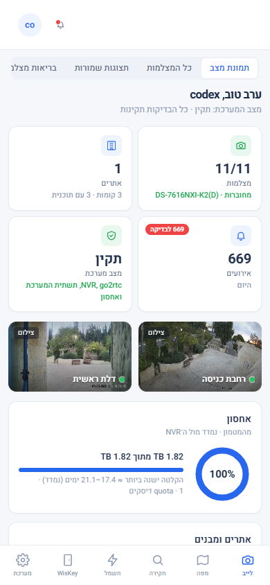

# צעדים ראשונים

Source: original

## מה זה

SmplWise Arx נפתח **מתוך תשתית המערכת** (בדפדפן או באפליקציה), או מחוץ לבית בכתובת הגישה מרחוק
שמנהל המערכת מסר לכם. אין לו רישום משתמשים נפרד: נכנסים עם חשבון המערכת שלכם (שם המשתמש והסיסמה
שלכם), והזהות הזו עוברת לאפליקציה עם כל בקשה. מה שאתם רואים בפועל — אילו אזורים מופיעים בסרגל הצד, אילו קומות פתוחות
לכם, אילו כפתורים פעילים — נקבע כולו לפי התפקיד(ים) שמנהל ה-VMS הקצה לכם (ראו מקרא התפקידים
ב-`00-INDEX_HE.md`). מי שאין לו עדיין תפקיד רואה מסך "אין הרשאה" ולא תוכן ריק שנראה כמו תקלה.

## איך אני… (כל תפקיד)

1. **נכנס בפעם הראשונה.** פותחים את תשתית המערכת בדפדפן (או באפליקציה) ולוחצים על **SMPLWISE
   VMS** בסרגל הצד. מחוץ לבית פותחים את כתובת הגישה מרחוק ונכנסים עם שם המשתמש והסיסמה שלכם. אם
   הפריט לא מופיע בסרגל הצד — המערכת כבויה או עוד לא מותקנת; יש לפנות למנהל המערכת.
2. **בודק שיש לי הרשאה.** אם מופיע מסך נעילה במקום תוכן — עדיין אין לכם תפקיד VMS. הביקור עצמו
   כן נרשם: מנהל המערכת רואה אתכם בהגדרות ← משתמשים והרשאות ומקצה תפקיד (ראו `81-roles_HE.md`).
   סטטוס "מנהל" בחשבון המערכת עצמו **לא** מקנה שום דבר כאן — צריך תפקיד VMS מפורש.
3. **מוצא את דרכי בסרגל הצד.** בעיצוב הנוכחי (SW A) סרגל אייקונים ימני מחזיק את הלשוניות: **ראשי**
   (סקירת החשמל וההתקנים, והמסך שהמערכת נפתחת עליו), **אבטחה** (שני מקטעים: לייב וחקירה; האזעקה נמצאת בהגדרות ← אבטחה),
   **מפה** (קומות, מצלמות והתקנים על התוכנית) ו-**WisKey** (בקרת כניסה, כשהוא לא מוסתר בהגדרות). לשונית
   שאין לכם הרשאה אליה לא מופיעה. בתחתית הסרגל נמצא **האווטאר שלכם** - הפריט האחרון, שפותח את תפריט
   המשתמש. הסרגל העליון מציג נתיב ניווט, את מקטעי האבטחה, שדה חיפוש ונורית בריאות.
4. **פותח את תפריט המשתמש.** לחיצה על האווטאר פותחת את התפריט: השם והתפקיד שלכם, **התראות** (עם מספר
   ההתראות הפתוחות, כשיש כאלה), **מערכת** (הגדרות, משתמשים והרשאות - רק למי שיש לו הרשאה לכך), **החשבון
   שלי** ו-**יציאה** (בכניסה מרחוק). תחת **החשבון שלי**: **סדר הלשוניות**, **הגדרות התראות** (מה נשלח לטלפון
   שלכם), **הכניסות שלי**, ובאפליקציית אנדרואיד **החלף שרת**. כשיש התראות פתוחות, נקודה אדומה מופיעה על
   האווטאר; בהגדרות האווטאר מסומן כפריט הפעיל.
5. **מסדר את הלשוניות כמו שנוח לי.** בתפריט המשתמש בוחרים **החשבון שלי** ← **סדר הלשוניות**, גוררים שורה בידית שלה או
   מזיזים אותה בחצים (גם במקלדת), ולוחצים **שמור**. הסדר נשמר לחשבון שלכם ומופיע בכל מכשיר - בסרגל הצד
   ובסרגל התחתון בטלפון. **אפס לברירת המחדל** מחזיר את הסדר המקורי. האווטאר תמיד נשאר אחרון.
6. **מחפש משהו במקום לנווט.** לוחצים **Ctrl+K** (או **⌘K** ב-Mac) בכל מסך — שדה חיפוש עולמי נפתח
   ומוצא חדרים ואזורים, מצלמות (לפי שם או מספר ערוץ), קומות, מבנים והתקנים, ומראה
   איפה כל אחד יושב. תוצאה של חדר פותחת את הקומה שלו עם החדר מודגש; מצלמה או ישות ממוקמת פותחת את
   הכרטיס שלה על המפה; מצלמה שלא ממוקמת פותחת את התצוגה החיה שלה ישירות. **חיפוש מציג רק מה שהתפקיד
   שלכם מרשה** — אין "תוצאה קיימת אבל חסומה".
7. **עובד מהטלפון.** בטלפון אין סרגל עליון, כדי שיישאר יותר מקום לתוכן. סרגל ניווט תחתון מחזיק את
   אותן לשוניות, והאווטאר הוא הפריט האחרון בו; תפריט המשתמש נפתח כגיליון מלמטה, ובראשו גם נורית הבריאות
   והתקדמות ההתקנה; כפתור החזרה של הטלפון סוגר אותו. באזור האבטחה מקטעי לייב וחקירה מופיעים כשורה
   דקה שנשארת בראש התוכן, ומתחתיה שורת הלשוניות של המסך, שנגללת יחד עם התוכן - אם היא רחבה מהמסך, גוללים
   אותה הצידה (הקצה דוהה כשיש עוד לשוניות). שאר המסך מתנהג
   אותו דבר. מסכים כבדים (עורך תוכנית, השוואת ניגון) מוצגים בטלפון בגרסה מוגבלת יותר או עם הערה שדסקטופ
   מתאים יותר.
8. **בודק את נורית הבריאות.** נורית קטנה בסרגל העליון (בטלפון: בראש תפריט המשתמש): **ירוק** = כל מה
   שהמערכת יודעת לבדוק תקין, **ענבר** = משהו דורש תשומת לב (מפורט ב-tooltip), **אדום** = כשל, ואז יופיע גם
   באנר בראש המסך בכל מסך. לחיצה על הנורית פותחת את כרטיסי הבריאות (`80-settings_HE.md` § בריאות ועבודות).

## איך אני… (מנהל מערכת)

1. **מתקין את המערכת ומגדיר חיבורים.** ראו את אשף ההתקנה (`70-setup-wizard_HE.md`; במוצר: הגדרות ← אשף התקנה) ואת
   `smplwise_vms/DOCS_HE.md` פרק "התקנה" — כתובת המאגר, `bootstrap_admin_username`, פרטי NVR,
   `go2rtc_url`, ואופציונלית WisKey ומפתח OpenAI לעורות קומה.
2. **מקצה תפקיד ראשון.** המשתמש שנרשם כ-`bootstrap_admin_username` הופך למנהל מערכת בביקור
   הראשון שלו בלבד (רשום ביומן הביקורת). מכאן, הוא מקצה תפקידים לשאר הצוות בהגדרות ← משתמשים
   והרשאות.
3. **קובע מה כל אחד רואה.** ניווט מוצג רק לפי מה שהקישורים של המשתמש מאפשרים; כתובת ישירה למסך
   שאין לו הרשאה עבורו מראה פאנל נעילה, לא שגיאה טכנית.

## שים לב

- הזהות שלכם היא חשבון המערכת שלכם — אין כאן סיסמה נפרדת, ואי אפשר "להתחבר בתור" מישהו אחר.
- כל דחייה של הרשאה נכתבת ביומן הביקורת עם הסיבה שלה; שורות הביקורת נשמרות שנה (ברירת מחדל,
  ניתן לשינוי בהגדרות).
- אם חשבון המערכת של משתמש הושבת או נמחק, הגישה שלו נלקחת תוך כ-60 שניות (בדחיפת הספרייה הבאה),
  כולל סגירת שקעי וידאו/ניגון פתוחים.

*צילום מהדגמה — תוכניות קומה אמיתיות אינן מתפרסמות במדריך.*

*צילום מהמערכת החיה.*
