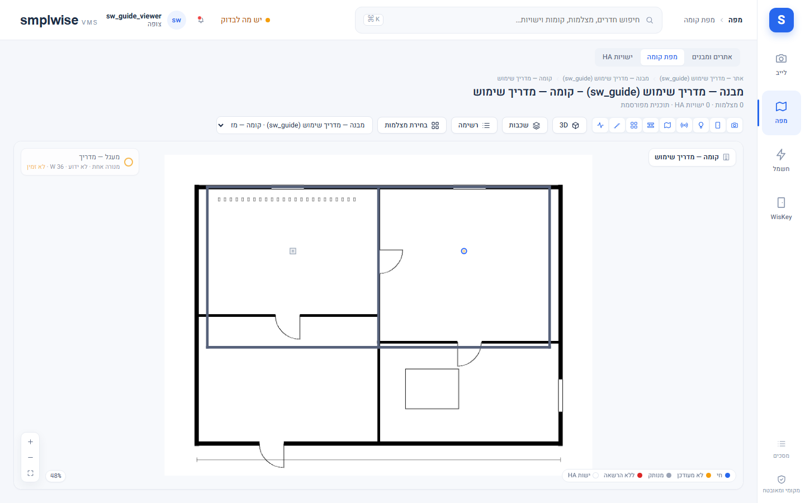

# צעדים ראשונים

## מה זה

SMPLWISE VMS נפתח **בתוך Home Assistant**, לא כאתר עצמאי: אין לו התחברות (login) משלו, אין לו
משתמשים משלו וסיסמה משלו. הזהות שלכם היא זהות ה-Home Assistant שלכם, וה-Supervisor מעביר אותה
לאפליקציה עם כל בקשה. מה שאתם רואים בפועל — אילו אזורים מופיעים בסרגל הצד, אילו קומות פתוחות
לכם, אילו כפתורים פעילים — נקבע כולו לפי התפקיד(ים) שמנהל ה-VMS הקצה לכם (ראו מקרא התפקידים
ב-`00-INDEX_HE.md`). מי שאין לו עדיין תפקיד רואה מסך "אין הרשאה" ולא תוכן ריק שנראה כמו תקלה.

## איך אני… (כל תפקיד)

1. **נכנס בפעם הראשונה.** פותחים את Home Assistant בדפדפן (או באפליקציה), ולוחצים על **SMPLWISE
   VMS** בסרגל הצד השמאלי/ימני של Home Assistant (לא בכתובת נפרדת). אם האייקון לא מופיע — ה-add-on
   כבוי, או שהוא עוד לא מותקן; יש לפנות למנהל המערכת.
2. **בודק שיש לי הרשאה.** אם מופיע מסך נעילה במקום תוכן — עדיין אין לכם תפקיד VMS. הביקור עצמו
   כן נרשם: מנהל המערכת רואה אתכם בהגדרות ← משתמשים והרשאות ומקצה תפקיד (ראו `81-roles_HE.md`).
   סטטוס "מנהל" ב-Home Assistant עצמו **לא** מקנה שום דבר כאן — צריך תפקיד VMS מפורש.
3. **מוצא את דרכי בסרגל הצד.** בעיצוב הנוכחי (SW A) סרגל אייקונים ימני מחזיק ארבעה אזורים קבועים:
   **מפה** (המסך שמראה קומות, מצלמות וישויות על תוכנית), **מצלמות** (וידאו חי), **חקירה** (מרכז
   אירועים, ניגון, תיקים), ו-**חשמל והתקנים**. אזור **WisKey** (בקרת כניסה) מופיע כשהוא לא מוסתר
   בהגדרות; אזור **מערכת** (הגדרות, משתמשים, אודיט) מופיע רק למי שיש לו הרשאות מתאימות. סרגל עליון
   בגובה 72 פיקסלים מציג נתיב ניווט (breadcrumbs), שדה חיפוש ותפריט משתמש.
4. **מחפש משהו במקום לנווט.** לוחצים **Ctrl+K** (או **⌘K** ב-Mac) בכל מסך — שדה חיפוש עולמי נפתח
   ומוצא חדרים ואזורים, מצלמות (לפי שם או מספר ערוץ), קומות, מבנים וישויות Home Assistant, ומראה
   איפה כל אחד יושב. תוצאה של חדר פותחת את הקומה שלו עם החדר מודגש; מצלמה או ישות ממוקמת פותחת את
   הכרטיס שלה על המפה; מצלמה שלא ממוקמת פותחת את התצוגה החיה שלה ישירות. **חיפוש מציג רק מה שהתפקיד
   שלכם מרשה** — אין "תוצאה קיימת אבל חסומה".
5. **עובד מהטלפון.** בפריסת מובייל סרגל הצד הופך לסרגל ניווט תחתון עם אותם אזורים בעיצוב מצומצם;
   שאר המסך מתנהג אותו דבר (אותם כפתורים, רק מסודרים אנכית). מסכים כבדים (עורך תוכנית, השוואת
   ניגון) מוצגים בטלפון בגרסה מוגבלת יותר או עם הערה שדסקטופ מתאים יותר.
6. **בודק את נורית הבריאות.** נורית קטנה בסרגל העליון: **ירוק** = כל מה שה-add-on יודע לבדוק תקין,
   **ענבר** = משהו דורש תשומת לב (מפורט ב-tooltip), **אדום** = כשל, ואז יופיע גם באנר מתחת לסרגל
   העליון בכל מסך. לחיצה על הנורית פותחת את כרטיסי הבריאות (`80-settings_HE.md` § בריאות ועבודות).

## איך אני… (מנהל מערכת)

1. **מתקין את ה-add-on ומגדיר חיבורים.** ראו את אשף ההתקנה (`70-setup-wizard_HE.md`; במוצר: הגדרות ← אשף התקנה) ואת
   `smplwise_vms/DOCS_HE.md` פרק "התקנה" — כתובת המאגר, `bootstrap_admin_username`, פרטי NVR,
   `go2rtc_url`, ואופציונלית WisKey ומפתח OpenAI לעורות קומה.
2. **מקצה תפקיד ראשון.** המשתמש שנרשם כ-`bootstrap_admin_username` הופך למנהל מערכת בביקור
   הראשון שלו בלבד (רשום ביומן הביקורת). מכאן, הוא מקצה תפקידים לשאר הצוות בהגדרות ← משתמשים
   והרשאות.
3. **קובע מה כל אחד רואה.** ניווט מוצג רק לפי מה שהקישורים של המשתמש מאפשרים; כתובת ישירה למסך
   שאין לו הרשאה עבורו מראה פאנל נעילה, לא שגיאה טכנית.

## שים לב

- הזהות שלכם היא הזהות שלכם ב-Home Assistant — לעולם אין כאן סיסמה נפרדת, ואי אפשר "להתחבר בתור"
  מישהו אחר.
- כל דחייה של הרשאה נכתבת ביומן הביקורת עם הסיבה שלה; שורות הביקורת נשמרות שנה (ברירת מחדל,
  ניתן לשינוי בהגדרות).
- אם משתמש הושבת או נמחק ב-Home Assistant, הגישה שלו נלקחת תוך כ-60 שניות (בדחיפת הספרייה הבאה),
  כולל סגירת שקעי וידאו/ניגון פתוחים.

*יוחלף בצילום מהמעבדה.*

*יוחלף בצילום מהמעבדה.*
