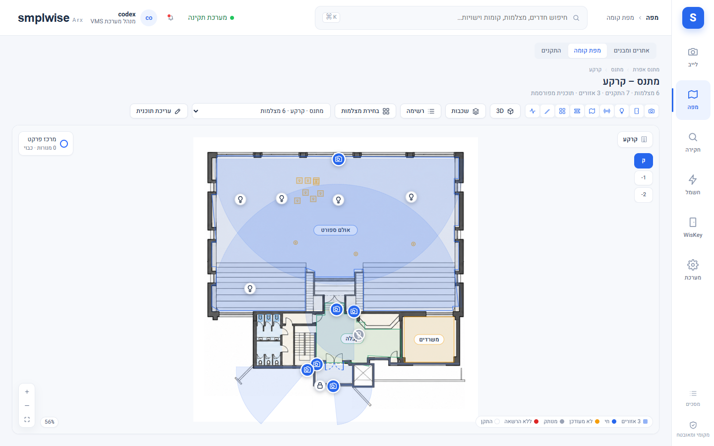
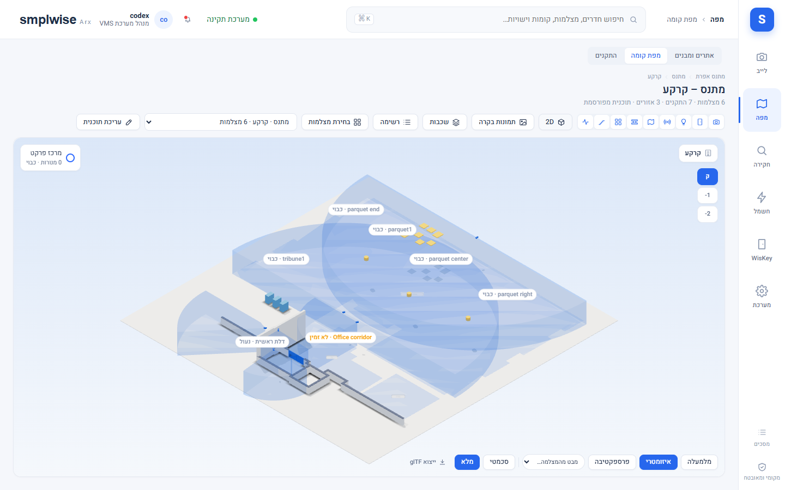
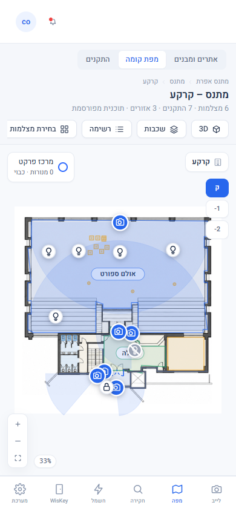

# מפת קומה חיה

Source: original

## מה זה

מפת הקומה היא המסך המרכזי של המוצר: תוכנית אדריכלית מפורסמת עם סיכות (מצלמות וישויות Home
Assistant) עליה, במצב חי. היא קיימת בשתי תצוגות — **דו־ממד** (ברירת המחדל, מהירה ומדויקת) ו-
**תלת־ממד** (רינדור איזומטרי של אותה קומה, לצפייה מרחבית). שתי התצוגות מציגות בדיוק את אותם נתונים
— שום פעולה לא זמינה רק באחת מהן באופן מהותי.

## איך אני… (צופה ומעלה)

1. **בוחר קומה.** שבב (chip) בראש המפה נוקב בשם הקומה הנוכחית; בורר קומות מאפשר מעבר מהיר בין
   מבנים וקומות שההרשאה שלי מכסה.
2. **מזיז ומגדיל את המפה.** גלגלת העכבר או צביטה (pinch) מגדילות; גרירת הרקע מזיזה (pan); פקדי
   הזום יושבים בפינה השמאלית-תחתונה, המקרא בפינה הימנית-תחתונה.
3. **פותח כרטיס מצלמה.** לחיצה על סיכת מצלמה פותחת כרטיס: תמונה חיה בתוך הכרטיס (סשן ששייך לכרטיס
   הזה בלבד — נסגר כשסוגרים אותו), מצב המצלמה, מיקומה (קומה + חדר/אזור), כפתור **"צפייה מלאה"**
   למסך מלא וכפתור **"הקלטות"** לניגון. Escape סוגר את הכרטיס.
4. **פותח כרטיס ישות.** לחיצה על סיכת ישות (דלת, תאורה, חיישן…) פותחת כרטיס דומה עם מצב הישות
   והפעולות שההרשאה שלי מרשה להריץ עליה דרך הגשר (bridge) — ראו `40-devices_HE.md` לגבי כללי
   האישור והסיווג לפי סיכון.
5. **פותח/סוגר שכבות.** כפתור **"שכבות"** פותח פאנל עם מתג נפרד לכל שכבה והספירה שלה: מצלמות,
   דלתות ואינטרקום, תאורה, אבטחה וחיישנים, שמות חדרים, מבנה, עצמים, מחברים, מצבי חדרים. מתג רק
   קובע מה מצויר על המסך שלי — **הוא לעולם לא מפעיל או מכבה ציוד**. מצב השכבות נשמר עם תצוגה
   שמורה (view).
6. **עובר לתלת־ממד.** כפתור ה-3D ליד בורר הקומה עובר לתצוגה איזומטרית של אותה קומה — קירות,
   פתחים, מבנה כללי, ואותם סמלי מצלמה/ישות. איכות התצוגה (**"רמת איכות"**, 1=סכמטי / 2=צללים
   וחומרים) נקבעת בהגדרות (ברירת מחדל להתקנה) וכל דפדפן יכול לדרוס אותה לעצמו; מכשיר איטי חוזר
   אוטומטית לרמה 1.
7. **רואה נוכחות מתפוגגת (presence fade).** על גבי התלת־ממד, חדר שבו הייתה תנועה לאחרונה מקבל
   גוון עדין שדוהה בהדרגה (ברירת מחדל: 3 דקות מהתנועה האחרונה; ניתן לכיבוי כך שהגוון יוצג רק כל עוד
   החיישן פעיל בפועל) — זו רק אינדיקציה חזותית, לא בקרת אבטחה.
8. **מחליף בין תמונת התוכנית לרקע נקי.** מתג "תמונת התוכנית" מעלים או מציג את קובץ התוכנית שנטען
   מתחת למבנה המצויר; במצב מוסתר רואים רק את המבנה על רקע נקי (שימושי כשהתמונה המקורית עמוסה).
9. **בוחר מצלמות לפעולה קבוצתית.** כפתור **"בחירת מצלמות"** הופך את המפה לבורר: לחיצות מוסיפות/
   מסירות מצלמות (או "בחר הכל"); **"קיר חי"** פותח בדיוק את הקבוצה הזו על קיר המצלמות; **"ניגון
   מסונכרן"** פותח ניגון עם המצלמה הראשונה מובילה ועד שלוש נוספות עוקבות (ראו `31-events_HE.md`).
10. **שומר תצוגה (view).** "שמירה כתצוגה" שומרת שם, קבוצת מצלמות ופריסת קיוסק; תצוגה אישית שייכת
    לי בלבד, תצוגה משותפת דורשת הרשאת ניהול משתמשים (`rbac.assign`) וגלויה לכל המחוברים. תצוגה
    שכוללת מצלמה שאין לי הרשאה לצפות בה חי — מוצגת בלעדיה.

## איך אני… (עורך ומעלה)

- כניסה לעריכת התוכנית (מיקום מצלמות/ישויות, ציור חדרים, ייבוא, פרסום) — ראו `21-plan-studio_HE.md`.

## שים לב

- הקונוס שמצויר מול מצלמה הוא **המחשה לתכנון בלבד** — הוא לא כיסוי (coverage) שנמדד באמת, ושינויו
  לעולם לא שולח פקודת PTZ למצלמה.
- שום פעולה על המפה לא נכתבת עד לחיצה מפורשת על כפתור השמירה/הפעולה עצמה — גרירת סיכה במצב תצוגה
  רגילה לא קיימת (זה קורה רק בעורך התוכנית).
- מפה היסטורית (חקירה של רגע שחלף) היא מסך נפרד לחלוטין: אין בה שום כפתור הפעלה, וישויות שם מוצגות
  לפי היסטוריית מצב שמורה, לעולם לא "חי כאילו היה עבר" — ראו `31-events_HE.md`.

*צילום מהמערכת החיה.*

*צילום מהמערכת החיה.*

*צילום מהמערכת החיה.*
