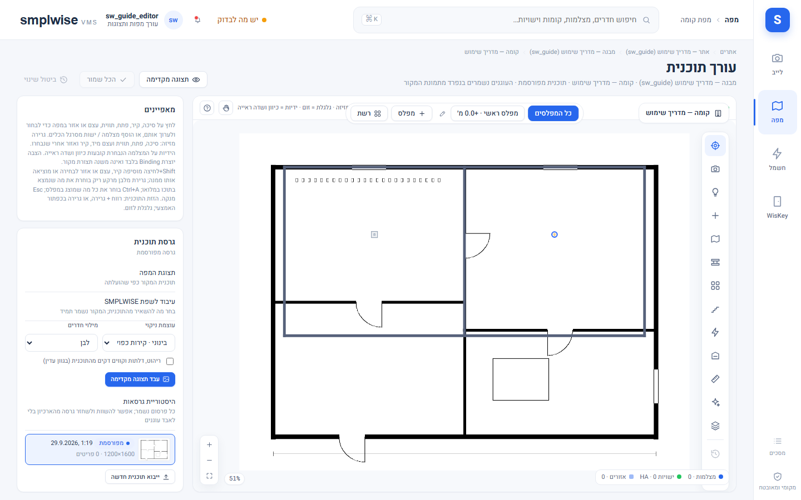

# Plan Studio — עורך תוכנית קומה

## מה זה

Plan Studio הוא עורך התוכנית: כאן מייבאים שרטוט אדריכלי (PDF/PNG/JPG/DXF), מסמנים קירות וחדרים,
ממקמים מצלמות וישויות, ומפרסמים גרסה חדשה שהצופים יראו. הכול נעשה על טיוטה — שום דבר לא משפיע על
מה שצופים רואים עד **"פרסום"** מפורש. גישה לעורך דורשת תפקיד **עורך** ומעלה, בהיקף שמכיל את הקומה.

## איך אני… (עורך ומעלה)

### ייבוא תוכנית

1. פותחים "ייבוא תוכנית" מתוך מסך הקומה. מעלים קובץ (PDF עד 20 עמודים / PNG / JPG עד 40MB, או
   קובץ `.dxf` שמזוהה לפי תוכן — לא לפי הסיומת שהוקלדה).
2. **PDF מרובה עמודים:** בוחרים עמוד.
3. **סיבוב וחיתוך:** האשף מציג את העמוד כשהוא כבר מסובב בצד השרת; מלבן החיתוך נמשך בעכבר ישירות
   מעל התמונה המסובבת (או מוקלד כאחוזים). סיבוב נוסף מאפס את החיתוך. מה שבתוך המלבן המקווקו הוא
   בדיוק מה שהגרסה השמורה תכיל — **הקובץ המקורי שהועלה לעולם לא משתנה**, אפשר לחזור אליו.
4. **קובצי DXF:** נבדקים (יחידות, שכבות, ספירת ישויות, סוגים לא נתמכים) ומרונדרים רק מהישויות
   הגיאומטריות; טקסט, הצללות (hatches), מידות וישויות תלת-ממד נספרים ומדווחים כהמרה חלקית. בוחרים
   שכבות ויחידות בכרטיס ה-DXF; קנה מידה נקבע אוטומטית כשהיחידות ידועות. **DWG חייב להיות מומר
   ל-DXF קודם** — המוצר לא קורא DWG ישירות.

### כלי המבנה

5. **ציור/עריכת קירות ופתחים:** הכול בעכבר על התוכנית — גרירת סיכה מזיזה, גרירת הידית העגולה
   מסובבת מצלמה נבחרת, גרירת שתי הידיות המרובעות בקצוות הקונוס מרחיבה/מצמצמת שדה ראייה, גלילה
   מגדילה, גרירת רקע מזיזה (pan). מקשי חצים מזיזים בחירה במעט (Shift = צעד גדול), Delete מסיר,
   Ctrl+Z/Ctrl+Y ביטול/חזרה, Ctrl+S שמירה. המפקח (inspector) מציג את אותם ערכים כמספרים (כיוון,
   שדה ראייה, X/Y באחוזים).
6. **מוסכמת כיוון:** 0° מצביע למעלה על התוכנית, מעלות גדלות עם כיוון השעון.
7. **"עיבוד לשפת SMPLWISE"** (ניקוי חזותי): הופך שרטוט אדריכלי לרינדור נקי בטוקני העיצוב — טקסט,
   קווי מידה ומתאר ריהוט דקים מוסרים, קירות הופכים לרצועות אפורות-כחולות, חדרים סגורים בלבן, חוץ
   בצבע קנבס. שלוש עוצמות ניקוי (קל/בינוני/חזק) ושתי בחירות נוספות (מילוי חדרים, השארת ריהוט/דלתות
   בגוון עמום). "עבד תצוגה מקדימה" מרנדר השוואה; "השתמש בתוצאה" הופך אותה לתמונת המפה. זה עיבוד
   תמונה מקומי בלבד (Pillow/numpy) — **בלי AI, שום דבר לא יוצא מההתקן**. "הצג מקור" חוזר לתמונה
   המקורית בכל עת; הקואורדינטות של הסיכות זהות בשני המצבים.

### זיהוי חדרים ואזורים

8. **"זהה חדרים"** מריץ זיהוי מקומי (אותו ניתוח קירות כמו בעיבוד לשפת SMPLWISE, שלוש עוצמות)
   ומציע פוליגון אחד לכל חדר סגור, מקווקו על המפה, עם שורת שם/סוג (חדר/אזור/מסדרון/חוץ/שירות)
   לכל אחד או השמטה. "שמור" שומרת את הנבחרים.
9. **"מחוץ למבנה הראשי" (0.1.130):** קווים שהמערכת זיהתה כמבנה משני נפרד (למשל אגף צדדי, לא רק
   רעש שרטוט) לא נמחקים — הם מסומנים בקו מקווקו מיוחד עם תווית ומופיעים כספירה נפרדת בסיכום הזיהוי,
   כך שאפשר להחליט לגביהם ידנית במקום שהם ייעלמו בשקט.
10. **"צייר אזור"** ידני: לחיצה על פינות, Enter או לחיצה על הפינה הראשונה סוגרת את הפוליגון. בחירת
    אזור עורכת שם, סוג, צבע והשתתפות בחיפוש מרחבי. עיצוב מחדש: גרירת פינה מזיזה, גרירת ידית קטנה
    באמצע קצה מוסיפה פינה, לחיצה כפולה על פינה מסירה אותה (מינימום שלוש פינות באזור).
11. אזורים הם **שכבת נתונים לצד התוכנית** — שורדים שינוי רינדור (מקור/שפת SMPLWISE) ולעולם לא
    נצרבים לתוך התמונה. אזור במפה הוא הקשר מרחבי לחיפוש ולחוקים בלבד — **לא** אזור זיהוי מצלמה
    ולא מסכת פרטיות, ולא משנה שום דבר ב-NVR.

### כיול (calibration)

12. תוכנית לא מכוילת מציגה מרחקים כאומדן (≈), מסומן `plan.estimates`; אחרי כיול (סימון שני
    נקודות במרחק ידוע) המרחקים מוצגים כמדויקים.

### פרסום, גרסאות ורולבק

13. **"פרסום גרסה"** תמיד עובר דרך תצוגה מקדימה: "השווה" מציג את שתי התמונות זו לצד זו, את שינוי
    הגיאומטריה, ומה קורה לכל פריט ממוקם.
14. כרטיס "גרסת תוכנית" מציג היסטוריה מלאה; **"שחזר"** משחזרת גרסה מארכיון כעותק מפורסם חדש —
    סיכות עוקבות כשהגיאומטריה זהה, אחרת נשארות במקום והמפה מסמנת אותן לבדיקה. **גרסאות מפורסמות
    לעולם לא נמחקות**, כדי שהמפה ההיסטורית תוכל להציג את התוכנית שהייתה בתוקף בכל רגע.
15. עריכה מיושנת (מישהו אחר שמר בינתיים) טוענת מחדש את המפה במקום לדרוס בשקט.

## שים לב

- שום דבר לא נכתב עד "שמירת מיקום"/"שמירה" מפורשת; פרסום טיוטה הוא פעולה נפרדת מהעריכה עצמה.
- זיהוי החדרים והמבנה הוא עיבוד תמונה מקומי — **הוא אינו קורא שמות חדרים מהשרטוט**, רק מציע
  פוליגונים.
- קובץ התוכנית המקורי שהועלה אף פעם לא משתנה, גם לא אחרי עיבוד לשפת SMPLWISE או חיתוך/סיבוב.
- מפלס (level) שהוא "הראשי" לא ניתן להחלפה בעצמו — צריך להפוך מפלס אחר לראשי קודם.

*יוחלף בצילום מהמעבדה.*
