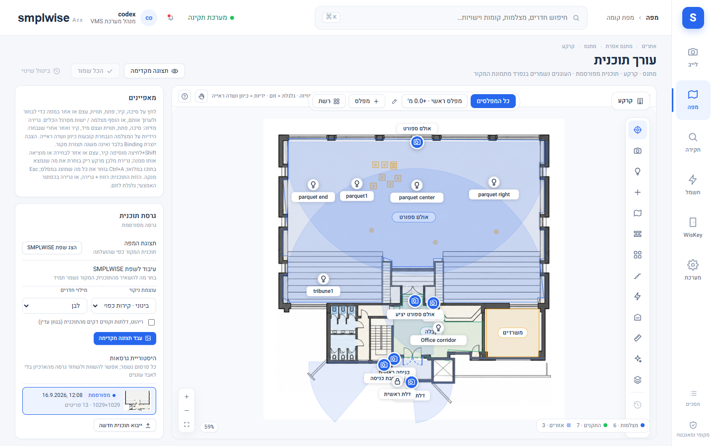

# Plan Studio — עורך תוכנית קומה

Source: original

## מה זה

Plan Studio הוא עורך התוכנית: כאן מייבאים שרטוט אדריכלי (PDF/PNG/JPG/DXF), מסמנים קירות וחדרים,
ממקמים מצלמות וישויות, ומפרסמים גרסה חדשה שהצופים יראו. הכול נעשה על טיוטה — שום דבר לא משפיע על
מה שצופים רואים עד **"פרסום"** מפורש. גישה לעורך דורשת תפקיד **עורך** ומעלה, בהיקף שמכיל את הקומה.

## איך אני… (עורך ומעלה)

### ייבוא תוכנית

1. פותחים "ייבוא תוכנית" מתוך מסך הקומה. מעלים קובץ (PDF עד 20 עמודים / PNG / JPG עד 40MB, או
   קובץ `.dxf` שמזוהה לפי תוכן — לא לפי הסיומת שהוקלדה).
2. **PDF מרובה עמודים:** בוחרים עמוד.
3. **סיבוב וחיתוך:** האשף מציג את העמוד כשהוא כבר מסובב בצד השרת; מלבן החיתוך נמשך בעכבר ישירות
   מעל התמונה המסובבת (או מוקלד כאחוזים). סיבוב נוסף מאפס את החיתוך. מה שבתוך המלבן המקווקו הוא
   בדיוק מה שהגרסה השמורה תכיל — **הקובץ המקורי שהועלה לעולם לא משתנה**, אפשר לחזור אליו.
4. **קובצי DXF:** נבדקים (יחידות, שכבות, ספירת ישויות, סוגים לא נתמכים) ומרונדרים רק מהישויות
   הגיאומטריות; טקסט, הצללות (hatches), מידות וישויות תלת-ממד נספרים ומדווחים כהמרה חלקית. בוחרים
   שכבות ויחידות בכרטיס ה-DXF; קנה מידה נקבע אוטומטית כשהיחידות ידועות. **DWG חייב להיות מומר
   ל-DXF קודם** — המוצר לא קורא DWG ישירות.

### כלי המבנה

5. **ציור/עריכת קירות ופתחים:** הכול בעכבר על התוכנית — גרירת סיכה מזיזה, גרירת הידית העגולה
   מסובבת מצלמה נבחרת, גרירת שתי הידיות המרובעות בקצוות הקונוס מרחיבה/מצמצמת שדה ראייה, גלילה
   מגדילה, גרירת רקע מזיזה (pan). מקשי חצים מזיזים בחירה במעט (Shift = צעד גדול), Delete מסיר,
   Ctrl+Z/Ctrl+Y ביטול/חזרה, Ctrl+S שמירה. המפקח (inspector) מציג את אותם ערכים כמספרים (כיוון,
   שדה ראייה, X/Y באחוזים).
6. **"סמן דלת" (מקש D):** במקום לצייר דלת ולכוון אותה, לוחצים פעם אחת על סמל הדלת בשרטוט (הכנף, הקשת,
   או על הקיר במקום הדלת). המערכת בודקת את השרטוט סביב הלחיצה ברזולוציה המלאה של התוכנית ומציעה דלת
   מקווקוות: הקיר, המיקום, הרוחב, צד הציר וכיוון הפתיחה לפי הסמל - קשת, קו סגירה ישר ("משולש"), כנף פתוחה
   באלכסון, דלת כפולה (שתי קשתות או "V"), או פער בקיר. תווית קטנה אומרת מה נמצא: **"נמצאה קשת"**,
   **"נמצא פער"**, או **"ברירת מחדל - בדוק"** (לא נמצא סמל: דלת ברוחב 0.9 מ׳ על הקיר שנלחץ). שלוש ידיות
   משנות את ההצעה לפני האישור: הריבוע בקצה הדלת - גרירה לאורך הקיר משנה את הרוחב; ⇄ - מחליף את צד הציר;
   ⇅ - מחליף את כיוון הפתיחה (בדלת כפולה: את הצד). **Enter** או לחיצה על ההצעה מאשרים; לחיצה על סמל הדלת
   הבאה מאשרת את ההצעה המוצגת ומציעה את הבאה - כך מסמנים קומה שלמה בכמה דקות; **Esc** מבטל. הדלת שנוספת
   היא פתח רגיל: עורכים, מבטלים (Ctrl+Z), מפרסמים ורואים אותה בתלת-ממד כמו כל דלת.
   - **אין קיר מצויר לאורך הדלת** (למשל לפני שקירות זוהו או צוירו): ההצעה מגיעה עם קטע קיר קצר משלה (רוחב
     הדלת ועוד 12 ס״מ מכל צד) ועם אזהרה - בדוק את עוביו ואת החיבור לקירות הסמוכים.
   - **אין סמל ואין קיר ליד הלחיצה**: מוצגת הודעה ולא נוספת דלת - לחץ על הסמל עצמו או צייר קודם את הקיר.
   - זה עיבוד תמונה מקומי בלבד, בלי AI; שום תמונה לא יוצאת מההתקן ושום דבר לא נשמר עד האישור.
7. **מוסכמת כיוון:** 0° מצביע למעלה על התוכנית, מעלות גדלות עם כיוון השעון.
8. **"עיבוד לשפת SMPLWISE"** (ניקוי חזותי): הופך שרטוט אדריכלי לרינדור נקי בטוקני העיצוב — טקסט,
   קווי מידה ומתאר ריהוט דקים מוסרים, קירות הופכים לרצועות אפורות-כחולות, חדרים סגורים בלבן, חוץ
   בצבע קנבס. שלוש עוצמות ניקוי (קל/בינוני/חזק) ושתי בחירות נוספות (מילוי חדרים, השארת ריהוט/דלתות
   בגוון עמום). "עבד תצוגה מקדימה" מרנדר השוואה; "השתמש בתוצאה" הופך אותה לתמונת המפה. זה עיבוד
   תמונה מקומי בלבד (Pillow/numpy) — **בלי AI, שום דבר לא יוצא מההתקן**. "הצג מקור" חוזר לתמונה
   המקורית בכל עת; הקואורדינטות של הסיכות זהות בשני המצבים.

### זיהוי חדרים ואזורים

9. **"זהה חדרים"** מריץ זיהוי מקומי (אותו ניתוח קירות כמו בעיבוד לשפת SMPLWISE, שלוש עוצמות)
   ומציע פוליגון אחד לכל חדר סגור, מקווקו על המפה, עם שורת שם/סוג (חדר/אזור/מסדרון/חוץ/שירות)
   לכל אחד או השמטה. "שמור" שומרת את הנבחרים.
10. **"מחוץ למבנה הראשי" (0.1.130):** קווים שהמערכת זיהתה כמבנה משני נפרד (למשל אגף צדדי, לא רק
   רעש שרטוט) לא נמחקים — הם מסומנים בקו מקווקו מיוחד עם תווית ומופיעים כספירה נפרדת בסיכום הזיהוי,
   כך שאפשר להחליט לגביהם ידנית במקום שהם ייעלמו בשקט.
11. **"צייר אזור"** ידני: לחיצה על פינות, Enter או לחיצה על הפינה הראשונה סוגרת את הפוליגון. בחירת
    אזור עורכת שם, סוג, צבע והשתתפות בחיפוש מרחבי. עיצוב מחדש: גרירת פינה מזיזה, גרירת ידית קטנה
    באמצע קצה מוסיפה פינה, לחיצה כפולה על פינה מסירה אותה (מינימום שלוש פינות באזור).
12. אזורים הם **שכבת נתונים לצד התוכנית** — שורדים שינוי רינדור (מקור/שפת SMPLWISE) ולעולם לא
    נצרבים לתוך התמונה. אזור במפה הוא הקשר מרחבי לחיפוש ולחוקים בלבד — **לא** אזור זיהוי מצלמה
    ולא מסכת פרטיות, ולא משנה שום דבר ב-NVR.

### חלל משותף לשתי קומות

חדר אחד שנמצא בשתי קומות, כמו אולם ספורט בגובה כפול שהמגרש שלו בקומה ‎-1 והטריבונות יורדות אליו מקומה 0 — וגם
כשהאולם רחב יותר בקומה העליונה. כל קומה שומרת את **המתאר והקירות שלה** של החדר; **התוכן** (טריבונות, סימוני מגרש,
עצמים, תאורה) נשמר פעם אחת ומוצג בשתי הקומות, עם תווית קטנה "רצפה בקומה ‎-1".

- **איך הופכים:** בכלי "חדרים ואזורים" בוחרים את החדר ולוחצים **"הפוך לחלל משותף"**. בוחרים את הקומה השנייה,
  איפה הרצפה של החדר (ברירת המחדל: הקומה התחתונה — המגרש) ואת החדר שלו בקומה השנייה (אותו שם נבחר לבד). התצוגה
  המקדימה אומרת שהמתאר של הקומה השנייה והקירות שלאורכו נשארים, מה יוסר ממנה (רק תוכן כפול — למשל ציור שני של
  קווי המגרש או כיסא שצויר פעמיים), ומה יקרה לכל מצלמה והתקן. אם המתאר התחתון לא נופל בתוך העליון תופיע האזהרה
  "ודא את יישור הקומות". "שתף את החדר" מחיל הכול בבת אחת.
- **במפה:** בקומת המגרש המתאר הרחב של המפלס העליון מסומן בקו מקווקו ובגוון בהיר עם "מפלס עליון" — מה שמצויר בתוכו
  ומחוץ למגרש (השורות העליונות) שייך לאולם. בקומה העליונה המגרש מסומן בקו מקווקו דק עם "מפלס תחתון".
- **עריכה משתי הקומות:** בעורך של כל אחת מהקומות אפשר להזיז, לסובב, להוסיף ולמחוק תוכן בתוך החדר; פריט נבחר מציג
  "חלל משותף · השינוי יופיע גם בקומה…". קירות ופתחים הם של כל קומה לחוד — עורכים אותם בקומה שלהם.
- **פרסום:** פרסום של כל אחת מהקומות מפרסם גם את השינויים של האולם. בחלון הפרסום מופיעה השורה "כולל שינויים באולם
  המשותף (קומה ‎-1)" עם מספר השינויים; שאר הטיוטה של הקומה השנייה נשארת טיוטה.
- **מצלמות והתקנים:** רק מה ש**נוסף לחלל המשותף** מוצג בשתי הקומות — בזמן השיתוף נוסף כל מה שמעוגן בתוך החדר.
  מצלמה שמוצבת אחר כך בתוך האולם מציגה בחלונית שלה "מצלמה בתוך האולם שאינה משותפת - הוסף?" עם הכפתור
  **"הוסף לחלל המשותף"**; מצלמה משותפת מציגה **"הסר מהחלל המשותף"**. מיקום בתוך החדר לבד לא משתף כלום.
- **הרשאות:** מי שמורשה רק באחת משתי הקומות רואה את כל החדר, כולל המצלמות וההתקנים המשותפים — ולא שום דבר אחר
  מהקומה השנייה. שלילה מפורשת עדיין גוברת. הוספה והסרה של חברים ושיתוף החדר דורשים הרשאת עריכה והצבה בשתי הקומות.
- **תלת־ממד:** המתאר התחתון עולה מהמגרש עד המפלס העליון, והמתאר העליון משם עד התקרה; במדרגה ביניהם מצוירת טבעת
  רצפה, אלא אם עומדת שם טריבונה. בקומה העליונה אין רצפה מעל האולם.
- **ביטול:** "בטל שיתוף" בחלונית החדר. התוכן נשאר בקומת הרצפה בלבד, והמשתמשים של הקומה השנייה מפסיקים לראות את
  המצלמות וההתקנים שלו מיד. מה שהוסר בזמן השיתוף (התוכן הכפול) לא חוזר.
- **הגדרות › מפה:** "מפלסים של חלל משותף" מציג או מסתיר בסרגל המפלסים של העורך את מפלסי הקומה של החדר.

### כיול (calibration)

13. תוכנית לא מכוילת מציגה מרחקים כאומדן (≈), מסומן `plan.estimates`; אחרי כיול (סימון שני
    נקודות במרחק ידוע) המרחקים מוצגים כמדויקים.

### פרסום, גרסאות ורולבק

14. **"פרסום גרסה"** תמיד עובר דרך תצוגה מקדימה: "השווה" מציג את שתי התמונות זו לצד זו, את שינוי
    הגיאומטריה, ומה קורה לכל פריט ממוקם.
15. כרטיס "גרסת תוכנית" מציג היסטוריה מלאה; **"שחזר"** משחזרת גרסה מארכיון כעותק מפורסם חדש —
    סיכות עוקבות כשהגיאומטריה זהה, אחרת נשארות במקום והמפה מסמנת אותן לבדיקה. **גרסאות מפורסמות
    לעולם לא נמחקות**, כדי שהמפה ההיסטורית תוכל להציג את התוכנית שהייתה בתוקף בכל רגע.
16. עריכה מיושנת (מישהו אחר שמר בינתיים) טוענת מחדש את המפה במקום לדרוס בשקט.

## שים לב

- שום דבר לא נכתב עד "שמירת מיקום"/"שמירה" מפורשת; פרסום טיוטה הוא פעולה נפרדת מהעריכה עצמה.
- זיהוי החדרים והמבנה הוא עיבוד תמונה מקומי — **הוא אינו קורא שמות חדרים מהשרטוט**, רק מציע
  פוליגונים.
- קובץ התוכנית המקורי שהועלה אף פעם לא משתנה, גם לא אחרי עיבוד לשפת SMPLWISE או חיתוך/סיבוב.
- מפלס (level) שהוא "הראשי" לא ניתן להחלפה בעצמו — צריך להפוך מפלס אחר לראשי קודם.

*צילום מהדגמה — תוכניות קומה אמיתיות אינן מתפרסמות במדריך.*
