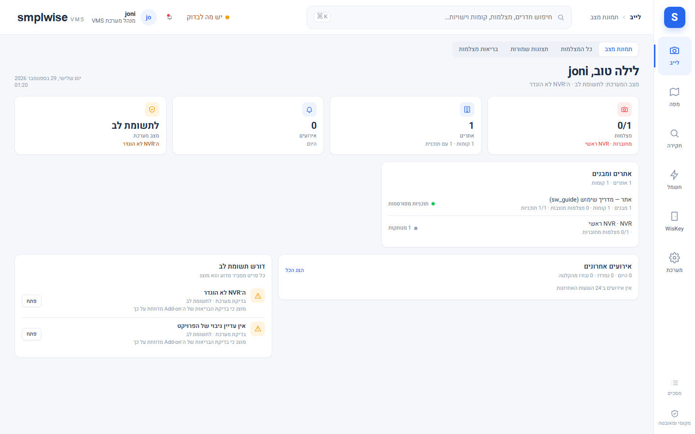
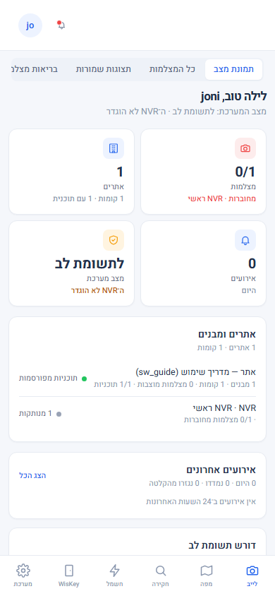
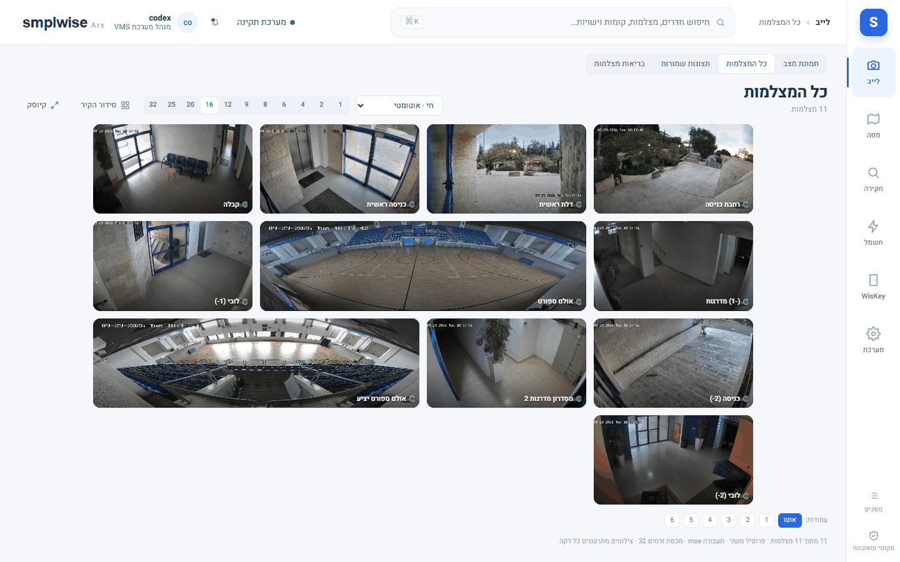
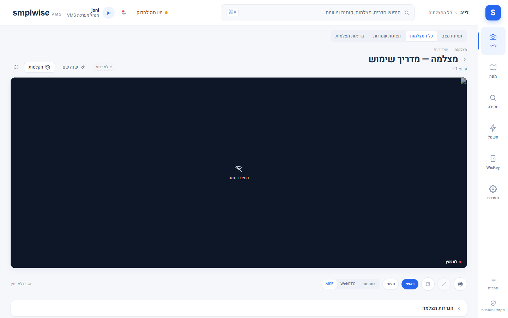

# וידאו חי — סקירה, קיר מצלמות ומצלמה בודדת

Source: original

## מה זה

לייב הוא אזור הווידאו החי: מסך "סקירה" (Dashboard) עם מצב ההתקנה במבט אחד, "כל המצלמות" (קיר)
לכמה מצלמות בבת אחת, ומסך מצלמה בודדת עם הזרם, בקרות ופרטי בריאות. הכול עובר דרך ממסר
WebSocket בין הדפדפן ↔ ה-add-on ↔ **go2rtc**: הדפדפן לעולם אינו לומד כתובת go2rtc או RTSP כלשהי,
וכל בקשת זרם נבדקת מחדש לפי המצלמה והקומה שהיא ממוקמת עליה.

שתי דרכי תעבורה: **MSE** (ברירת המחדל — fMP4 מעל שקע הממסר; עובד דרך Ingress, מנהרת Cloudflare
ו-CGNAT) ו-**WebRTC** (השהיה נמוכה יותר, אך דורש UDP ישיר בין הדפדפן למארח go2rtc — תקין ב-LAN,
לא דרך מנהרה). `auto` מנסה WebRTC ונופל חזרה ל-MSE. במעבדת הפיילוט: פרופיל **sub** (‏H.264
Baseline, 640×360) מתנגן ב-WebRTC תוך שניות; פרופיל **main** (‏H.264 Main, 2560×1440) מתחבר
ב-WebRTC אבל דפדפנים אינם מפענחים אותו מ-RTP, כך ש-`auto` נופל ל-MSE אחרי כ-12 שניות. ל-MSE יש
עוד עיכוב משלו: הפריים הראשון מוצג רק ב-key frame הבא, ועם GOP של כ-8 שניות ב-NVR זה 8–12 שניות
נוספות עד לתמונה הראשונה. ברירת המחדל של ההתקנה נקבעת בהגדרות ← וידאו ומדיה; כל נגן יכול לדרוס
אותה לדפדפן הנוכחי בלבד (ראו `80-settings_HE.md`).

**וידאו מרחוק (SmplWise Arx, `https://<שם ה-Home Assistant>/arx`).** מחוץ לבית הכלל שונה: הנגן מתחיל בזרם שנבחר
בהגדרות ← גישה מרחוק ← "זרם ברירת מחדל" (ראשי, כברירת מחדל) ב-**WebRTC**, כדי שהווידאו יעבור ישירות ולא דרך
המנהרה. תג קטן על התמונה מראה מה מתנגן: `main·WebRTC`, `sub·WebRTC` או `main·MSE`. אם WebRTC לא מצליח (לא
מתחבר, או לא מציג תמונה תוך 12 שניות) - כש"MSE כמוצא אחרון" מותר, אותו זרם עובר ל-MSE דרך המנהרה והנגן אומר זאת;
כשהוא אסור, הנגן עובר לזרם השני ב-WebRTC ומציג "הזרם הראשי אינו ניתן לפענוח ב-WebRTC - ראה הגדרות › וידאו", ואם גם
זה לא מתנגן - רק את ההודעה. הסיבה השכיחה היא הקידוד של הזרם הראשי ב-NVR: דפדפנים מפענחים ב-WebRTC רק H.264 בלי
B-frames ובלי SVC, לא H.265. המערכת קוראת את הקידוד מה-NVR בכל גילוי מצלמות; מצלמה שהזרם הראשי שלה לא יתנגן
ב-WebRTC מופיעה עם הנחיה מדויקת בבריאות המערכת (כרטיס "וידאו ב־WebRTC"), בשורת היכולות של המצלמה ובאשף ההתקנה,
ומרחוק היא מדלגת ישר לנפילה בלי לחכות 12 שניות. במעבדת הפיילוט הזרם הראשי היה H.264 עם SVC מופעל - מכבים SVC
בזרם הראשי ב-NVR (או בוחרים "משני" כברירת המחדל המרוחקת). בתוך הבית (Ingress / LAN) הנגן נשאר כמו שהיה.

## איך אני… (צופה ומפעיל)

1. **פותח את "סקירה"** (לייב, מסך הבית): ברכה לפי אזור הזמן, מצלמות מחוברות מתוך הסך הכול עם דגם
   הרשם, אתרים/קומות עם תוכניות מפורסמות, אירועי היום עם ספירת "לא טופלו", מצב מערכת מתוך תקציר
   הבריאות, שתי תצוגות חיות לדוגמה, ואחוז אחסון בשימוש (רק למי שרשאי לקרוא את דוח האחסון). הרצועה
   "**דורש תשומת לב**" מרכזת: מצלמות לא מקוונות, בדיקות בריאות כושלות, אירועים לא טופלו, זרם
   התראות שלא מסר דבר (ה-NVR צריך "Notify Surveillance Center"), וחיבור Home Assistant שאבד —
   כל שורה עם הסיבה שהיא מוצגת וכפתור למסך הנכון. מתרענן כל דקה.
2. **פותח "כל המצלמות" (קיר).** "פריסה" קובעת עמודות ורוחב; "סידור הקיר" משנה סדר הופעה. תצוגות
   שמורות (הגדרות ← לייב, `rbac.assign` לתצוגה משותפת) פותחות בדיוק את קבוצת המצלמות שנשמרה, על
   הקיר או בקיוסק. מעל תקרת `media.max_live_sessions` (ברירת מחדל 8) אריחים נוספים מציגים רק
   תצוגה מקדימה (snapshot) עד שמתפנה סשן.
3. **פותח מצלמה בודדת.** תג המצב (חי / מנותקת / לא ידוע), "מסך מלא", עוצמת שמע (אם המצלמה תומכת
   באודיו דו-כיווני), "צילום מסך" ו"רענון תמונה". "מצלמות באותה קומה" מקפיצות בין שכנות. פתיחת
   "הקלטות" עוברת לניגון של אותה מצלמה (ראו `31-events_HE.md`).
4. **בודק בריאות ויכולת.** כרטיס הפרטים מציג PTZ (נתמך/לא נתמך/לא ידוע, עם הסיבה מה-NVR), רשימת
   presets ואודיו דו-כיווני בדיוק כפי שה-NVR מדווח — קריאה בלבד; שום תנועת PTZ, קריאת preset או
   דיבור לא מוצעים בפיילוט. אזורי הזיהוי (רשת תנועה, מסכות פרטיות, חדירה, קווי חציית קו) מצוירים
   מעל התצוגה המקדימה, גם הם קריאה בלבד מה-NVR, ואינם חדרים על תוכנית הקומה.
5. **מבצע זום דיגיטלי.** הגדלה בדפדפן בלבד — לא מזיזה את המצלמה עצמה. פקדי הכיוונים (אם המסך
   מציע "בקרת PTZ") מיועדים למצלמה עם PTZ אמיתי בלבד.

## איך אני… (עם ההרשאה הרגישה המתאימה, `nvr.config.*`)

6. **מקליט ידנית.** כפתור הקלטה ידנית בכרטיס המצלמה, עם משך נבחר — כתיבה מתועדת ל-NVR
   (GET ← PUT ← GET לאימות), ניתנת לביטול ומוצגת ביומן השינויים של הגדרות ← חיבורים.
7. **עורך אזורי זיהוי תנועה ורגישות (`nvr.config.detection`, תפקיד מותאם אישית).** ציור תאים,
   "בחר הכל"/"נקה", רגישות בצעדי המכשיר עצמו (ערך ביניים מתעגל, לעולם לא מתעלם בשקט). "שמור
   ל-NVR" מציג את ההפרש (תאים +/‑, רגישות ישנה ← חדשה) לפני כתיבה אחת הפיכה; כתיבה שה-NVR אישר
   אך לא שמר מדווחת "ללא אפקט" ולא נספרת כהצליחה.

## שים לב

- **מה "אין חיבור" אומר, ולמה לבדוק:** באנר "אין חיבור לשרת" בדפדפן פירושו שהדפדפן לא הצליח
  להגיע כלל ל-backend של ה-add-on (רשת/Ingress/הפעלה מחדש) — לא בעיית מצלמה. תג "**המצלמה מנותקת
  מה-NVR**" על אריח פירושו שהסנכרון האחרון מה-NVR (בהפעלה וכל 10 דקות, או "סנכרון מצלמות" מיידי
  בהגדרות) לא ראה את הערוץ הזה כמחובר — לבדוק כבל/רשת המצלמה עצמה ואת ה-NVR. כשל בפתיחת הזרם
  עצמו (למשל `source_unavailable`) מתנסה שוב עם נסיגה (3 ← 30 שניות) ומוצג ככשל, לעולם לא כ"חי"
  מדומה. תג "אין הרשאת צפייה" פירושו שהתפקיד שלכם לא כולל את הקומה שהמצלמה ממוקמת עליה.
- מצלמה שאינה ממוקמת על תוכנית קומה עדיין נגישה כאן, אך אינה מופיעה בחיפוש מרחבי או בקורלציה
  דלת-מצלמה-חיישן.
- שום פעולה במסכים האלה אינה כותבת ל-NVR פרט לשתיים שסומנו למעלה, וגם הן דורשות הרשאה מפורשת
  ומתועדות. פרטים נוספים ופתרון תקלות מורחב ב-`95-troubleshooting_HE.md`.

*יוחלף בצילום מהמעבדה.*

*יוחלף בצילום מהמעבדה.*

*יוחלף בצילום מהמעבדה.*

*יוחלף בצילום מהמעבדה.*
