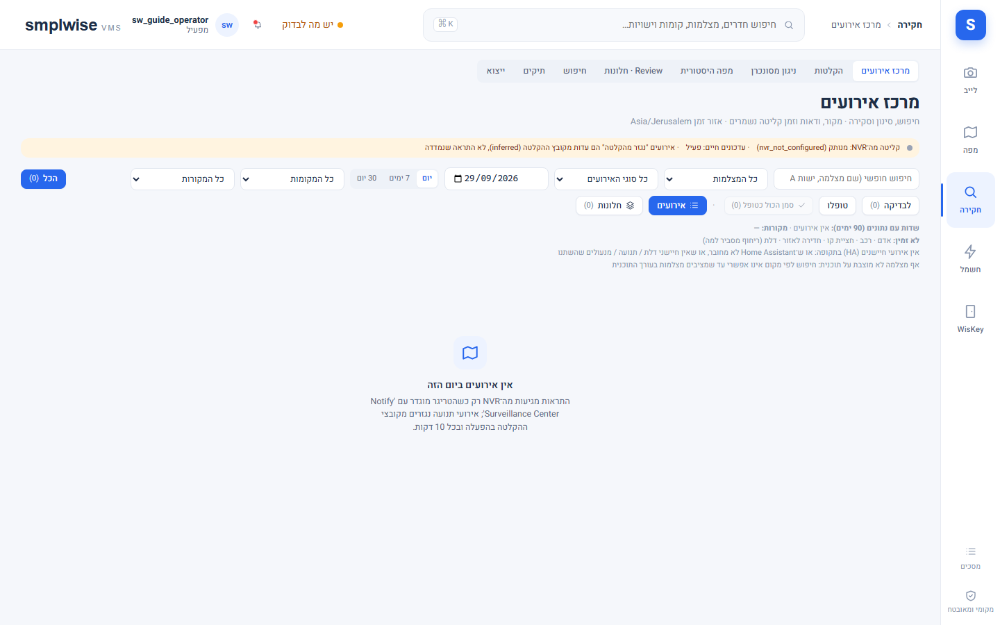
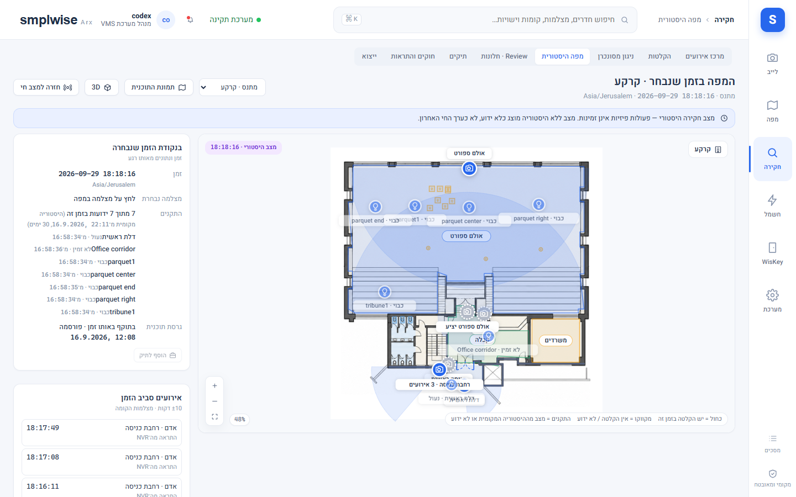
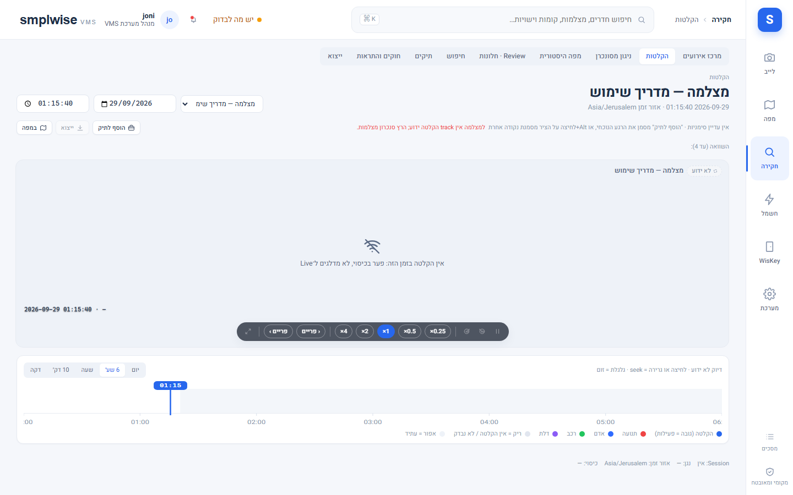

# מרכז אירועים, ניגון ותיקי חקירה

## מה זה

חקירה היא אזור ההיסטוריה: מרכז האירועים (רשימה וחיפוש), הקלטות וניגון עם ציר זמן, מפה היסטורית
(מצב הקומה ברגע נבחר), ותיקי חקירה שאוספים אירועים/קטעים/הערות לחבילת ראיות ניתנת לייצוא. אירועים
מגיעים משני מקורות, שניהם מתויגים: **מדודים** (measured) מזרם ההתראות של ה-NVR, ו-**נגזרים**
(inferred) שמופקים מחיפוש ההקלטות — אירוע נגזר לעולם אינו מוצג כהתראה מדודה. ה-NVR שולח התראה רק
כשהקישוריות שלו כוללת "Notify Surveillance Center"; בלעדיה הזרם נושא פעימות לב אך לא התראות
(ראו `95-troubleshooting_HE.md`).

## איך אני… (צופה ומפעיל)

1. **מסנן במרכז האירועים.** יום/סוג/מצלמה/מקום (קומה ← חדר/אזור, לפי מיקום הסיכה בפועל)/מקור/
   לא-טופל, עם עדכונים חיים דרך WebSocket. השורה שמעל הרשימה נוקבת אילו שדות יש להם נתונים
   ב-90 הימים האחרונים ולמה לאחרים אין (למשל מסנני אדם/רכב/חדירה אינם נתמכים עד שאירועי smart
   מוגדרים במצלמה — מוצג "המסנן אינו נתמך כאן", לא רשימה ריקה מטעה). "חלונות" מקבצת אירועים
   סמוכים של אותה מצלמה (פער 1–10 דקות, לבחירה) לשורה אחת; "סמן הכל כטופל" מטפל בחלון שלם, בלי
   למזג או למחוק את האירועים הגולמיים.
2. **פותח עמוד אירוע.** ניגון מ-2 שניות לפני האירוע, כרטיס הקשר (טופל על ידי מי, מקור, סוג, משך,
   מיקום עם תוכנית וסיכה מודגשות), **קורלציה דלת-מצלמה-חיישן** (חיישנים/מנעולים סמוכים וטווח
   ±2 דקות, כל שורה מסומנת "נמדד"/"נגזר"/"פקודה" — פקודה אינה הוכחה שהדלת נפתחה), ו**מסלול מוצע**
   (מצלמות שכנות מדורגות לפי טופולוגיית המפה — השערה, לעולם לא זיהוי אדם/רכב). "סמן כטופל"
   (`events.ack`) נכתב ביומן הביקורת בשם המשתמש.
3. **מנגן ומייצא.** ציר הזמן תומך ב-seek, ±10 שניות, האטה ×0.5/×0.25 וצעידת פריים; ריחוף מציג
   תצוגה מקדימה. "השוואה" מוסיפה עד שלוש מצלמות נוספות סביב שעון-אב אחד (best effort, ללא עוגן
   PTS↔UTC מאומת — סחיפה מוצגת לכל אריח). "ייצוא קטע": לבחור טווח, לקבל אומדן קבצים/בייטים,
   לאשר ולעקוב אחרי המשימה תחת ייצוא והורדות; החיתוך הוא ב-key frame, וה-manifest מתעד טווח
   מבוקש מול בפועל וגרסת pipeline (דורש `video.export`).
4. **פותח מפה היסטורית.** "המשך חקירה במפה" מציג את הקומה ברגע הנבחר עם גרסת התוכנית שהייתה
   בתוקף אז: סיכת מצלמה כחולה כשיש כיסוי הקלטה, מקווקוות כשאין; ישויות HA מוצגות עם המצב
   שההיסטוריה המקומית מכירה לאותו רגע או "לא ידוע" (ולמה — ההיסטוריה לא ממולאת קדימה בלי גבול).
   ציר זמן תחתון גולל את היום; "נגן מכאן" פותח ניגון; לא ניתן להפעיל ציוד מהמסך הזה.

## איך אני… (מפעיל, מנהל אתר, מנהל מערכת — תיקי חקירה)

5. **פותח או עורך תיק** (`cases.manage`): מעמוד אירוע ("הוסף לתיק"), מהניגון (קליפ 15 שניות
   לפני/45 אחרי הסמן) או מהמפה ההיסטורית, ובנוסף "תיק חדש" ברשימת התיקים. פריט מציג את מצבו
   האמיתי: **"סימנייה ל-NVR בלבד"** (עדיין ניתנת לדריסה שם), **"שמור עותק"** (מריצה ייצוא; הופך
   ל"עותק שמור" רק כשהעותק הושלם), **"חסר"** (ה-NVR כבר מחק — לעולם לא "משומר"), **"לא נבדק"**.
6. **בונה חבילת ראיות (ZIP).** קליפים שמורים עם ה-manifest שלהם, תצוגות מקדימות, הערות, manifest
   עם SHA-256 לכל קובץ, דוח קריא, וסימניות שלא נשמרו מוצגות כדולגו. כל חבילה **חתומה ב-Ed25519**
   במפתח הפעיל של ההתקנה (`manifest.sig.json`).
7. **מאמת חבילה** ("אימות חבילה", כל מי שרשאי לקרוא אירועים): מעלים ZIP, כל קובץ מגובב מחדש
   ומושווה ל-manifest — **שום דבר לא יובא בשלב הזה**. התוצאה מבדילה בין "חתום על ידי מפתח של
   התקנה זו" (פעיל או פרוש), "חתום על ידי מפתח לא ידוע" (שלמות בלבד) ו"לא חתום" (חבילות ישנות).
   **מה ההתאמה מוכיחה:** SHA-256 תואם ו-manifest שלם = הקבצים לא השתנו מאז הייצוא; חתימה תקינה
   של מפתח התקנה זו = ההתקנה הזו הפיקה את החבילה; חתימה תקינה של מפתח לא מוכר = שלמות בלבד. **מה
   זה לא מוכיח:** אמיתות הצילום במקור, שעון המצלמה, או קבילות משפטית — המצלמה, ה-NVR והרשת
   נשארים מחוץ לכל hash וחתימה.
8. **מייבא חבילה מהתקנה אחרת** ("ייבוא חבילת ראיות", `cases.manage` בהיקף ההתקנה, 0.1.131):
   מריץ קודם את אותו אימות ומציג דוח לכל קובץ (תואם/שונה/חסר/פגום), את ההתקנה שהפיקה (מזהה,
   גרסת SMPLWISE, זמן ייצוא) והאם זו ההתקנה הזו. **"ייבא כתיק" פעיל רק כשהכול תואם**, ואז יוצר
   תיק **חדש** מסומן **"מיובא"** עם באנר מקור (התקנה, זמן ייצוא, SHA-256 של החבילה, "hash תואם"
   בזמן הייבוא) וכפתור **"בדיקת hash חוזרת"** שמגבב מחדש את העותקים השמורים בכל עת. קבצי הקליפ/
   תצוגה מקדימה נשמרים תחת `/data/imported/<sha256>/`; הערות הופכות ל"מיובא · לקריאה בלבד";
   סימניות שהמקור לא שימר מוצגות "לא נכללו בחבילת המקור". פריטים מיובאים לא ניתנים להסרה בודדת —
   רק מחיקת התיק כולו מסירה אותם ואת הקבצים. אותה חבילה מיובאת פעם אחת (409 מציין את התיק הקיים);
   אחרי מחיקתו ניתן לייבא שוב. **מה חבילה מיובאת אינה יכולה לעשות:** שום דבר בה הופך למצלמה,
   אירוע, תוכנית, משתמש, שיוך או הגדרה — מזהי מצלמת מקור נשמרים כטקסט בלבד, ורק קבצי קליפ/תצוגה
   ששמם עובר רשימת היתר קפדנית מגיעים לדיסק, מוגשים לפי הסוג האמיתי שלהם (בדיקת תוכן, לא סיומת).
   מוגבל בגודל (`cases.import_max_mb`, ברירת מחדל 512MB) ונדחה לפני קריאה כשהארכיון חשוד (נתיבים
   חורגים, סימלינק, ספירת קבצים קיצונית). הבייטים המיובאים נספרים במערכת ← אחסון ("ראיות
   מיובאות") ובדוח הבריאות, **ואינם חלק מגיבויי הפרויקט** (כמו תצוגות מקדימות של אירועים).

## איך אני… (מנהל אתר, מנהל מערכת — חוקים והתראות, אם המסך זמין בהתקנה)

9. **בונה חוק:** טריגר (סוגי אירועים, מקורות, חומרה) × היקף (קומות/חדרים/מצלמות, ריק = הכל)
   × חלון זמן (יכול לחצות חצות) × תקופת צינון. הפעולה היחידה היא התראה בתוך ה-VMS או שירות
   `notify` ב-Home Assistant — לעולם לא פקודת התקן. **"הרצה יבשה"** מריצה מחדש את אירועי 24 השעות
   האחרונות דרך אותו מתאם ומסבירה למה כל אחד היה או לא היה מעורר, בלי לכתוב דבר. דורש `rules.manage`.

## שים לב

- כל אישור טיפול, שינוי תיק, ייצוא, אימות וייבוא נכתבים ביומן הביקורת.
- שמירת אירועים (`events.retention_days`, ברירת מחדל 30 יום) וקבצי ייצוא (`exports.retention_days`,
  ברירת מחדל 7 ימים) נמחקים אוטומטית בתום התקופה; חבילות ראיות ופריטים מיובאים אינם כפופים
  לשמירה הזו — הם נשארים עד מחיקת התיק.
- אירוע סמוך במסלול המוצע או בקורלציה הוא הקשר בלבד — לעולם לא טענה לזיהוי אותו אדם/רכב.

*יוחלף בצילום מהמעבדה.*

*יוחלף בצילום מהמעבדה.*

*יוחלף בצילום מהמעבדה.*
