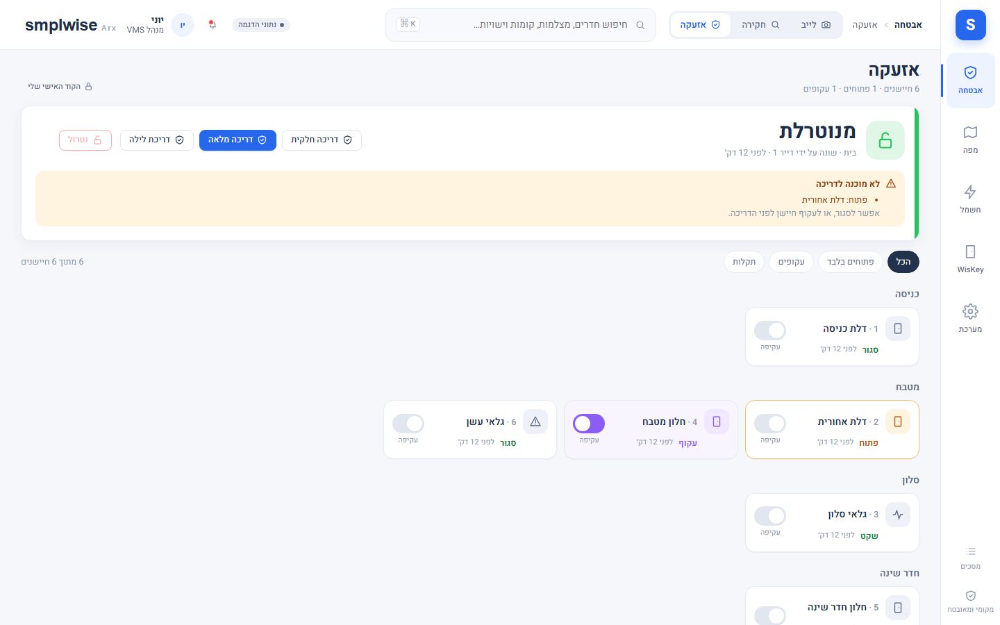

# הגדרות › אבטחה › אזעקה

Source: original

## מה זה

אזור "אבטחה" בסרגל הצד מרכז את **לייב** (מצלמות) ואת **חקירה** (אירועים, הקלטות, תיקים, בריאות מצלמות). **האזעקה**
נמצאת בהגדרות: בתפריט המשתמש (האווטאר) ← **מערכת** ← **אבטחה**. שם שלושה עמודים: **אזעקה** (המסך שמתואר כאן),
**ניהול אזעקה** (קודים, שיוך חיישנים, מדיניות מרחוק - למנהל מערכת) ו**NVR** (מצב ה-NVR וקיצור להגדרות החיבור).
העמוד מופיע רק למי שיש לו הרשאת אזעקה (`alarm.view` ומעלה) - גם בלי הרשאה להגדרות אחרות, ורק כשמחוברת למערכת
לוח אזעקה; בלי לוח, עמודי האזעקה לא מוצגים בכלל. קישורים ישנים (`#/security/alarm`, גם עם לוח מסוים) ממשיכים
לעבוד ופותחים את אותו מסך.

מסך **האזעקה** מציג את לוח האזעקה של המבנה: אם הוא דרוך או מנוטרל, כפתורי דריכה ונטרול, והחיישנים (אזורים) של
המערכת - כל אחד עם המצב החי שלו ומתג עקיפה. הנתונים מגיעים ממערכת האזעקה עצמה ומתעדכנים מעצמם.

## איך אני… (צופה ומעלה)

1. **רואה את מצב האזעקה.** הכרטיס העליון מציג את המצב באותיות גדולות ובצבע: "מנוטרלת" (ירוק), "מופעלת מלאה",
   "מופעלת חלקית", "מופעלת · לילה" (סגול), "בהשהיית יציאה" / "בהשהיית כניסה" (כתום), "אזעקה!" (אדום מהבהב),
   "לא זמינה" (אפור). מתחת: מי שינה לאחרונה ומתי.
2. **בוחר לוח.** כשיש יותר מלוח אחד (למשל שתי מחיצות - "בית" ו"חצר"), שורת כפתורים מעל הכרטיס מחליפה ביניהם.
3. **בודק "מוכנה לדריכה?".** כשהאזעקה מנוטרלת, הכרטיס מפרט אילו חיישנים פתוחים או בתקלה. אפשר לסגור אותם או
   לעקוף אותם לפני הדריכה.
4. **עובר על החיישנים.** החיישנים מקובצים לפי אזור בבית. לכל חיישן: מצב (**פתוח / סגור / תנועה / תקלה / עקוף**),
   מתי השתנה, ו"חבלה" או "סוללה חלשה" כשהחיישן מדווח עליהם. חיישן שמשותף לשתי מחיצות מסומן "משותף".
5. **מסנן.** "פתוחים בלבד", "עקופים", "תקלות", או "הכל".

## איך אני… (מפעיל ומעלה - לפי ההרשאות שלכם)

1. **דורך את האזעקה.** לוחצים על מצב הדריכה הרצוי (דריכה מלאה, דריכה חלקית, דריכת לילה - רק המצבים שהלוח תומך
   בהם). דריכה אינה מבקשת אישור. אם המשתמש שלכם חייב קוד, נפתחת מקלדת.
2. **מנטרל.** "נטרול" מבקש תמיד אישור. אם נדרש קוד, מקלידים אותו במקלדת שנפתחת (הקוד מוסתר, השדה מתרוקן כשסוגרים).
3. **עוקף חיישן.** המתג "עקיפה" שליד החיישן מוציא אותו מההגנה (הוא לא יתריע) עד שמחזירים אותו. גם עקיפה וגם
   החזרה מבקשות אישור, ועקיפה הולכת לפי אותה מדיניות קוד כמו נטרול.
4. **מגדיר קוד אישי.** "הקוד האישי שלי" (בראש המסך) - קוד של 6 עד 8 ספרות לאזעקה בלבד (מנהל יכול לקבוע מינימום
   אחר). זה **אינו** קוד הלוח. את הקוד **הראשון** נותן מנהל המערכת - או שמגדירים אותו כאן אחרי הקלדה נכונה של קוד הלוח;
   שינוי קוד קיים דורש את הקוד הנוכחי. בלי קוד אישי, משתמש שחייב קוד מקבל "פנה למנהל המערכת לקבלת קוד אישי".
5. **מבין את התשובה.** אחרי שליחה מופיעה שורה: "נשלח · ממתין לאישור הלוח" ואז "הלוח אישר". "הלוח לא אישר את
   הפקודה בזמן" אומר שהלוח לא דיווח על שינוי - לעתים כי הקוד שגוי; המצב שמוצג הוא תמיד מה שהלוח עצמו מדווח.

## איך אני… (מנהל מערכת)

1. **שומר את קוד הלוח.** הגדרות › אבטחה › ניהול אזעקה › בכרטיס של הלוח: מקלידים קוד ושומרים. הקוד נשמר מוצפן ואינו
   מוצג שוב - רואים רק "מוגדר", מתי ועל ידי מי. אפשר להחליף או למחוק.
2. **קובע מי צריך קוד.** משתמשים והרשאות › משתמש › "אזעקה": דריכה ונטרול, כל אחד בנפרד, "ללא קוד" (לחיצה אחת,
   המערכת שולחת את קוד הלוח השמור) או "חייב קוד" (ברירת המחדל). שם גם קובעים או מוחקים קוד אישי של משתמש. את
   ההגדרות והקוד של **עצמכם** משנים רק עם הקוד האישי הנוכחי שלכם - או שמנהל מערכת אחר משנה אותם.
3. **בוחר איזה קוד מקלידים.** הגדרות › אבטחה › ניהול אזעקה: "קוד אישי לכל משתמש" (ברירת מחדל - אף משתמש לא לומד את קוד
   הלוח) או "קוד הלוח".
4. **קובע מה מותר מחוץ לבית.** שליטה מרחוק, נטרול ועקיפה מרחוק, ו"ללא קוד גם מרחוק" (פעיל כברירת מחדל).
5. **מתקן שיוך.** טבלת השיוך מראה לכל חיישן את מתג העקיפה שלו ולפי מה שויך. אפשר לבחור מתג אחר, "ללא עקיפה",
   לשייך חיישן למחיצה אחת, או להוציא חיישן שאינו אזור. מתגים שלא שויכו מוצגים תחת "ללא שיוך".

## שימו לב

- **נטרול ועקיפה תמיד מבקשים אישור**; דריכה לא. הפעלת אזעקה ("trigger") לא קיימת במסך.
- **קודים לא נשמרים גלויים ולא מוצגים.** קוד הלוח נשמר מוצפן, קוד אישי נשמר רק כטביעה חד-כיוונית, ושום קוד לא
  מופיע ביומן הביקורת, בהודעות שגיאה או בכתובת הדפדפן.
- **5 קודים שגויים בתוך 5 דקות** נועלים את הקלדת הקוד למשך 10 דקות - קוד אישי שגוי נועל רק את המשתמש שהקליד אותו,
  קוד לוח שגוי נועל גם את הלוח. הנעילה נשמרת גם אחרי הפעלה מחדש.
- **הלוח ומתגי העקיפה נשלטים רק מכאן.** בכרטיס המפה ובמסכי חשמל והתקנים הם מופיעים לקריאה בלבד ("נשלט ממסך האזעקה"),
  ופעולות מרוכזות לעולם לא נוגעות בהם.
- **כל פעולה נרשמת ביומן הביקורת** - מי, מה, על איזה לוח או חיישן, התוצאה, ואם נעשתה מתוך הרשת או מבחוץ.
- **מבחוץ עם "ללא קוד":** הנעילה הביומטרית קיימת רק באפליקציית האנדרואיד ורק אם הופעלה בה; בדפדפן אין נעילה כזו.
  מנהל יכול לכבות את "ללא קוד גם מרחוק" כדי שכל פעולה מבחוץ תבקש קוד.
- **שתי מחיצות:** חיישן שהמערכת לא יודעת לאיזו מחיצה הוא שייך מופיע בשתיהן ומסומן "משותף", עד שמנהל משייך אותו. מי
  שמורשה רק על אחת המחיצות רואה חיישן כזה בשמו בלבד ולא יכול לעקוף אותו.

*צילום מהדגמה - הלוח, החיישנים והשמות בדויים.*
