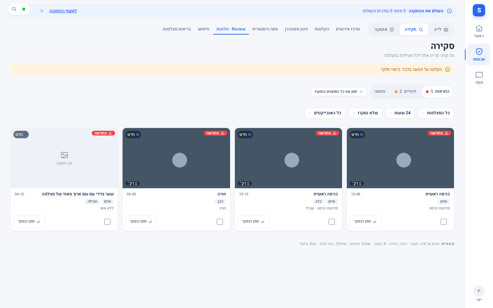
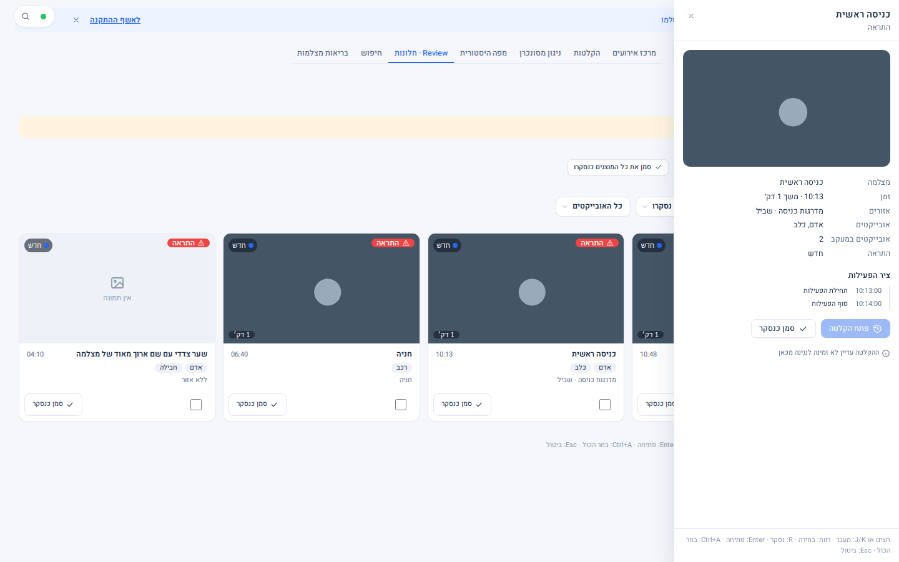
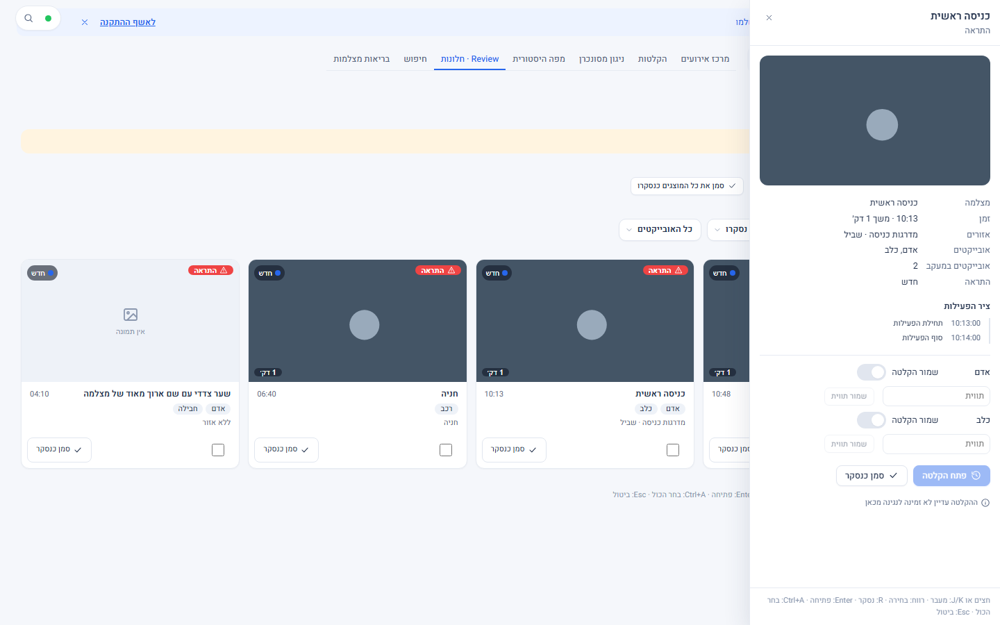
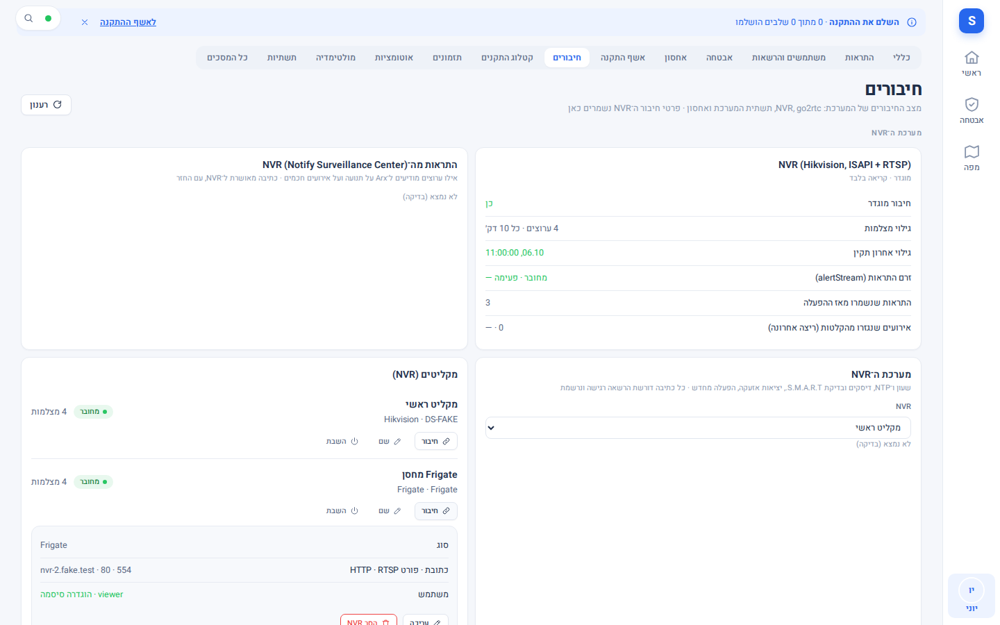
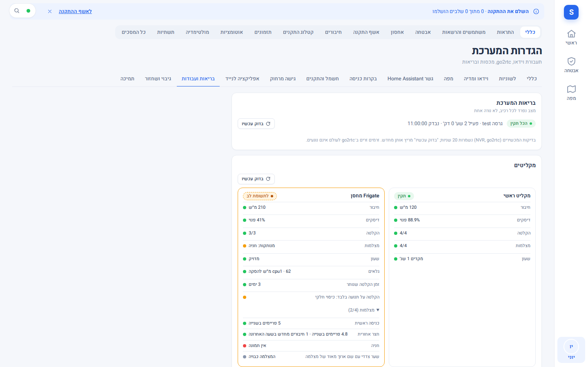
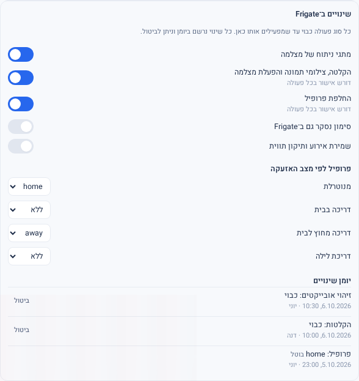

# מקליטי Frigate — סקירה, ניגון ושליטה

Source: original

## מה זה

מלבד מקליטי NVR רגילים, המערכת יכולה להתחבר גם למקליט **Frigate** (גרסה 0.18 ומעלה): מערכת הקלטה שמזהה אנשים, כלי רכב
ובעלי חיים בתמונה. מצלמות של Frigate מופיעות בלייב ובמפה כמו כל מצלמה, ויש להן מסכים משלהן: **סקירה** (מה קרה, פריט אחד
לכל פעילות) ובריאות המקליט.

**החיבור כבוי כברירת מחדל.** סוג המקליט "Frigate" מופיע בבחירה רק אחרי שמנהל הפעיל אותו באפשרות התוסף `frigate_enabled`
(ראו "חיבור מקליט" למטה; משנה 2.2.1). בלי זה אין שום שינוי: שום מסך לא מוסיף Frigate מעצמו.

שני שלבים, וכל אחד נשלט בנפרד:

1. **צפייה וניגון (קריאה בלבד).** המערכת רק קוראת מ-Frigate: אין שום שינוי בהגדרות שלו.
2. **שליטה ופעולות.** מתגים וצעדים שמשנים את Frigate עצמו. **כל סוג פעולה כבוי** עד שמנהל מפעיל אותו.

*צילום מהדגמה: פריטי הסקירה והתמונות הן נתוני דמה; בהתקנה אמיתית מופיעות התמונות מהמצלמות.*

## איך אני… (מפעיל ומעלה)

1. **רואה מה קרה.** אבטחה › חקירה › **חלונות · Review** (הסקירה). שלוש שכבות: **התראות** (מה שחשוב), **זיהויים** ו**תנועה**. לכל
   פריט: מצלמה, שעה, משך, מה זוהה (אדם, רכב…) והאזור. מסננים לפי מצלמה, תקופה (היום, 24 שעות, 7 או 30 ימים), מצב (חדש / נסקר)
   וסוג אובייקט.
2. **מסמן "נסקר".** על פריט בודד או "סמן את כל המוצגים כנסקרו". הסימון הוא **אישי**: מה שסימנתם לא נעלם אצל אחרים.
3. **פותח פריט.** לחיצה פותחת מגירה עם התמונה, האזורים, ציר הפעילות של האובייקט וכפתור "פתח הקלטה" לניגון הקטע. כשההקלטה
   עדיין לא זמינה לניגון, המגירה אומרת זאת במקום להציג כפתור שלא עובד.
   **שמירה ותווית (למי שמורשה לשנות אירועים):** מתחת לפרטים, לכל אובייקט שנעקב יש שורה עם מתג **שמור הקלטה** (מונע מ-Frigate
   למחוק את הקטע) ושדה **תווית** (למשל שם של אדם) עם כפתור **שמור תווית**. השורות מופיעות רק כשסוג הפעולה "שמירת אירוע
   ותיקון תווית" דלוק למקליט ויש לכם `analytics.events`; אחרת הן לא מצוירות בכלל. תווית שכבר קיימת מוצגת גם ליד שם האובייקט בפרטי
   הסקירה לכל מי שרואה אותם. אחרי שינוי שמוצג "נשמר" ה-Frigate נקרא חזרה; אם לא ניתן לאמת, מוצג "נשלח; המצב לא אומת".
4. **רואה בריאות.** הגדרות › כללי › בריאות ועבודות › "מקליטים": כרטיס לכל מקליט עם חיבור, מקום פנוי, מצלמות פעילות, חיבורים
   מחדש ותקיעות בשעה האחרונה. הקלטה על תנועה בלבד מסומנת "כיסוי חלקי" - זו לא תקלה, ואין לפרש היעדר הקלטה כאילו לא קרה דבר.
5. **מקבל התראות.** התראות מגיעות מפריטי **התראה** בלבד (לא מכל זיהוי), דרך אותם ערוצים ושעות שקט של מרכז ההתראות.
6. **בלייב.** מצלמת Frigate מוצגת כתמונה שמתרעננת (לא כוידאו רציף) - כך נאמר בכרטיס המקליט.

*צילום מהדגמה: מגירת הפרטים של פריט סקירה.*

*צילום מהדגמה: שורה לכל אובייקט שנעקב (אדם, כלב) עם "שמור הקלטה" ושדה תווית; נתוני דמה.*

## איך אני… (מנהל מערכת)

### חיבור מקליט

1. מפעילים את סוג Frigate באפשרות התוסף: **תצורה (Configuration) של התוסף › `frigate_enabled: true` › שמירה › הפעלה מחדש של
   התוסף.** ברירת המחדל `false`: בלי זה "Frigate" לא מופיע בבחירת סוג המקליט. (עד 2.2.0 זה נעשה רק במשתנה סביבה בשרת, בידי
   המתקין; האפשרות עושה את אותו דבר.)
2. הגדרות › חיבורים › **הוסף NVR**, בוחרים **Frigate**, ממלאים כתובת ופורטים ומשתמש.
   **מומלץ חשבון צפייה (viewer) ייעודי** ב-Frigate ולא חשבון מנהל.
3. "בדיקה": המערכת מראה גרסה, מצלמות, גלאים, יכולות (סקירה, אובייקטים, הקלטות, ניגון, חיפוש…) ושמירת הקלטות. גרסה מתחת ל-0.18
   נדחית עם הסבר.
4. שומרים ומפעילים מחדש את התוסף (שינוי חיבור חל רק אחרי הפעלה מחדש), ואז מייבאים את המצלמות.
5. אותו מקום מכוסה גם במקליט אחר? מקשרים את המצלמות בעורך המצלמות כך שהאירועים מתחברים למקום אחד.

*צילום מהדגמה: מקליט Frigate לצד מקליט Hikvision; הכתובת בדויה.*

*צילום מהדגמה: כרטיס בריאות לכל מקליט; המקליט השני מראה "כיסוי חלקי" והמצלמה הכבויה.*

### הפעלת שליטה (כבוי כברירת מחדל)

הגדרות › המקליט › **"שינויים ב-Frigate"**. ששת סוגי הפעולה, לכל אחד מתג משלו והרשאה משלו:

| סוג פעולה | מה מאפשר | הרשאה |
|---|---|---|
| מתגי ניתוח של מצלמה | זיהוי אובייקטים / תנועה / שמע, התראות וזיהויי סקירה… למצלמה אחת | `analytics.control` |
| הקלטה, צילומי תמונה והפעלת מצלמה | כיבוי והדלקה של הקלטה / תמונות / המצלמה עצמה | `analytics.record_control` |
| החלפת פרופיל | פרופיל ב-Frigate, וגם "פרופיל לפי מצב האזעקה" (ברירת מחדל: ללא) | `analytics.profile` |
| סימון נסקר גם ב-Frigate | שיקוף הסימון האישי ל-Frigate | `analytics.events` |
| שמירת אירוע ותיקון תווית | "שמור הקלטה" לאירוע, תיקון תווית משנה | `analytics.events` |
| שליטת PTZ | **לא משוחרר** - אי אפשר להפעיל, ואין לוח PTZ | - |

כללי הבטיחות: כל שינוי נעשה **פעם אחת**, נקרא חזרה מ-Frigate ורק אז מוצג "נשמר"; אם לא ניתן לאמת - "נשלח; המצב לא אומת".
**אין ניסיון חוזר ואין תור** (פעולה שנכשלה לא תקרה מאוחר יותר מעצמה). כיבוי הקלטה, החלפת פרופיל ו-PTZ מבקשים אישור בכל פעם
(אפשר לדרוש אישור גם לשאר: "דורש אישור בכל פעולה"). **יומן שינויים** מציג מי שינה מה ומתי, ובכל שורה "ביטול".

*צילום מהדגמה: מתגי סוגי הפעולה (PTZ אינו מוצג), מיפוי פרופיל לפי מצב האזעקה ויומן השינויים עם "ביטול" בכל שורה.*

הרשאת הצפייה `analytics.review` ניתנת למפעיל ומעלה; ההרשאות `analytics.*` האחרות רגישות, למנהלי אתר ומערכת בלבד.

### כרטיס הניהול "שינויים ב-Frigate": הלשוניות (מגרסה FRGD)

הכרטיס מחולק ללשוניות. בראשו שבב שאומר כמה סוגי פעולה דלוקים (או "לקריאה בלבד"). כל לשונית נפתחת רק למי שיש לו ההרשאה המתאימה;
בלי מחלקת הפעולה הדלוקה הרשימה נקראת אך הפעולות נעולות, ושבב "סוג הפעולה כבוי" אומר זאת.

1. **סוגי פעולה.** המתגים משולחן למעלה, ועוד שניים: **ייצוא קטעים** (`analytics.exports`, וגם `video.export` במצלמה) ו**תיקים**
   (`analytics.cases`). ליד כל שורה: "דורש אישור בכל פעולה" / "דורש אישור במחיקה" ומזהה ההרשאה.
2. **פרופילים.** המיפוי "פרופיל לפי מצב האזעקה" (כמו קודם), ומתחתיו **פרופיל אוטומטי לפי מצב האזעקה**: מצב (כבוי / הצעה בלבד /
   הפעלה), מתג **הסכמה להחלפה אוטומטית** (מי ומתי), ושורת מצב אחת שאומרת מה קורה עכשיו בשינוי אזעקה, או למה "הפעלה" עדיין לא
   מחליפה (סוג הפעולה כבוי / חסרה הסכמה / טרם כתיבה ראשונה בפיקוח). "הפעלה" אינה ניתנת לבחירה בלי הסכמה. **הצעות פתוחות**: לכל
   הצעה "החל" (אישור בכל פעם; בהחלפה האוטומטית הראשונה גם תיבת הפיקוח) ו"דחה". מתחת: שינויי האזעקה האחרונים עם מצב וסיבה.
3. **ייצואים.** טבלה של הייצואים ב-Frigate (שם, מצלמה, תאריך, מצב, נוצר ב-Arx / ב-Frigate). **ייצוא חדש**: מצלמה אחת, טווח (עד
   שעתיים, לא בעתיד) ושם. שינוי שם (בשורה עצמה) ומחיקה (עם הקלדת השם לאישור) מוצעים רק לייצואים ש-Arx יצר; Frigate עצמו לא
   נוגעים בו. אפשר לייצא גם ישירות ממגירת פריט סקירה: "ייצוא הקטע" (מופיע רק כשיש לכם ההרשאות ומחלקת הייצוא דלוקה).
4. **תיקים.** כמו ייצואים: שם ותיאור, שינוי שם, מחיקה עם הקלדת השם, רק לתיקים ש-Arx יצר.
5. **אירועים ידניים.** יצירה (מצלמה, תווית, משך 1-600 שניות או "פתוח עד לסיום ידני", תווית משנה) דרך מחלקת "אירועים", ורשימת
   האירועים הפתוחים שנוצרו כאן עם "סיים".
6. **יומן שינויים.** כל השינויים (גם ייצואים, תיקים ואירועים ידניים) עם "ביטול"; ביטול שהוא כתיבה ראשונה מסוגו מבקש תיבת פיקוח.
7. **פיקוח.** עשרת סוגי הכתיבה החדשים ומצבם ("בוצע" / "טרם בוצע"), ו**קריאת קטע וידאו** בפיקוח: מצלמה וחלון של עד שעה, נפתח
   בלשונית חדשה כקטע שמועבר דרך Arx (`video.playback`). הקריאה הראשונה במקליט מסומנת "מבוצע בפיקוח".

**כתיבה ראשונה בפיקוח:** כל סוג כתיבה חדש נחסם עד שמנהל מערכת מבצע אותו פעם אחת ומסמן "מבוצע בפיקוח" בתיבה שמופיעה בטופס. מי
שאינו מנהל מערכת רואה את ההסבר במקום הכפתור. הסבב המפוקח מתואר ב-`docs/operations/FRIGATE_SUPERVISED_VERIFICATION_HE.md`.

**כנות מלאה:** כל הצורות האלה נבדקו רק מול Frigate מדומה (בשרת ובמסכים). הכתיבה או הקריאה הראשונה מול Frigate אמיתי עדיין לא בוצעה.
אל תפעילו אותן בהתקנה חיה לפני סבב אימות מפוקח. **לא נבנו:** עורך אזורים ותצורת Frigate לפי סכמה (דורשים צעד שרת), שיוך ייצוא לתיק,
לוח PTZ.

### מסך הסקירה: שתי תצוגות

בראש מסך הסקירה יש מתג **כרטיסים / טבלה** (הבחירה נשמרת בדפדפן) וכפתור "?" לקיצורי המקלדת. בטבלה: תמונה, מצלמה, זמן, משך,
אובייקטים, אזורים, מיקום, מצב ופעולות; במסך צר הטבלה מתקפלת לשורות של שתי שורות טקסט.

## מגבלות

- **הכתיבות לא נבדקו מול Frigate אמיתי.** הן נבדקו מול Frigate מדומה בלבד. מומלץ להפעיל סוג פעולה אחד, לבצע פעולה אחת בפיקוח
  ולוודא ב-Frigate עצמו, לפני שמפעילים את הבא.
- **PTZ לא שוחרר.** אי אפשר להפעיל אותו במסך.
- **ייצוא קטע, תיקים, אירועים ידניים ופרופיל אוטומטי** יש להם מסך בהגדרות (ראו למעלה), אך לא נבדקו מול Frigate אמיתי.
  עדיין אין בדיקה עם חשבון צפייה בלבד, ועוגני זמן מדויקים לניגון.
- טבלאות מחלקות הכתיבה של Frigate נכללות בגיבוי מגרסה 2.2.1.
- הפעלת סוג Frigate נעשית באפשרות התוסף `frigate_enabled` (כבויה כברירת מחדל), ורק אחרי הפעלה מחדש של התוסף.

## שים לב

- קריאה בלבד פירושה שהמערכת לא משנה דבר ב-Frigate עד שמנהל הפעיל סוג פעולה. סימון "נסקר" אצל משתמש אינו משנה את Frigate (אלא אם
  הופעל השיקוף).
- כל שינוי ב-Frigate נרשם ביומן הביקורת עם שם המשתמש.
