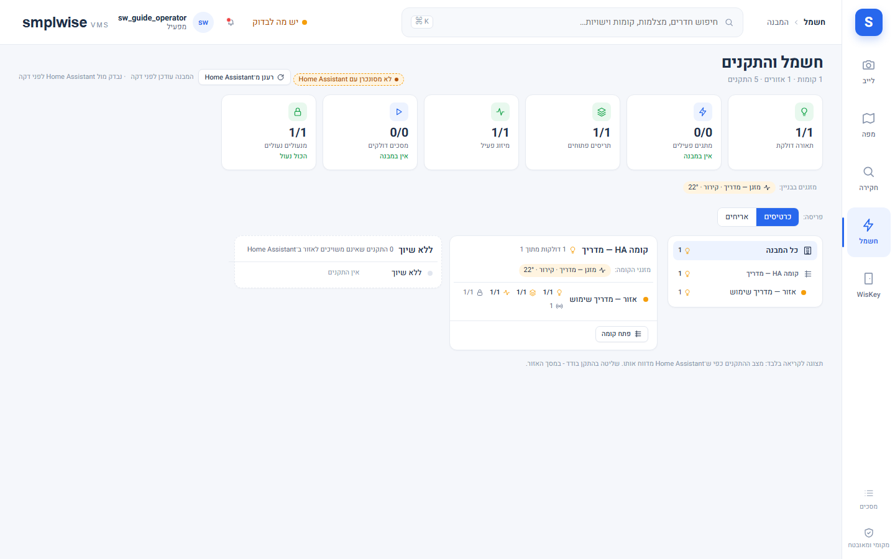

# חשמל והתקנים

## מה זה

"חשמל והתקנים" הוא האזור לשליטה בציוד Home Assistant (תאורה, מזגנים, תריסים, מתגים, מסכים)
מאורגן לפי מבנה ← קומה ← אזור, בלי צורך לעבור דרך המפה. פעולות עוברות תמיד דרך אינטגרציית
**SMPLWISE Bridge** בזהות ה-HA האמיתית של המשתמש הפועל — הרשאות Home Assistant עצמו מחליטות
אחרונות, בנוסף להרשאות ה-VMS.

## איך אני… (צופה ומעלה)

1. **מנווט בעץ המבנה.** מסך "המבנה" מציג עץ קומות/אזורים עם נקודות מצב (state dots) וספירות
   (תאורה דולקת, תריסים פתוחים, מיזוג פעיל, מנעולים נעולים, אזעקה); לחיצה על קומה פותחת כרטיס
   קומה עם שורה לכל אזור, ולחיצה על אזור פותחת את מסך האזור.
2. **בוחר פריסה.** "פריסה" מחליף בין **כרטיסים** (עץ + כרטיסי קומה, ברירת המחדל) ל-**אריחים**;
   הבחירה נזכרת לכל דפדפן.
3. **רואה "מזגני הקומה"/"מזגנים בבניין".** רצועה מרוכזת של מצב+טמפרטורת יעד לכל מזגן, בלי צורך
   להיכנס לכל אזור בנפרד (ניתנת לכיבוי בהגדרות).
4. **בודק סנכרון מול Home Assistant.** תג "מסונכרן"/"לא מסונכרן עם Home Assistant" ו"מבנה עודכן"
   מציינים מתי המבנה השתנה לאחרונה ב-HA (העברת ישות בין אזורים משתקפת תוך כ-1.5–10 שניות בזכות
   מנוי לאירועי registry, בלי לחכות לרענון התקופתי של 600 שניות).
5. **פותח את מסך האזור** ורואה כרטיסי התקן לכל תחום (תאורה/מתגים, מזגנים, תריסים, חיישנים, נעילה,
   מדיה) עם מצב חי ופקודות בודדות.
6. **שולט בהתקן בודד (`devices.control`, אזור בלבד).** פעולות שגרתיות (הדלקה/כיבוי, כיוון) נשלחות
   ישירות; פעולות "תשומת לב" (פתיחה/סגירה של תריס, לחיצת button, script/scene) דורשות דיאלוג
   אישור; פעולה שהתוצאה שלה לא מדווחת מוצגת כ**"נשלח"**, לעולם לא כ**"בוצע"** בלי אישור אמיתי.
   `devices.control` **לעולם לא** מגיעה למנעול, לוח אזעקה, סירנה, script, scene או button — אלה
   נשארים מאחורי `ha.entity.control` (ובמנעול/אזעקה גם `door.unlock`/`alarm.disarm`) ומטופלים
   מהמפה, לא מהמסך הזה.
7. **מקצה ישות לאזור (מנהל מערכת, `system.configure`).** ישות "ללא שיוך" מקבלת אזור דרך שיוך
   ידני — כתיבת registry יחידה שמורשית בדיוק לפעולה הזו.
8. **מסמן מתג "בטוח לכיבוי מרוכז" (מנהל מערכת).** מעגל תאורה מוצע לסימון אוטומטית; **כל מתג
   אחר** (כולל מה שעשוי להיות שחרור דלת) מוצג כלא כלול עד שמישהו בודק ומסמן במפורש. סימון מתנקה
   כשהישות עוזבת את Home Assistant.

## איך אני… (מנהל אתר / מנהל מערכת)

9. **מריץ פעולה מרוכזת (`devices.control_bulk`).** כפתורי מבנה/קומה/אזור: "כבה תאורה בלבד",
   "כבה הכל בבניין", "כבה קומה", "כבה אזור", "כל התריסים". כל פעולה פותחת דיאלוג שמפרט **בדיוק**
   מה יישלח (ומה לא נכלל, עם הסיבה): מנעולים, לוח אזעקה, סירנות, scripts, scenes, buttons,
   `input_boolean`, תריסי דלת/מוסך/שער וכל התקן על שכבת הדלת במפה **תמיד מוחרגים** — אין דרך
   לכלול אותם ב-bulk. עד 8 ישויות בכל פעם; התוצאה היא "בוצע" (כולן אישרו) או **"בוצע חלקית: N לא
   אושרו"**.
10. **מגביל היקף.** מחזיק בהיקף קומה פועל רק על הישויות בקומותיו; פעולות ברמת מבנה דורשות היקף
    התקנה.
11. **פותח את "ערוך פריסה" (`system.configure`, 0.1.130).** בעורך פריסה גוררים ומשנים גודל
    כרטיסי דומיין (תאורה, מזגנים…) על גריד של 8 פיקסלים (יחידות גריד, לא פיקסלים חופשיים; מדויק
    ב-RTL); חצים מזיזים, Shift+חצים משנים גודל. פאנל צד לכל כרטיס: כותרת ואייקון מותאמים, גודל
    טקסט בשלוש רמות, צבע רקע/מסגרת **מתוך פלטת תפקידים (role) בלבד — לא צבע חופשי**, הסתרה, ואילו
    ישויות הכרטיס מציג (ישויות מוסתרות עדיין נספרות). "שמור / בטל / אפס לברירת מחדל" ו-**"העתק
    לכל האזורים"** (מאושר, עם בדיקת גרסה, מבוקר). פריסה אחת להתקנה שלמה, גלויה לכולם; רק מי
    שמחזיק `system.configure` רואה את הכפתור. **בזמן עריכה תוכן הכרטיסים אינו פעיל** — אי אפשר
    להפעיל התקן אמיתי בטעות בזמן שעורכים.
12. **עורך פריסת טלפון בנפרד.** נגזרת אוטומטית מסדר הדסקטופ; "חזור לאוטומטי" מבטל שינויים ידניים.
13. **בוחר סגנון וערכת נושא (הגדרות › חשמל והתקנים, 0.1.128/0.1.130).** סגנון: **SMPLWISE**
    (הרגיל) או **זכוכית** (שקוף, מעוגל, אייקונים — מבוסס על המוקאפ שאושר). ארבע פלטות צבע (כחול,
    חול, יער, גרפיט), כל אחת עם ערכי בהיר וכהה. **"בהיר או כהה"** (`devices.scheme`): בהיר / כהה /
    לפי המכשיר — ברירת מחדל **בהיר**, כי מעטפת האפליקציה עצמה בהירה בלבד; מצב כהה **לעולם לא**
    מופעל רק כי מערכת ההפעלה במצב כהה.
14. **קובע צפיפות ותצוגת ברירת מחדל.** צפיפות "נוח"/"קומפקטי", ותצוגת ברירת מחדל של מסך המבנה
    (כרטיסים/אריחים — לצופה עצמו יש עדיפות עם המתג האישי שלו בדפדפן).

## שים לב

- כל שיוך ישות לאזור, כל שינוי פריסה וכל פעולה מרוכזת נכתבים ביומן הביקורת.
- "רענן מ־Home Assistant" מוגבל לקריאה אחת למשתמש כל 10 שניות; תוצאה בת פחות מ-3 שניות נעשה בה
  שימוש חוזר במקום לשאול שוב.
- ישות שכבר כבויה או לא זמינה מדולגת בפעולה מרוכזת — היא לא נספרת ככשל.
- שינוי גשר (bridge) דורש הפעלה מחדש אחת של Home Assistant לפני שפעולות חדשות (למשל מהירות
  מאוורר, מיקום תריס) זמינות בפועל.

*יוחלף בצילום מהמעבדה.*

*יוחלף בצילום מהמעבדה.*

*יוחלף בצילום מהמעבדה.*
