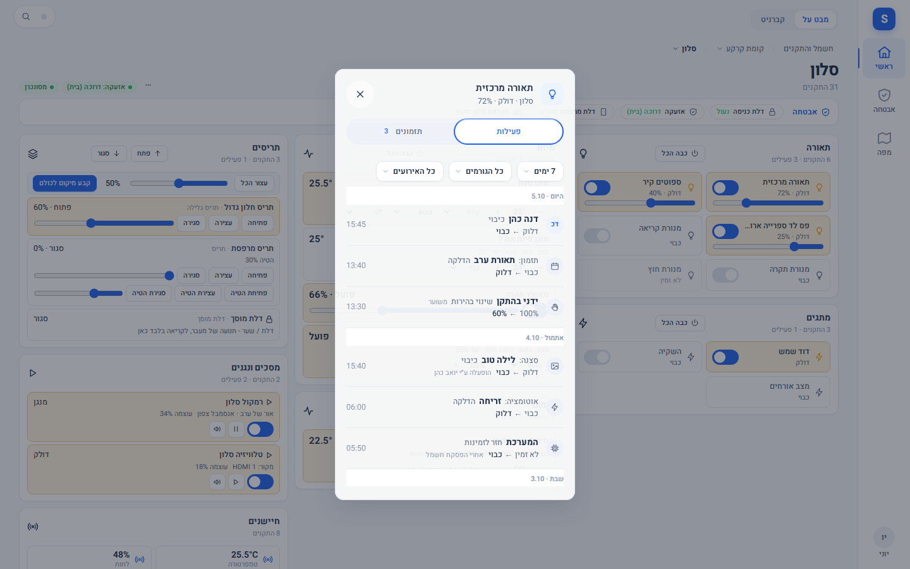
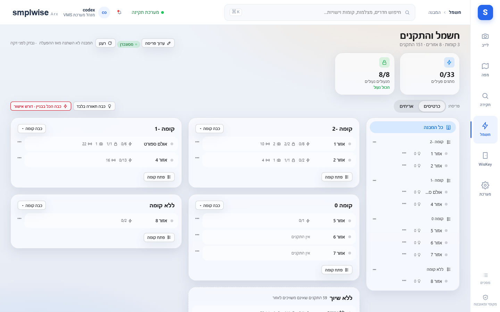
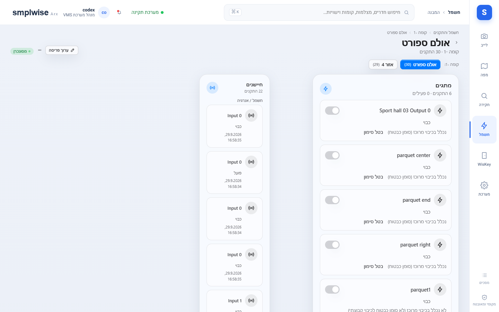
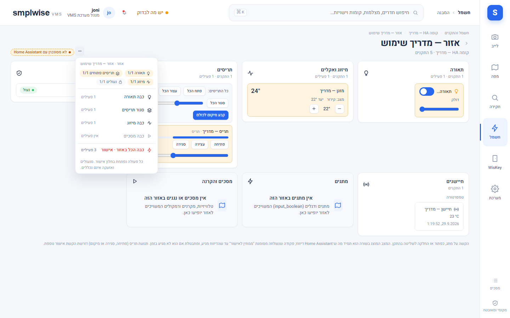
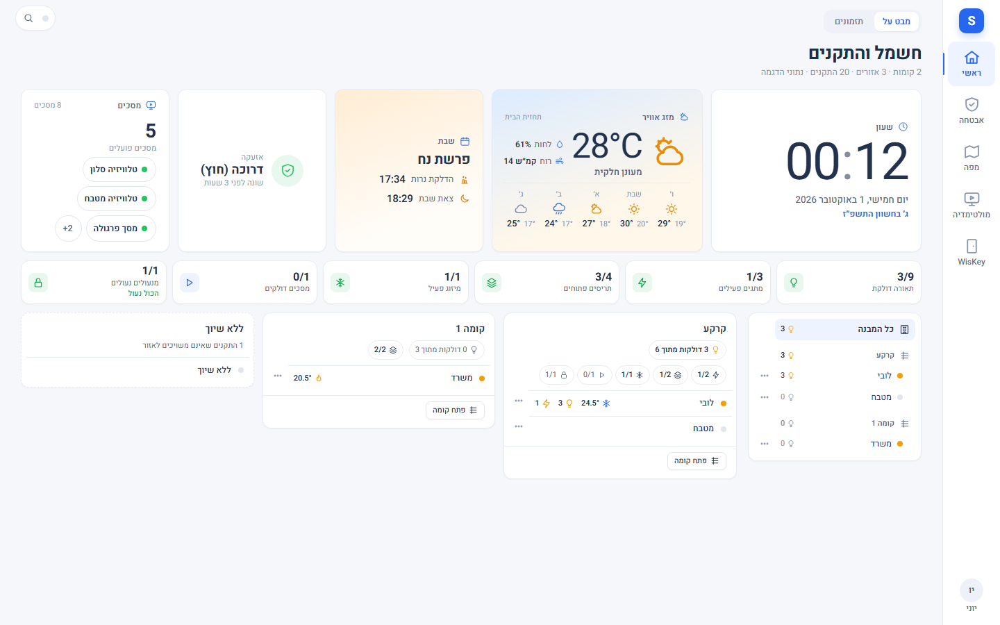
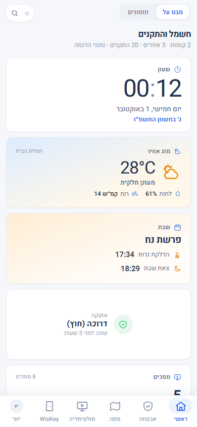

# חשמל והתקנים

Source: original

## מה זה

"חשמל והתקנים" הוא האזור לשליטה בציוד הבית (תאורה, מזגנים, תריסים, מתגים, מסכים)
מאורגן לפי מבנה ← קומה ← אזור, בלי צורך לעבור דרך המפה. פעולות עוברות תמיד דרך אינטגרציית
**SMPLWISE Bridge** בזהות חשבון המערכת האמיתית של המשתמש הפועל — הרשאות תשתית המערכת עצמה
מחליטות אחרונות, בנוסף להרשאות ה-VMS.

> מ-0.1.154 המסך הזה הוא הלשונית **"מבט על"**, ולצידה הלשונית **"קברניט"**, שבה הסגמנטים תזמונים, אוטומציות, סצנות וסקריפטים (ראו `41-schedules_HE.md`, `43-automations_HE.md`). שורת
> הלשוניות מוצגת רק למי שרואה יותר מלשונית אחת.

## איך אני… (צופה ומעלה)

1. **מנווט בעץ המבנה.** מסך "המבנה" מציג עץ קומות/אזורים עם נקודות מצב (state dots) וספירות
   (תאורה דולקת, תריסים פתוחים, מיזוג פעיל, מנעולים נעולים, אזעקה); לחיצה על קומה (או על שם הקומה
   בכרטיס שלה) פותחת כרטיס קומה עם שורה לכל אזור, ו**לחיצה על אזור נכנסת ישר למסך האזור**. ריחוף
   עם העכבר (או מעבר במקלדת) מציג סיכום של האזור עם הפעולות המהירות; במסך מגע הסיכום נפתח
   מכפתור "⋯" שבסוף השורה. מונים ותחומים שאין מהם אף התקן (למשל אין תריסים במבנה) פשוט לא מוצגים.
2. **בוחר פריסה.** "פריסה" מחליף בין **כרטיסים** (עץ + כרטיסי קומה, ברירת המחדל) ל-**אריחים**;
   הבחירה נזכרת לכל דפדפן.
3. **רואה מה קורה בכל אזור בשורה אחת.** ליד שם האזור מופיע סימן מזגן אחד (פתית שלג בקירור, להבה בחימום,
   מאוורר; עמום כשכבוי), אפשר עם הטמפרטורה או עם המצב, ואחריו המונים החשובים: תאורה ומתגים דולקים, מדיה שמנגנת.
   כמה מזגנים באזור הם סימן אחד: כברירת מחדל ממוצע הטמפרטורה של הפועלים ומספרם, או — בבחירת "מוביל" — הטמפרטורה והמצב של
   מזגן אחד (שנבחר לכל אזור, ובלי בחירה: הראשון שפועל). ערך אפס לא מוצג, ודלתות וחלונות פתוחים ומנעולים לא נעולים מופיעים רק
   כשמשהו פתוח או לא נעול ("רק כשפתוח", לכל פריט); בטלפון נכנסים עד שלושה פריטים בשורה אחת והשאר נאספים ל-"+N". לחיצה על השורה פותחת את האזור. מה מוצג ובאיזה סדר נקבע בהגדרות › חשמל והתקנים › "מה מוצג ליד
   שם האזור" (ברירת מחדל למתקן; הסדר חופשי בחצים, והקו המקווקו מראה מה נכנס בטלפון), ומי שיש לו "התאמה אישית של המסך שלי" יכול לבחור אחרת לעצמו ב-החשבון שלי › המסך שלי.
   אין יותר רשימות מזגנים בכרטיס הקומה ובראש המסך; מונה "מזגנים" אחד בשורת הספירות של הקומה ובסיכום המבנה.
4. **בודק סנכרון.** תג "מסונכרן"/"לא מסונכרן" ו"מבנה עודכן"
   מציינים מתי המבנה השתנה לאחרונה בתשתית המערכת (העברת ישות בין אזורים משתקפת תוך כ-1.5–10 שניות בזכות
   מנוי לאירועי registry, בלי לחכות לרענון התקופתי של 600 שניות).
5. **פותח את מסך האזור** ורואה כרטיסי התקן לכל תחום שיש באזור (תאורה/מתגים, מזגנים, תריסים,
   חיישנים, נעילה, מדיה) עם מצב חי ופקודות בודדות; תחום בלי אף התקן באזור לא מקבל כרטיס.
6. **שולט בהתקן בודד (`devices.control`, אזור בלבד).** פעולות שגרתיות (הדלקה/כיבוי, כיוון) נשלחות
   ישירות; פעולות "תשומת לב" (פתיחה/סגירה של תריס, לחיצת button, script/scene) דורשות דיאלוג
   אישור; פעולה שהתוצאה שלה לא מדווחת מוצגת כ**"נשלח"**, לעולם לא כ**"בוצע"** בלי אישור אמיתי.
   `devices.control` **לעולם לא** מגיעה למנעול, לוח אזעקה, סירנה, script, scene או button — אלה
   נשארים מאחורי `ha.entity.control` (ובמנעול/אזעקה גם `door.unlock`/`alarm.disarm`) ומטופלים
   מהמפה, לא מהמסך הזה.
7. **מקצה ישות לאזור (מנהל מערכת, `system.configure`).** ישות "ללא שיוך" מקבלת אזור דרך שיוך
   ידני — כתיבת registry יחידה שמורשית בדיוק לפעולה הזו.
8. **מגן על מתג מפעולה קבוצתית (מנהל מערכת).** כל מתג נכלל כברירת מחדל בכפתור "כבה הכל" ובפעולות קבוצתיות - גם מתג חדש
   שמופיע אחרי השדרוג. רק מתג שמנהל המערכת הגן עליו במפורש לא נכלל (הגדרות › חשמל והתקנים › "מתגים מוגנים"). המערכת
   רק מציעה: מתג שנראה רגיש (משאבה, דוד, שער, מקרר, שרת, ראוטר, אזעקה, בריכה, השקיה ועוד) מופיע שם כ"מוצע להגנה", ונשאר
   בפעולות הקבוצתיות עד שתאשרו. מתג מוגן לא נכלל **רק** בפעולות קבוצתיות - אפשר עדיין להפעיל אותו לבד, בתזמון ובאוטומציה.
   ההגנה נשמרת גם כשמשנים את שם ההתקן, וגם כשהוא נעלם זמנית.

## אריחי הסיכום: לחיצה מציגה ושולטת

- **לחיצה על אריח סיכום** בראש מסך המבנה (למשל "0/33 מתגים פעילים", "8/8 מנעולים נעולים") פותחת
  חלונית עם כל ההתקנים מהסוג הזה במבנה - במחשב כמגירה בצד המסך, בטלפון כגיליון מלמטה. בראש החלונית:
  כמה יש וכמה פעילים, סינון (הכול / פעילים או פתוחים או לא נעולים / כבויים או סגורים או נעולים / לא
  זמינים) וחיפוש לפי שם או אזור. ההתקנים מקובצים לפי קומה ואזור, עם המצב שדווח וזמן השינוי האחרון.
- **שליטה מהחלונית** - כמו במסך האזור ולפי ההרשאות שלך: מתג הפעלה לתאורה ולמתגים (ובהירות לגוף
  תאורה שמתעמעם), פתיחה / עצירה / סגירה ומיקום לתריסים (תנועת תריס דורשת הקשת אישור נוספת), מצב
  וטמפרטורת יעד למזגנים, הפעלה ונגינה למסכים. **נעילה** היא הקשה אחת; **פתיחת מנעול** מוצעת רק למי
  שקיבל את ההרשאה הנפרדת לפתיחת דלת, ותמיד אחרי חלון אישור. לוחות אזעקה מוצגים עם המצב שלהם בלבד;
  דריכה וניטרול - דרך "פתח במסך האזעקה".
- **כפתור ראשי** (למי שמורשה לפעולות מרוכזות) ליד הסינון, סמל בלבד (המילים מופיעות בריחוף):
  - מתגים, תאורה ומסכים - כפתור הפעלה "חכם": מלא כשמשהו דולק (לחיצה מכבה את כולם), ריק כשהכול כבוי
    (לחיצה מדליקה את כולם), ומספר קטן עליו כשרק חלק דולקים;
  - תריסים - שני כפתורים: פתח הכול / סגור הכול; מיזוג - אין כפתור ראשי;
  - מנעולים - "נעל את כל המנעולים" בלבד (אין "פתח הכול"); כל מנעול ננעל בנפרד, אחד אחרי השני.
  הכפתור פועל על מה שמוצג כרגע (ההיקף, הסינון והחיפוש), ותמיד נפתח קודם חלון אישור עם השאלה ("להדליק 22
  מתגים?"), ופרטים נוספים תחת "פרטים". מתג נכלל בכפתור הזה אלא אם מנהל המערכת הגן עליו (או שהוא מתג עקיפה של האזעקה, בשכבת הדלתות או שייך למסך המולטימדיה
  - אלה אף פעם לא נכללים); כשכל המתגים שמוצגים מוגנים, הכפתור לא פעיל וההסבר מופיע בריחוף עליו.
- **הגנה על מתגים (מנהל מערכת):** הגדרות › חשמל והתקנים › "מתגים מוגנים" - ראו `80-settings_HE.md`. מתג יכול להיות דוד,
  משאבה או שער - ודאו שמה שלא מוגן בטוח לכבות ולהדליק יחד עם שאר המתגים.
- התקן שמותר לך לראות אבל לא לשלוט בו מסומן "לקריאה בלבד"; ריחוף או הקשה מציגים את הסיבה.
- בכל כרטיס קומה יש שורת מונים קטנה (מתגים, תריסים, מיזוג, מסכים, מנעולים - רק מה שיש בקומה) לצד מונה
  התאורה; לחיצה על מונה פותחת את אותה חלונית לקומה בלבד. כך גם מוני הקומה בתצוגת "אריחים".
- Escape, לחיצה מחוץ לחלונית או כפתור "חזרה" של הדפדפן / הטלפון סוגרים אותה. Escape בתוך חלון אישור
  סוגר רק את חלון האישור. לחלונית יש כתובת משלה (למשל `#/devices/building?domain=switches&floor=...`),
  כך שאפשר לשמור קישור ישיר אליה.
- בתמונת המצב (לייב) האריחים מובילים למסך המתאים: מצלמות (הרשימה המלאה, המנותקות ראשונות ומסומנות
  "מנותקת"), אתרים, אירועי היום ובריאות המערכת.
- בטלפון ובמסך מגע אין ריחוף: "כבה אזור" נמצא בתפריט "⋯" שבסוף שורת האזור.

## איך אני… (מנהל אתר / מנהל מערכת)

9. **מריץ פעולה מרוכזת (`devices.control_bulk`).** כפתורי מבנה/קומה/אזור: "כבה תאורה בלבד",
   "כבה הכל בבניין", "כבה קומה", "כבה אזור", "כל התריסים". כל פעולה פותחת דיאלוג שמפרט **בדיוק**
   מה יישלח (ומה לא נכלל, עם הסיבה): מנעולים, לוח אזעקה, סירנות, scripts, scenes, buttons,
   `input_boolean`, תריסי דלת/מוסך/שער וכל התקן על שכבת הדלת במפה **תמיד מוחרגים** — אין דרך
   לכלול אותם ב-bulk. עד 8 ישויות בכל פעם; התוצאה היא "בוצע" (כולן אישרו) או **"בוצע חלקית: N לא
   אושרו"**.
10. **מגביל היקף.** מחזיק בהיקף קומה פועל רק על הישויות בקומותיו; פעולות ברמת מבנה דורשות היקף
    התקנה.
11. **פותח את "עריכת המסך הראשי" (`system.configure`, 0.1.130; מאז 0.1.146 בתפריט המשתמש ולא ככפתור במסך, ומאז 0.1.149 הפעולה מוצעת בתפריט רק כשנמצאים במסך הראשי).** בעורך פריסה גוררים ומשנים גודל
    כרטיסי דומיין (תאורה, מזגנים…) על גריד של 8 פיקסלים (יחידות גריד, לא פיקסלים חופשיים; מדויק
    ב-RTL); חצים מזיזים, Shift+חצים משנים גודל. פאנל צד לכל כרטיס: כותרת ואייקון מותאמים, גודל
    טקסט בשלוש רמות, צבע רקע/מסגרת **מתוך פלטת תפקידים (role) בלבד — לא צבע חופשי**, הסתרה, ואילו
    ישויות הכרטיס מציג (ישויות מוסתרות עדיין נספרות). "שמור / בטל / אפס לברירת מחדל" ו-**"העתק
    לכל האזורים"** (מאושר, עם בדיקת גרסה, מבוקר). פריסה אחת להתקנה שלמה, גלויה לכולם; רק מי
    שמחזיק `system.configure` רואה את הפריט בתפריט. **בזמן עריכה תוכן הכרטיסים אינו פעיל** — אי אפשר
    להפעיל התקן אמיתי בטעות בזמן שעורכים.
12. **עורך פריסת טלפון בנפרד.** נגזרת אוטומטית מסדר הדסקטופ; "חזור לאוטומטי" מבטל שינויים ידניים.
13. **מסדר את ההתקנים בתוך כרטיס ("סידור התקנים").** בעורך הפריסה, הכפתור "סידור התקנים" על כרטיס
    (או בפאנל שלו) פותח את הכרטיס לבד, עם "כל הכרטיסים" לחזרה. גוררים התקן למקום אחר; במקלדת חצים
    מקדימים/מאחרים אותו, Shift+חצים משנים רוחב (חצי / רוחב מלא), ו-H מסתיר או מחזיר. בפאנל: רוחב,
    גודל (קטן/רגיל/גדול), כותרת מותאמת (טקסט בלבד) והסתרה. התקן מוסתר עדיין נספר במונים של הכרטיס.
    "אפס סידור" מחזיר את הסדר האוטומטי של הכרטיס. בטלפון הסדר נגזר מהמחשב (כל התקן ברוחב מלא)
    ואפשר לסדר אותו בנפרד. הכל נשמר עם "שמור" של הפריסה, לכולם.
14. **בוחר סגנון וערכת נושא (הגדרות › חשמל והתקנים, 0.1.128/0.1.130).** סגנון: **SMPLWISE**
    (הרגיל) או **זכוכית** (שקוף, מעוגל, אייקונים — מבוסס על המוקאפ שאושר). ארבע פלטות צבע (כחול,
    חול, יער, גרפיט), כל אחת עם ערכי בהיר וכהה. **"בהיר או כהה"** (`devices.scheme`): בהיר / כהה /
    לפי המכשיר — ברירת מחדל **בהיר**, כי מעטפת האפליקציה עצמה בהירה בלבד; מצב כהה **לעולם לא**
    מופעל רק כי מערכת ההפעלה במצב כהה.
15. **קובע צפיפות ותצוגת ברירת מחדל.** צפיפות "נוח"/"קומפקטי", ותצוגת ברירת מחדל של מסך המבנה
    (כרטיסים/אריחים — לצופה עצמו יש עדיפות עם המתג האישי שלו בדפדפן).
16. **בוחר פריסת אריחים (הגדרות › כללי › עיצוב הממשק).** "פריסת אריחים": **אוטומטי** (ברירת המחדל -
    קומפקטי בטלפון, כרטיסים במסך רחב), **כרטיסים** (האריח הגבוה, הסמל מעל הערך) או **קומפקטי** (מלבן
    נמוך, הסמל לצד הערך, שני אריחים בשורה בטלפון). התצוגה המקדימה מראה את הבחירה מיד; השמירה חלה על
    כולם, בתמונת המצב ובחשמל והתקנים. כל משתמש יכול לבחור אחרת בדפדפן שלו ("פריסת אריחים בדפדפן הזה").

17. **מתאים את המסך הראשי (0.1.146, `system.configure`).** במצב "עריכת המסך הראשי" (תפריט המשתמש) יש כרטיס עם:
    **כותרת המסך** (טקסט רגיל, עד 60 תווים; ריק = כותרת ברירת המחדל), **שעון** (כבוי / שעה / תאריך ושעה), **מזג אוויר**
    (מישות מזג אוויר שבוחרים), **לוח שנה עברי** (פרשת השבוע, הדלקת נרות וצאת שבת, מחיישנים שבוחרים; מוצעים חיישנים של
    לוח שנה עברי) ו**סדר הקומות** (גרירה או חצים; חל על העץ, הכרטיסים והאריחים). הווידג'טים כבויים כברירת מחדל, נקראים
    מההתקנים שכבר מוצגים במערכת בלבד (בלי שירות חיצוני), ומופיעים בשורה קטנה בראש המסך. הרענון הוא אייקון קטן, ותג הסנכרון מופיע
    רק כשהמצב אינו תקין.
18. **רואה חימום בנפרד ממיזוג (0.1.149).** התקן אקלים שאינו יודע לקרר (תרמוסטט, משאבת חום, חימום תת-רצפתי או של בריכה) אינו
    "מזגן": במסך האזור הוא בכרטיס משלו, **"חימום"**, לצד "מיזוג"; בספירות יש מונה חימום נפרד, ובפעולה מרוכזת יש **"כבה חימום"**.
    "כבה מיזוג" אינו נוגע בחימום, ו"כבה הכל" כן. התקן שלא מדווח על מצבים נשאר מיזוג. מנהל המערכת יכול לשנות את הסיווג של התקן
    (אוטומטי / מיזוג / חימום) ב-הגדרות › חשמל והתקנים › "מיזוג וחימום" (ראו `80-settings_HE.md`); במסכי העבודה אין ניהול כזה. צעד
    הטמפרטורה הוא מעלה אחת, או הצעד שההתקן עצמו מדווח עליו, ותחום הטמפרטורות הוא של ההתקן.

## פעילות ההתקן

**לחיצה ארוכה** על אריח התקן חשמלי (או "פעילות" בתפריט, או Alt+Enter) פותחת חלונית עם שתי לשוניות:

- **פעילות:** יומן של מי או מה שינה את ההתקן (אדם, תזמון, אוטומציה, המערכת), מה היה לפני ומה אחרי, מקובץ לפי יום, עם סינון.
- **תזמונים:** התזמונים של ההתקן.

*צילום מהדגמה: יומן פעילות של מנורה.*

מי שרואה התקן רואה את הפעילות שלו; מנעול דורש הרשאת פתיחה או שליטה בהתקנים, ולוח אזעקה דורש הרשאת דריכה. ההיסטוריה מתחילה מאפס
בהתקנת הגרסה, נשמרת 90 יום כברירת מחדל (7 עד 365, הגדרות › מולטימדיה › שמירת היסטוריית פעילות). הרצת תזמון מוצגת כרגע "ידני" או
"אוטומציה (ללא שם)".

## שים לב

- כל שיוך ישות לאזור, כל שינוי פריסה וכל פעולה מרוכזת נכתבים ביומן הביקורת.
- "רענן" מוגבל לקריאה אחת למשתמש כל 10 שניות; תוצאה בת פחות מ-3 שניות נעשה בה
  שימוש חוזר במקום לשאול שוב.
- ישות שכבר כבויה או לא זמינה מדולגת בפעולה מרוכזת — היא לא נספרת ככשל.
- שינוי גשר (bridge) דורש הפעלה מחדש אחת של תשתית המערכת לפני שפעולות חדשות (למשל מהירות
  מאוורר, מיקום תריס) זמינות בפועל.

*צילום מהמערכת החיה.*

*צילום מהמערכת החיה.*

*צילום מהמערכת החיה.*

*צילום מהדגמה.*

*צילום מהדגמה.*

*צילום מהדגמה.*

*צילום מהדגמה.*
