# מולטימדיה — מסכים ושלט

Source: original

## מה זה

"מולטימדיה" היא כניסה משלה בסרגל הצד (בין "מפה" ל-WisKey) ובסרגל התחתון בטלפון, ובראשה שלוש לשוניות: **"מסכים"**,
**"נגנים ורמקולים"** ו**"קבוצות"**. במסכים - טלוויזיות ומסכי תצוגה - לכל מסך פיזי כרטיס אחד, מקובצים לפי קומה, ולחיצה על כרטיס
פותחת **שלט** שלם: הפעלה וכיבוי, עוצמה, מקור ואפליקציה, חצים, ערוצים, מספרים, מקשי צבע והקלדה. אותו שלט נפתח גם מכרטיס המסכים
שבמסך האזור. ב"נגנים ורמקולים" יש כרטיס לכל רמקול, נגן ומגבר, ולחיצה עליו פותחת **נגן**: מה מנגן, ניגון והשהיה, עוצמה, "הבא בתור",
מועדפים ותחנות, וקיבוץ של כמה חדרים לניגון אחד. ב"קבוצות" רואים מי מנגן עם מי ומפעילים קבוצות שמורות בלחיצה אחת. מערכת שמכירה את
אותו התקן בכמה דרכים (למשל טלוויזיה דרך היצרן, דרך שירות ענן ודרך שידור למסך, או רמקול דרך היצרן ודרך נגן המוזיקה) מציגה אותו
**ככרטיס אחד**.

מה שמופיע כאן מאושר מראש: מנהל המערכת מאשר ב-הגדרות › מולטימדיה אילו מסכים, נגנים ורמקולים מוצגים (ראו `80-settings_HE.md`), ואתם
רואים רק מה שבקומות שההרשאה שלכם מכסה. מגבר או מקרן קול שמקושר למסך מופיע גם כשורה "שמע: ..." בכרטיס המסך וכיעד של העוצמה.

**ארבעה כללים שכדאי להכיר לפני שמתחילים:**

- **הדלקה וכיבוי הם כפתורי הפעלה בלבד.** אין בשלט מקש "הפעלה" שמחליף מצב: מסכים רבים מפרשים אותו כהחלפה, ולכן
  ההפעלה נשלחת תמיד כהדלקה או כיבוי מפורשים. פתיחת השלט אינה מדליקה מסך ואינה משנה דבר.
- **"כבוי" אינו אמין עד הסוף.** מסכים מדווחים על עצמם בדרכים שונות. אם מסך לא אישר פקודה תוך כשמונה שניות תראו
  **"המסך לא אישר את הפקודה"** והכרטיס חוזר למצב האחרון שאושר - המערכת לא מנחשת ולא שולחת שוב.
- **שום פקודה לא נכנסת לתור.** לחיצה שנשלחה מהר מדי נופלת (הכפתור "רועד" קצרות, בלי הודעה); אחרי ניתוק וחיבור מחדש
  כלום לא נשלח מעצמו.
- **מה שהשלט מציג, המסך יודע לעשות.** מקש שאין למסך הזה פשוט לא מצויר. מסך של יצרן אחר מקבל מערך מקשים אחר.

## איך אני… (צופה ושולט)

1. **מוצא את המסכים.** הכניסה "מולטימדיה" ← "מסכים". הכניסה מופיעה רק למי שיש לו **צפייה במסכים ובמולטימדיה**, ורק כשמנהל
   המערכת לא כיבה את האזור. בראש המסך: כותרת, שבבי חדרים שנגללים הצידה, כפתור קומה וחיפוש. בטלפון הכרטיסים אופקיים
   וקומפקטיים והקומות הן שבבים.
2. **קורא כרטיס.** שם המסך, החדר, שורת מצב ("מנגן · ...", "מושהה · ...", "כבוי", "מצב אמנות", "לא זמין") ומה מוצג כרגע -
   תמונה קטנה רק כשיש תוכן אמיתי, אחרת סמל ניטרלי בגוון של המערכת (לא לוגו של אפליקציה). בכרטיס: הפעלה, עוצמה, השתקה ומקור,
   ושורת "שמע: ..." כשיש מגבר מקושר. כרטיס מקווקו עם "לא זמין · מאז HH:MM" - המסך אינו מגיב, ואין בו שום פעולה.
3. **מסנן ומחפש.** שבב חדר, כפתור הקומה, חיפוש לפי שם, וסינון מצב: הכול, דולקים, כבויים, לא זמינים. "לא זמינים" נספרים
   בנפרד ואינם נכללים בכיבוי קבוצתי.
4. **פותח את השלט.** לחיצה על כרטיס (או על "שלט" בכרטיס האזור). בדסקטופ ובטאבלט השלט נפתח כלוח בצד, ליד הסרגל; בטלפון - כגיליון
   שעולה מלמטה. בראשו: **הפעלה**, **מקור** ו**אפליקציות**. בגוף, לפי הסדר: "אחרונים", חזרה · בית · תפריט, חצים ואישור (או
   משטח מגע), עוצמה, ערוצים וניגון. מה שנמצא מאחורי **"עוד מקשים"**: מספרים, מקשי צבע, הקלדה ומקשים נוספים של הדגם.
5. **מדליק ומכבה.** מסך כבוי מציג כפתור הפעלה גדול מעל לוח מעומעם - רק הוא פעיל. לחיצה מציגה ספינר עד שהמסך מדווח שהשתנה.
   מסך במצב אמנות מציג **"מעבר לצפייה"** (הדלקה לתוכן) ובנוסף את כפתור ההפעלה שבראש השלט לכיבוי מלא.
6. **שולט בעוצמה.** כפתורי עוצמה, מחוון כשהמסך תומך בקביעת ערך, והשתקה. כשיש מגבר מקושר מופיע מתג **"רמקולי המסך / מגבר"**
   והעוצמה עוקבת אחרי הבחירה (ברירת המחדל נקבעת בהגדרות). מנהל המערכת יכול לקבוע תקרת עוצמה למסך. מסך שהקול שלו יוצא
   לרמקול חיצוני אינו מציג מחוון, רק כפתורים.
7. **לוחץ מקשים.** חצים ואישור (או משטח מגע ששולח חצים), חזרה, בית ותפריט, ערוצים. חצים ועוצמה חוזרים על עצמם כל עוד
   מחזיקים לחוץ (כל 200 מילישניות, עד 10 שניות, ונפסק ברגע שמשחררים). בדסקטופ אפשר להשתמש גם במקלדת - חצים, Enter ו-Backspace -
   אבל רק כשהשלט בפוקוס ואתם לא מקלידים בשדה. לחיצות מהירות מדי נופלות, ואינן מצטברות.
8. **מחליף מקור או אפליקציה.** הלשוניות **"מקורות"** ו**"אפליקציות"** (רשת של סמלים ניטרליים, בשמות שהמסך מדווח או כפי
   שמנהל המערכת שינה). שורת **"אחרונים"** שומרת את שלוש הבחירות האחרונות שאושרו, בשביל המסך הזה בלבד. בחירה שולחת את המחרוזת של
   המסך עצמו, לא את השם שמוצג.
9. **מקליד טקסט.** בשלט, מאחורי "עוד מקשים", על מסכים שתומכים בכך: עד 200 תווים, נשלח רק בלחיצה על שליחה, לעולם לא ממולא מראש.
   ביומן הביקורת נרשם שנשלח טקסט ואורכו - לא התוכן.
10. **מנגן ומשהה.** כפתורי הניגון מופיעים כשהמסך או מכשיר השידור שלו מדווחים על תוכן. אם מכשיר השידור מדווח על שם התוכן
    והתמונה - הם מוצגים בכרטיס.
11. **מכבה מסכים בקומה או באזור.** בכפתור הקומה: **"כבה מסכים"**; בכרטיס האזור: **"כבה הכל"**. מופיעה שאלה עם מספר המסכים
    שיכובו, והפירוט מקופל. נשלחת פקודה רק למסכים **שאושר שהם דולקים** (או במצב אמנות); כבויים, לא זמינים ומסכים שלא אושר
    מצבם מדולגים ומופיעים עם הסיבה. בסוף מופיעה תוצאה **לכל מסך בנפרד**, לפי מה שדיווח ולא לפי מה ששלחנו. מגברים ורמקולים
    לעולם לא נכללים (אולי הם משמיעים לחדר אחר). אין כיבוי לכל הבניין מהמסך הזה. ב-חשמל והתקנים, "כבה אזור" ו"כבה הכל בבניין"
    כוללים אף הם מסכים מאושרים שדולקים בלבד; נגן שלא הוגדר כמסך מופיע כ"לא כלול: לא מוגדר כמסך".
12. **פותח את השלט מהאזור ומהבית.** כרטיס המדיה במסך האזור מציג כרטיס קטן לכל מסך בחדר (טלוויזיה ומכשירי השידור שלה הם כרטיס
    אחד), עם הפעלה, עוצמה, השתקה ו"שלט". בעריכת המסך הראשי אפשר להוסיף את הווידג'ט **"מסכים"**: הוא מראה כמה מסכים דולקים
    וכל מסך דולק כשבב שפותח את השלט. מי שאין לו צפייה במסכים לא רואה אותו.

## איך אני… (נגנים, רמקולים וקבוצות)

הכללים של המסכים חלים גם כאן: כפתור שאין להתקן אינו מצויר, פקודה שלא אושרה תוך כשמונה שניות מסומנת "לא אושר" והכרטיס חוזר למצב
האחרון שאושר, שום דבר לא נכנס לתור, ואחרי ניתוק וחיבור מחדש כלום לא נשלח מעצמו.

13. **מוצא את הנגנים.** "מולטימדיה" ← **"נגנים ורמקולים"**. הכרטיסים מקובצים לפי קומה, עם שבבי חדרים, חיפוש וסינון מצב: "מנגנים",
    "כבויים", "לא זמינים". בבית בלי קומות מוצגת רשימה אחת, "כל החדרים". התקנים שלא שויכו לחדר מופיעים בסוף, תחת **"לא משויכים"**
    (ובסינון החדרים - "ללא חדר"); מנהל המערכת משייך אותם ב-הגדרות › מולטימדיה. רכיבים שאינם התקנים פיזיים - למשל חיבורים של
    אפליקציות - אינם מופיעים כאן כלל.
14. **קורא כרטיס.** תמונת העטיפה, שם ההתקן, החדר, ושורת מצב: "מנגן · שם השיר", "מושהה", "לא מנגן", "כבוי", "לא זמין", או "מנגן עם סלון"
    כשהוא חלק מקבוצה. בכרטיס: הפעלה והשהיה, עוצמה והשתקה, ו"נגן" שפותח את הנגן. תחנת רדיו מציגה "שידור חי" ובלי פס התקדמות.
15. **פותח את הנגן.** בדסקטופ ובטאבלט כלוח בצד, בטלפון כגיליון שעולה מלמטה. בראשו שם ההתקן והחדר; בגוף: התמונה, שם השיר, האמן והאלבום,
    פס התקדמות שאפשר לגרור (הוא ממשיך לזוז מעצמו), כפתורי ערבוב · הקודם · הפעל והשהה · הבא · חזרה, ועוצמה.
16. **שולט בעוצמה.** מחוון והשתקה. בקבוצה מופיע מחוון אחד לכולם, ולצידו **"לפי חדר"**: מחוון לכל חדר, ולצד כל חדר מה קרה לו. עוצמה
    נחתכת **רק** למקסימום שמנהל המערכת קבע לאותו רמקול (או לחלון הלילה שהגדיר) - אין מקסימום ברירת מחדל, אין כפתור "מקסימום", והפעלת שיר,
    קבוצה או העברת מוזיקה אינן משנות עוצמה.
17. **רואה מה הבא.** "הבא בתור" מציג את השיר הנוכחי, את הבא, וכמה נשארו. אם הקריאה נכשלה או ישנה מדי כתוב **"לא זמין"** - לעולם לא
    "ריק". בבית שבו אין ספריית מוזיקה אפשר לראות מיקום וגודל בלבד. כשהחיבור הישיר לשרת המוזיקה מוגדר (ראו "תור וספרייה" מיד אחרי
    הרשימה הזו), "הבא בתור" הוא התור כולו ולא שלוש שורות.
18. **מתחיל מועדף, תחנה או פלייליסט.** לשוניות **"מועדפים"**, **"תחנות"** ו**"פלייליסטים"** (לשונית שאין לה תוכן במערכת שלכם אינה
    מוצגת; בבית בלי ספריית מוזיקה אין לשוניות כלל). לחיצה מתחילה את הפריט; לחיצה ארוכה - **"נגן אחרי הנוכחי"**. הרשימה אחת לכולם
    ומנהל המערכת מסדר ומסתיר בה פריטים. אפשר להתחיל רק פריט שהמערכת הציגה בעצמה.
19. **מעביר את המוזיקה לכאן.** כשנגן אחר מנגן מופיע **"העבר את המוזיקה לכאן"**: התור עובר אליו, והמקור נעצר. לא בכל מערכת זה אפשרי -
    ואז הכפתור אינו מוצג.
20. **שולט במגבר.** מגבר עם כמה אזורים (למשל ראשי ואזור 2) הוא כרטיס אחד עם בורר אזורים. לכל אזור הפעלה, עוצמה, השתקה, מקור
    ומצב צליל; באזור 2 אין ניגון. למגבר אין מקשי שלט.
21. **מקבץ חדרים לניגון אחד.** בנגן, בחלק **"קבוצה"**, מסמנים את החדרים שיצטרפו. הסימונים נשלחים יחד אחרי חצי שנייה, ולכל חדר מוצגת
    התוצאה בשמו: **"הצטרף"** או **"פרגולה לא הצטרף"**. התוצאה נקראת מההתקן ולא מנחשים אותה. מוצעים רק חדרים שאפשר לקבץ יחד:
    זמינים, שלא בקבוצה אחרת, ושההרשאה שלכם מכסה. קבוצה של **ארבעה התקנים ומעלה, או של יותר מקומה אחת**, מבקשת אישור קודם ("הקבוצה
    תשמיע ב-4 חדרים"); קבוצה לכל הבניין דורשת הרשאה של מנהל. ב**"קבוצות"** מסירים חדר מקבוצה באותה צורה.
22. **מפעיל קבוצה שמורה.** ב"קבוצות", בכרטיס קבוצה שמורה (למשל "סלון + מטבח"), **"הפעל"**. הקבוצה מותאמת למצב הנוכחי - מי שיש להוסיף
    מצטרף, מי שיש להוריד יוצא - ואם הוגדרו עוצמות הן נקבעות אחרי כן. הכרטיס מציג ספינר, ואחרי כן **"פועל"** או את החדרים שלא הצטרפו,
    בשמם. מי שיש לו **עריכת מסך המולטימדיה והשלט** יכול ליצור ולערוך קבוצות שמורות גם משם, ובהגדרות.
23. **מחליש או מגביר קבוצה.** מחוון הקבוצה פועל ביחס (ברירת מחדל: כל החדרים משתנים באותו יחס והאיזון ביניהם נשמר) או בערך אחד לכולם.
    חדר מושתק, כבוי או לא זמין מדולג ומופיע עם הסיבה, וחדר שאין לכם הרשאה אליו מסומן כך ואינו נחשב כשל.
24. **עוצר את המוזיקה בקומה.** בכפתור הקומה, כשמשהו מנגן בה: **"עצור מוזיקה"** - שאלה קצרה, ואחריה תוצאה לכל חדר. נעצרים רק נגנים
    שמנגנים בקומה; התקנים שאינם משויכים לחדר אינם נכללים.
25. **רואה קבוצה וירטואלית.** קיצור שהוגדר בתשתית המערכת כדי להשמיע בכמה רמקולים יחד ("כל הרמקולים") מופיע ב"קבוצות" כ**"קבוצה
    וירטואלית"**: אפשר להפעיל, להשהות ולשנות עוצמה, אבל אי אפשר להצטרף אליה או לפרק אותה.

## איך אני… (מי שיש לו הרשאת עריכה)

מי שיש לו **עריכת מסך המולטימדיה והשלט** רואה בתפריט המשתמש שתי פעולות: **"עריכת מסך המולטימדיה"** ו**"עריכת השלט"** (האחרונה
רק כששלט פתוח). הן נמצאות רק בתפריט, לא על המסך עצמו.

26. **עורך את מסך המסכים.** "עריכת מסך המולטימדיה" פותחת את המסך במצב עריכה עם שורת שמירה, ביטול ו"ברירת מחדל", ולוח צד:
    - **סדר:** גרירה או חצי למעלה ולמטה.
    - **מועדפים:** כרטיס שמועבר ל"מועדפים" עולה לשורה עליונה; אפשר להחזיר אותו לקבוצה שלו.
    - **גודל:** קטן, בינוני או גדול (בטלפון עד בינוני).
    - **נראות:** לכל מסך - מוצג בדסקטופ ומוצג בטלפון.
    - **קיבוץ:** לפי קומה, לפי אזור או בלי קיבוץ; וסדר הקומות.

    העריכה חלה על הלשונית שפתוחה - מסכים, נגנים ורמקולים או קבוצות - ולכל לשונית סדר, מועדפים ונראות משלה.

    השינוי שמור בהתקנה ותקף לכל מי שלא בחר פריסה אישית. אם מישהו אחר שמר בינתיים, השמירה נדחית והמסך נטען מחדש לפי הגרסה העדכנית, כדי שלא תדרסו שינוי בלי לראות אותו. בטלפון מסך העריכה מוסתר כשמנהל המערכת הסתיר את עורך הפריסה בנייד.
27. **פריסה אישית.** מי שיש לו גם **התאמה אישית של המסך שלי** יכול לערוך **פריסה אישית** באותו מסך: סדר, קיבוץ, גודל ונראות של
    הכרטיסים שלו בלבד, מעל ברירת המחדל של ההתקנה. "ברירת מחדל" מחזירה לפריסת ההתקנה. מי שאין לו את ההרשאה לא רואה את האפשרות,
    והשרת דוחה שמירה שלה.
28. **עורך שלט.** "עריכת השלט" מציעה היקף: **"למסך הזה"** או **"ברירת מחדל לכל המסכים"**. מפעילים ומכבים חלקים (אחרונים, חצים,
    עוצמה, ערוצים, ניגון, מספרים, מקשי צבע, הקלדה ומקשים נוספים), מסדרים אותם ובוחרים מה מאחורי "עוד מקשים". ברשימות המקורות
    והאפליקציות של המסך אפשר לסדר, להסתיר, לשנות שם ("HDMI 1 · ממיר") ולבחור סמל. מקור שהוסתר אינו מופיע לאף אחד, והשרת דוחה
    בחירה בו; בעורך הוא נשאר ברשימה, עמום, וניתן להחזיר אותו. מי שיש לו גם הרשאת הגדרות רואה שם רשימת "חיבורים" לקריאה: איזה חיבור עונה על מה.

## תור הניגון המלא וספריית המוזיקה

הנגן של רמקול יכול להציג את **התור כולו** ולערוך אותו, ולחפש בספריית המוזיקה. זה עובד רק כשהמתקין הגדיר חיבור ישיר לשרת המוזיקה
(הגדרות › מולטימדיה › חיבור, ראו `80-settings_HE.md`). **עד שהחיבור מוגדר, הנגן נראה ופועל כמו קודם:** "הבא בתור" הקצר, ומועדפים,
תחנות ופלייליסטים בלי תיבת חיפוש. כשהחיבור מוגדר אבל לא עונה, "הבא בתור" אומר **"לא זמין"** (לעולם לא "ריק"), והספרייה חוזרת לצורה
הקצרה. אף אחד מהמצבים האלה אינו משפיע על ניגון, עוצמה, קיבוץ או כל פעולה אחרת בנגן.

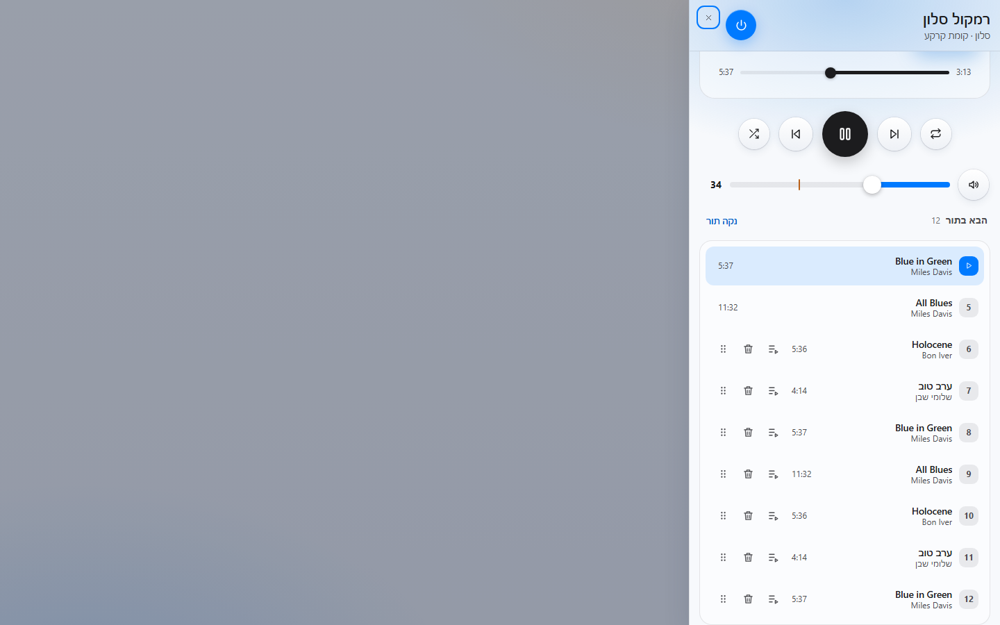
*צילום מהדגמה.*

- **רואה את התור.** "הבא בתור" מונה את כל השורות: השיר המנגן ראשון (מסומן), אחריו כל השאר לפי הסדר, עם משך ושם האמן. מספר השורות מופיע
  ליד הכותרת. התור מתרענן כשהנגן נפתח, אחרי כל עריכה, כשהשיר מתחלף, וכל חצי דקה כל עוד הנגן פתוח. התור נקרא עם הרשאת הצפייה
  במולטימדיה, גם בלי הרשאה לערוך.
- **עורך את התור (הרשאה "עריכת תור הניגון", `media.queue`, ובנוסף שליטה במולטימדיה).** בכל שורה שאפשר לערוך: **ידית** לגרירה
  לסדר חדש (במקלדת: כפתורי "הזז למעלה" ו"הזז למטה" של השורה), **מחיקה**, ו**"נגן הבא"** - השורה עוברת מיד אחרי השיר המנגן.
  הפעולות מתבצעות מיד, בלי חלון אישור: השורה זזה או נעלמת.
- **מנקה את התור.** **"נקה תור"** שואל פעם אחת ("לנקות N שירים מהתור?") ומוחק את מה שאפשר למחוק.
- **שורות נעולות.** השיר המנגן והשורה שהשרת כבר טען מראש אינם ניתנים להזזה או למחיקה, ואי אפשר להכניס שורה לפניהם. הן מוצגות בלי
  ידית. אם השורה כבר לא קיימת כשלוחצים (התור השתנה בינתיים) הפעולה נדחית והתור מתרענן.
- **קבוצה.** כשהנגן הוא מוביל של קבוצת רמקולים, עריכת התור משפיעה על כולם, ולכן נדרשת ההרשאה גם בחדרי החברים שבקבוצה.
- **מי שאין לו הרשאת עריכה** רואה את התור לקריאה בלבד, בלי ידיות ובלי כפתורים.
- **מחפש בספרייה (הרשאה "עיון וחיפוש בספריית המוזיקה", `media.browse`).** בנגן לשונית רביעית, **"ספרייה"**, בנוסף ל"מועדפים",
  "תחנות" ו"פלייליסטים". בראשה בורר סוג: **שירים · אלבומים · אמנים · פלייליסטים · תחנות**, כפתור **"עוד"** לדפדוף, ותיבת **חיפוש
  בספרייה** (החיפוש רץ כשמפסיקים להקליד לרגע; **"נקה חיפוש"** מאפס). לחיצה על פריט מנגנת אותו עכשיו (זו שליטה רגילה בנגן);
  בשורה גם **"נגן הבא"** ו**"הוסף לתור"**. החיפוש עצמו זמין רק כשהחיבור הישיר מוגדר.

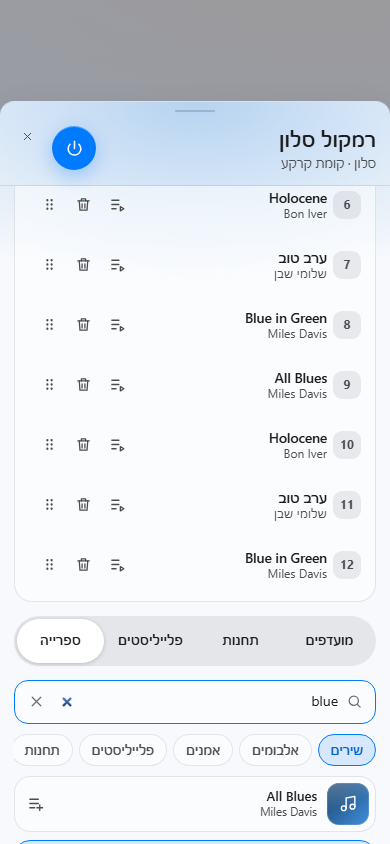
*צילום מהדגמה.*

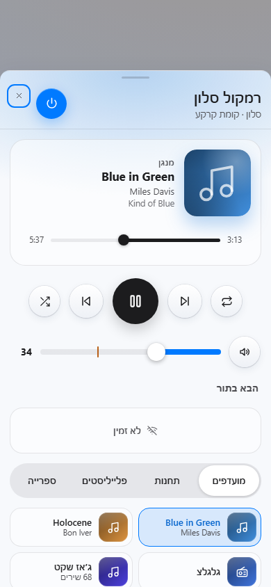
*צילום מהדגמה.*

**שימו לב:** מספר הפעולות בשנייה מוגבל (עריכות, ובנפרד חיפושים); פעולה שחרגה נדחית ואינה נשארת בתור. עריכה שנכשלה אינה נשלחת
שוב אוטומטית. כל ניסיון עריכה נרשם ביומן הביקורת (סוג הפעולה והתוצאה בלבד, בלי שמות שירים).

## הכרזות קוליות

המערכת יכולה **להקריא שורת טקסט ברמקולים** לפי חדר או לפי רמקול, באמצעות מנוע הדיבור של התשתית. אפשר להכריז ידנית או כפעולה של חוק
אוטומציה. **כבוי כברירת מחדל:** עד שמנהל מגדיר, אי אפשר להכריז ושום חוק לא ידבר.

**איך אני… (מנהל מערכת, הגדרות › מולטימדיה › הכרזות קוליות)**

1. בוחרים **מנוע דיבור** (ישות הדיבור של התשתית) ו**שפה**.
2. מסמנים **רמקולים מורשים להכרזה**. רק רמקול מסומן יכול לדבר; "חדר" פירושו הרמקולים המורשים שבו. אם הרשימה ריקה, מאשרים קודם
   נגנים בלשונית "מסכים ונגנים".
3. קובעים **מקסימום הכרזות בדקה**.
4. **בדיקה:** "השמע בדיקה" משמיע משפט קבוע ברמקול או בחדר שנבחרו. רק אחרי שהשמיעה עבדה - מפעילים את המתג **הכרזות קוליות**.
5. נותנים את ההרשאה `media.announce` (רגישה: מנהלי אתר ומערכת) למי שמותר לו להכריז.

**איך אני… (מי שהוזכרה לו ההרשאה)**

6. באותו מסך, "הכרזה עכשיו": בוחרים חדר או רמקול, מקלידים טקסט ולוחצים **הכרז**.
7. **הכרזות אחרונות** מציגות לכל ניסיון: מי, מתי, ידנית / בדיקה / חוק, והתוצאה: נשמע, נכשל, נחסם (קצב), נדחה או בביצוע.

**שים לב:** כל ניסיון נרשם ביומן הביקורת, כולל נדחים. הגבלת הקצב נועדה למנוע הצפה. הטקסט שמוקרא הוא מה שהוקלד: אל תכתבו בו מידע
רגיש.

## שידור מצלמה למסך

בלייב, ליד "מסך מלא", יש כפתור **"שדר למסך"**: מציג את המצלמה הנוכחית על טלוויזיה או מסך חכם שמנהל אישר לשידור. **כבוי כברירת
מחדל** - הכפתור לא מופיע עד שמנהל מפעיל ומאשר מסך.

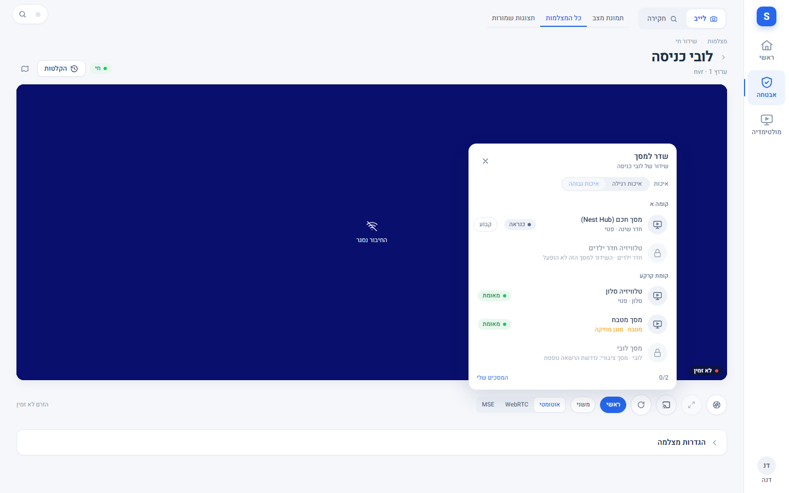

*צילום מהדגמה: הבורר מציג מסכים לפי קומה ואת מצב כל אחד (מאומת, חסום, לא זמין).*

**איך אני… (מי שיש לו הרשאת שידור, `media.cast`: מפעיל ומעלה)**

1. בלייב פותחים מצלמה ולוחצים **שדר למסך**.
2. בוחרים מסך. כל מסך מציג את מצבו: פנוי, כבוי, מנגן מוזיקה, משדר או לא זמין. מסך שלא אושר מסומן במנעול עם הסיבה (למשל "השידור
   למסך הזה לא הופעל" או "מסך ציבורי: נדרשת הרשאה נוספת").
3. בוחרים איכות (רגילה, או גבוהה אם המסך תומך) ומשך (ברירת מחדל 30 דקות; אפשר קבוע אם הותר), ולוחצים **שדר**.
4. מסך שמנגן מוזיקה שואל לפני שמפסיקים אותה.
5. **המוסית הגלובלית** מציגה את השידורים הפעילים: להאריך (עד 8 פעמים), להחליף מצלמה או לעצור; עצירה יכולה גם לכבות את המסך אם
   הוא היה כבוי לפני השידור.
6. "המסכים שלי לשידור" מציג מה מותר לכם.

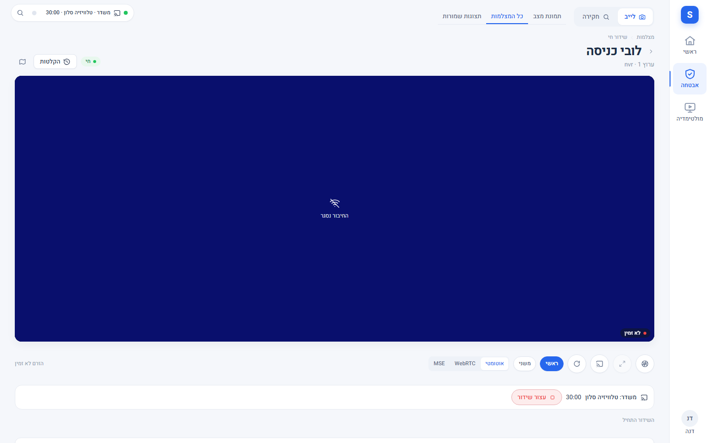

*צילום מהדגמה: מצלמה בלייב ובורר המסכים פתוח.*

**איך אני… (מנהל מערכת)** - הגדרות › מולטימדיה › **שידור למסכים**: מפעילים את המתג, בודקים את כתובת המקור (המשדר ברשת הביתית),
מאשרים כל מסך בנפרד, ומריצים **שידור בדיקה** של 60 שניות. מגדירים מקסימום שידורים בו-זמנית, משך ברירת מחדל ואיכות. נדרש גם
עדכון רכיב החיבור לגרסה 0.7.0 והפעלה מחדש של התשתית, ואפשרות ההתקנה `cast_relay`. **הבדיקה הפיזית הראשונה** רק לפי
`docs/operations/CAST_FIRST_PHYSICAL_TEST_RUNBOOK.md`.

**מגבלה:** לא נבדק על מסך אמיתי. במסך שלא מקבל שידור, הכפתור אומר "המסך לא מקבל שידור".

## מצבים שאפשר להיתקל בהם

| מה רואים | מה זה אומר |
|---|---|
| אין כניסה "מולטימדיה" | חסרה הרשאת צפייה במסכים, או שמנהל המערכת כיבה את האזור ב-הגדרות › מולטימדיה (או הסתיר את הלשונית ב-הגדרות › לשוניות) |
| אין מסכים, או חסר מסך מסוים | המסך עוד לא אושר בהגדרות, הוא מחוץ להיקף שלכם, או שהוא לא זוהה כמסך |
| כפתור הפעלה גדול מעל לוח מעומעם | המסך כבוי. שום מקש, עוצמה או מקור אינם נשלחים למסך כבוי |
| "מצב אמנות" | מסך מסוג מסגרת שמציג תמונה. "מעבר לצפייה" מדליק לתוכן; ההפעלה שבראש השלט מכבה לגמרי |
| כפתור ההדלקה מושבת | למסך אין הדלקה מרחוק (רק כיבוי, או שההדלקה תלויה בהגדרה שמחוץ למערכת). הסיבה מופיעה בריחוף בלבד |
| "לא זמין · מאז HH:MM" | המסך לא מגיב. אין בו פעולה והוא לא נכלל בכיבוי קבוצתי |
| ספינר על הכפתור | הפקודה נשלחה וממתינה לדיווח של המסך |
| "המסך לא אישר את הפקודה" | הפקודה התקבלה, אבל המסך לא דיווח שהשתנה תוך כשמונה שניות. הכרטיס חוזר למצב האחרון שאושר. לא נשלח שוב אוטומטית |
| הכפתור "רועד" ולא קורה כלום | לחצתם מהר מדי; הלחיצה נפלה ולא תישלח |
| "פקודת הפעלה קודמת עדיין ממתינה" | פקודת הפעלה אחת בכל רגע למסך; המתינו לתוצאה (ובין שתי פקודות לפחות שתי שניות) |
| מצב צפייה: אין כפתורי שליטה | יש לכם רק צפייה במסכים ובמולטימדיה. המצב והתוכן מוצגים, בלי שליטה |
| מקורות, אפליקציות והקלדה חסרים במסך מסוים | זה מסך ציבורי (חדר משותף, לובי): החלפת מקור ואפליקציה והקלדה דורשות הרשאה נפרדת. עוצמה ומקשים עובדים |
| "המסך אינו תומך בפעולה זו" | המקש או הפעולה אינם בסט של המסך הזה |
| "נדרש עדכון של רכיב החיבור" | רכיב החיבור בתשתית המערכת ישן מדי לפקודות מסך (גרסה 0.4.0) או לפקודות נגנים וקבוצות (גרסה 0.5.0); ההתקנה בידי מנהל המערכת (ראו `80-settings_HE.md`) |
| העוצמה עוקבת אחרי המגבר ולא אחרי המסך | המגבר מקושר ובחירת השמע היא "מגבר"; החליפו ב"רמקולי המסך" |
| נגן "לא זמין" וכפתוריו מעומעמים | אין כרגע דרך להגיע להתקן (כבוי, מנותק, או שהמערכת רק זוכרת אותו). המערכת אינה מנחשת מה הוא יודע לעשות ושומרת את הכפתורים האחרונים מעומעמים |
| "קיבוץ לא תואם" | ההתקן מקובץ באחת משתי הדרכים שהמערכת מכירה ולא בשנייה. ההצטרפות מושבתת עד שמנהל המערכת יפרק אחת מהן |
| "מנגן עם סלון" | ההתקן חלק מקבוצה שהסלון מוביל; הפקודות שלו (ניגון, תור) מתבצעות על המוביל |
| חדר "לא הצטרף" אחרי קיבוץ | ההתקן קיבל את הבקשה ולא הצטרף. לא נשלח שוב אוטומטית; אפשר לנסות שוב |
| "לא משויכים" | התקנים בלי חדר. הם עובדים, אבל מי שהרשאתו לקומה מסוימת אינו רואה אותם עד שמנהל המערכת ישייך אותם |
| מחוון הקבוצה לא הזיז חדר אחד | החדר מושתק, כבוי, לא זמין, או שיש לו מקסימום עוצמה; הסיבה מופיעה ליד שמו |
| אין לשוניות מועדפים ותחנות | אין במערכת ספריית מוזיקה זמינה, או שמנהל המערכת כיבה אותן. הנגן עובד כרגיל |
| אין לשונית "ספרייה", או שאין תיבת חיפוש | חסרה לכם ההרשאה "עיון וחיפוש בספריית המוזיקה", או שהחיבור הישיר לשרת המוזיקה אינו מוגדר או אינו עונה (החיפוש תלוי בו) |
| התור מוצג בלי ידיות ובלי מחיקה | חסרה לכם ההרשאה "עריכת תור הניגון" (או השליטה במולטימדיה), או שהחיבור הישיר אינו מוגדר |
| "הבא בתור" אומר "לא זמין" | החיבור הישיר מוגדר אבל אינו עונה כרגע. הוא נבדק שוב מעצמו אחרי חצי דקה; הנגן עצמו ממשיך לעבוד |
| שורה בתור בלי ידית | השיר המנגן והשורה שנטענה מראש נעולים |

## מה רק מנהל מערכת עושה

- **הגדרות › מולטימדיה** (ראו `80-settings_HE.md`): אישור מסכים, נגנים ורמקולים, שם, סימון "ציבורי", פרופיל מקשים, מגבר מקושר, תקרת
  עוצמה וחלון לילה, שיוך התקן לחדר, מקשים נוספים לדגם, רשימת החיבורים, איחוד כפילויות (אשף ההצעות) וידני, קבוצות שמורות, סידור
  המועדפים והתחנות, וברירת המחדל של השלט. **החיבור הישיר לשרת המוזיקה** (כתובת ואסימון גישה) מוגדר על ידי מי שיש לו
  `system.configure` בלבד, בהגדרות › מולטימדיה › חיבור.
- **הרשאות** (ראו `81-roles_HE.md`): מי רואה, מי שולט, מי מדליק ומחליף מקור, מי שולט במסכים ציבוריים, **מי מקבץ רמקולים וקבוצות שמורות**,
  מי מכבה או עוצר קבוצתית ומי עורך.
- **בדיקה מקדימה** לפני הפעלה: סקריפט קריאה בלבד שמתאר את המבנה של מסכי המערכת בלי שמות ומזהים - ראו `80-settings_HE.md`.

## מגבלות ידועות

- **הכרזות קוליות כבויות כברירת מחדל** ועובדות רק ברמקולים שמנהל אישר (ראו "הכרזות קוליות" למטה). לא נבדקו מול רמקול אמיתי.
- **שידור מצלמה למסך כבוי כברירת מחדל**, ולא נבדק עדיין על מסך פיזי (ראו "שידור מצלמה למסך").
- **תור מלא, עריכת תור וחיפוש בספרייה תלויים בחיבור ישיר שהמתקין מגדיר.** בלעדיו "הבא בתור" מציג שלושה פריטים בלבד (הנוכחי, הבא
  וכמה נשארו), אין עריכת תור (גרירה, מחיקה) ואין חיפוש בספרייה - רק מועדפים, תחנות ופלייליסטים שמנהל המערכת הציג.
- **עוצמת קבוצה** נקבעת חדר חדר, לפי מה שכל התקן דיווח; האיזון נשמר בחישוב של המערכת ולא בהתקן. לכן בקבוצה גדולה העדכון אינו מיידי
  לכולם, והתוצאה מוצגת לכל חדר.
- **קיבוץ** אפשרי רק בין התקנים שיודעים להצטרף יחד באותה דרך. התקן שמקובץ בשתי דרכים שונות מסומן "קיבוץ לא תואם". קבוצה וירטואלית
  אינה קבוצה: אי אפשר להצטרף אליה או לפרק אותה.
- **העברת מוזיקה** ו"נגן אחרי הנוכחי" אינן קיימות בכל מערכת; מה שאינו נתמך אינו מוצג.
- התנהגות של יצרנים שונים עדיין נבדקת על מכשירים אמיתיים: מקש הצבע הכחול בחלק מהמסכים, הקלדה בחלק מהמסכים, מצב אמנות
  והדלקה מרחוק אינם בהכרח זהים בכל דגם. מה שלא אומת - כבוי כברירת מחדל, ומנהל המערכת יכול להפעיל מקש נוסף לדגם ספציפי.
- מסך שאינו מדווח על מצב כבוי אמין עלול להופיע "דולק" או "לא אושר". לכן הכיבוי הקבוצתי דוחה כל מסך שלא אושר שהוא דולק.
- אין שליטה בכמה מסכים בו-זמנית מעבר לכיבוי קבוצתי, ואין תזמון ואין סצנות בשלט. תזמון מוזיקה אינו כאן.
- נגן שמדווח על עצמו כ"לא זמין" אינו נחשב ל"בלי יכולות": מה שידע לעשות בפעם האחרונה שהיה זמין נשמר, מעומעם, עד שיחזור.

## שים לב

- כל פקודה נרשמת ביומן הביקורת: מי, איזה מסך, איזו פעולה וגם מה נדחה ולמה. מקשים נרשמים מקובצים (שורה לכל משתמש ומסך בכל דקה, עם
  ספירה לכל מקש); טקסט נרשם כאורך בלבד; סודות, כתובות ומזהי חומרה לעולם לא מופיעים ביומן ולא בתשובות המערכת.
- נגן שאושר ב"נגנים ורמקולים" מנוהל מעכשיו רק מכאן, כמו מסך: ההרשאות, מגבלות הקצב והיומן הם של המולטימדיה. לחיצות מהירות מדי
  על ערבוב, חזרה, התקדמות והעברה נופלות בשקט, וקבוצה אחת בכל רגע לכל מוביל: ניסיון נוסף תוך כשמונה שניות נדחה.
- מסך שנוהל בעבר ככרטיס התקן רגיל (למשל במפה) מנוהל מעכשיו רק כאן: שם ההרשאות, מגבלות הקצב והיומן הם מסך המולטימדיה. ניסיון
  לשלוט בו מהכרטיס הרגיל מסתיים בהודעה שההפעלה נעשית ממסך המולטימדיה.
- הגבלות ההיקף של Arx אינן מגבילות את ממשק הבית המקורי של המסך או של תשתית המערכת.

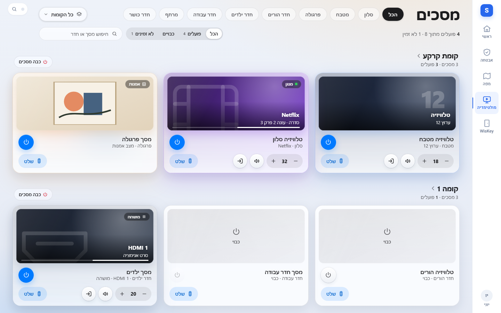
*צילום מהדגמה.*

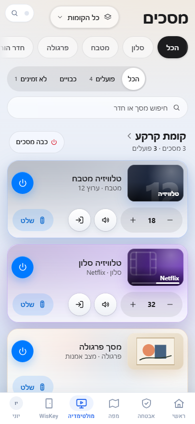
*צילום מהדגמה.*

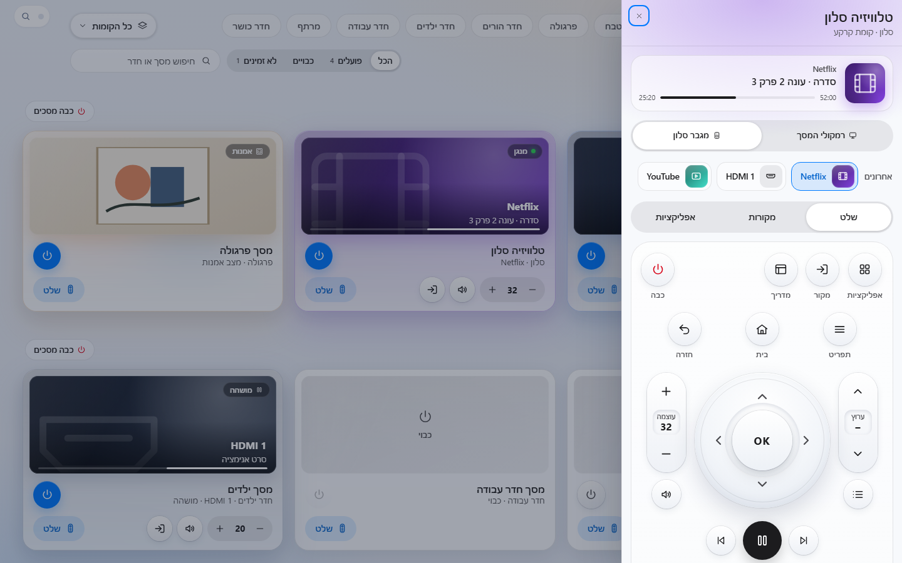
*צילום מהדגמה.*

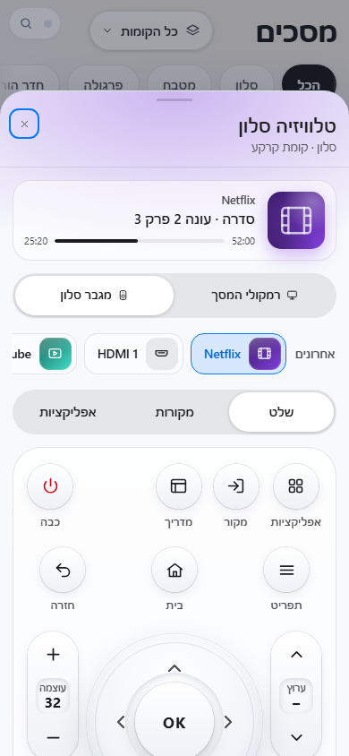
*צילום מהדגמה.*

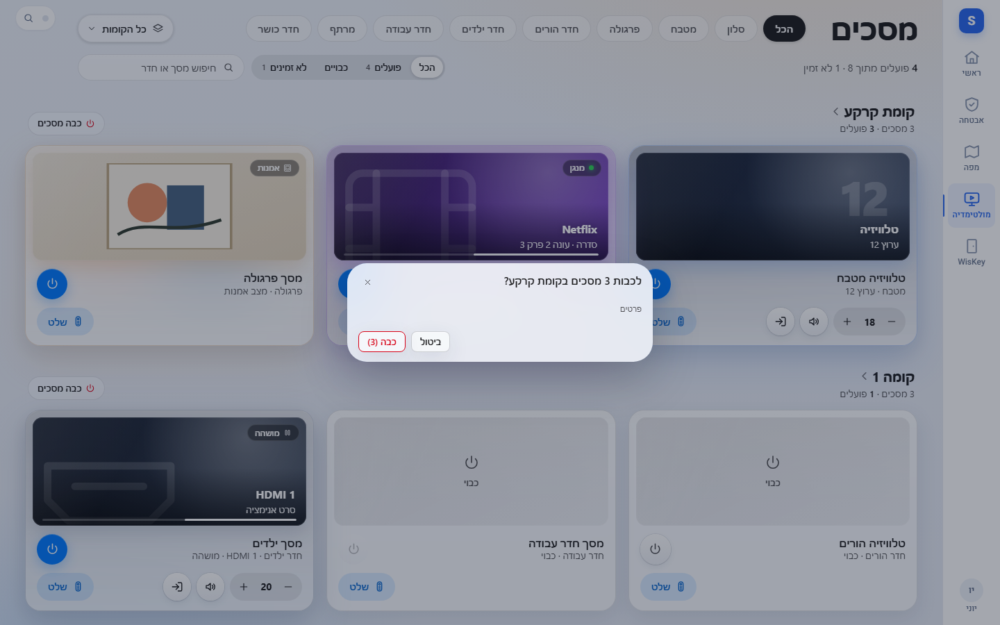
*צילום מהדגמה.*

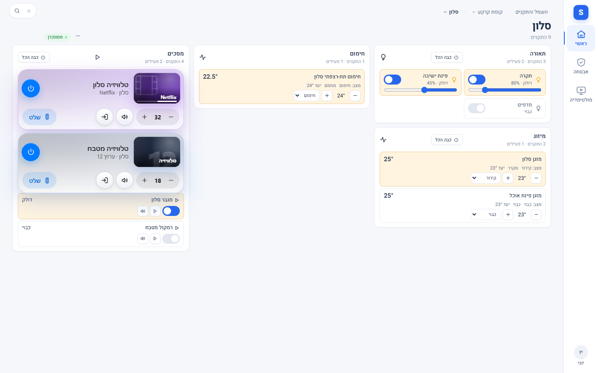
*צילום מהדגמה.*

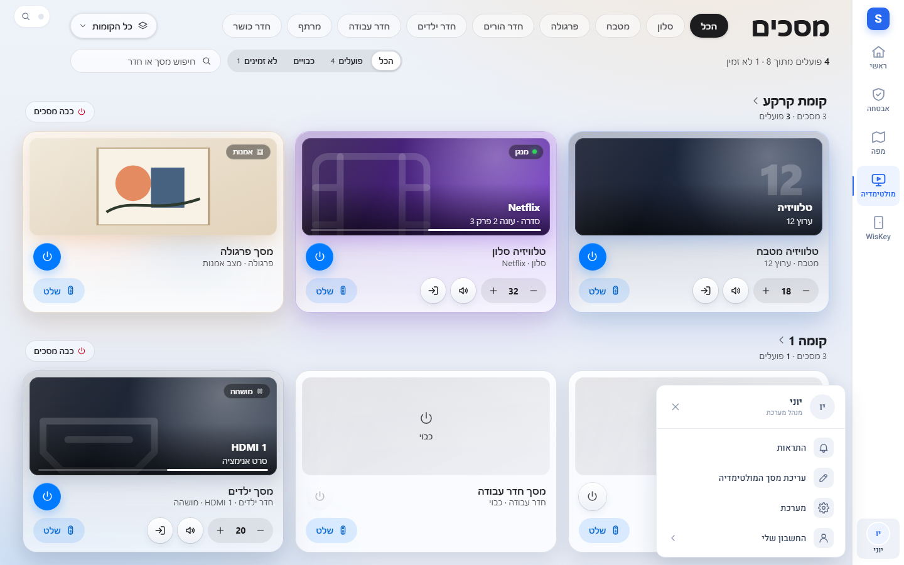
*צילום מהדגמה.*

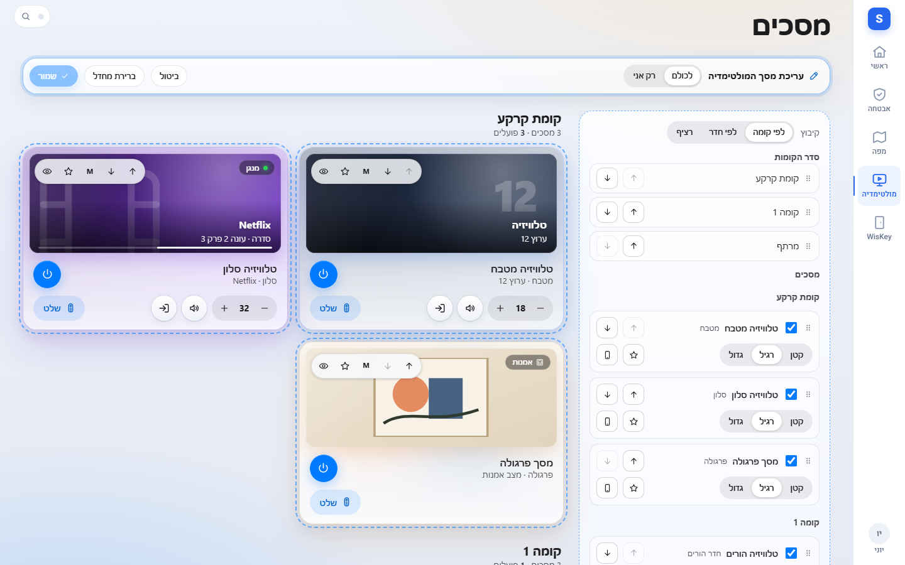
*צילום מהדגמה.*

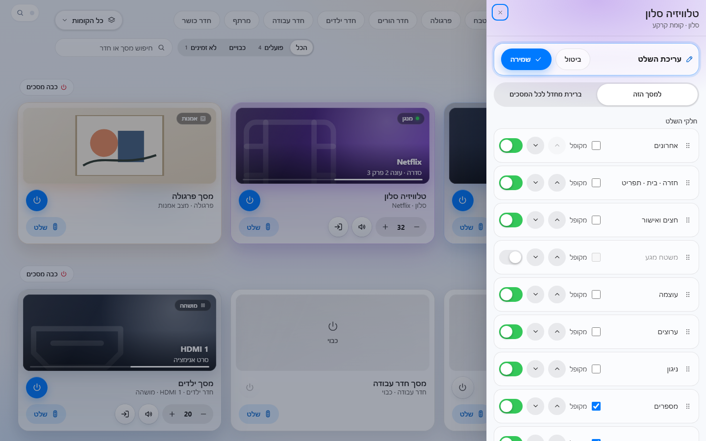
*צילום מהדגמה.*

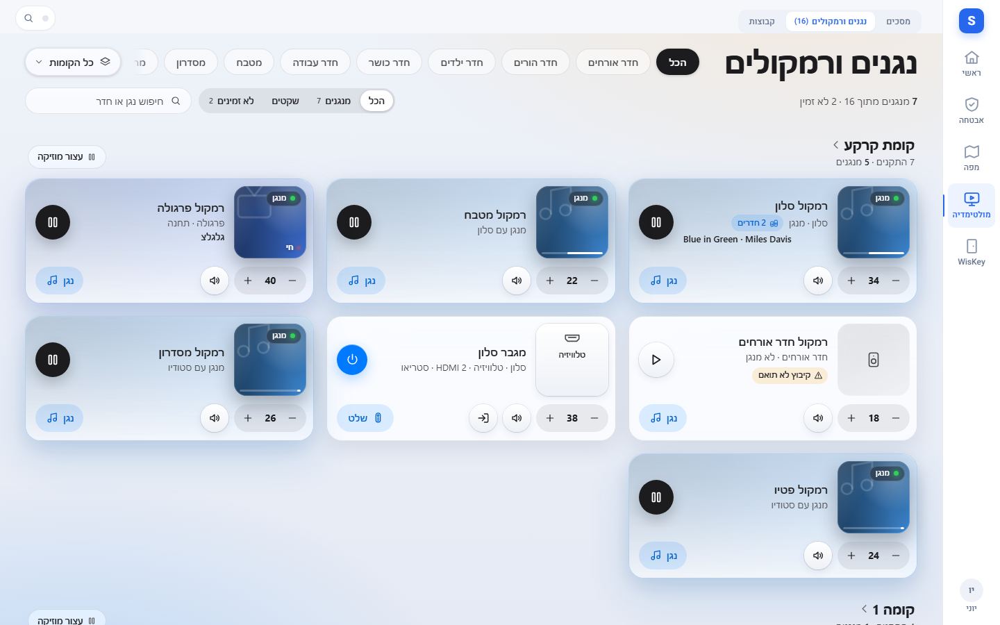
*צילום מהדגמה.*

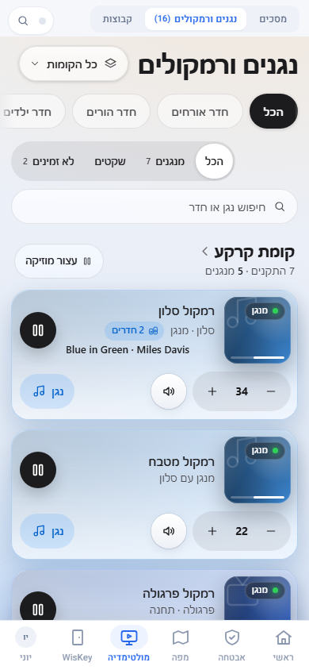
*צילום מהדגמה.*

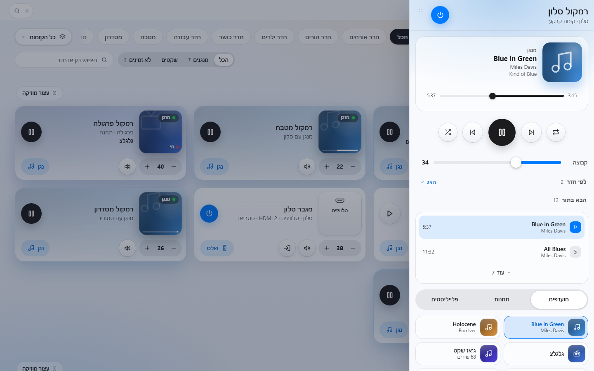
*צילום מהדגמה.*

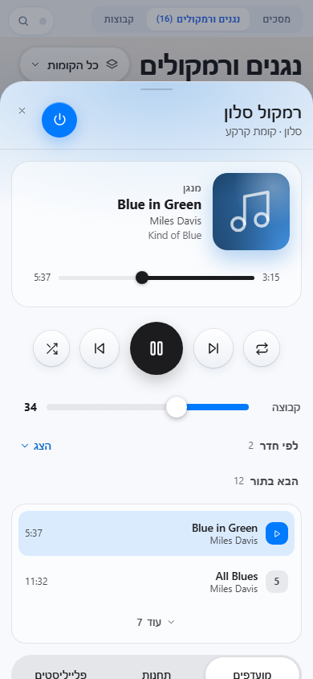
*צילום מהדגמה.*

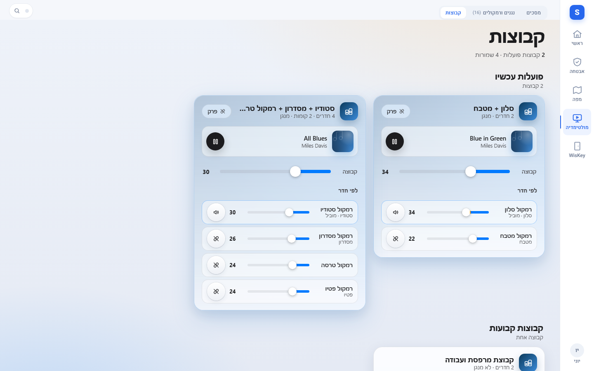
*צילום מהדגמה.*

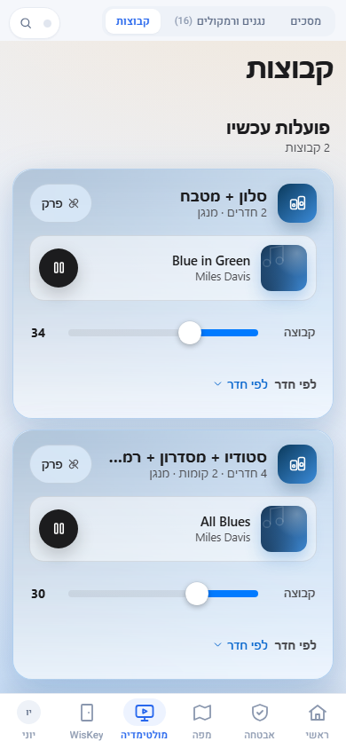
*צילום מהדגמה.*
