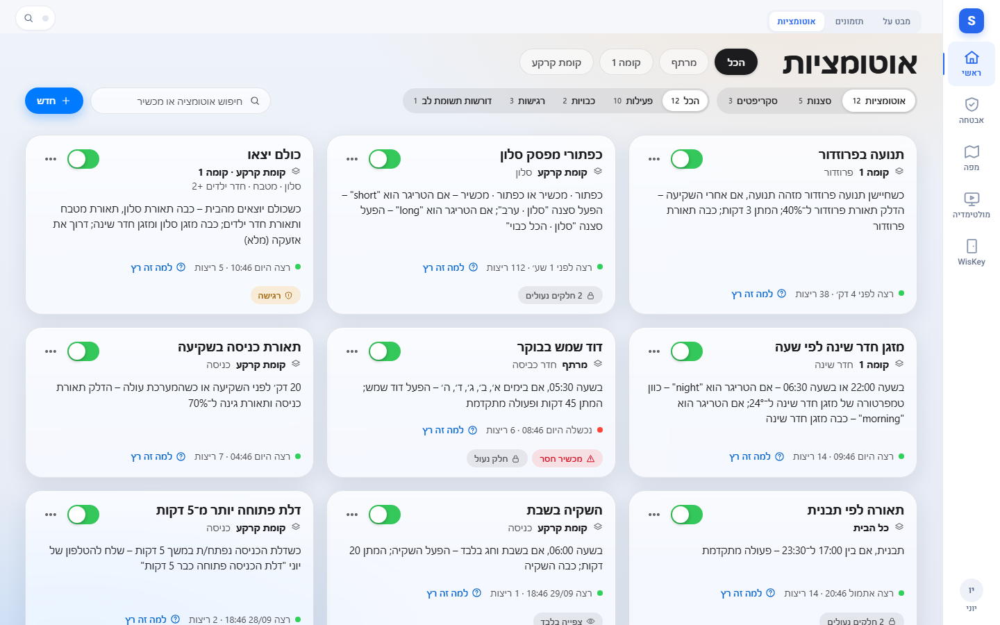
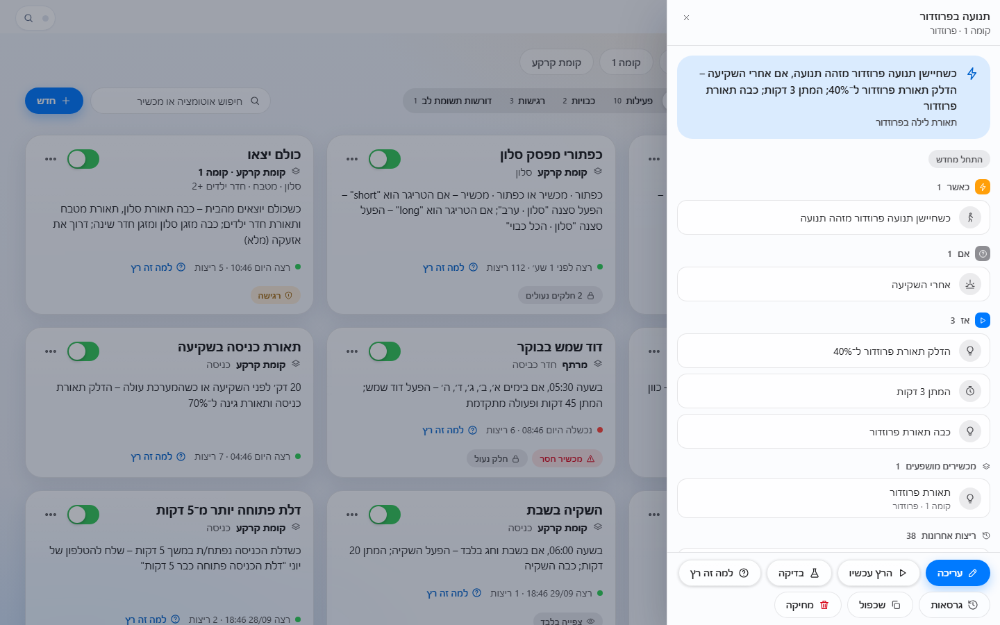
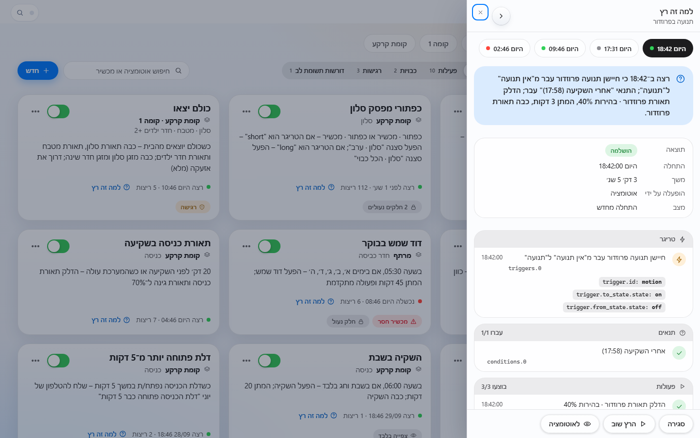
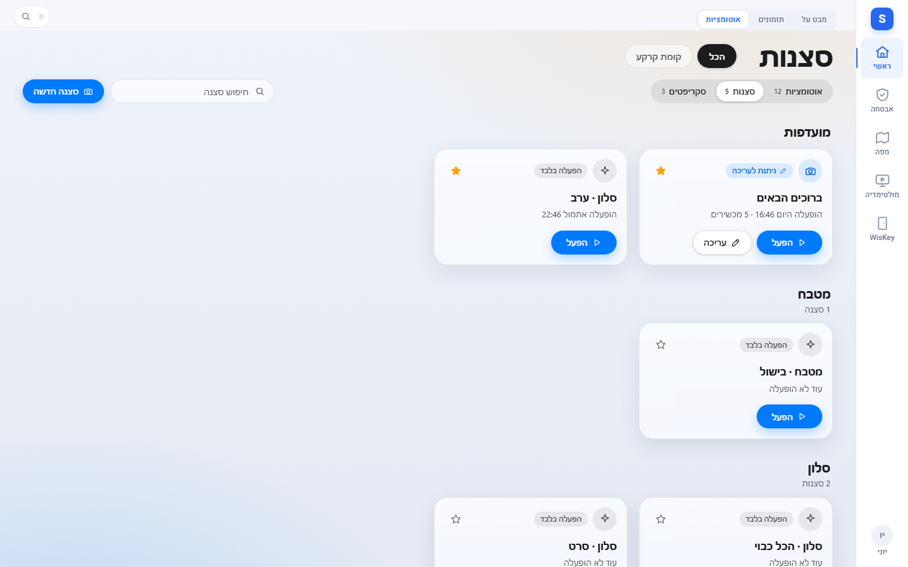
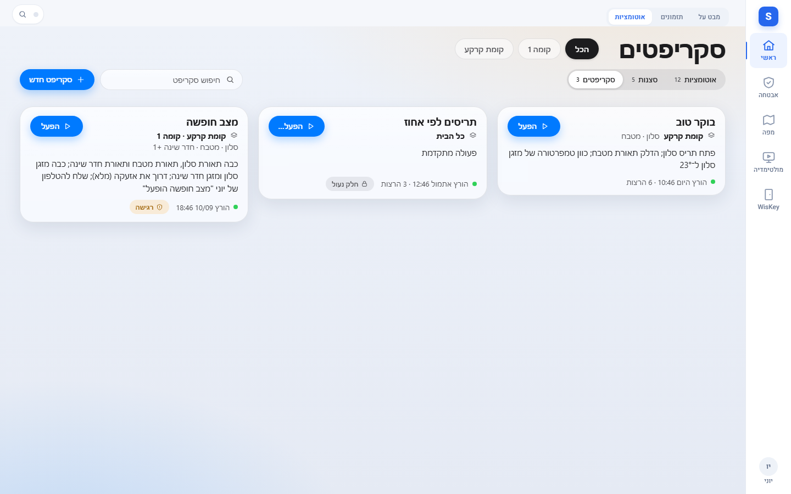
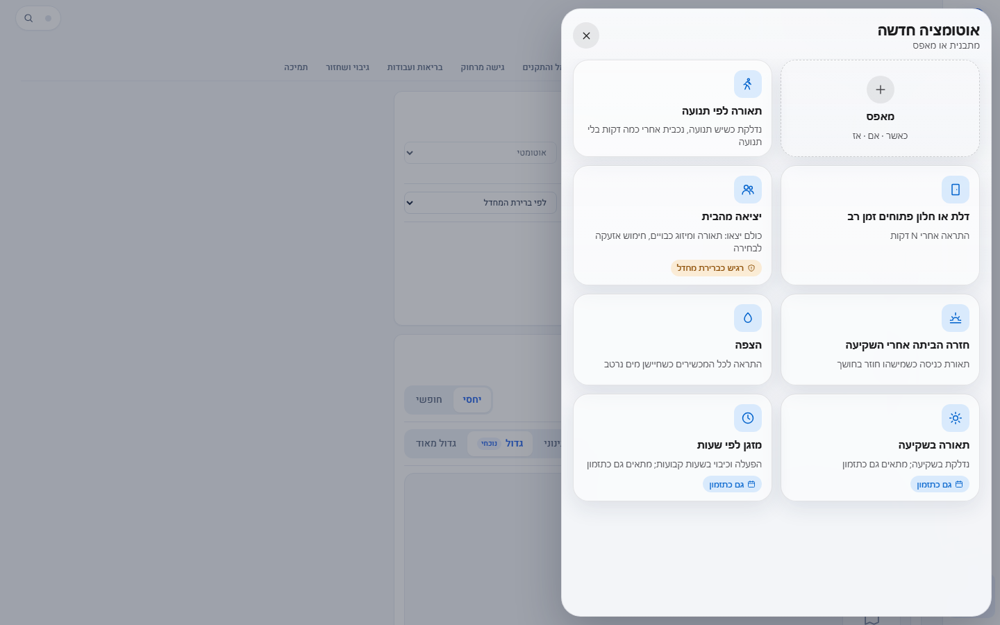
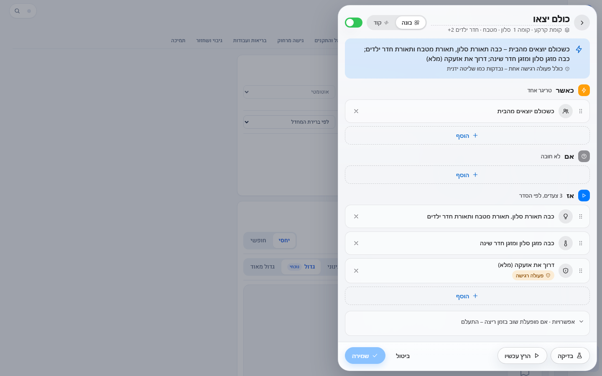
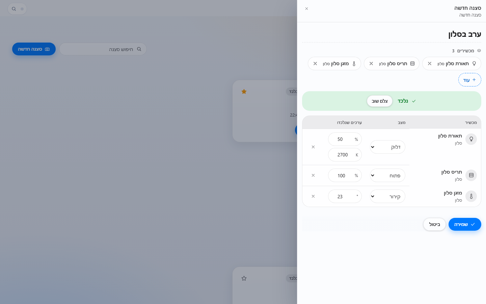

# אוטומציות, סצנות וסקריפטים

Source: original

## מה זה

"אוטומציות" הוא סגמנט בלשונית **"קברניט"** של מסכי הבית (חשמל והתקנים), לצד **"מבט על"**; בלשונית הזו הסגמנטים הם **תזמונים, אוטומציות, סצנות וסקריפטים** (בכניסה היא נפתחת על "תזמונים" כשהם זמינים). היא מרכזת שלושה סוגים של
פעולות שהבית עושה בשבילכם:

- **אוטומציה** - "כאשר משהו קורה, ואם תנאי מתקיים, אז עושים": תאורה שנדלקת בתנועה, התראה על דלת שנשארה פתוחה, כיבוי הכול ביציאה
  מהבית. היא רצה מעצמה, גם כש-Arx סגור.
- **סצנה** - מצב מוכן של כמה התקנים יחד ("ערב בסלון"). מפעילים אותה בלחיצה.
- **סקריפט** - רצף פעולות שמריצים בכפתור ("בוקר טוב", "מצב חופשה"), לפעמים עם שדות לבחירה לפני ההרצה.

מי שמחפש הפעלה בשעות קבועות בלבד ישתמש ב"תזמונים" (`41-schedules_HE.md`): זה כלי פשוט
יותר, והבונה של האוטומציות מציע לעבור אליו כשהאוטומציה היא רק "שעון + שליטה במכשירים".

**מי רואה את הלשונית.** מי שיש לו לפחות אחד מאלה: הרשאה לנהל אוטומציות, הרשאה להריץ סקריפטים, או הרשאה לשלוט בהתקנים (שמאפשרת
להפעיל סצנות). **אין גישת צפייה בלבד:** מי שאינו מורשה לנהל אוטומציות אינו רואה אותן כלל - לא ברשימה, לא בהתראות ולא בקישור ישיר
(קישור כזה מציג "אין הרשאה"). מנהל המערכת יכול גם להסתיר את הלשונית לכולם ב-הגדרות › אוטומציות, או לסדר אותה ב-הגדרות › לשוניות.

## מי רשאי מה

| פעולה | מה נדרש |
|---|---|
| לראות אוטומציות, להפעיל ולהשבית, להריץ עכשיו, ליצור, לערוך, לשכפל ולמחוק | `automation.manage` (ברירת מחדל: מנהל אתר ומנהל מערכת) |
| **להפעיל סצנה** | שליטה בהתקנים (`devices.control` או `ha.entity.control`), בכל ההתקנים שבסצנה |
| ליצור, לצלם ולערוך סצנה | `scene.manage` |
| **להריץ סקריפט** (ולעצור אותו) | `script.run` או `script.manage` |
| ליצור ולערוך סקריפט | `script.manage` |
| לעבור בעורך לתצוגת "קוד" | `automation.code_view` (ברירת מחדל: מנהל אתר ומנהל מערכת; מנהל המערכת קובע מי עוד) |

- **ההיקף:** פריט מוצג ומופעל רק אם **כל** ההתקנים שהוא משנה נמצאים בקומות ובאזורים שלכם. פריט עם התקן שאינכם רואים אינו מופיע.
- **צעד רגיש** (אזעקה, מנעול, דלת, שער, צופר): מותר באוטומציה, בסצנה ובסקריפט כמו בכל פעולה, אבל **כל מי ששומר, מריץ או מפעיל**
  חייב להחזיק את אותה הרשאה שהוא צריך לשליטה ידנית בהתקן הזה. מי שאינו רשאי לפתוח את הדלת ממסך ההתקן אינו רשאי ליצור אוטומציה
  שפותחת אותה. **קוד אזעקה או מנעול לעולם אינו נשמר באוטומציה**; פעולה שדורשת קוד אינה יכולה להיות חלק ממנה.
- מי שאינו מנהל בתשתית המערכת יכול לשמור שינויים בעורך רק אם מנהל המערכת הפעיל "האצלה" (ראו `80-settings_HE.md`). אחרת העורך שלו נפתח
  **לקריאה בלבד** עם הכיתוב "שמירה דורשת מנהל", וההפעלה, ההשבתה וההרצה ממשיכות לעבוד לפי ההרשאות.
- ההרשאות המלאות והגדרות הלשונית: `80-settings_HE.md` (הגדרות › אוטומציות) ו-`81-roles_HE.md`.

## איך אני… (רואה ומפעיל)

1. **פותח את הלשונית.** חשמל והתקנים ← **"אוטומציות"**. מעל הרשימה מתג בין **אוטומציות · סצנות · סקריפטים** (עם מספר הפריטים בכל סוג).

   
   *צילום מהדגמה. השמות והנתונים לדוגמה.*

2. **מבין כרטיס.** בכל כרטיס: השם; הקומה והאזור שהוא משנה; **משפט בעברית** שמתאר מה קורה ("כשחיישן תנועה מזהה תנועה, אם אחרי השקיעה,
   הדלק..."); מתג הפעלה והשבתה; ו"רצה לפני 4 דק׳ · 38 ריצות" (או "נכשלה היום" באדום). **צ'יפים** מסמנים מצב: **רגישה**
   (יש בה פעולה רגישה), **חלק נעול** (חלק שהבונה אינו מכיר ונשמר כמו שהוא), **מכשיר חסר** (התקן שהוסר), **שגיאה בהגדרה**,
   **שונתה מחוץ למערכת** ו**לצפייה בלבד**. תפריט "..." בכרטיס מציג את הפעולות שמותר לכם.
3. **מחפש ומסנן.** חיפוש לפי שם או התקן; מסננים **הכל · פעילות · כבויות · רגישות · דורשות תשומת לב**; וצ'יפים לפי קומה ואזור. בטלפון
   המסננים מקופלים ב**"סינון"** אחד (או מוצגים כשורות, לפי מה שמנהל המערכת בחר). "נקה סינון" מאפס.
4. **פותח מגירה.** לחיצה על כרטיס פותחת מגירת פרטים: המשפט, **כאשר · אם · אז** כרשימת צעדים, **מכשירים מושפעים**, ריצות אחרונות
   וכפתורים: **"למה זה רץ"**, **"בדיקה"**, **"הרץ עכשיו"**, **"עריכה"**, **"שכפול"**, **"גרסאות"**, **"מחיקה"**.

   
   *צילום מהדגמה.*

5. **מפעיל או משבית.** המתג בכרטיס (או "הפעל" / "כיבוי" בתפריט). השבתה לא מוחקת דבר.
6. **מריץ עכשיו.** **"הרץ עכשיו"** מריץ את הפעולות מיד, בלי לבדוק את התנאים. **"בדוק תנאים ואז הרץ"** מריץ רק אם התנאים מתקיימים.
   תופיע שאלה "להריץ עכשיו?" - ופעולה על התקן רגיש מבקשת את אותו אישור כמו בשליטה ידנית. מרווח מינימלי בין הרצות של אותו פריט
   (ברירת מחדל 10 שניות) מונע לחיצות כפולות.
7. **בודק בלי להריץ.** **"בדיקה"** מראה מה היה קורה: מצב כל תנאי עכשיו, וההבדל שיעשה בכל התקן ("תאורת פרוזדור: כבוי ← דלוק 40%"),
   בלי לשנות דבר. תנאי שאי אפשר לבדוק מסומן **"לא ניתן לבדוק"**.
8. **שואל "למה זה רץ".** לכל ריצה: משפט קצר בעברית ("רצה ב-18:42 כי חיישן התנועה עבר מ'אין תנועה' ל'תנועה'..."), ומתחתיו **הריצה כולה**:
   מה הפעיל אותה (טריגר), כל תנאי ואם עבר, כל פעולה ותוצאתה, משך ההרצה ושגיאה אם הייתה. בחירה בין ריצות אחרונות בצ'יפים בראש. ערכים
   חסויים (סיסמאות, אסימונים) מוסתרים (`••••`).

   
   *צילום מהדגמה.*

9. **חוזר לגרסה קודמת.** **"גרסאות"** מציג את הגרסאות השמורות (כולל שינויים שנעשו מחוץ למערכת), ומאפשר לשחזר אחת מהן. מספר
   הגרסאות שנשמרות נקבע בהגדרות.
10. **רואה "שונתה מחוץ למערכת".** אם האוטומציה שונתה במקום אחר, מופיע כיתוב ו**"הרץ שוב"** / **"טען מחדש"**: טענו את הגרסה העדכנית
    והחליטו מה לשמור.

### סצנות

*צילום מהדגמה.*

- סצנות מקובצות **לפי אזור**, עם **מועדפות** (כוכב) למעלה. **"הפעל"** מפעיל סצנה; על הכרטיס "הופעלה היום 16:46 · 5 מכשירים".
- סצנה שמסומנת **"הפעלה בלבד"** מגיעה ממערכת אחרת (למשל בקר מתגים): אפשר להפעיל, להוסיף למועדפות ולהסתיר, אך לא לערוך. סצנה עם
  **"ניתנת לעריכה"** נוצרה ב-Arx.
- הפעלה חוזרת של אותה סצנה מוגבלת בקצב (ברירת מחדל: אחת לשלוש שניות).

### סקריפטים

*צילום מהדגמה.*

- כרטיס לכל סקריפט עם **"הפעל"**. סקריפט שדורש בחירה לפני ההרצה מציג **"הפעל…"** שפותח טופס שדות: מספר, כן/לא, בחירה מרשימה,
  טקסט והתקן (רשימת ההתקנים מצומצמת לאלה שבהיקפכם).
- סקריפט שרץ מסומן **"רץ עכשיו"** ויש **"עצור"**. סקריפט עם צעד רגיש מבקש אישור ("להפעיל עכשיו?").
- סקריפט שבו חלק נעול מסומן "חלק נעול" והאישור מזהיר שהוא "עלול לשנות מכשירים נוספים".

## איך אני… (מי שיש לו הרשאת ניהול)

11. **יוצר אוטומציה.** **"חדש"** פותח **גלריית תבניות** (כשמנהל המערכת השאיר אותה פעילה):
    **תאורה לפי תנועה**, **דלת או חלון פתוחים זמן רב**, **יציאה מהבית** (מסומנת "רגישה כברירת מחדל" כי היא יכולה לדרוך אזעקה),
    **חזרה הביתה אחרי השקיעה**, **הצפה**, **מזגן לפי שעות** ו**תאורה בשקיעה** (השתיים האחרונות מסומנות **"גם כתזמון"**), או **מאפס**.
    תבנית היא טיוטה מלאה למחצה: בוחרים התקנים, בודקים וממשיכים. **שום דבר לא נשמר בלי שבדקתם.**

    
    *צילום מהדגמה.*

12. **בונה בבונה.** העורך נפתח כלוח צד (בטלפון - על כל המסך). למעלה: שם, מתג הפעלה, ו**המשפט החי** שמתעדכן תוך כדי עריכה. בשלושה חלקים:
    - **כאשר** - מה מפעיל: שינוי מצב של התקן, שעה, שקיעה או זריחה, אחרי כל כמה זמן, הפעלת המערכת, נוכחות ("כולם יצאו").
    - **אם** - תנאים (לא חובה): מצב או ערך של חיישן, שעה, ימים בשבוע, שקיעה. "כל התנאים צריכים להתקיים" או "אחד מהם".
    - **אז** - מה לעשות, לפי הסדר: שליטה בהתקן, הפעלת סצנה או סקריפט, התראה, המתנה, **בחירה** ("אם... אחרת..."), חזרה ועצירה.
    כל צעד הוא כרטיס שאפשר לגרור, למחוק ולפתוח לטופס קטן. **"+ הוסף"** מוסיף. צעד רגיש מסומן **"פעולה רגישה"** (צ'יפ צהוב או אדום, לפי
    ההגדרה). בתחתית **"אפשרויות"**: מה לעשות כשהאוטומציה מופעלת שוב בזמן ריצה (התעלם, התחל מחדש, המתן בתור, הרץ במקביל).

    
    *צילום מהדגמה.*

13. **חלקים נעולים.** כל מה שהבונה אינו מכיר (תבניות טקסט מתקדמות, פעולות של מכשירים מסוימים, שירותים מיוחדים) מוצג בכרטיס עם סימן
    נעילה ו**נשמר בדיוק כמו שהוא**. אפשר להזיז ולמחוק אותו, אך לא לערוך את תוכנו בבונה.
14. **בודק ושומר.** **"בדיקה"** (בלי להריץ), **"הרץ עכשיו"**, **"שמירה"**. "שמירה" פעילה אחרי שינוי ורק כשהכול תקין; רשימת "דברים לתקן"
    מובילה לכל בעיה. הבונה מזהה גם **לולאה אפשרית** (אוטומציה שמפעילה את עצמה) ומבקשת אישור לפני שמירה. כשהאוטומציה היא רק
    שעון ושליטה במכשירים מופיע **"צור כתזמון"**: הוא פותח את חלון התזמונים עם הנתונים שכבר הזנתם, והאוטומציה אינה נוצרת.
15. **"קוד".** מי שיש לו `automation.code_view` רואה למעלה מתג **"בונה · קוד"**. תצוגת הקוד היא אותו פריט בטקסט; שינוי בה מתורגם חזרה
    לבלוקים (מה שהבונה לא מכיר נשאר נעול). קוד שאינו תקין מוצג עם השגיאה והשמירה נחסמת.
16. **מישהו שינה במקביל.** אם הפריט שונה בזמן שערכתם מופיע **"הפריט שונה במקום אחר"** עם **השוואה**, **"טען את החדש"** (השינויים שלכם לא
    יישמרו) ו**"המשך עריכה"**. שום דבר לא נשמר עד שתבחרו.
17. **משכפל ומוחק.** **"שכפול"** יוצר עותק ("שם (עותק)"). **"מחיקה"** מבקשת אישור ומעבירה את הפריט ל**סל המחזור** (כברירת מחדל 30
    יום): "סל מחזור" ברשימה מציג מה נמחק ומתי, ו**"שחזר"** מחזיר אותו. אחרי התקופה הוא נמחק סופית.

### עריכת סצנה וסקריפט

- **סצנה חדשה:** **"סצנה חדשה"** ← בוחרים התקנים ← **"צלם מצב נוכחי"**: המערכת קוראת את המצב של ההתקנים עכשיו (דלוק/כבוי, בהירות,
  גוון, מיקום תריס, טמפרטורה...) ומציגה **טבלה** של הערכים שנקלטו - אפשר לתקן כל ערך, להסיר התקן או **"צלם שוב"**. נותנים שם ו**"שמירה"**.
  מנעול נקלט כמצב בלבד, ודורש אצל מי שיצר את הרשאת המנעול; אזעקה אינה נקלטת בסצנה (כי שחזור המצב שלה דורש קוד).

  
  *צילום מהדגמה.*

- **סקריפט חדש:** שם, **שדות** (שם, סוג - מספר, כן/לא, בחירה, טקסט, התקן; חובה או לא; ברירת מחדל ומגבלות) ורצף **צעדים** באותו בונה
  של "אז". **"הרץ עכשיו"** לניסוי.
- סצנה ממערכת אחרת אינה ניתנת לעריכה, ובמקרה כזה הכפתור הוא **"הפעלה בלבד"**.

## כשמשהו משתבש - התראות

- **כשל מגיע למרכז ההתראות.** אוטומציה או סקריפט שהרצתם הסתיימה בשגיאה מעלים התראה **"אוטומציה נכשלה"** (עם שם הפריט והפירוט),
  פעם אחת לכל כשל. מי מקבל: **מנהלים** או **כל מי שרואה את הפריט** - לפי בחירת מנהל המערכת בהגדרות › התראות (ראו `85-notifications_HE.md`),
  ותמיד רק מי שרשאי לראות את האוטומציה עצמה.
- **התראה שאוטומציה שלחה.** אוטומציה שיש בה צעד "התראה" מעלה התראה למרכז, רק ליעדים שמנהל המערכת אישר.
- **סערת הרצות.** פריט שרץ בתדירות חריגה (ברירת מחדל מעל 20 בדקה, או 200 בדקה בכל הפריטים) מעלה התראה למנהל עם כיבוי בלחיצה אחת.
  כיבוי אוטומטי קיים אך כבוי כברירת מחדל.

## מצבים שאפשר להיתקל בהם

| מה רואים | מה זה אומר |
|---|---|
| "אין עדיין אוטומציות / סצנות / סקריפטים" | עוד לא נוצר פריט מהסוג הזה; מי שיש לו הרשאה רואה "חדש" |
| "לא נמצאו ..." | החיפוש או הסינון לא מצאו; "נקה סינון" |
| "האוטומציות כבויות" | מנהל המערכת כיבה את התכונה ב-הגדרות › אוטומציות |
| "האוטומציות עדיין לא הוגדרו" | המערכת עדיין לא מוכנה לכתיבה; פנו למתקין |
| "המידע אינו עדכני. הרענון האחרון נכשל." / "תשתית המערכת אינה זמינה כרגע. מוצג המידע האחרון שנטען." | החיבור לתשתית נפל. מוצג מה שנטען לאחרונה; פעולות כתיבה לא יישלחו |
| "אין הרשאה" | אין לכם הרשאה לראות את הסוג הזה |
| "לצפייה בלבד. עריכה: בתשתית המערכת." | הפריט מוגדר בקובץ תצורה ולא ב-Arx; אפשר לראות אך לא לערוך |
| "שמירה דורשת מנהל" | העורך פתוח לקריאה בלבד כי ההאצלה כבויה |
| "מכשיר חסר" | התקן שהפריט משתמש בו הוסר; הפריט נשאר וניתן לעריכה |
| "לא פעילה - שגיאה בהגדרה" | האוטומציה אינה תקינה ולכן אינה רצה; פותחים לעריכה ומתקנים |
| "נשמר, אך עדיין לא נטען" | הפריט נכתב, אך התשתית טרם הטעינה אותו |
| "ההפעלה נדחתה: אחד הצעדים דורש מנהל של תשתית המערכת." | הפריט מכיל צעד שרק מנהל רשאי להפעיל ידנית (למשל שליחת הודעת MQTT). מנהל המערכת יכול להחליף את הצעד בהתקן מתאים, או להשאיר את ההפעלה למנהל |

## שים לב

- כל יצירה, עריכה, מחיקה, הפעלה והרצה נרשמות ביומן הביקורת עם שם המשתמש. קודים וערכים חסויים לעולם אינם נשמרים, מוצגים או נרשמים.
- הכלל של פעולה רגישה זהה לשליטה ידנית: אין מסלול עוקף. אוטומציה שפותחת דלת או מנטרלת אזעקה רצה גם כשאיש אינו בבית - ולכן ההרשאה
  נבדקת אצל מי שיוצר אותה.
- כתיבה אינה נשלחת שוב אוטומטית כשנכשלה: מוצגת השגיאה וצריך לבצע שוב ביודעין.
