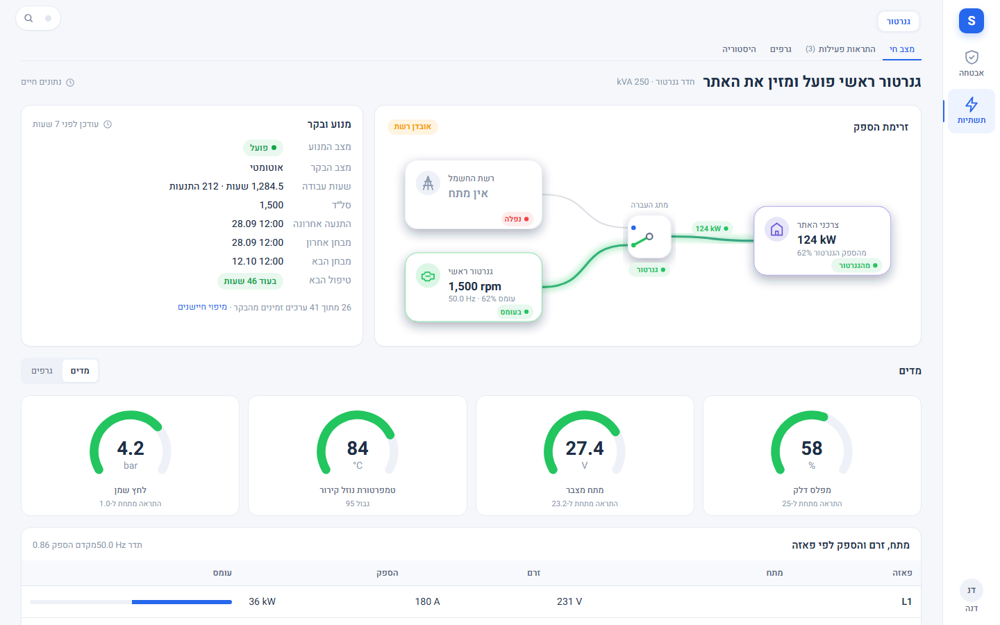

# תשתיות › גנרטור

Source: original

## מה זה

מסך צפייה בגנרטור הגיבוי של האתר: מצב חי, זרימת הספק בין הרשת, הגנרטור ומתג ההעברה לצרכנים, פרטי המנוע והבקר, מתח / זרם / הספק
לכל פאזה, גרפים, התראות והיסטוריה. **המסך לקריאה והתראות בלבד** - אי אפשר להתניע, לעצור או לשנות מצב בקר מכאן, והספים
שמגדירים אינם משנים דבר בבקר עצמו.

הלשונית "גנרטור" מופיעה תחת **תשתיות** רק כשהמערכת מזהה בקר גנרטור (התקן אחד עם כל החיישנים שלו) ולמשתמש יש הרשאת צפייה.

*צילום מהדגמה: נתוני דמה של גנרטור בעומס בזמן נפילת רשת.*

## איך אני… (מפעיל ומעלה)

1. **רואה מה קורה עכשיו.** תשתיות › גנרטור › **מצב חי**. הכותרת אומרת במשפט אחד: פועל ומזין את האתר / בריצת מבחן / במנוחה.
   שבב כתום "אובדן רשת" מופיע כשהרשת נפלה.
2. **מבין את הזרימה.** התרשים מראה רשת החשמל, הגנרטור, מתג ההעברה והצרכנים, וכמה קילוואט עוברים מהגנרטור.
3. **בודק מנוע ובקר.** מצב המנוע, מצב הבקר (אוטומטי / ידני / כבוי / מבחן), שעות עבודה, התנעות, התנעה ומבחן אחרונים, טיפול הבא.
   אם הבקר אינו במצב אוטומטי, מופיעה תווית "לא אוטומטי".
4. **מחליף בין מדים לגרפים.** מפלס דלק, מתח מצבר, טמפרטורת נוזל קירור ולחץ שמן, עם גבולות ההתראה; ובטבלה מתח, זרם והספק לכל פאזה.
5. **צופה בגרפים.** לשונית **גרפים**: טווחים (שעה, 24 שעות, 7, 30 ימים או טווח מותאם) וייצוא CSV. דגימה מלאה נשמרת 3 ימים, אחר כך
   ממוצע ל-5 דקות.
6. **מאשר התראות.** לשונית **התראות פעילות**: "אישור" להתראה אחת או "אישור הכול", עם הערה לא חובה. **היסטוריה**: חיפוש וסינון לפי
   חומרה, סוג ומצב.
7. כשהקשר לבקר נקטע, המסך אומר "אין תקשורת עם בקר הגנרטור" ומציג את הערכים האחרונים שנקלטו עם זמן - לא ערכים שנראים חיים.

## איך אני… (מנהל אתר / מנהל מערכת)

הגדרות › תשתיות › **גנרטור**:

1. **זיהוי.** המסך מראה אם נמצא גנרטור ואילו חיישנים חסרים; "בדיקה חוזרת" או בחירת התקן ידנית.
2. **מיפוי חיישנים.** כל חיישן של הבקר משויך לתפקיד; מתקנים שיוך שזוהה לא נכון.
3. **ספי התראה.** לחץ שמן מינימלי, טמפרטורה מקסימלית, דלק נמוך וכדומה.
4. **שמירת נתונים.** ימי היסטוריית התראות וגרפים, וזמן עד סימון "אין תקשורת".
5. **ניתוב התראות.** **מתחיל ריק**: עד שבוחרים נמענים לכל סוג התראה, ההתראות נשמרות במרכז ההתראות בלבד. לכל התראה בוחרים
   חומרה, נמענים (לפי תפקיד או משתמש), ערוצים, דקות עד הסלמה ונוסח הודעה בעברית עם תצוגה מקדימה.
6. **הרשאות.** צפייה והתראות (`generator.view`: מפעיל ומעלה) וניהול והגדרות (`generator.manage`: מנהלי אתר ומערכת).

## מגבלות

- נבדק מול נתוני דמה ובקר מדומה בלבד; **לא נבדק מול בקר גנרטור אמיתי**. אחרי החיבור הראשון כדאי לבדוק את מיפוי החיישנים.
- אין שליטה בגנרטור, ואין התנעה או עצירה מהמסך.
- מסירת ההתראות בפועל נעשית דרך מרכז ההתראות ולפי הערוצים שהוגדרו שם.

## שים לב

- אישור התראה נרשם ביומן הביקורת עם שם המשתמש.
- ערך שהבקר לא דיווח מוצג כחסר, ולא כאפס.
