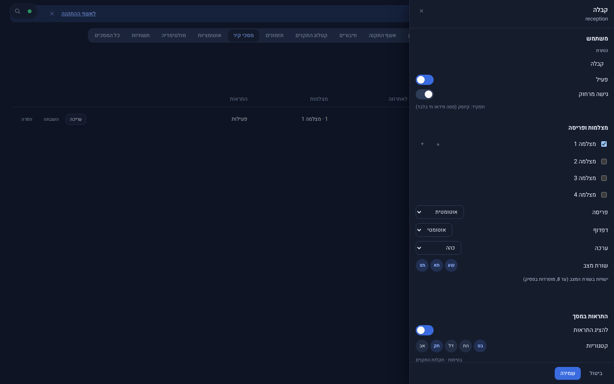

# מסכי קיר — טאבלט קבוע

Source: original

## מה זה

מסך קיר הוא **טאבלט שמחובר לקיר** (קבלה, מסדרון, חדר בקרה) ומציג בלי מגע יד את המצלמות והמפה של המקום שלו. הוא כניסה רגילה
של **משתמש קיר** מיוחד: כשמשתמש כזה נכנס מטאבלט, המערכת עוברת מעצמה לממשק קיר גדול וקריא מרחוק. מהמסך הזה אי אפשר לשנות דבר
במערכת (אין הדלקה, נעילה, אזעקה או PTZ).

**כבוי כברירת מחדל:** עד שמנהל יוצר פרופיל קיר למשתמש, שום דבר לא משתנה. בטלפון או במחשב אותו משתמש רואה את המערכת הרגילה,
מוגבלת לצפייה במפה ובווידאו חי.

## איך אני… (מנהל מערכת — הקמה)

1. הגדרות › משתמשים והרשאות: ליצור משתמש לקיר (בתשתית המערכת), עם תפקיד **kiosk** והרשאת `wall.view`, בהיקף קומה או מצלמות.
2. הגדרות › **מסכי קיר** › "הוספת משתמש מסך": בוחרים את המשתמש ומגדירים כותרת ומקום.
3. **מצלמות ופריסה:** אילו מצלמות, באיזה סדר, פריסה (אוטומטית או קבועה) ודפדוף.
4. **שעות והגנה על המסך:** שעות פעילות ועמעום, והגנה מצריבה (תזוזה קטנה של התמונה, "הקדמה / דחייה").
5. **התראות במסך:** אילו קטגוריות מוצגות (בטיחות, תקלות התקנים…). התראה מופיעה כאריח, ובדחיפות גבוהה משתלטת על המסך
   וחוזרת לפריסה הרגילה לבד. **שורת מצב** מציגה עד 8 ישויות.
6. **מסגרת תמונות:** כשאין פעילות המסך מציג תמונות מתיקייה שנבחרה (לעולם לא פריימים ממצלמות), וחוזר למצלמות ברגע שיש התראה.
7. בטאבלט: נכנסים פעם אחת עם שם המשתמש והסיסמה. הכניסה נשמרת גם אחרי הפעלה מחדש.

*צילום מהדגמה: מגירת העריכה של מסך קיר, בערכת נושא כהה.*

## איך אני… (מי שעומד מול המסך)

- אין מה ללחוץ. המסך מתעדכן לבד; אם הקשר לשרת נופל הוא אומר זאת ולא מציג תמונה ישנה כאילו היא חיה.
- מצלמה שאין ממנה תמונה מסומנת "אין תמונה" ולא נשארת קפואה.

## מגבלות

- כניסה מרחוק (מחוץ לרשת) של משתמש קיר נדחית.
- נבדק מול דמויות וראיות מסך בלבד; לא נבדק על טאבלט פיזי או מערכת חיה.
- אין שליטה בבהירות המסך או בחומרה: זה נעשה באפליקציית קיוסק של הטאבלט.
- מסך טלוויזיה מציג מצלמה דרך **שידור למסך** (ראו `42-multimedia_HE.md`), לא דרך מצב קיר.
