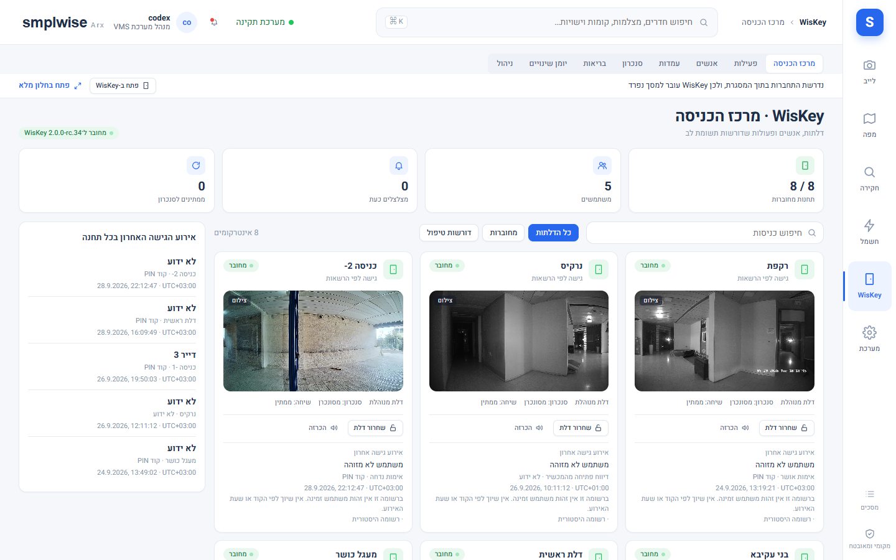
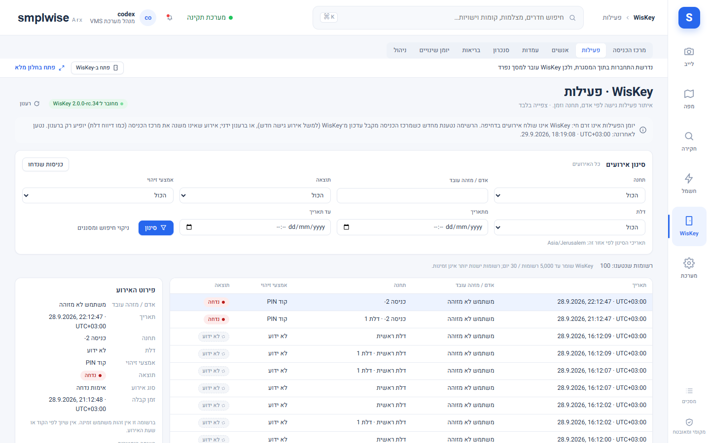

# אזור WisKey (בקרת כניסה)

Source: original

## מה זה

אזור WisKey מציג את מערכת בקרת הכניסה של הבניין (עמדות דלת, אינטרקום, כרטיסים ו-PIN). מאז החלטת
הבעלים ב-28.09.2026, **ברירת המחדל היא הטמעה** (embed): שלוש מהלשוניות (מרכז הכניסה, פעילות,
אנשים) יכולות להציג את פאנל ה-WisKey **האמיתי** שלכם מתוך תשתית המערכת, בדיוק כפי שהוא נראה שם
— או, לחלופין, את מסך ה-SMPLWISE המקביל שנבנה במוצר. שאר לשוניות WisKey (עמדות, סנכרון, בריאות,
יומן שינויים, ניהול) **תמיד מוטמעות**, כי SMPLWISE מעולם לא בנה מסכים משלו בשבילן. הבחירה נעשית
בהגדרות ← בקרות כניסה, לכל לשונית בנפרד.

## איך אני… (צופה — `access.read`)

1. **פותח את מרכז הכניסה, הפעילות או ספריית האנשים.** אם ההגדרה למסך הזה היא "SMPLWISE" — רואים
   מסך שנבנה כאן (רשימת עמדות, תמונת עמדה מ-go2rtc, יומן פעילות עם סינון סטציה/אדם/תוצאה/דלת/טווח
   תאריכים, ספריית אנשים עם חיפוש). אם ההגדרה היא "WisKey" — נפתח הפאנל האמיתי בתוך מסגרת
   (frame), עם ההתחברות וההרשאות של חשבון המערכת שלכם.
2. **מבין למה משהו נראה אחרת בפאנל המוטמע.** בפאנל המוטמע, תשתית המערכת מסתירה את סרגל הצד שלה
   סביב הפאנל כשגרסתה מאפשרת זאת (אחרת הוא נשאר גלוי עם הערה). המסגרת המוטמעת טוענת עותק שני של ממשק
   התשתית — היא איטית יותר ממסך SMPLWISE המקביל, במיוחד בטלפון.
3. **פותח בחלון מלא.** "פתח בחלון מלא" פותח את אותו פאנל בלשונית נפרדת של הדפדפן.

## איך אני… (מפעיל ומעלה — `access.release`, רגישה)

4. **משחרר דלת / עונה או דוחה שיחה / משמיע הכרזה** — רק במסך "מרכז הכניסה" של SMPLWISE (בפאנל
   המוטמע, אלה פעולות WisKey עצמו, ראו למטה). הכפתורים "שחרור דלת", "מענה"/"דחייה"/"סיום שיחה",
   "הכרזה בעמדה" זמינים כאן. תוצאת הקריאה מדווחת כ**"בוצע"** (העמדה אישרה קבלה), **"לא ידוע"**
   (לא התקבל אישור), או שגיאה ספציפית (מנוע ההקראה נכשל, ההשמעה בעמדה נכשלה, ערוץ שמע תפוס).

## איך אני… (מנהל אתר / מנהל מערכת — `access.people.manage`, רגישה)

5. **עורך אנשים.** בעורך האדם: יוצרים/עורכים/מוחקים אדם, PIN, כרטיסים, חלון תוקף והקצאות עמדה.
   "יצירת PIN ייחודי אוטומטית" מציגה את ה-PIN **פעם אחת בגלוי** עם "העתק"; הוא מוסתר שוב מיד
   לאחר העתקה/הסתרה/שמירה/סגירה. יש לנקות את לוח ההעתקה (clipboard) אחרי מסירת PIN לאדם.
6. **קולט כרטיס מהאינטרקום (`access.cards.capture`, נדרשת גם `access.people.manage`).** בסעיף
   הכרטיסים: "קריאת כרטיס מהאינטרקום" מעביר את קורא עמדת הדלת הנבחרת למצב איסוף (פעולה פיזית
   בדלת שמתחילה רק אחרי אישור). כרטיס מוצג במסכה (`•••• 1234` — המספר המלא לעולם לא יוצא
   מ-WisKey), ורק **"הוספת הכרטיס וסנכרון"** מוסיף אותו לאדם ומבקש מ-WisKey לסנכרן לעמדות. מגבלות
   WisKey חלות: קליטה אחת לעמדה ושלוש בסך הכול, המתנה עד 30 שניות לכרטיס, סשן של 120 שניות.
   קליטה שייכת למי שהתחיל אותה בלבד.
7. **בוחר, לכל לשונית (מרכז הכניסה / פעילות / אנשים), "WisKey (מוטמע)" או מסך SMPLWISE** —
   בהגדרות ← בקרות כניסה (`40-devices_HE.md` וגם `80-settings_HE.md`).
8. **מציג/מסתיר את כל אזור WisKey.** מתג נפרד "הצג את WisKey במערכת" מסתיר את כל האזור לכולם ללא
   תלות בתפקיד (כמו הסתרת המפה); כתובת ישירה למסך WisKey כשהוא מוסתר מראה פאנל "מוסתר".

## מה קורה בפאנל המוטמע (rc.19, contract v1)

- הפאנל נפתח דרך `?embed=1&tab=…&tool=…`; WisKey מסתיר את הסרגל/כלים שלו ואת סרגל הצד של התשתית. הלשוניות
  והכלים ב-SMPLWISE (בשני העיצובים, כולל סרגל הטלפון) מגיעים **מקטלוג `wiskey:ready` של הפאנל
  עצמו** — רק מה שהמשתמש הזה מורשה לראות. לחיצה על לשונית שולחת `wiskey:navigate`, וה"מעבר" קורה
  רק כש-`wiskey:location` מאשר (דיאלוג "שינוי לא נשמר" שנדחה משאיר את המסך הישן; סשן נעול לא עונה
  והבקשה פגה אחרי 3 שניות). כתובת הדפדפן משקפת את המסך המאושר (`wiskey_tab`/`wiskey_tool`), כך
  שסימניות וקדימה/אחורה עובדים.
- **בתוך הפאנל המוטמע, המשתמש הוא בעל חשבון המערכת שלו** — לא זהות SMPLWISE. משתמש
  שהחשבון שלו מחזיק `manage` של WisKey (או שהוא מנהל בתשתית המערכת) יכול לשחרר דלתות ולערוך אנשים **בלי**
  שלב האישור של SMPLWISE ו**בלי** רישום ביומן הביקורת של SMPLWISE — רק יומן WisKey עצמו רושם
  זאת.
- גרסאות ישנות יותר של WisKey (לפני rc.19) עדיין עובדות עם שיטה קודמת (deep-link ב-DOM); סימן
  הטמעה בלי handshake מציג "מתחבר…"; חוזה חדש מדי מציג "גרסה לא נתמכת".

## אפליקציית הטלפון (0.1.123)

- **בתוך האפליקציה לטלפון, שום דבר לא מוטמע** — האפליקציה מזהה את עצמה
  (User-Agent + גשר native) ולפני שנפתחת מסגרת כלשהי. שם, מרכז הכניסה/פעילות/אנשים מציגים תמיד
  את מסכי SMPLWISE (גם כשההגדרה היא "WisKey"); שאר לשוניות WisKey מציגות הערה קצרה עם כפתור
  **"פתח ב-WisKey"** שמעביר את האפליקציה עצמה (לא מסגרת) לפאנל WisKey, בדיוק כפי שהאפליקציה מנווטת.
- הסיבה: בתוך האפליקציה, ההתחברות עוברת דרך הגשר הפנימי שלה **רק בחלון העליון** — ממשק
  מקונן בתוך מסגרת לעולם לא מקבל את ההתחברות הזו ותמיד יבקש כניסה מחדש.
- אותו דבר קורה בדפדפן רגיל אם תשתית המערכת מבקשת כניסה בתוך המסגרת המוטמעת (למשל התחברות בלי
  "השאר אותי מחובר") — מוצג "נדרשת כניסה".

## שים לב

- `access.release` (רגישה) מכסה את הפעולות הפיזיות בלבד — שחרור דלת, מענה/דחייה/ניתוק, הכרזות.
  `access.people.manage` (רגישה) פותחת את עורך האנשים. שתיהן מוענקות כברירת מחדל רק ל-site_admin
  ו-system_admin; כדי לתת לאדם ספציפי רק את עריכת האנשים בלי כל תפקיד מנהל אתר — בונים תפקיד
  מותאם אישית (`81-roles_HE.md`).
- כל שמירה בעורך האנשים דרך SMPLWISE מבוקרת תחת משתמש ה-SMPLWISE (שמות שדות וספירות בלבד —
  **לעולם לא PIN, מספר כרטיס או טלפון**).
- קליטת כרטיס לא אומתה עדיין מול עמדה פיזית אמיתית (רק מול קוד מקור ו-fixture) — השימוש האמיתי
  הראשון הוא הבדיקה החיה; יש לבצע אותה עם מישהו בדלת ולבדוק גם את הדלת וגם את הקורא.

*צילום מהמערכת החיה.*

*צילום מהמערכת החיה.*

*צילום מהמערכת החיה.*
