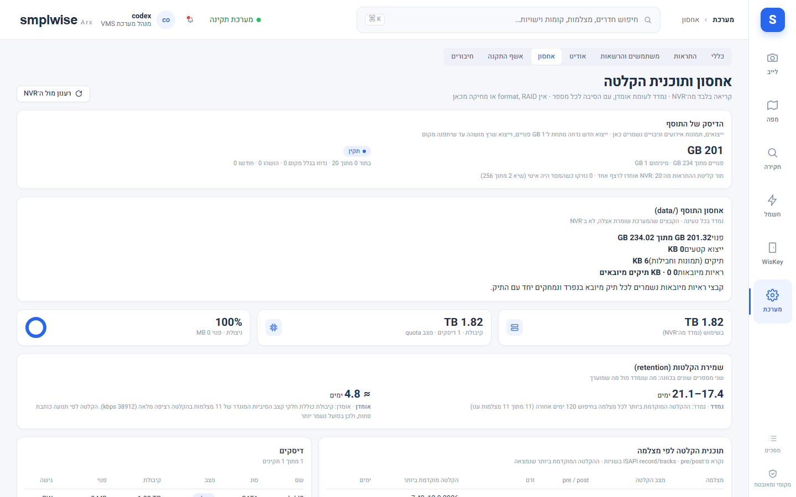

# גיבוי ושחזור, ואחסון

Source: original

## מה זה

הגדרות ← גיבוי ושחזור שומרת גיבויי **פרויקט** (לא וידאו) בתוך ה-add-on; מערכת ← אחסון מציגה שני
דברים נפרדים: מה שנקרא **מה-NVR עצמו** (דיסקים, תוכנית הקלטה, שמירה — קריאה בלבד, אין כאן format/
RAID/מחיקה) ואנליטיקת השימוש של ההתקנה עצמה. שני האזורים דורשים **מנהל מערכת** (`system.configure`).

## איך אני… (גיבוי ושחזור)

1. **יוצר גיבוי ידני.** "צור גיבוי" (עם הערה אופציונלית) כותב zip תחת `/data/backups`: אתרים,
   מבנים, קומות, קובצי תוכנית וגרסאות, סיכות, מצלמות, חדרים ואזורים, הגדרות; משתמשים והרשאות
   נכללים אך משוחזרים רק לפי בחירה. **גיבויים לעולם אינם מכילים אישורי NVR/HA (אלה נשארים
   באפשרויות ה-add-on) ולעולם לא וידאו, תמונות ממוזערות של אירועים או ראיות מיובאות.**
2. **סומך על הגיבוי האוטומטי.** עותק אחד נכתב **לפני כל שדרוג גרסה** (חמשת האחרונים נשמרים)
   ואחד **ביום** (שבעת האחרונים). כל השורה הזו כלולה גם בגיבוי המלא של Home Assistant, כי ה-add-on
   מוגדר `backup: hot` ו-`/data` (כולל תיקיית הגיבויים) חי שם.
3. **מוריד או מעלה קובץ גיבוי.** "הורד" שומר zip למחשב; "העלאת גיבוי" טוענת zip שהורד מכאן —
   גם מהתקנה אחרת — לרשימה, ומשם אפשר "שחזר".
4. **משחזר.** בוחרים **אופן שחזור**: **החלפה** (מחליפה את כל נתוני הפרויקט הנוכחיים במה שבגיבוי)
   או **מיזוג** (רק פריטים שחסרים היום מתווספים; הקיימים נשארים). מתג נפרד **"כולל משתמשים
   והרשאות"** — ברירת המחדל היא נתוני פרויקט בלבד; ההרשאות של המשתמש שמבצע את השחזור נשמרות בכל
   מקרה, כך שאתם לא ננעלים בחוץ. לאישור מקלידים **RESTORE** בדיוק. **דוח השחזור** שמופיע אחרי כן
   מפרט: מה בוצע (החלפה/מיזוג), כמה שורות בכל טבלה, כמה קובצי תוכנית שוחזרו, וכמה שורות "לא
   בטוחות" דולגו (למשל שורת עורות-קומה עם מזהה קומה שאינו קיים עוד — נספרות, לא נדרסות בשקט).
5. **גיבוי שאינו תואם גרסה.** גיבוי שמגרסת סכימה **חדשה יותר** מההתקנה הנוכחית נדחה עם הודעה
   לעדכן את ה-add-on קודם. גיבוי **ישן יותר** משוחזר כרגיל לתוך הסכימה הנוכחית — שדות/טבלאות
   חדשות שהגיבוי לא הכיר פשוט לא נוגעות; אין צורך "להריץ migration" ידנית.
6. **חוזר אחורה אחרי שדרוג כושל (Rollback).** מתקינים את הגרסה הקודמת דרך Home Assistant, ואז
   משחזרים את הגיבוי **"לפני עדכון"** עם **החלפה**.
7. **מוחק גיבוי ישן** מהרשימה כשאין בו יותר צורך.

## איך אני… (מה בטוח בשחזור)

8. **קורא את הערת אבטחת הסקינים.** קבצי תמונות הבקרה/הרינדורים של Plan Studio 3D (`skins.*`)
   **מוגבלים תמיד לתיקיית `data/skins`** — גם שורת מסד נתונים מורעלת וגם ארכיון גיבוי מבויים לא
   יכולים "לברוח" מהתיקייה הזו; מזהי קומה מאומתים, ושחזור גיבוי מדלג על שורות קומה לא בטוחות
   ומדווח את המספר בדוח (סעיף 4). חילוץ `files/` בתוך הארכיון דוחה `..`, נתיבים מוחלטים,
   backslash ואות כונן — לא רק לוכסן קדמי.
9. **יודע מה לא חוזר בשחזור.** קבצים שהם עותקים נגזרים ולא חלק מהפרויקט המקורי — ראיות מיובאות
   מתיקי חקירה (`/data/imported/...`) ותצוגות מקדימות של אירועים (`/data/thumbs`) — **אינם**
   נכללים בגיבוי, גם לא בשחזור: תיק שיובא לפני הגיבוי חוזר עם הפריטים שלו מסומנים "חסר" בדיסק,
   וניסיון לייבא את אותה חבילה שוב עדיין נחסם עד שהתיק ההוא נמחק.

## איך אני… (אחסון — מה-NVR)

10. **בודק שמירת הקלטה.** מערכת ← אחסון קוראת מה-NVR בלבד: דיסקים ומקום פנוי, תוכנית הקלטה לכל
    מצלמה (רציף/תנועה, ימים, קצב סיביות ורזולוציה) ותקופת שמירה. **"נמדד"** הוא ההקלטה הישנה
    ביותר שנמצאה בפועל (חיפוש עד 120 יום אחורה); **"אומדן"** הוא חישוב קיבולת מהקצבים המוגדרים
    כאילו הכול מקליט ברציפות — מצלמות מבוססות-תנועה שומרות בפועל יותר. הדוח במטמון 10 דקות;
    "רענון מול ה-NVR" שואל שוב. שום דבר במסך הזה אינו כותב להתקן.
11. **צופה באנליטיקת אחסון (Beta, נתוני הדגמה כרגע).** תחזית שימוש (נמדד עד קו מסוים, אומדן
    אחריו — לא תחזית פשוטה של "דיסק מתמלא"), פילוח לפי מצלמה לפני retention, ומדיניות ההקלטה.
    המסך מסומן Beta עם נתוני הדגמה משום שהוא עדיין לא מחובר לחלוטין ל-backend החי בכל הסביבות —
    לבדוק תמיד מול הכרטיסים ב-#10 לנתון אמיתי.
12. **בודק את אחסון ה-add-on עצמו** (`/data`): הגדרות ← בריאות ועבודות מציגה את השימוש שה-add-on
    צורך (מסד נתונים, קובצי תוכנית, גיבויים, תמונות ממוזערות עד 200MB, וראיות מיובאות בנפרד),
    לצד הגיבוי האחרון. מכסת ייצוא (`exports.max_mb`, ברירת מחדל 2048MB לכל משימה) ותקופת שמירת
    ייצוא (`exports.retention_days`) נקבעות בהגדרות ← וידאו ומדיה. הגדרת מוצר נוספת,
    `storage.min_free_mb` (ברירת מחדל 1024MB), שומרת רזרבת מקום פנוי חובה על `/data` — פעולה
    שהייתה משאירה פחות מזה (כמו ייבוא חבילת ראיות גדולה) נדחית מראש במקום להסתכן במסד נתונים
    שנתקע כשהדיסק מתמלא.

## שים לב

- כל יצירה, מחיקה ושחזור של גיבוי נכתבים ביומן הביקורת; המנהל שמבצע שחזור שומר על הגישה שלו גם
  כשבוחרים "החלפה" עם היקף הרשאות.
- אין כאן "שחזור חלקי בעצמכם" — היחידה היא כל הפרויקט (או כל הפרויקט + הרשאות). לשחזור פריט בודד
  (למשל תוכנית קומה אחת) יש להשתמש בהיסטוריית הגרסאות של עורך התוכנית (`21-plan-studio_HE.md`),
  לא בגיבוי.
- הגיבוי המקומי אינו תחליף לגיבוי HA `backup: hot` (למקרה של אובדן דיסק שלם) — שניהם פועלים יחד.

*יוחלף בצילום מהמעבדה.*

*יוחלף בצילום מהמעבדה.*
