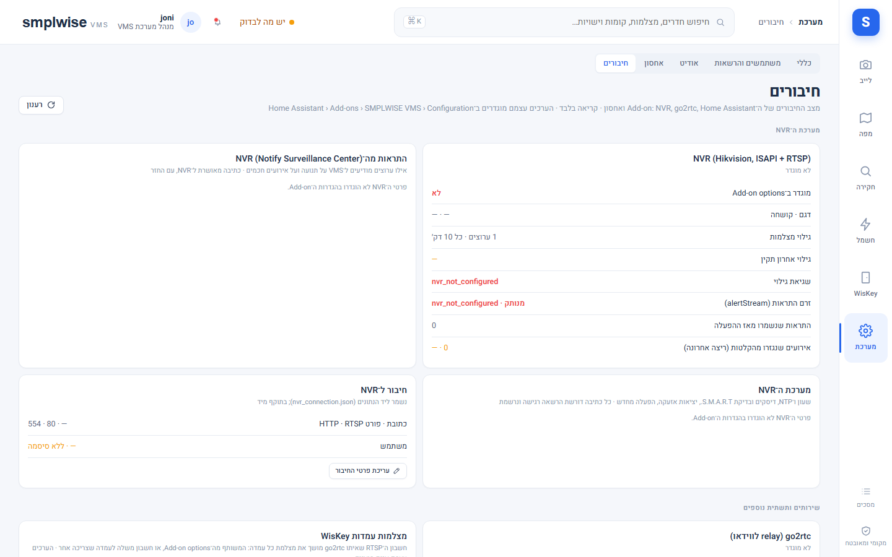
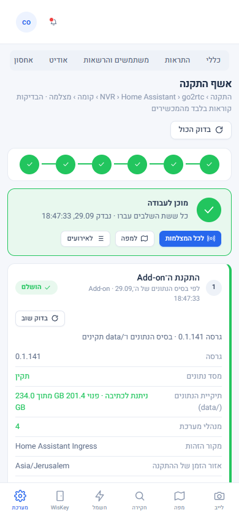

# התקנה ראשונית — אשף ההתקנה

Source: original

## מה זה

שני חלקים:

- **הגדרת החיבורים** קורית בלשונית "Configuration" של ה-add-on ב-Home Assistant, שדה-שדה (למטה).
- **אשף ההתקנה** במוצר — הגדרות ← **אשף התקנה** (`#/system/wizard`, למנהלי מערכת בלבד) — בודק שההתקנה באמת
  עובדת, בשישה שלבים: **התקנה ← NVR ← Home Assistant ← go2rtc ← קומה ← מצלמה**. לכל שלב הוא מציג מצב
  (הושלם / לביצוע / נכשל / ממתין לשלב קודם), את העובדות שנבדקו, ואם השלב לא הושלם — מה הבעיה, **מה עושים**
  וקישור למסך שמתקן אותה. האשף עצמו **לא משנה דבר** ב-NVR, ב-go2rtc או ב-Home Assistant: הוא רק קורא.

הגדרות ← **חיבורים** (`#/system/setup`) נשאר המסך עם העובדות המפורטות על כל חיבור, עריכת פרטי ה-NVR והכתיבות
המאושרות ל-NVR; האשף מקשר אליו כשצריך.

## איך אני… (מנהל מערכת) — לפני ההפעלה הראשונה

1. **מוסיף את המאגר ומתקין.** הגדרות ← אפליקציות ← חנות האפליקציות ← ⋮ ← מאגרים ← מדביקים את
   כתובת המאגר ← הוספה, ואז מתקינים **SMPLWISE VMS** (ה-Supervisor בונה את התמונה מקומית, כמה
   דקות בהתקנה הראשונה).
2. **ממלאים את לשונית Configuration**, שדה־שדה (`smplwise_vms/config.yaml`):

   | שדה | חובה? | מה הוא עושה |
   |---|---|---|
   | `bootstrap_admin_username` | לא (אך בלעדיו אין למי להקצות תפקידים) | ה-username (לא שם תצוגה) של HA שהופך למנהל מערכת בביקור הראשון שלו; ניתן להשאיר ריק כדי לנסות רק את המפות |
   | `nvr_host`, `nvr_http_port`, `nvr_rtsp_port`, `nvr_username`, `nvr_password` | לא, אך בלעדיהם אין מצלמות | גישת ISAPI לקריאה בלבד (סנכרון מצלמות, תצוגות מקדימות); פורט ה-RTSP הוא זה ש-go2rtc מושך ממנו וידאו. מומלץ חשבון NVR ייעודי שאינו מנהל — ה-add-on לעולם אינו כותב הגדרות NVR מעבר לשתי הפעולות המפורשות שדורשות הרשאה נפרדת (ראו `95-troubleshooting_HE.md`) |
   | `go2rtc_url` (+ `go2rtc_api_username`/`password` אופציונלי) | לא, אך בלעדיו אין וידאו חי | כתובת ה-API של add-on go2rtc (למשל `http://<ha-host>:1984`); רק זרמי `smplwise_*` נוצרים, זרמים אחרים לעולם לא נוגעים |
   | `wiskey_username`, `wiskey_password` | לא | חשבון RTSP משותף לעמדות WisKey (תצוגה מקדימה); עמדה עם חשבון שונה מקבלת override נפרד בהגדרות ← חיבורים (מנהל מערכת בלבד) |
   | `openai_api_key` | לא | מפתח OpenAI לעורות קומה מרונדרות ב-AI — ראו `docs/operations/OPENAI_ACCOUNT_SETUP_HE.md` להסבר המלא (מנוי ChatGPT אינו מספיק, צריך חשבון API נפרד עם אמצעי תשלום) |
   | `log_level` | לא | `debug`/`info`/`warning`/`error`; `debug` לפרטי בקשה, לעולם לא מדפיס סודות |

3. **מפעילים ופותחים את ה-add-on** מסרגל הצד. אחרי מילוי פרטי ה-NVR, מצלמות מתגלות לבד תוך
   דקה (גילוי בהפעלה וכל 10 דקות); הגדרות ← וידאו ומדיה ← "סנכרון זרמים" (`system.configure`)
   פותחת את זרמי go2rtc לראשונה. אם הרשימה ריקה — לבדוק את יומן ה-add-on ואת `/api/v1/health`
   (`discovery.cameras_last_error`).

## איך אני… (מנהל מערכת) — גשר Home Assistant

4. **מתקין את SMPLWISE Bridge פעם אחת.** בהגדרות ← גשר Home Assistant, "התקנת הגשר (פעם אחת)"
   מעתיק את `custom_components/smplwise_bridge` ל-config של HA ומכריז עליו ל-Supervisor. **יש
   להפעיל מחדש את Home Assistant פעם אחת** כדי שהרכיב ייטען, ואז לאשר "SMPLWISE Bridge" תחת
   Settings ← Devices & services (קוד הזיווג כבר ממולא). בלי מיפוי `homeassistant_config`, המסלול
   הידני נשאר: להעתיק את התיקייה בעצמכם או להוסיף כמאגר HACS.
   **חשוב:** בכל פעם שהגשר עצמו מתעדכן לגרסה חדשה (למשל כשגרסת ה-add-on מוסיפה שירותי HA
   נתמכים) יש **להפעיל מחדש את Home Assistant שוב** — עד אז השירותים החדשים נענים
   `service_not_allowed`/"השירות אינו מורשה", וזה לא באג. לשונית ההגדרות מציגה את מצב הגשר
   (ממתין ל-Restart / פעיל / עדכון ממתין) בכל עת.

## איך אני… (מנהל מערכת) — עובר על אשף ההתקנה

5. **פותח את הגדרות ← אשף התקנה.** בראש המסך שורת שלבים (ירוק = הושלם, אדום = נכשל, כתום = לביצוע) וסיכום
   "n מתוך 6 שלבים הושלמו · השלב הבא". בפתיחה האשף בודק מול המכשירים כל שלב שידוע רק מעבודות הרקע של ה-add-on
   (השורה מתחת לכותרת השלב אומרת "נבדק מול המכשיר", "לפי עבודות הרקע" או "לפי בסיס הנתונים").
6. **מטפל בשלב הראשון שלא הושלם.** בכרטיס השלב: הבעיה במשפט אחד, "מה עושים:" עם הפעולה עצמה, וקישור למסך
   המתקן. אחרי התיקון — **"בדוק שוב"** באותו שלב (אפשר פעם ב-5 שניות לכל שלב; אם מוקדם מדי, המסך אומר כמה
   לחכות). "בדוק הכול" בודק את כל השלבים.

   | שלב | מה נבדק | כשזה נכשל — הדוגמה הנפוצה |
   |---|---|---|
   | 1. התקנת ה-Add-on | בסיס הנתונים, `/data` (כתיבה ושטח פנוי), מנהלי מערכת, אזור הזמן | דיסק מלא ← לפנות ייצואים וגיבויים ישנים (הגדרות ← אחסון) |
   | 2. חיבור ל-NVR | דגם וקושחה, רשימת הערוצים והזרמים (ראשי ומשני), פרופילי הווידאו, שעון ה-NVR מול ה-add-on, שעון קיץ | "ה־NVR לא ענה" ← לבדוק שהוא דולק ושהכתובת והפורט נכונים (הגדרות ← חיבורים); "דחה את שם המשתמש או הסיסמה"; סטיית שעון מעל 30 שנ׳ ← NTP או "סנכרן לשעון השרת"; היסט UTC שגוי ← אזור הזמן/שעון הקיץ בהגדרות ה-NVR |
   | 3. Home Assistant והגשר | החיבור ל-HA, גרסת HA, מצב SMPLWISE Bridge וצימודו, הפעלה מחדש ממתינה, שעון HA ואזור הזמן שלו | "עוד לא נטענה" ← להפעיל מחדש את Home Assistant; "עוד לא צומד" ← לאשר את SMPLWISE Bridge ב-Devices & services |
   | 4. go2rtc | גרסה, זרמי `smplwise_` מול הזרמים שהמצלמות צריכות (זרמים של מוצרים אחרים רק נספרים) | "go2rtc לא ענה" ← `go2rtc_url`; "אין אף זרם smplwise_" ← "סנכרון זרמים" (הגדרות ← כללי ← וידאו ומדיה) |
   | 5. קומה ותוכנית | אתר, מבנה, קומה ותוכנית מפורסמת | "אין תוכנית" / "טיוטה שלא פורסמה" ← הקישור פותח את ייבוא התוכנית של אותה קומה |
   | 6. מצלמה על המפה | מצלמות רשומות, מוצבות על תוכנית, עם פרופיל זרם ידוע | "אף מצלמה עוד לא מוצבת" ← הקישור פותח את עורך התוכנית |

7. **מסיים כשמופיע "מוכן לעבודה".** כל ששת השלבים עברו; משם קישורים ישירים לכל המצלמות, למפה ולאירועים.
   עד אז מנהל מערכת רואה מעל כל מסך את השורה "השלם את ההתקנה · n מתוך 6 שלבים הושלמו" עם קישור לאשף; × מסתיר
   אותה עד סוף הסשן בדפדפן.

ספי השעון: עד 2 שניות סטייה — תקין; עד 30 — אזהרה (השלב עובר); מעבר לזה — השלב נכשל. שעון קיץ נבדק לפי אזור
הזמן של ההתקנה (הגדרות ← כללי ← וידאו ומדיה, "אזור זמן של האתר וה־NVR").

## מצב ללא NVR (חשמל בלבד)

התקנה שמשמשת רק לשליטה בחשמל ובהתקנים עובדת בלי NVR: משאירים את `nvr_host` (ואת `nvr_username` / `nvr_password`)
ריקים ב־Configuration. במצב הזה האשף מסמן את שלבי **NVR** ו**מצלמה** "דילוג - מצב ללא NVR" (לא "נכשל"), ואת go2rtc
כרשות כל עוד אינו מוגדר (הוא נדרש רק לווידאו של עמדות WisKey). "מוכן לעבודה" מופיע כשהשלבים הנותרים הושלמו - התקנה,
Home Assistant, קומה (ו־go2rtc אם הוגדר). מסכי המצלמות, האירועים וההקלטות מוסתרים מהניווט לכולם; המפה, חשמל והתקנים
ו־WisKey עובדים כרגיל. כדי להוסיף NVR בהמשך ממלאים את שלושת השדות ומפעילים מחדש את ה־Add-on - בלי הסבת נתונים. פירוט:
`smplwise_vms/DOCS_HE.md`, "מצב ללא NVR".

## שים לב

- קישור המפתח ל-OpenAI מוסבר בפירוט (מנוי מול API, חיוב, תקציב, ביטול) ב-
  `docs/operations/OPENAI_ACCOUNT_SETUP_HE.md`.
- אחרי כל שדרוג גרסה — או כל שינוי בהגדרות NVR/go2rtc/WisKey — לבדוק את הגדרות ← בריאות ועבודות
  לפני שמדווחים על תקלה; רשימת בדיקה מוכנה למעבדה: `docs/operations/LAB_CHECKLIST_2026-09-29_HE.md`.
- אף שדה סוד (סיסמה, מפתח API) לא מוצג שוב אחרי שמירה — רק "מוגדר: כן/לא".

- האשף לא מחליף את הגדרות ← בריאות ועבודות: הוא עונה על "האם ההתקנה שלמה", ומסך הבריאות על "מה קורה עכשיו".
- בדיקה מול מכשיר מוצגת 10 דקות; אחר כך האשף חוזר להציג את מה שעבודות הרקע יודעות, עד ה"בדוק שוב" הבא. כל
  בדיקה נרשמת ביומן הביקורת (`setup.check`).

*צילום מה-build מול backend עם NVR ו-go2rtc מדומים (`frontend/tests/fixtures/setup_fake_devices.py`), לא מהמעבדה.*

