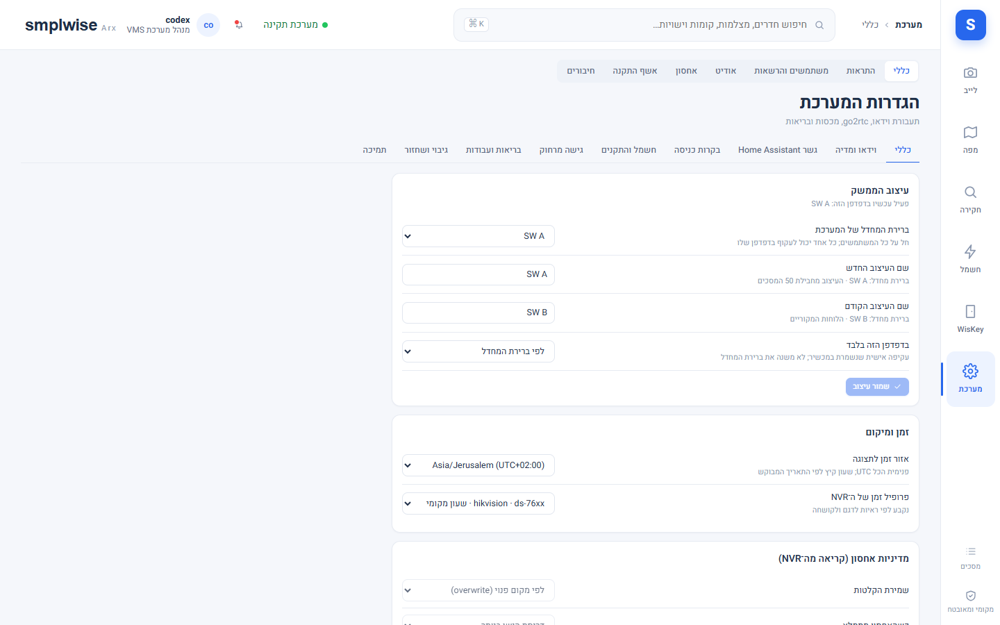
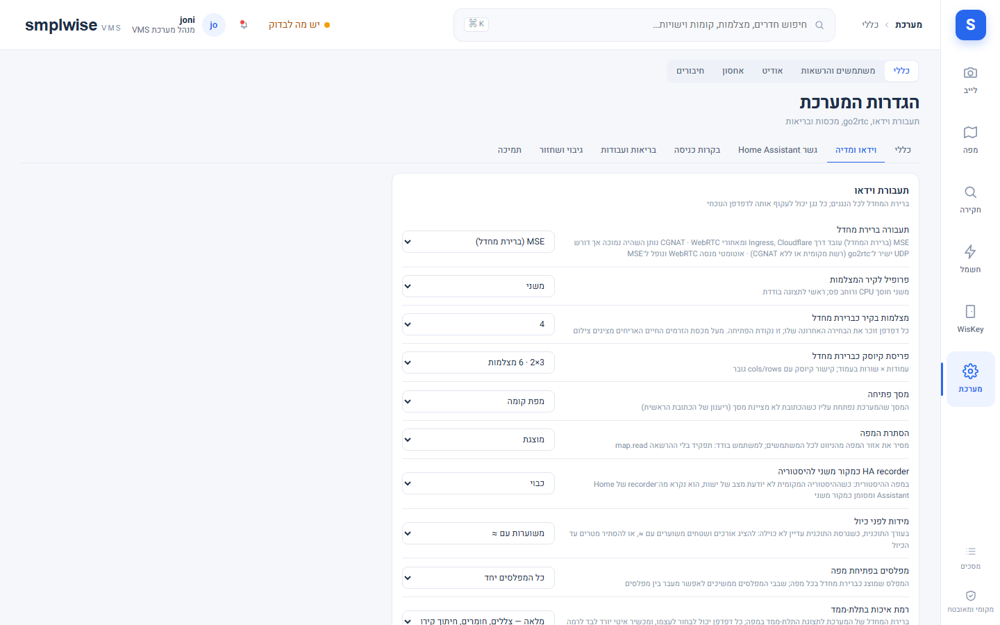
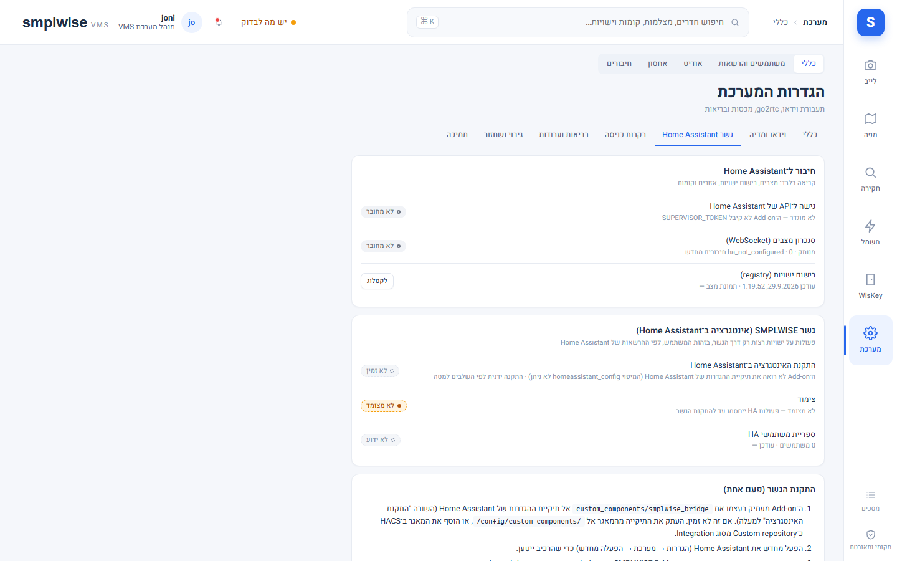
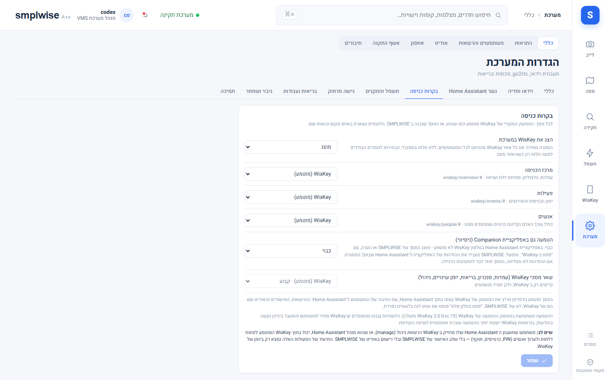
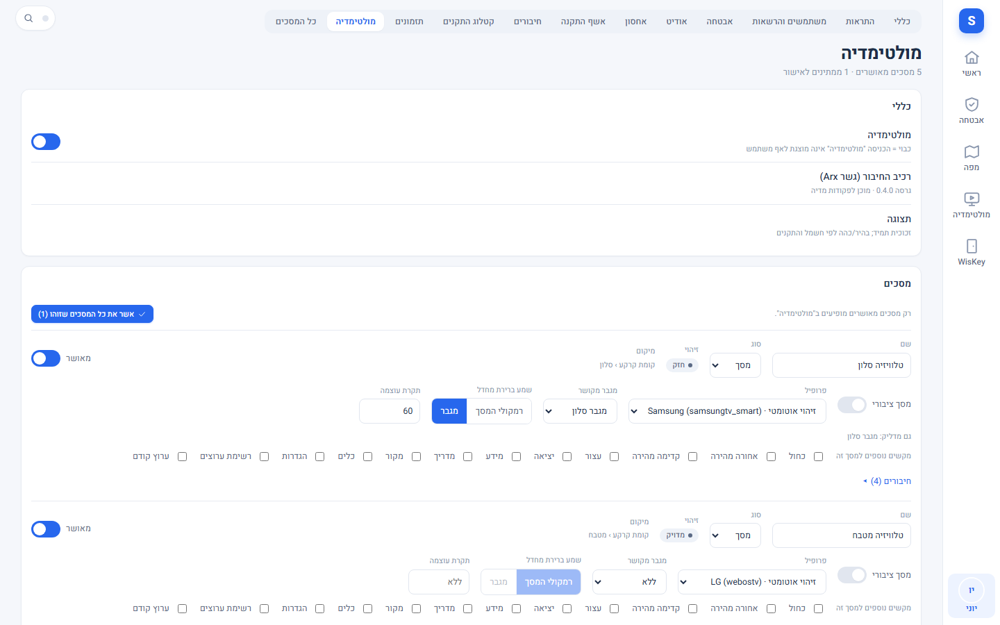
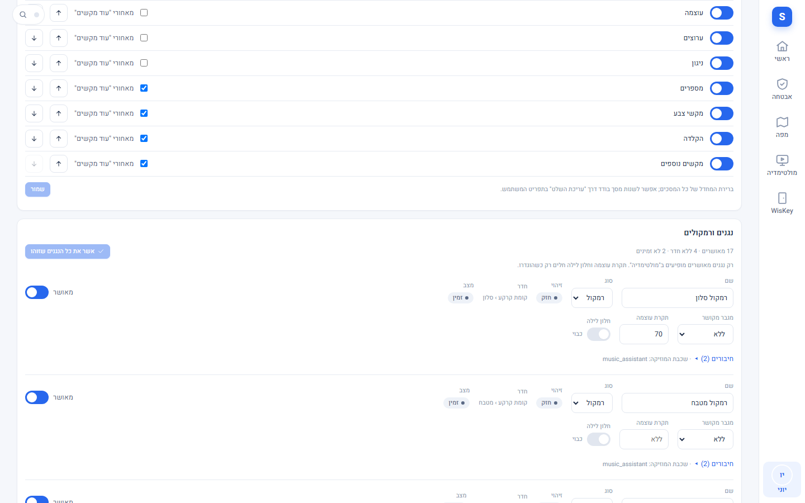
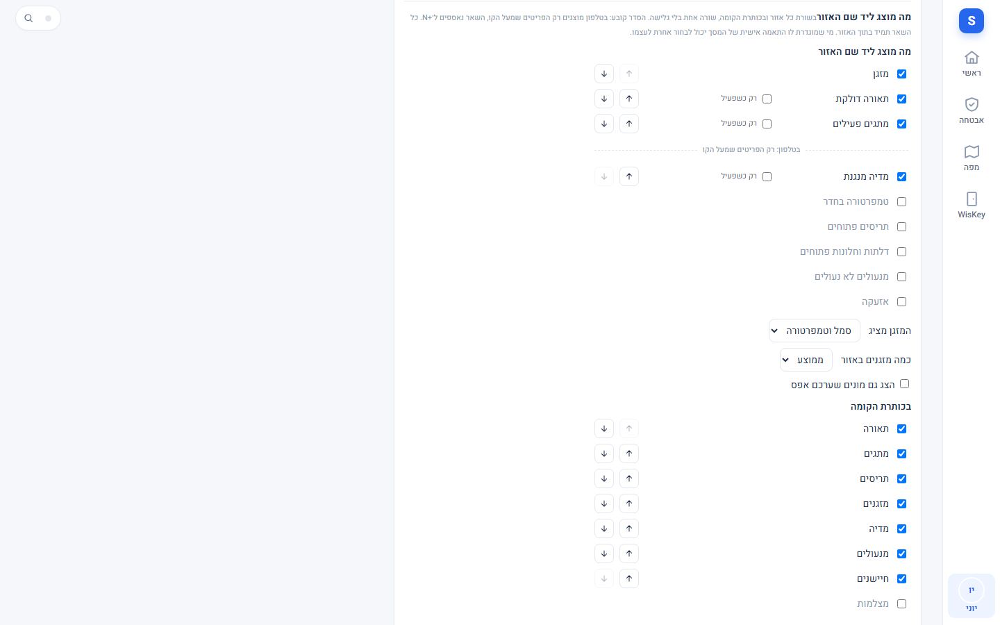
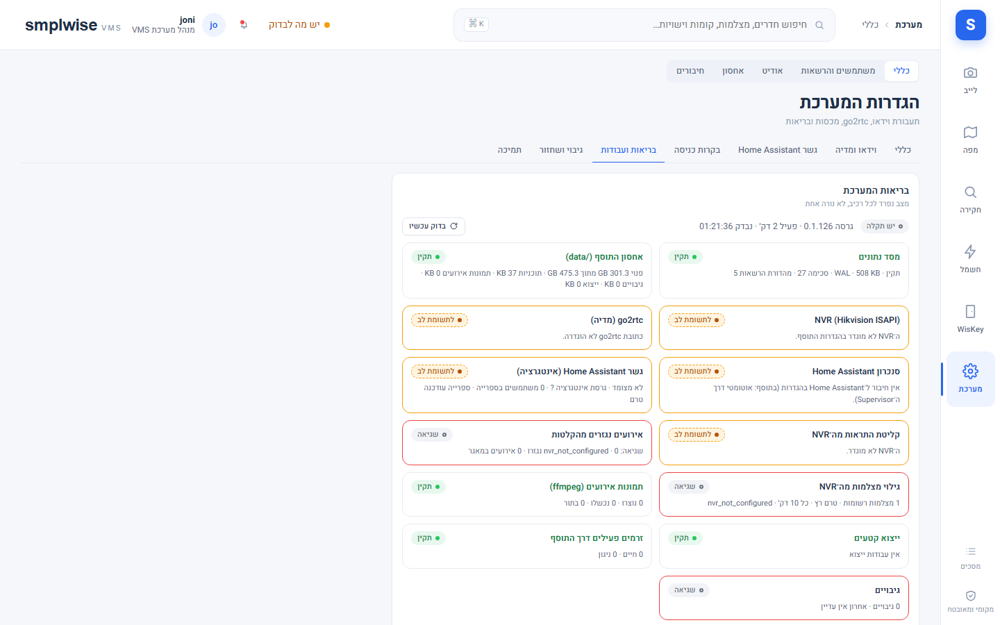
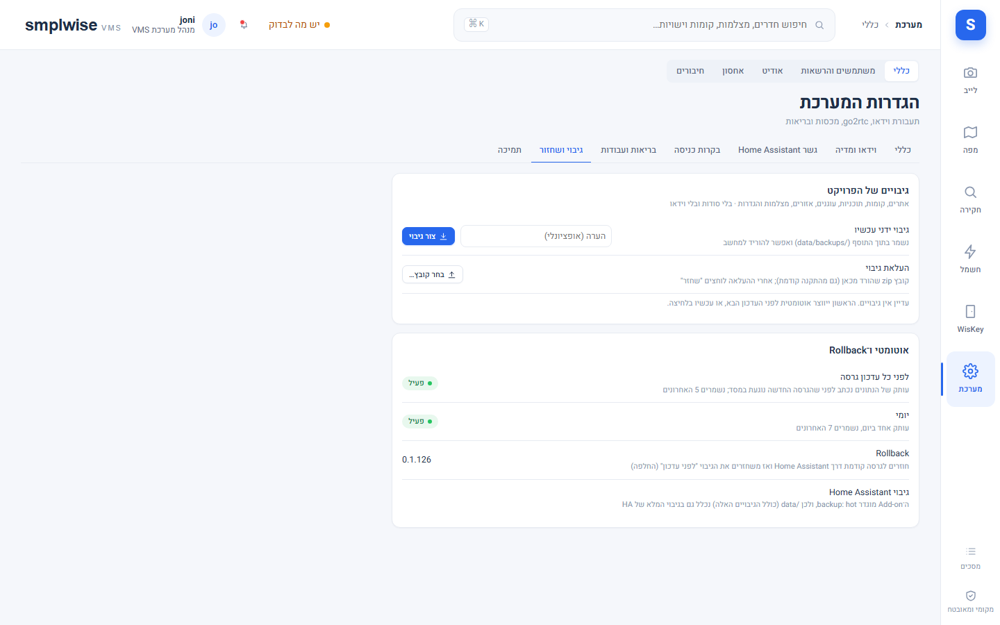
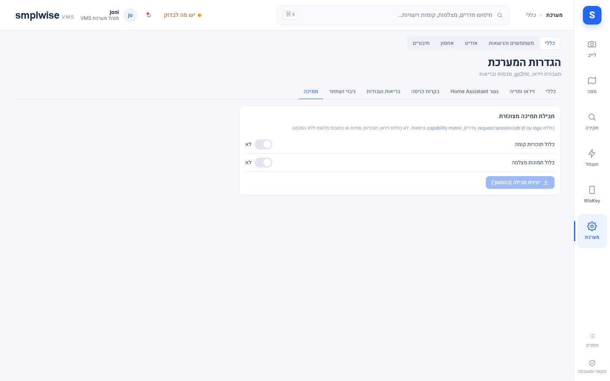

# הגדרות

Source: original

## מה זה

מסך ההגדרות (מערכת ← הגדרות) מרכז את כל מה שקובע איך המוצר מתנהג להתקנה כולה: וידאו, גשר Home
Assistant, בקרות כניסה, חשמל והתקנים, מולטימדיה (מסכים ושלט), בריאות, גיבוי ותמיכה. **כל שינוי דורש `system.configure`**
(בפועל: תפקיד **מנהל מערכת**) ונכתב ליומן הביקורת (`settings.update`, עם הערכים החדשים בלבד — לא
סודות). מי שאין לו את ההרשאה רואה את הלשוניות שהוא רשאי לצפות בהן, ללא אפשרות לשמור. שדות שמקורם
בקובץ אפשרויות ה-add-on (למשל `openai_api_key`, פרטי NVR) **אינם** בהגדרות המוצר — הם נערכים
בלשונית Configuration של ה-add-on עצמו ב-Home Assistant, ומוצגים כאן רק כ"מוגדר/לא מוגדר".

הטבלאות שלמטה מבוססות על `smplwise_vms/backend/smplwise/routers/settings.py` (מקור האמת לערכי
ברירת המחדל וטווחי הקלט) ועל `smplwise_vms/DOCS_HE.md`.

## לשונית "כללי"

| שדה | משמעות | ברירת מחדל | מי רשאי לשנות | אודיט |
|---|---|---|---|---|
| עיצוב הממשק (`ui.design`, `ui.design_names`) | הוסר ב-0.1.148: יש עיצוב אחד (SW A). המפתחות עדיין מתקבלים בשרת אך אין להם השפעה, ו-`?design=` בכתובת מתעלמים ממנו. נשארה רק פריסת האריחים (בכרטיס "עיצוב הממשק") | — | מנהל מערכת | כן |
| אזור זמן לתצוגה (`time.zone`) | אזור IANA שאליו מתורגמים כל הזמנים (חיפוש הקלטות, אירועים); פנימית הכול UTC | `Asia/Jerusalem` | מנהל מערכת | כן |
| התראת אחסון נמוך | אזהרה כשנשאר פחות מ-10% פנוי ב-NVR (קריאה בלבד מה-NVR) | פעיל | תצוגה בלבד | — |
| go2rtc / גשר HA | קיצורים ללשוניות "וידאו ומדיה" ו-"גשר Home Assistant" | — | — | — |
| בריאות המערכת | תקציר מצב, עם קישור ל"בריאות ועבודות" | — | — | — |

## לשונית "לשוניות"

קובעת לכל אזור אילו לשוניות מוצגות ובאיזה סדר: הניווט הראשי (סרגל הצד והסרגל התחתון), המסך הראשי (מבט על / תזמונים),
אבטחה (לייב / חקירה ולשוניות כל אחד מהם), המפה, WisKey, ההגדרות ולשוניות האבטחה שבהן. לכל לשונית מתג הצגה, ידית גרירה
וחצים (במקלדת: חצים על הידית), ולכל אזור "אפס לברירת המחדל". "שמור" כותב הכול יחד (`ui.tabs`, מנהל מערכת, נרשם
ביומן).

- האזור נפתח על **הלשונית הראשונה שמוצגת**. בכל אזור נשארת לפחות לשונית אחת, והלשונית "כללי" של ההגדרות (שדרכה
  מגיעים לעורך הזה) נעולה: אי אפשר להסתיר את הדרך חזרה.
- **הסתרה היא הצגה בלבד.** הרשאות לא משתנות, והכתובת של לשונית מוסתרת ממשיכה לעבוד למי שמורשה. הרשאות מסתירות לשוניות
  לפני ההגדרה הזו: לשונית שהמשתמש לא מורשה לה לא מוצעת לו בשום מקרה.
- **סדר אישי גובר.** הסדר של הניווט הראשי כאן הוא ברירת המחדל לכולם. כל משתמש יכול לסדר אותו לעצמו בתפריט המשתמש
  (**סדר הלשוניות**) והסדר שלו נשמר לו בכל מכשיר; מי שלא סידר, או שאיפס, עוקב אחרי הסדר של המנהל. שאר האזורים
  אינם אישיים.
- הלשוניות של WisKey נלקחות מ-WisKey עצמו; לשונית שעוד לא נטענה בדפדפן הזה שומרת את ההגדרה שלה.

## לשונית "וידאו ומדיה"

| שדה | משמעות | ברירת מחדל | טווח | מי רשאי לשנות |
|---|---|---|---|---|
| תעבורה ברירת מחדל (`media.transport_default`) | `mse` עובד דרך Ingress/Cloudflare/CGNAT; `webrtc` השהיה נמוכה אך דורש UDP ישיר; `auto` מנסה WebRTC ונופל ל-MSE | `mse` | mse / auto / webrtc | מנהל מערכת |
| פרופיל לקיר המצלמות (`media.wall_profile`) | משני (sub) חוסך CPU ורוחב פס; ראשי (main) לתצוגה בודדת | `sub` | sub / main | מנהל מערכת |
| מקסימום זרמים חיים במקביל (`media.max_live_sessions`) | הגנה על ה-NVR; מעל המכסה — צילום בלבד; ערך מעל מחצית מספר הערוצים שה-NVR בנוי להם מציג אזהרה ליד השדה, אבל השמירה לא נחסמת | 8 | 1–128 | מנהל מערכת |
| רעננות צילום (`snapshots.max_age_s`) | תדירות עדכון תמונת ISAPI לאריחים | 60 שניות | 5–3600 | מנהל מערכת |
| מצלמות בקיר כברירת מחדל (`ui.wall_count`) | נקודת פתיחה; כל דפדפן זוכר בחירה אחרונה | 4 | 1–32 | מנהל מערכת |
| פריסת קיוסק כברירת מחדל (`ui.kiosk_cols`/`ui.kiosk_rows`) | עמודות×שורות; קישור קיוסק עם `cols`/`rows` גובר | 3×2 | 1–6 / 1–5 | מנהל מערכת |
| מסך פתיחה (`ui.start_route`) | המסך שהמערכת נפתחת עליו כשהכתובת לא מציינת מסך. **ברירת המחדל היא "ראשי"** (חשמל והתקנים). ערך ששמר מנהל בעבר גובר על ברירת המחדל: התקנה ששמרה "מפת קומה" (או מסך אחר) ממשיכה להיפתח עליו עד שמשנים כאן ל-"ראשי". משתמש שאינו רואה את מסך הפתיחה נוחת על הלשונית הראשונה שלו | ראשי (`devices`) | devices (ראשי) / explore (מפת קומה) / live (סקירה) / wall (כל המצלמות) / events / playback | מנהל מערכת |
| גודל תצוגת WisKey (`ui.wiskey_size`, `ui.wiskey_scale`) | **רגיל:** WisKey ממלא את אזור התוכן. **מותאם:** WisKey מוצג בגודל וירטואלי גדול יותר ומוקטן (קנה מידה 100 / 90 / 80 / 70%), כך שנכנסים בו יותר כרטיסים. **מסך מלא:** מכסה את כל החלון; יציאה בכפתור קטן בפינה או ב-Esc. הפאנל המוטמע אינו מציג יותר פס, כפתורי רענון / הגדלה / חלון חדש או מסגרת של Arx | רגיל; קנה מידה 90 | normal / fit / full; 100 / 90 / 80 / 70 | מנהל מערכת |
| קומת ברירת מחדל במפה (`map.default_floor`, לשונית "מפה") | הקומה שנפתחת ראשונה בלשונית "מפת קומה", נבחרת מרשימה לפי אתר ומבנה. "אוטומטי" = הקומה הראשונה שהמשתמש רשאי לראות. משתמש שאינו רשאי לראות את הקומה שנבחרה מקבל את הקומה הראשונה שלו (ההגדרה לעולם לא נותנת גישה); מחיקת הקומה מנקה את ההגדרה | אוטומטי | קומה קיימת | מנהל מערכת |
| הסתרת המפה (`ui.hide_map`) | מסיר את אזור המפה מהניווט לכולם | מוצגת | true/false | מנהל מערכת |
| HA recorder כמקור משני (`history.ha_secondary`) | במפה ההיסטורית: מקור גיבוי כשההיסטוריה המקומית לא יודעת מצב | כבוי | true/false | מנהל מערכת |
| מידות לפני כיול (`plan.estimates`) | הצגת ≈ עד כיול, או הסתרת מטרים | משוערות (≈) | true/false | מנהל מערכת |
| מפלסים בפתיחת מפה (`plan.levels`) | כל המפלסים יחד, או רק ברירת המחדל של הקומה; מופיע גם בלשונית "מפה" | כל המפלסים | all/default | מנהל מערכת |
| תצוגת פתיחה של מפה (`map.default_view`, לשונית "מפה") | המפה החיה, המפה ההיסטורית ודף האירוע נפתחים בדו־ממד או בתלת־ממד (כשלקומה יש מבנה); הכפתור 2D / 3D ממשיך להחליף בכל ביקור | דו־ממד | 2d/3d | מנהל מערכת |
| מפלסים של חלל משותף (`map.shared_levels`, לשונית "מפה") | בעורך של קומה שמציגה חלל משותף: להציג בסרגל המפלסים גם את מפלסי הקומה של החדר | מוצגים | show/hide | מנהל מערכת |
| רמת איכות בתלת-ממד (`plan.quality`) | ברירת מחדל להתקנה; דפדפן יכול לדרוס, מכשיר איטי יורד לבד | מלאה (2) | 1/2 | מנהל מערכת |
| דעיכת סימון תנועה (`plan.presence_fade`) | דקות עד שגוון "נוכחות" בתלת-ממד דועך; כבוי = רק בזמן תנועה | 3 דקות | off / 1–120 | מנהל מערכת |
| הסתרת חיפוש AI (`ui.hide_search`) | מסיר לשונית מהניווט; המסך עדיין זמין בכתובת | מוצג | true/false | מנהל מערכת |
| תמונת מצב באבטחה (`ui.security_snapshot`) | מסיר את "תמונת מצב" (הסקירה החיה) מהניווט לכולם; הלייב נפתח על "כל המצלמות" והכתובת הישנה מפנה אליהן | מוצגת | true/false | מנהל מערכת |
| סשני ניגון במקביל (`playback.max_sessions`) | כל ניגון = זרם playback אחד מה-NVR; ערך מעל מחצית מספר הערוצים שה-NVR בנוי להם (למשל מעל 16 ב-NVR של 32 ערוצים) מציג אזהרה ליד השדה, אבל השמירה לא נחסמת. אם דגם ה-NVR לא מזוהה — אין אזהרה | 4 | 1–128 | מנהל מערכת |
| פקיעת סשן ניגון (`playback.lease_s`) | שניות ללא פעילות עד מחיקת הזרם | 600 | 60–3600 | מנהל מערכת |
| גודל ייצוא מקסימלי (`exports.max_mb`) | לפי נפח משוער של קבצי NVR בטווח | 2048 MB | 50–20480 | מנהל מערכת |
| שמירת קבצי ייצוא (`exports.retention_days`) | מחיקה אוטומטית לאחר התקופה | 7 ימים | 1–365 | מנהל מערכת |
| שמירת אירועים (`events.retention_days`) | מחיקת אירועים ישנים מהמאגר המקומי | 30 ימים | 1–3650 | מנהל מערכת |
| שמירת אודיט (`audit.retention_days`) | מחיקת שורות ביקורת ישנות | 365 ימים | 30–3650 | מנהל מערכת |
| **סקינים מרונדרים (AI)** — ספק ומודל (`skins.provider`/`skins.model`) | ספק תמונה חיצוני לעיבוד קומה פוטו-ריאליסטי | openai / `gpt-image-1.5` | — | מנהל מערכת |
| סקינים — אישור פרטיות (`skins.privacy_ack`) | כל עוד כבוי, שום דבר לא נשלח, גם לא בדיקת חיבור | כבוי | true/false | מנהל מערכת |
| סקינים — רינדורים לקומה (`skins.budget_renders_per_floor`) | לכל קומה וגרסת מבנה | 4 | 0–6 | מנהל מערכת |
| סקינים — רינדורים בחודש (`skins.budget_monthly`) | לכל ההתקנה, לחודש קלנדרי, כולל בדיקות חיבור | 20 | 0–500 | מנהל מערכת |
| go2rtc — סנכרון זרמים | פותח לראשונה זרמי `smplwise_*` ב-go2rtc; זרמים זרים לא נגועים | — | `system.configure` | כן |

## לשונית "גשר Home Assistant"

| מה מוצג | משמעות |
|---|---|
| חיבור ל-Home Assistant | האם `SUPERVISOR_TOKEN` הוגדר; בלעדיו אין גישה ל-API של HA |
| גשר SMPLWISE (אינטגרציה ב-Home Assistant) | סטטוס: לא הותקנה / ממתינה ל-Restart / פעילה / עדכון ממתין / שגיאה / לא זמין |
| כתובת + קוד זיווג | להעתקה כשמתקינים את האינטגרציה ידנית (HACS) |
| "התקנת הגשר (פעם אחת)" | מעתיק את `custom_components/smplwise_bridge` ל-config של HA ומכריז עליה; דורש הפעלה מחדש אחת של HA כדי שתיטען |

מי רשאי: מנהל מערכת בלבד רואה כתובת/קוד זיווג ולוחץ "התקנת האינטגרציה"; כל השאר תצוגה בלבד.

## אבטחה (אזעקה ו-NVR)

מסך האזעקה, הניהול שלה וסיכום ה-NVR הם עמוד נפרד בהגדרות, **הגדרות ← אבטחה** (ראו `32-alarm_HE.md`); הניהול כבר לא לשונית של "כללי", ומסך
האזעקה מופיע גם כמקטע באזור האבטחה. העמוד מופיע למחזיקי הרשאות האזעקה גם בלי הרשאת הגדרות כללית, ועמודי האזעקה רק כשקיים לוח
אזעקה (עמוד ה-NVR למנהל מערכת).

## לשונית "בקרות כניסה"

| שדה | משמעות | ברירת מחדל | מי רשאי לשנות |
|---|---|---|---|
| הצג את WisKey במערכת (`ui.hide_wiskey`) | הסתרת כל אזור WisKey מהניווט לכולם, ללא תלות בתפקיד | מוצג | מנהל מערכת |
| מרכז הכניסה (`access.ui.overview`) | WisKey (מוטמע) או SMPLWISE | WisKey | מנהל מערכת |
| פעילות (`access.ui.events`) | WisKey (מוטמע) או SMPLWISE | WisKey | מנהל מערכת |
| אנשים (`access.ui.people`) | WisKey (מוטמע) או SMPLWISE | WisKey | מנהל מערכת |
| הטמעה גם באפליקציית Companion (ניסיוני) (`access.phone_embed`) | מופעל: גם באפליקציית Home Assistant בטלפון WisKey מוטמע, ו־SMPLWISE מעביר את ההזדהות של האפליקציה ל־Home Assistant שבתוך המסגרת; אם ההזדהות לא מצליחה, המסך חוזר לבד למסך של SMPLWISE עם "פתח ב-WisKey". כבוי: באפליקציה אין מסגרת | כבוי | מנהל מערכת |
| שאר מסכי WisKey (עמדות, סנכרון, בריאות, יומן שינויים, ניהול) | תמיד מוטמעים — קבוע, לא ניתן לשינוי | WisKey (קבוע) | — |

ראו `50-wiskey_HE.md` לגבי מה זה אומר בפועל (הרשאות WisKey עצמו חלות בפאנל המוטמע, לא הרשאות
SMPLWISE).

## לשונית "חשמל והתקנים"

| שדה | משמעות | ברירת מחדל | מי רשאי לשנות |
|---|---|---|---|
| סגנון (`devices.style`) | SMPLWISE (מראה שאר המערכת) או זכוכית (משטחים שקופים ומטושטשים, מהמוקאפ שאושר) | SMPLWISE | מנהל מערכת |
| ערכת צבע (`devices.theme`) | ברירת מחדל / חול / יער / גרפיט — פלטת swatches | ברירת מחדל | מנהל מערכת |
| בהיר או כהה (`devices.scheme`) | לעולם לא כהה רק כי מערכת ההפעלה כהה — צריך בחירה מפורשת | בהיר | מנהל מערכת |
| תצוגת הפתיחה של המבנה (`devices.default_view`) | כרטיסים (עץ+כרטיסי קומה) או אריחים; בחירה אישית של הצופה גוברת | כרטיסים | מנהל מערכת |
| צפיפות (`devices.density`) | מרווחת / דחוסה (אריחים, שורות ורווחים קטנים יותר) | מרווחת | מנהל מערכת |
| חיישנים (`devices.show_sensors`) | כרטיס חיישנים במסך אזור + מונה במסך מבנה | מוצג | מנהל מערכת |
| מה מוצג ליד שם האזור (`devices.area_row`) | אילו פריטים מופיעים בשורה אחת אחרי שם האזור ובאיזה סדר: מזגן, טמפרטורה בחדר, תאורה, מתגים, תריסים, מדיה, דלתות וחלונות פתוחים, מנעולים, אזעקה; מה המזגן מציג (סמל / סמל וטמפרטורה / סמל ומצב); מזגן ממוצע או מוביל (ואיזה מזגן מוביל בכל אזור עם כמה מזגנים); "רק כשפעיל" לכל פריט (ברירת מחדל לדלתות/חלונות פתוחים ולמנעולים); האם להציג גם מונים שערכם אפס | מזגן עם טמפרטורה, תאורה, מתגים, מדיה; אפסים מוסתרים | מנהל מערכת |
| מה מוצג בכותרת הקומה (`devices.floor_row`) | אילו מונים ובאיזה סדר בשורת הספירות של כרטיס הקומה | תאורה, מתגים, תריסים, מזגנים, מדיה, מנעולים, חיישנים | מנהל מערכת |
| ~~רצועת המזגנים~~ (`devices.show_climate_strip`) | הוסרה ב-0.1.149: רשימות המזגנים הוחלפו בסימן אחד בשורת האזור; המפתח נשמר אך אינו משפיע | — | — |

מי שמוגדרת לו ההרשאה "התאמה אישית של המסך שלי" (`screen.personalize`) בוחר את שתי הרשימות גם לעצמו, ב-החשבון שלי ›
המסך שלי; רק מה שנבחר שונה מברירת המחדל נשמר, כך ששינוי מאוחר של ברירת המחדל עדיין מגיע אליו.

הפריסה עצמה (מיקום/גודל כרטיסים, כותרת, אייקון, צבע לפי תפקיד) נערכת ב"עריכת המסך הראשי" (תפריט המשתמש) במסך המבנה/
האזור עצמו — ראו `40-devices_HE.md`, לא כאן. באותו מצב עריכה מגדירים גם את כותרת המסך הראשי, את הווידג'טים האופציונליים
(שעון, מזג אוויר, לוח שנה עברי מחיישנים שבוחרים) ואת סדר הקומות; כולם כבויים כברירת מחדל. לשונית זו מכילה רק
את הסגנון, הצבעים והצפיפות.

## קטלוג התקנים

קטלוג ההתקנים (כל הישויות של תשתית המערכת, עם שיוך למפה, פעולות מותרות ומצב חי) עבר מהלשונית "התקנים" של המפה אל
**הגדרות › קטלוג התקנים**, ומיועד למנהלי מערכת בלבד (`system.configure` בהיקף התקנה). קישור ישן ל-`#/explore/entities`
מפנה לשם למי שמורשה, ואחרת למפה. הנתונים עצמם עדיין נגישים בשרת למי שמחזיק `entity.state.read`; הסתרת הלשונית היא
הסתרת תצוגה, לא הרשאה.

## הגדרות › תזמונים

הלשונית "תזמונים" במסך הראשי (ראו `41-schedules_HE.md`) מציגה ומנהלת את התזמונים של **רכיב התזמונים** בתשתית המערכת
(האינטגרציה Scheduler של nielsfaber; רישיון GPL-3.0, ולכן אינה כלולה בהתקנה ואינה מותקנת על ידי Arx). הרכיב שומר
ומריץ את התזמונים; Arx קורא אותם ממנו וכותב אליו דרך גשר Arx. ההגדרות כאן דורשות `system.configure`, נרשמות ביומן, ואף
אחת מהן אינה משנה את התזמונים הקיימים.

### הפעלה: כבוי כברירת מחדל

התזמונים **כבויים עד שמנהל מערכת מפעיל אותם**: "הצגת הטאב 'תזמונים' במסך הראשי" (`schedules.enabled`, ברירת מחדל כבוי).
כבוי = הלשונית אינה מוצגת לאף משתמש, Arx אינו מאזין לרכיב ואינו כותב אליו, וכל התזמונים הקיימים **ממשיכים לפעול ברכיב**.
ההדלקה מתחילה להאזין מיד ואינה דורשת הפעלה מחדש של Arx.

### כרטיסי המסך

| כרטיס | מה בו |
|---|---|
| **חיבור** | האם רכיב התזמונים נמצא (וגרסתו; נדרש Home Assistant 2024.11.0 ומעלה), גרסת גשר Arx מול הנדרשת (0.3.0 ומעלה לשמירת תזמונים), סנכרון אחרון, מספר התזמונים ("N מוסתרים מהמשתמש הנוכחי" - תזמונים שמחוץ להיקף שלכם), "בדיקה מחדש", והוראות התקנה |
| **הפעלה** | מתג ההפעלה, וחיישן שבת וחג |
| **סוגי התקנים מותרים בתזמון** | שמונה סוגים, כל אחד במתג: תאורה, מתגים, תריסים, מיזוג, מאווררים (רגילים), ואזעקה, מנעולים, דלתות ושערים (מסומנים "רגיש"). ברירת מחדל: כולם |
| **ברירות מחדל לעורך** | הצמדת זמן 5 / 15 / 30 דקות (15), סוג חזרה (חוזר), ושמירת הרצות אחרונות (90 ימים; בשרת 7–365) |
| **מי רשאי מה** | ההרשאות הרגילות של כל תפקיד מובנה, וקישור ל-משתמשים והרשאות |

- **חיישן שבת וחג** (`schedules.shabbat_sensor`): ה-binary sensor "איסור מלאכה בתוקף" של לוח השנה היהודי. נבחר פעם אחת מרשימה
  (מוצעים חיישנים שנראים כחיישן של לוח שנה יהודי). בלעדיו אין את התנאים המוכנים "רק בשבת ובחג", "לא בשבת ובחג" ו-"מוצאי
  שבת" (מנהל מערכת רואה בעורך הודעה שמפנה לכאן), ותזמון שיש בו תנאי כזה מוצג כ-"בתנאי: <שם החיישן> ...". מצב החיישן מוצג לכל
  צופה בתזמונים, כי זו עובדה של לוח שנה. השרת מסרב לחיישן שאינו נראה כחיישן לוח שנה יהודי ומחזיר הודעה.
- **סוגי התקנים:** סוג שכובה - אי אפשר ליצור בו תזמונים חדשים; תזמונים קיימים ממנו הופכים לקריאה בלבד (אפשר להשבית או
  למחוק, לא להפעיל או להריץ) ומופיעים ב-"לבדיקה". מתגים נכנסים לתזמון רק אם סומנו "בטוחים לפעולה קבוצתית" במסך
  האזור (ראו `40-devices_HE.md`). גם כשהסוג מופעל, מה שמותר ביותר הוא קבוע בקוד: אין סצנות, סקריפטים או תחומים אחרים.
- **כללי הבטיחות אינם הגדרות:** סל המחזור (30 יום), האישורים, סירוב לשמור קוד והרשימה המותרת של פעולות קבועים.

### התקנת רכיב התזמונים

1. מתקינים את האינטגרציה המותאמת "Scheduler" (ב-HACS: "scheduler component"), או מעתיקים ידנית את התיקייה
   `custom_components/scheduler`.
2. מפעילים מחדש את Home Assistant.
3. הגדרות › מכשירים ושירותים › הוספת אינטגרציה › "Scheduler".
4. גרסת Home Assistant 2024.11.0 ומעלה. חוזרים לכאן ולוחצים "בדיקה מחדש": "נמצא · גרסה ...".

עד שהרכיב נמצא, משתמש רגיל רואה "אין תזמונים להצגה. הפעלת התזמונים מנוהלת בהגדרות." ומנהל מערכת רואה הודעה מפורטת. Arx
לא נוגע ברכיב הקיים כשהוא חסר (המידע השמור נשמר) ומאשר "חסר" רק אחרי שתי תשובות במרווח של 5 דקות לפחות.

### גשר Arx 0.3.0 - חובה לכתיבה

קריאה ותצוגה של תזמונים אינן דורשות את הגשר. **יצירה, עריכה, הפעלה והשבתה, הרצה, מחיקה ושחזור עוברות דרך שירות
חדש בגשר (`smplwise_bridge.schedule`) שקיים מגרסה 0.3.0.** אחרי עדכון ה-add-on לגרסה שכוללת תזמונים:

1. ב-הגדרות › גשר Home Assistant מוודאים שהגשר עודכן ("התקנת הגשר" מעתיקה את הגרסה החדשה, אם צריך).
2. **מפעילים מחדש את Home Assistant פעם אחת**, כדי שהגשר החדש ייטען.
3. חוזרים ל-הגדרות › תזמונים: "גשר Arx: גרסה 0.3.0 (נדרש 0.3.0 ומעלה)".

עד אז הרשימה עובדת לקריאה בלבד, ופעולות כתיבה מראות "נדרש עדכון של רכיב החיבור" (גשר חסר או לא מזווג: "שמירת שינויים אינה
זמינה כרגע"). הגשר בודק בעצמו כל בקשה, בנפרד מהשרת: חתימה, רשימת פעולות מותרות, מבנה הבקשה, שאין קוד, והאם המשתמש רשאי
לשלוט בכל התקן בתזמון.

### הרשאות

| הרשאה | מה היא נותנת | ברירת מחדל |
|---|---|---|
| `schedule.view` - צפייה בתזמונים | לראות תזמונים, הרצות באות ואחרונות (בהיקף) | מנהל אתר, מנהל מערכת |
| `schedule.manage` - ניהול תזמונים | ליצור, לערוך, להפעיל ולהשבית, להריץ עכשיו, לשכפל, למחוק ולשחזר | מנהל אתר (בהיקף שלו), מנהל מערכת; **רגישה - אינה מרומזת** |
| `schedule.sensitive` - תזמון פעולות רגישות | להוסיף לתזמון אזעקה, מנעולים, דלתות ושערים | מנהל מערכת בלבד; **רגישה - אינה מרומזת** |

- מנהל מערכת בפועל: כל השלוש. `system.configure` לבדו מנהל את ההגדרות האלה ואינו נותן הרשאה על תזמונים. הרצה מיידית כלולה
  ב-`schedule.manage` (אין הרשאה נפרדת). צפייה מתקבלת גם מ-`schedule.view` וגם מ-`schedule.manage`.
- **הרשאה על ההתקנים עצמם חלה גם היא.** כדי לערוך תזמון צריך `schedule.manage` **וגם** שליטה בכל התקן בו
  (`devices.control` להתקנים הרגילים, `ha.entity.control` למנעולים ולדלתות, `alarm.arm` / `alarm.disarm` לאזעקה,
  `door.unlock` לפתיחת נעילה), ולראות אותם (`devices.read` או `entity.state.read`). פעולה רגישה דורשת גם `schedule.sensitive`.
- **כלל ההיקף:** עורך במסגרת היקף (קומה, מבנה) רואה תזמון רק אם **כל** ההתקנים שבו בהיקפו, ועורך אותו רק אם הוא מחזיק את
  כל ההרשאות על **כל** ההתקנים - הישנים והחדשים. התקן אחד מחוץ להיקף הופך את כל התזמון לקריאה בלבד עם סיבה מפורטת (או
  מסתיר אותו, אם אינו נראה). תנאי על חיישן שמחוץ להיקפו מוצג לו אך נעול: הוא עורך שעות ופעולות, ואינו יכול לשנות או
  להסיר את התנאי.
- **מנהל אתר** ברירת מחדל: צפייה וניהול, בהיקף שלו, בלי פעולות רגישות. רשימת "לבדיקה" ומחיקה לצמיתות מסל המחזור - רק בהיקף
  התקנה.

**איך נותנים הרשאה למשתמש או לתפקיד (משתמשים והרשאות, ראו `81-roles_HE.md`):**

1. **למנהל אתר קיים:** אין צורך - צפייה וניהול כבר כלולים בתפקיד, בהיקף שלו.
2. **תפקיד מותאם "עורך תזמונים"** (לאדם שצריך לערוך תזמונים בלבד, בקומה או במבנה מסוים):
   1. משתמשים והרשאות › לשונית "תפקידים" › "תפקיד מותאם חדש", שם: **עורך תזמונים**.
   2. **הרשאות רגילות:** "צפייה בתזמונים", "צפייה בחשמל והתקנים" (`devices.read`; במקומה מספיקה גם "מצב
      ישויות HA") ו-"שליטה בהתקן בודד (חשמל והתקנים)".
   3. **הרשאות רגישות (מסומנות במפורש):** "ניהול תזמונים: יצירה, עריכה, הפעלה והשבתה, הרצה מיידית, מחיקה ושחזור".
      רק אם הוא צריך גם אזעקה, מנעולים או דלתות: "תזמון פעולות רגישות" והרשאות ההתקן המתאימות ("ניטרול אזעקה", "פתיחת
      דלת", "שליטה בישות HA").
   4. מבטלים את "שייך את התפקיד אליי מיד" אם אינכם רוצים לקבל אותו בעצמכם, ולוחצים "צור תפקיד". תפקיד עם הרשאה רגישה
      אינו ניתן להאצלה למנהלי אתר - רק מנהל מערכת משייך אותו.
   5. משתמש (או קבוצה) › שיוך: בוחרים את התפקיד "עורך תזמונים", **את ההיקף** (הקומה או המבנה שבהם הוא רשאי לערוך),
      בודקים את התצוגה המקדימה ולוחצים "שמור שיוך".
3. **בדיקה:** "הרשאות אפקטיביות" מראה מה מותר למשתמש בהיקף. אחרי השיוך הלשונית "תזמונים" מופיעה לו במסך הראשי.

### מגבלות - מה חשוב לדעת

- **מי שעורך ישירות בתשתית המערכת עוקף את הרשאות Arx.** כל משתמש עם גישה לרכיב התזמונים (למשל דרך כרטיס התזמונים
  המקורי) יכול ליצור, לערוך ולמחוק תזמונים בלי היקף, בלי רשימת ההתקנים המותרת, בלי אישורים ובלי יומן של Arx. Arx אינו
  יכול למנוע זאת (הגבלות Arx אינן מגבילות את הממשק המקורי). תזמונים כאלה מופיעים ב-Arx כ-"שנוצרו מחוץ למערכת" (נערכים
  רק אם Arx מבין אותם במלואם, אחרת לקריאה בלבד ואינם נכתבים מחדש). **תזמון רגיש שנוצר מחוץ ל-Arx מסומן ב-"לבדיקה"**
  ("תזמון רגיש שנוצר מחוץ למערכת"), ושינוי מבחוץ בתזמון רגיש נרשם ביומן (`schedule.changed_outside`). תזמון רגיל
  שנוצר מחוץ ל-Arx אינו מסומן בנפרד, אלא רק אם יש בו בעיה אחרת.
- **הפעולה מתבצעת רק ברגע ההתחלה של המשבצת.** "עד שעה" הוא סוף חלון בלבד: בסופו לא קורה כלום. "הדלקה עד 19:00" דורשת
  משבצת כיבוי נפרדת (העורך מציע "כיבוי בסיום החלון").
- **הימים שייכים לתזמון כולו.** הפרשי ימים = תזמונים נפרדים (העורך מפצל באישור). ימי "עבודה" ו-"סוף שבוע" אינם ניתנים
  לפיצול ואינם מחושבים בתצוגת השבוע ובתצוגה המקדימה.
- **תנאים אינם מוערכים ב-"הרצה הבאה".** הרכיב מחשב מועדים לפי ימים ותאריכים בלבד, והתנאי נבדק רק כשהמשבצת אמורה לרוץ;
  לכן תזמון עם תנאי מוצג "· בתנאי" ולא כהבטחה. משבצת שדולגה בגלל תנאי אינה נרשמת בשום מקום.
- **לרכיב אין היסטוריית הרצות.** "הרצות אחרונות" ש-Arx מציג הן נגזרות: תזמון שנכנס למצב "מתבצע" נרשם כהרצה, ואחרי 20
  שניות מצב ההתקנים מושווה למצופה: "אושר", "לא אושר" או "דולג" (התקן לא זמין). לעולם לא "נכשל", והרכיב אינו מדווח על
  כשל.
- **אזעקה או מנעול שדורשים קוד - אי אפשר לתזמן.** תזמון אינו שומר קודים (תשתית המערכת שומרת את פרטי הפעולה כטקסט גלוי).
  דריכה בלי קוד מותרת. פעולה קיימת שכבר נשמרה (למשל דריכה בלי קוד בלוח שכנראה עובד בלי קוד) אינה נחסמת בעריכה, אלא
  מסומנת באזהרה וברשימת "לבדיקה". תכנון לפתרון בטוח לנטרול (מסירת קוד דרך Arx, שלב 2ב) מחכה לאישור נפרד.
- **תזמון ממשיך לפעול אחרי שמי שיצר אותו איבד הרשאה** או הוסר. "לבדיקה" מציג זאת; Arx לעולם לא משבית תזמון בעצמו.
- **חלון קצר של דריסה:** לרכיב אין מספר גרסה לתזמון, ולכן בין הבדיקה האחרונה לכתיבה (אלפיות שנייה) שינוי מקביל יכול
  להידרס. Arx בודק גרסה לפני כל כתיבה ומציג "התזמון שונה במקום אחר", אך אינו יכול לסגור את החלון הזה לגמרי.
- **מה עוד עדיין לא זמין:** עריכת תגיות (מוצגות בלבד, עד שהכתיבה תאומת), היסט שלילי משקיעה / זריחה ("לפני"), ארגון
  בתיקיות וסדר ידני, ייבוא וייצוא, מסך פעילות מלא וזיהוי התנגשויות בין תזמונים. סקריפטים וסצנות בתזמון אינם נתמכים
  (תזמון שכולל אותם נשאר לקריאה בלבד).
- **הרכיב עצמו:** אחריות של מפתח חיצוני יחיד; שינוי בגרסה שלו יכול לשנות את מבנה הנתונים. Arx מציג לקריאה בלבד כל
  מה שאינו מבין, ואינו כותב מחדש תוכן לא מוכר.

## הגדרות › מולטימדיה (מסכים, שלט, נגנים, רמקולים וקבוצות; CR-015 ו-CR-016)

הכניסה "מולטימדיה" (ראו `42-multimedia_HE.md`) מתמלאת מכאן. המסך נמצא ב-`#/system/multimedia`, דורש `system.configure`, חל על
ההתקנה כולה ונרשם ביומן (`settings.update`, `media.device.update`, `media.link`, `media.approve`, `media.group.preset`). המסך הזה - ורק הוא -
מציין בשמם את הרכיבים של תשתית המערכת (נגן המוזיקה, שירותי היצרנים); מסכי המפעילים אינם מציינים אותם. **אין קשר ללשונית
"וידאו ומדיה"** שלמעלה: זו מדיה של מצלמות (תעבורת וידאו, מכסות זרמים); כאן מדובר במסכים, טלוויזיות ושלט.

### לפני שמפעילים

- **גשר Arx 0.4.0 ומעלה למסכים, 0.5.0 ומעלה לנגנים וקבוצות.** פקודות מסך (הפעלה, מקור, מקשים, עוצמה) עוברות דרך הגשר, והוא בודק
  אותן בעצמו, בנפרד מהשרת. כל עוד הגשר המותקן ישן יותר, הקריאה והתצוגה עובדות אבל כל פקודה נדחית עם **"נדרש עדכון של רכיב החיבור"**
  (`bridge_outdated`). גשר 0.5.0 מוסיף את פקודות הנגנים (דילוג, ערבוב, חזרה, קיבוץ ופירוק, התחלת פריט מהספרייה, העברת מוזיקה), קריאה
  בלבד של "הבא בתור" ושל הספרייה, ושיוך התקן לחדר; גשר 0.4.0 ממשיך לשרת מסכים. מעדכנים כמו את גשר 0.3.0 (ראו "גשר Arx 0.3.0 - חובה
  לכתיבה" למעלה): מתקינים מחדש את האינטגרציה, מפעילים מחדש את הליבה, ובודקים שהמסך מציג "גשר Arx: גרסה 0.5.0".
- **בדיקה מקדימה (מומלץ, פעם אחת בכל מערכת).** סקריפט קריאה בלבד שמתאר את מבנה המסכים ברישום של המערכת בלי שמות ומזהים -
  ראו "בדיקה מקדימה" בהמשך. הוא עונה מראש כמה מסכים פיזיים יוצאו מהישויות הקיימות ואילו חיבורים יאוחדו.
- **הפעלה:** `multimedia.enabled` (ברירת מחדל: פועל). כבוי = הכניסה "מולטימדיה" אינה מוצגת לאף משתמש והשרת עונה `feature_disabled`;
  מסכים ועריכות שנשמרו נשארים.

### לשונית "מסכים" - אישור והגדרה

שום מסך אינו מוצג למשתמשים עד שמנהל המערכת מאשר אותו. **"אשר את כל המסכים שזוהו"** מאשר בפעולה אחת; אפשר גם מסך מסך.
המערכת סופרת כמה מסכים שזוהו עדיין ממתינים לאישור.

| שדה | משמעות |
|---|---|
| סוג וביטחון הזיהוי | מסך / מגבר / רמקול / נגן / קבוצה, ואיך הוחלט (אוטומטי או ידני) ובאיזו ודאות. מסכים - כאן; רמקולים, נגנים ומגברים - ב"נגנים ורמקולים" למטה |
| אישור | מוצג למשתמשים או לא |
| שם תצוגה | ריק = השם של ההתקן המקורי |
| קומה ואזור | נקראים מהרישום של תשתית המערכת, אינם נערכים כאן. **ההיקף של המסך (מי רואה ושולט) נקבע לפי המיקום של ההתקן הראשי שלו** |
| מסך ציבורי | החלפת מקור, אפליקציה והקלדה דורשות **מסכים ציבוריים** (הרשאה רגישה) - לחדרים משותפים, לובי, אולם |
| פרופיל | מה מזוהה אוטומטית, או פרופיל שנקבע ידנית (ראו למטה) |
| מגבר מקושר וברירת שמע | מגבר או מקרן קול שהמסך משתמש בו, ואם העוצמה עוקבת כברירת מחדל אחריו או אחרי המסך |
| תקרת עוצמה | 0-100; פקודת עוצמה גבוהה ממנה נחתכת לתקרה |
| מקשים נוספים לדגם | מקשים שלא אומתו (למשל הכחול בחלק מהמסכים) - מופעלים למסך ספציפי בלבד, אף פעם לא בניחוש |
| "גם מדליק: ..." | רק לקריאה: מסך שהתצורה שלו בתשתית המערכת מדליקה גם התקנים אחרים עם ההדלקה שלו. Arx לעולם לא מפעיל את זה בעצמו |

### לשונית "חיבורים" - איך מכירים מסך אחד מכמה ישויות

אותה טלוויזיה מופיעה לעיתים בכמה ישויות: של היצרן, של שירות ענן, של שידור למסך, של DLNA ושל נגן מוזיקה. Arx בונה מהן **מכשיר
אחד**, לפי הכללים האלה בסדר הזה (הראשון שמתקיים מכריע):

1. **אותו התקן ברישום** - כל הישויות של אותו התקן (מדיה ושלט).
2. **לולאת נגן המוזיקה** - ישות שנוצרה על ידי נגן המוזיקה ומזהה הנגן שלה הוא ישות קיימת.
3. **כתובת MAC זהה** בשני התקנים (מנורמלת: אותיות קטנות, בלי מפרידים).
4. **מזהה זהה** (UUID, מספר סידורי או מזהה שידור) בשני התקנים.
5. **אותו אזור ושם דומה - הצעה בלבד** ("הצעת איחוד"): אף פעם לא מתאחד לבד.
6. **ידני:** "חיבור", "ניתוק" או "התעלמות" מישות - גוברים על כל הכללים ונרשמים ביומן.

**כללים נוספים למוזיקה (CR-016):** (2ב) מזהה הנגן בנגן המוזיקה **זהה בדיוק** למזהה של התקן אחר (מגבר עם שירות היצרן) - מתאחד
אוטומטית; (2ג) מזהה הנגן **מכיל** את מזהה היצרן אחרי הסרת הקידומת (רמקולי Wi-Fi) - מתאחד אוטומטית; (3ב) אותו יצרן ואותו דגם (דגם מקוצר
של שידור למסך נחשב אם הוא תחילית) - מתאחד אוטומטית **רק כשהזוג יחיד במערכת**; שני התקנים מאותו דגם הופכים להצעה; (5ב) אותו שם ואותו
סוג כשיש חדר לפחות בצד אחד - הצעה, ושם שהוא מספר דגם בלבד אינו מתאים לעולם. ישות של שירות ענן שהיא העתק עני של ישות עשירה (למשל
רמקול בענן לצד אותו רמקול של יצרנו) מסומנת **"מראה"**: מוסתרת, ואינה עונה על אף פעולה.

**כללי הגנה:** שתי ישויות של אותה אינטגרציה בשני התקנים שונים לעולם אינן מתאחדות (שתי טלוויזיות זהות); כתובת IP לא משמשת לזיהוי
(היא משתנה); כלל חלש אינו מאחד בין אזורים. לכל מכשיר מוצגת רשימת הישויות שלו: אינטגרציה, תפקיד (יצרן / שלט / שידור / DLNA /
ענן / נגן מוזיקה), באיזה כלל הצטרפה, אם היא **כפילות מוסתרת** (מופיעה רק כאן), ואילו פעולות היא עונה עליהן.

**איזו ישות עונה על מה (ברירת מחדל; ניתן לדרוס לכל פעולה):**

| פעולה | עונה | לעולם לא |
|---|---|---|
| הפעלה וכיבוי | האינטגרציה של היצרן | מכשיר השידור (ההדלקה שלו מפעילה אפליקציה), נגן המוזיקה |
| מקשים והקלדה | הישות של הפרופיל (בטלוויזיות אנדרואיד: ישות השלט) | - |
| מקורות ואפליקציות | האינטגרציה של היצרן (באנדרואיד: פעילויות השלט) | מכשיר השידור, נגן המוזיקה |
| עוצמה והשתקה | המגבר המקושר, או כשהמסך מוציא קול לרמקול חיצוני; אחרת היצרן; אחרת מכשיר השידור | - |
| מה מנגן ותמונה | מכשיר השידור כשהוא מדווח על תוכן, אחרת היצרן | - |

### פרופילים ומקשים

הפרופיל נקבע לפי האינטגרציה של ישות היצרן. הוא קובע רק **אילו מקשים קיימים** ואיך הם נשלחים; מה שהמסך יודע לעשות (הפעלה, עוצמה,
מקורות, ניגון) נקרא מהמסך החי.

| פרופיל | מזוהה מ | מקשים | הקלדה | אפליקציות |
|---|---|---|---|---|
| `samsung_smart` | האינטגרציה המותאמת של סמסונג | כן (שליחת מקש) | כן, עד 200 תווים | ברשימת המקורות של המסך |
| `lg_webos` | האינטגרציה של LG webOS | כן (כפתורי webOS) | כבוי עד שיאומת | ברשימת המקורות של המסך; יציאת שמע נבחרת בנפרד |
| `android_tv` | אנדרואיד TV Remote | כן (ישות השלט) | כן | פעילויות של ישות השלט |
| `generic` | כל השאר (כולל שידור בלבד) | אין | אין | אין: הפעלה, עוצמה, מקורות וניגון בלבד |

**מקש הפעלה אינו קיים באף פרופיל** (לא `KEY_POWER`, לא `POWER`): הפעלה וכיבוי עוברים רק בהדלקה וכיבוי מפורשים, והגשר בודק זאת שוב
בנפרד. מקשים שלא אומתו כבויים: הכחול בסמסונג, הריצה אחורה וקדימה ב-LG, והקלדה ב-LG. משטח המגע שולח חצים.

### לשונית "שלט" ו"תצוגה"

**שלט:** ברירת המחדל של חלקי השלט (אחרונים, חצים, עוצמה, ערוצים, ניגון; מאחורי "עוד מקשים": מספרים, צבעים, הקלדה, נוספים), אותה
ברירת מחדל שנערכת גם מ"עריכת השלט" בתפריט המשתמש (`media.layout`). התאמה למסך בודד נשמרת עליו. **תצוגה:** שורה לקריאה בלבד -
המולטימדיה תמיד בסגנון הזכוכית (השלט בנוי סביבו), ובהיר או כהה לפי ההגדרה `devices.scheme` של חשמל והתקנים.

### לשונית "נגנים ורמקולים"

כל התקן שאינו מסך: **רמקול**, **נגן** או **מגבר**. התקנים חדשים אינם מוצגים עד שמאשרים אותם; **"אשר את כל הנגנים שזוהו"** מאשר בפעולה
אחת (ליד "אשר את כל המסכים שזוהו"). לכל התקן:

| שדה | משמעות |
|---|---|
| סוג, ביטחון וחיבורים | רמקול / נגן / מגבר, ואילו ישויות מרכיבות אותו: **מי עונה על מה** - מוזיקה (תור, ערבוב, ספרייה, קיבוץ) אצל נגן המוזיקה או אצל הרמקול עצמו כשאין נגן מוזיקה; הפעלה, מקור ומצב צליל אצל היצרן; ישות מסומנת "מראה" מוסתרת. ההתקן הוא כרטיס אחד תמיד, גם כשכמה ישויות עונות עליו |
| חדר | נקרא מתשתית המערכת. להתקן **ללא חדר** יש כאן בורר "חדר": הבחירה נכתבת לרישום של תשתית המערכת דרך הגשר (פעולת מנהל, נרשמת ביומן) וההתקן עובר מ"לא משויכים" לחדר ולקומה שלו |
| אישור, שם תצוגה | כמו במסכים |
| מגבר מקושר | המגבר שהרמקול או המסך עובדים דרכו |
| **תקרת עוצמה** | 0-100; **ריק = ללא תקרה** (אין ברירת מחדל). פקודה גבוהה ממנה נחתכת, וגם עוצמת קבוצה |
| **חלון לילה** | שעת התחלה, שעת סיום ותקרה שנייה שחלה בתוכו. חיתוך בלבד: אין תזמון ואין שינוי עוצמה אחרי המעשה |

מגבר עם כמה אזורים מוצג כהתקן אחד עם האזורים שלו (ראשי, אזור 2). שירותי חשבון של יצרנים (כניסה ויציאה), התראות מעורר של רמקול, ניהול קבוצות
עזר, כיול אקוסטי והזרקת פקודות גולמיות **אינם נחשפים** ואינם ברשימת השירותים של הגשר.

### איחוד כפילויות (אשף ההצעות)

בכל מערכת נשארות כמה כפילויות שהכללים אינם מאחדים לבד. **"איחוד כפילויות"** עובר עליהן אחת אחת: שורה לכל זוג, עם הסיבה (**"דגם זהה"**,
**"שם זהה · חדר באחד הצדדים"**, **"שם זהה · חדר"**), ושתי פעולות - **"אחד"** (חיבור ידני, נרשם כ-`media.link`) ו**"התעלם"** (ההצעה לא תחזור),
ומונה של מה שנשאר. התקנים שאינם פיזיים (ראו להלן) אינם מוצעים לעולם. זוג שאין עליו הצעה (שני צדדים ללא חדר, שמות שונים) מחברים ידנית
מרשימת הישויות של ההתקן ב"חיבורים".

### רכיבים לא פיזיים

מקופלים עם מונה ומתג להצגה: **חיבורי לקוח של שרת מדיה** (כל אפליקציה שמתחברת כנגן, לעיתים עשרות באותו שם כללי), **קבוצות עזר** שהוגדרו בתשתית
המערכת (השמעה בכמה רמקולים יחד, בלי קיבוץ אמיתי) ו**שירותים** (למשל רשימת התקני שידור של שירות הזרמה). הם נשמרים במערכת, אינם מוצגים
כהתקנים, אינם מוצעים לאיחוד ואינם ניתנים לקיבוץ; קבוצת עזר מופיעה למפעילים ב"קבוצות" כקיצור "קבוצה וירטואלית".

### קבוצות שמורות

רשימה, **"קבוצה חדשה"** ועריכה: שם (עד 40 תווים), מוביל, חדרים (עד 16) ועוצמה לכל חדר (לא חובה). מחיקה בבקשת אישור. חדר שהתקנו כבר אינו מאושר
מסומן "חסר" ואינו מופעל. נשמר מיד, ביומן (`media.group.preset`); שמירה על גרסה ישנה נדחית (`revision_conflict`) וכך אין דריסה שקטה. הפעלה
והצגה במסך "קבוצות"; ליצירה ולעריכה נדרשת `media.layout`.

### מועדפים ותחנות

אילו רשימות מופיעות בנגן (**מועדפים**, **תחנות**, **פלייליסטים**) ולכל פריט - סדר והסתרה. הרשימה אחת לכולם. כשיש נגן מוזיקה, הרשימות באות ממנו
(הספרייה מתרעננת כל חמש דקות); כשאין - ממועדפי הרמקול עצמו, ואין פלייליסטים.

### חיבור

שורה אחת לקריאה שאומרת מה עונה על המוזיקה בהתקנה הזו: **"נגן המוזיקה דרך תשתית המערכת: מחובר · N נגנים · N לא זמינים"** (או "ספרייה לא
זמינה" כשהאינטגרציה אינה טעונה), **"נגן המוזיקה: לא מותקן · ספק המוזיקה: רמקול"** בבית שבו הרמקולים עצמם מנגנים, ו**"חיבור ישיר: שלב מאוחר יותר"**
(מוצג רק כשיש נגן מוזיקה, ואינו ניתן להגדרה כאן). בשורה גם גרסת הגשר והאם היא מספיקה לנגנים.

### הרשאות במסך

שורה אחת שמציינת אילו תפקידים מחזיקים `media.group` וקישור למסך התפקידים (ראו `81-roles_HE.md`).

### הרשאות

| הרשאה | מה היא נותנת | ברירת מחדל |
|---|---|---|
| `media.read` - צפייה במסכים ובמולטימדיה | הכניסה, הכרטיסים, המצב, מה מנגן והשלט לקריאה (בהיקף) | צופה, מפעיל, עורך, מנהל אתר, מנהל מערכת (כמו `devices.read`; לא קיוסק) |
| `media.control` - שליטה במסכים: עוצמה, מקשים וניגון | עוצמה, השתקה, מקשים, משטח מגע, ניגון, הקלדה | מפעיל, מנהל אתר, מנהל מערכת |
| `media.power` - הדלקה וכיבוי של מסכים והחלפת מקור | הפעלה וכיבוי, מקור, אפליקציה ויציאת שמע | מפעיל, מנהל אתר, מנהל מערכת |
| `media.public` - מסכים ציבוריים | החלפת מקור ואפליקציה והקלדה **במסכים שסומנו ציבוריים** | מנהל אתר, מנהל מערכת; **רגישה - אינה מרומזת** |
| `media.bulk` - כיבוי מרוכז של מסכים | "כבה מסכים" בקומה ו"כבה הכל" באזור; "עצור מוזיקה" בקומה; קבוצה שכוללת את כל הבניין | מנהל אתר, מנהל מערכת; **רגישה - אינה מרומזת** |
| `media.layout` - עריכת מסך המולטימדיה והשלט | פריסת הלשוניות (מסכים, נגנים, קבוצות), ברירת המחדל של השלט, התאמת שלט למסך, **קבוצות שמורות ורשימת המועדפים** | מנהל אתר, מנהל מערכת |
| `media.group` - קיבוץ רמקולים וקבוצות שמורות | צירוף ופירוק של חדרים, עוצמת קבוצה והפעלת קבוצה שמורה (דורש גם `media.control` בכל חדר שבקבוצה; יצירת קבוצה שמורה דורשת `media.layout`) | מפעיל, מנהל אתר, מנהל מערכת |

- **ההיקף:** כל ההרשאות חלות בהיקף של המסך (קומה / אזור לפי המיקום של ההתקן הראשי). אזורים וקומות של תשתית המערכת אינם הקנה
  הרשאה בעצמם. הגדרות, אישור, איחוד, סימון ציבורי, פרופילים ומגברים מקושרים דורשים `system.configure`. פריסה אישית דורשת
  `screen.personalize` (הרשאה קיימת).
- **`devices.control` ו-`ha.entity.control` אינם שולטים יותר במסך מנוהל.** מרגע שמסך מאושר כאן, ההרשאות, מגבלות הקצב והיומן של
  המולטימדיה הם הסמכות היחידה שלו; ניסיון לשלוט בו מכרטיס התקן רגיל (למשל במפה) נדחה עם הודעה שההפעלה נעשית ממסך המולטימדיה.
  **בשדרוג** תפקידים מותאמים שהחזיקו `devices.read` מקבלים `media.read`, ומי שהחזיק `devices.control` מקבל `media.control` ו-`media.power`,
  כדי שאיש לא יאבד שליטה בטלוויזיה שהייתה לו. `devices.control_bulk` ממשיך לכסות "כבה אזור" ו"כבה הכל בבניין" ב-חשמל והתקנים, אבל הפעם
  רק למסכים מאושרים שדולקים.
- **תפקיד מותאם "מפעיל מסכים"** (להפעלה ושליטה בלי אישור או הרשאות רגישות): משתמשים והרשאות › תפקידים › "תפקיד מותאם חדש";
  הרשאות רגילות: "צפייה במסכים ובמולטימדיה", "שליטה במסכים: עוצמה, מקשים וניגון", "הדלקה וכיבוי של מסכים והחלפת מקור". ללא הרשאות
  רגישות. משייכים בהיקף הקומה או המבנה. להוספת מסכים ציבוריים או כיבוי קבוצתי - מציינים אותן במפורש בין ההרשאות הרגישות (ראו
  `81-roles_HE.md`).

### בדיקה מקדימה - `scripts/media_probe.py`

סקריפט שהבעלים או המתקין מריץ **מהמחשב שלו** מול מערכת שלו, **קריאה בלבד**: הוא שולח חמש פקודות קריאה בלבד (התחברות, רשימת מצבים,
רישום ישויות, רישום התקנים ורשימת שירותים), לא קורא לשירות, לא נרשם לאירועים ולא כותב דבר במערכת. הפלט הוא **מבנה בלבד**: ספירות,
קבוצות מפתחות, סוגי ערכים ורשימות סגורות - לעולם לא שם, מזהה, כתובת MAC, כתובת רשת, כתובת URL, מזהה או טוקן. לפני כתיבה הוא
עוצר אם משהו נראה כמו כתובת או מזהה.

```powershell
C:/cloude/smplwisebms/.venv/Scripts/python.exe scripts/media_probe.py <קובץ-env> --label home
```

- **קובץ הסביבה** הוא שורות `שם=ערך` עם כתובת המערכת (`SW_PROBE_HA_URL`) וטוקן ארוך טווח של **מנהל** (`SW_PROBE_HA_TOKEN`); רק שמות
  המשתנים מופיעים בשורת הפקודה. עם טוקן של משתמש רגיל רישומי ההתקנים נדחים והסקריפט מדווח על מצבי הישויות בלבד ואומר זאת.
- **הפלט** נכתב רק אל `private-evidence/media-probe-<תאריך>-<תווית>/summary.json` (תיקייה מחוץ לגיט) - קובץ אחד, בלי העתק גולמי.
  `--label` מבדיל בין שתי מערכות; `--no-write` רק מדפיס.
- **מה הוא עונה:** אילו אינטגרציות רושמות כתובת MAC ומזהים ובאיזו צורה; כמה מכשירים פיזיים יוצאו מהישויות לפי כללי האיחוד (כלל אחרי
  כלל, כולל מה ש"כלל ההגנה" חסם והצעות שמות); איך כל אינטגרציה מדווחת מצב הפעלה, מצב אמנות, יציאת שמע ורשימות מקורות; מסכות התכונות
  המדויקות; ורשימת כפתורי ה-webOS.
- אפשר לשלוח לפיתוח את `summary.json` כפי שהוא. הוא לא מכיל דבר פרטי; ועדיין כדאי להציץ בו לפני.

### מגבלות - מה חשוב לדעת

- **בגרסה זו רק מסכים.** נגנים, רמקולים, קבוצות ושמע מוזיקלי מוכנים במודל אבל ללא מסך.
- **אימות על מכשירים אמיתיים עדיין חסר** למקש הכחול בסמסונג, לריצה קדימה ואחורה ולהקלדה ב-LG, למצב האמנות ולמצב ה"כבוי" של חלק
  מהדגמים, ולאילו אינטגרציות רושמות MAC. הבדיקה המקדימה והשלב הידני (איחוד וניתוק) נועדו לכך.
- **ברישום של תשתית המערכת, שני התקנים עם אותה כתובת MAC בדרך כלל כבר מתאחדים בעצמם** להתקן אחד; כלל ה-MAC של Arx תופס את
  השאר (פורמט שונה, התקנים ישנים, אינטגרציות שאינן רושמות MAC).
- **מסך שלא אושר שהוא דולק אינו מכובה קבוצתית**, גם אם הוא בפועל דולק. זו החלטה מכוונת.
- **הכללים הבאים אינם הגדרות:** אין מקש הפעלה, אין הדלקה אוטומטית בפתיחת השלט, אין תור ואין שליחה חוזרת, והגשר בודק כל פקודה מחדש.

## לשונית "בריאות ועבודות"

מציגה כרטיס נפרד לכל תת-מערכת (NVR, go2rtc, גשר HA, קליטת אירועים, מאגר) עם סטטוס **ירוק** (עובד),
**ענבר** (לא מוגדר/ממתין) או **אדום** (נכשל, עם הסיבה), בתוספת האחסון שה-add-on משתמש בו והגיבוי
האחרון, ותור עבודות עם התקדמות. **"בדוק עכשיו"** בודק שוב את ה-NVR וה-go2rtc (בדיקות מכשירים
נשמרות ל-TTL קצר; זרמים זרים ב-go2rtc לעולם לא נבדקים/נוגעים). תצוגה בלבד לכולם — אין כאן שדות
לעריכה.

## לשונית "גיבוי ושחזור"

| פעולה | משמעות | מי רשאי |
|---|---|---|
| "צור גיבוי" | כותב zip עם נתוני הפרויקט (אתרים/מבנים/קומות/תוכניות/גרסאות/סיכות/מצלמות/חדרים/אזורים/הגדרות; משתמשים והרשאות נכללים אך משוחזרים רק לפי דרישה); הערה אופציונלית | מנהל מערכת |
| גיבויים אוטומטיים | לפני כל שדרוג גרסה (5 אחרונים נשמרים) ואחד ביום (7 אחרונים) | אוטומטי |
| "שחזר" | טעינת גיבוי אחרי הקלדת **RESTORE** בדיוק; מצב **החלפה** (מחליף את נתוני הפרויקט הנוכחיים) או **מיזוג** (רק פריטים חסרים); היקף כולל גישה (משתמשים/הרשאות) הוא בחירה נפרדת | מנהל מערכת |
| העלאת קובץ גיבוי | מאפשר לשחזר מגיבוי שהורד למחשב או הגיע מהתקנה אחרת | מנהל מערכת |
| מחיקת גיבוי | מסיר קובץ גיבוי מהרשימה | מנהל מערכת |

**גיבויים לעולם אינם מכילים אישורי NVR או HA (אלה נשארים באפשרויות ה-add-on) ולעולם לא וידאו.**
המנהל שמבצע שחזור שומר על הגישה שלו; השחזור עצמו מבוקר.

## לשונית "תמיכה"

מציגה פרטי גרסה ומידע לתמיכה, ומאפשרת יצירת "חבילת תמיכה מצונזרת" (לוגים/מצב בלי סודות) לשליחה
למפתחים.

## שים לב

- שינוי `ai.provider` ל-`external` נדחה תמיד — אין ספק ניתוח חיצוני מובנה, קיים רק חוזה המתאם;
  ניתן לבחור רק `none` או `local`.
- כל שינוי הגדרה (`PATCH /settings`) נכתב ביומן הביקורת כ-`settings.update` עם השדות שהשתנו בלבד
  — לעולם לא סודות (מפתחות API, אישורי NVR/WisKey/go2rtc).
- **שעון ה-NVR (0.1.146).** ה-NVR מדווח את שעון הקיר שלו (עם שעון קיץ) מתויג בהיסט הסטנדרטי, ולכן קריאה מילולית נראתה
  בקיץ כסטייה של שעה (+3599 שניות). עכשיו השעון נקרא לפי אזור הזמן של ההתקנה, וב-הגדרות › חיבורים › "מערכת ה־NVR"
  ובאשף ההתקנה אין יותר סטייה מדומה. "סנכרן לשעון השרת עכשיו" (דורש `nvr.config.time`) כותב באותה צורה **וקורא את
  השעון בחזרה**; אם ההתקן עדיין סוטה ביותר מ-2 דקות מוצגת הודעה ("אחרי הסנכרון שעון ה־NVR סוטה...", `clock_verify_failed`,
  נרשם ביומן). כתיבת השעון הזו עדיין לא נוסתה על התקן אמיתי.
- `openai_api_key`, פרטי חיבור NVR/go2rtc/WisKey — **לא** בהגדרות אלה; הם באפשרויות ה-add-on
  עצמו ב-Home Assistant (Configuration).


*צילום מהמערכת החיה.*


*צילום מהמערכת החיה.*


*צילום מהמערכת החיה.*


*צילום מהמערכת החיה.*


*צילום מהדגמה.*


*צילום מהדגמה.*


*צילום מהדגמה.*


*צילום מהמערכת החיה.*


*צילום מהמערכת החיה.*


*צילום מהמערכת החיה.*
