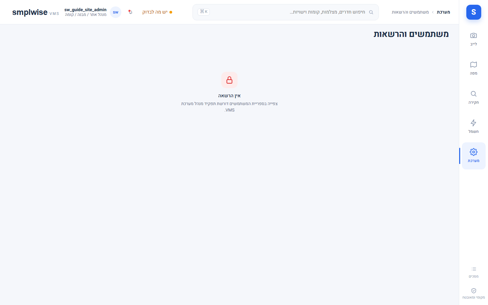
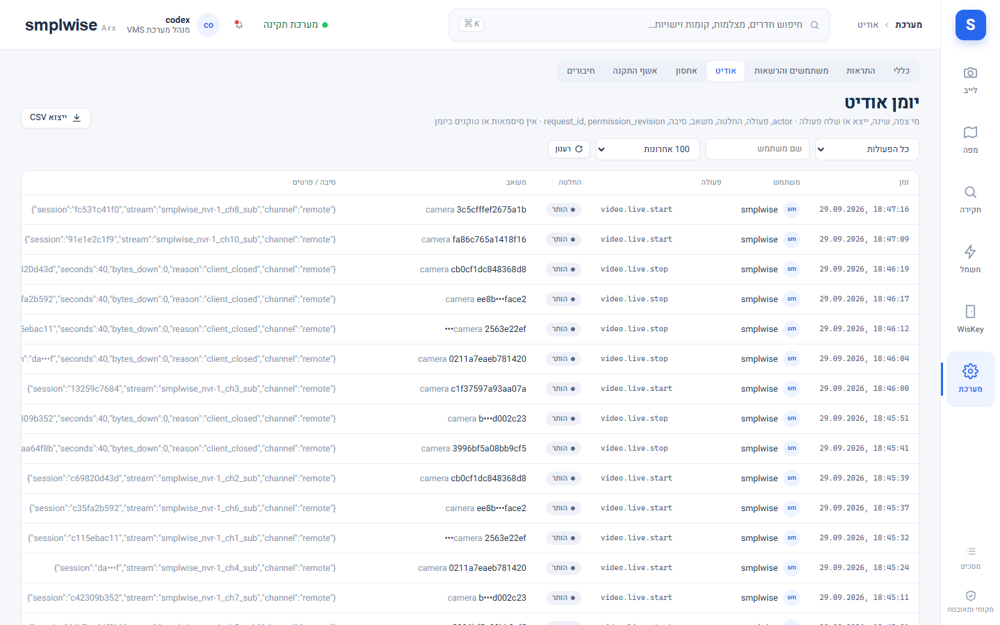

# משתמשים והרשאות

Source: original

## מה זה

מסך "משתמשים והרשאות" (מערכת ← משתמשים והרשאות) הוא מקום ניהול הזהות והתפקידים: חמש לשוניות —
**משתמשים**, **קבוצות**, **תפקידים**, **הרשאות אפקטיביות**, **אודיט הרשאות**. משתמשים עצמם
**מגיעים רק מ-Home Assistant** — אינטגרציית הגשר דוחפת את ספריית המשתמשים (id, שם, username,
פעיל, דגל מנהל, קבוצות) כל דקה. איש לא נוצר כאן, אין סיסמאות כאן, ודגל "מנהל HA" מוצג כמידע בלבד
ולא מקנה שום דבר במוצר.

## איך אני… (מנהל מערכת / מנהל אתר — לשונית משתמשים)

1. **רואה את כל המשתמשים.** טבלה עם שם, מצב (פעיל/מושבת ב-HA), מנהל HA (מידע בלבד — לא תפקיד
   VMS), סנכרון (מתי הספרייה עודכנה מ-HA לאחרונה), תפקיד/היקף.
2. **מסנכרן ידנית.** "סנכרון משתמשים מ-HA" מבקש דחיפה מיידית מהאינטגרציה במקום לחכות לדקה
   הבאה.
3. **משייך תפקיד (`rbac.assign`).** בוחרים תפקיד + היקף (כל ההתקנה / אתר / מבנה / קומה) למשתמש
   או לקבוצת VMS. "שמור שיוך" כותב ומבוקר עם diff לפני/אחרי; "ביטול שיוך" מסיר.
4. **מבין מה קורה כשמשתמש מושבת ב-HA.** הגישה נלקחת בדחיפת הספרייה הבאה (עד 60 שניות): בקשות
   חדשות נדחות, שקעי live/playback פתוחים נסגרים תוך שניות, האודיט שומר את ה-id. **מנהל VMS פעיל
   אחרון לעולם לא מוסר רק בגלל שדחיפה השמיטה אותו** (last-admin guard).

## איך אני… (קבוצות, T082)

5. **יוצר קבוצה** ("קבוצה חדשה", למשל "עורכי קומה 2") ומוסיף לה חברים.
6. **משייך תפקיד לקבוצה שלמה** — כל חבר יורש את השיוך; ההרשאה האפקטיבית של משתמש היא **איחוד**
   השיוכים שלו עצמו ושל כל הקבוצות שהוא חבר בהן.
7. **רואה תצוגה מקדימה של השפעה** לפני שמירה — לכל שינוי שיוך/חברות, המערכת מציגה מראש איזה
   משתמשים מושפעים.
8. מחיקת קבוצה **נדחית** כל עוד יש בה חברים או שיוכים.

## איך אני… (האצלה למנהל אתר, T082)

9. **מנהל אתר עם `rbac.assign` מואצל** יכול לשייך תפקידים **בתוך האתר שלו בלבד**, בכפוף לארבע
   מגבלות: (א) רק תפקידים ברשימת ההיתר של האצלה (נערכת בלשונית תפקידים; ברירת מחדל
   viewer/operator/editor/kiosk, בתוספת תפקידים מותאמים אישית שסומנו **"ניתן להאצלה"**); (ב) רק
   תפקידים שההרשאות שלהם הוא עצמו מחזיק באותו היקף; (ג) רק למשתמשים בודדים, **לעולם לא לקבוצות**;
   (ד) **לעולם לא תפקיד עם הרשאת מערכת**. חריגה מכל אחת נדחית עם סיבה (`role_not_delegable`,
   `delegation_escalation`, `delegation_groups`) ומבוקרת.
10. **דנייה (deny) על משתמש נשארת כלי של הרשאה מלאה בלבד** — מנהל אתר מואצל לא יכול ליצור או
    להסיר deny.
11. סמכות מלאה (הענקת `system_admin` לדוגמה) דורשת **גם** `rbac.assign` **וגם**
    `rbac.roles.manage` ברמת ההתקנה — לא מספיק להחזיק אחת מהן.

## איך אני… (לשונית תפקידים, מנהל מערכת)

12. **בונה תפקיד מותאם אישית** מהרשאות רגילות בתוספת **הענקות רגישות** שיש לסמן במפורש (למשל
    `door.unlock`, `alarm.disarm`, `access.people.manage`, `access.cards.capture`,
    `devices.control_bulk`). תפקיד מותאם אישית **לעולם לא** נושא הרשאת מערכת (ניהול תצורה/תפקיד/
    קישור); תפקידים מובנים (viewer/operator/editor/kiosk/site_admin/system_admin) **אינם ניתנים
    לעריכה**.
13. לפני שמירה, דיאלוג מציג את **ההשפעה** (קישורים, משתמשים, קבוצות, היקפים, הרשאות שנוספו/הוסרו).
    השינוי חל על כל סשן מושפע בבקשתו הבאה; עריכה מיושנת נדחית (revision); תפקיד שעדיין מקושר לא
    ניתן למחיקה.
14. מסמנים תפקיד "**ניתן להאצלה**" כדי שמנהל אתר יוכל לשייך אותו בעצמו.

## איך אני… (לשונית הרשאות אפקטיביות והרשאות מיוחדות בהיקף WisKey)

15. **"הרשאות אפקטיביות"** מחשבת בצד השרת מה משתמש נתון באמת רשאי לעשות בהיקף נתון — בלי
    התחזות (impersonation), רק חישוב.
16. הרשאות WisKey הרגישות: `access.read` (viewer ומעלה) — צפייה בלבד; `access.release`
    (site_admin/system_admin) — שחרור דלת, מענה/דחייה/ניתוק, הכרזות; `access.people.manage`
    (site_admin/system_admin) — עורך האנשים; `access.cards.capture` (site_admin/system_admin,
    בנוסף ל-people.manage) — קליטת כרטיס. כדי לתת למישהו רק עריכת אנשים בלי כל תפקיד מנהל אתר —
    בונים תפקיד מותאם אישית שמפרט את `access.people.manage` בין הרשאותיו הרגישות.

## איך אני… (לשונית אודיט הרשאות)

17. **"יומן אודיט"** (מערכת ← יומן אודיט) מציג שורה לכל פעולה מורשית/נדחית: זמן, משתמש, פעולה,
    משאב, החלטה (allowed/denied — כולל הסיבה), תפקיד/היקף ששימשו. שורות נשמרות `audit.retention_days`
    (ברירת מחדל 365 יום).

## שים לב

- כל שינוי שיוך, קבוצה או תפקיד מקדם **גרסת הרשאה (revision)** ונכנס לתוקף מיד; עריכה על גרסה
  מיושנת נדחית, לא דורסת בשקט.
- כל שינוי שיוך/חברות בבאצ' (`POST /access/bindings/bulk`, עד 50 פריטים) הוא **all-or-nothing** —
  הפריט הראשון שנדחה עוצר את כל הבקשה עם האינדקס וה-id שלו.
- אף כתיבת שיוך/חברות לא יכולה להשאיר את ההתקנה **בלי מנהל מערכת פעיל אחד לפחות** (409
  `last_admin`), כולל deny על עצמך.
- הרשאות אמיתיות תמיד נבדקות **בצד השרת** על המשאב עצמו — מצלמה נגישה רק דרך קומה שהמשתמש רשאי
  לראות, ומניעה מפורשת בקומה סופית אפילו למשתמש כל-ההתקנה.

*יוחלף בצילום מהמעבדה.*

*יוחלף בצילום מהמעבדה.*
