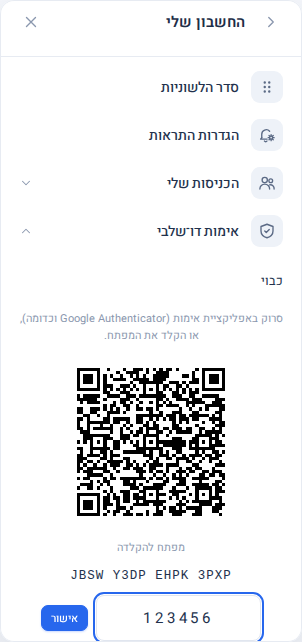
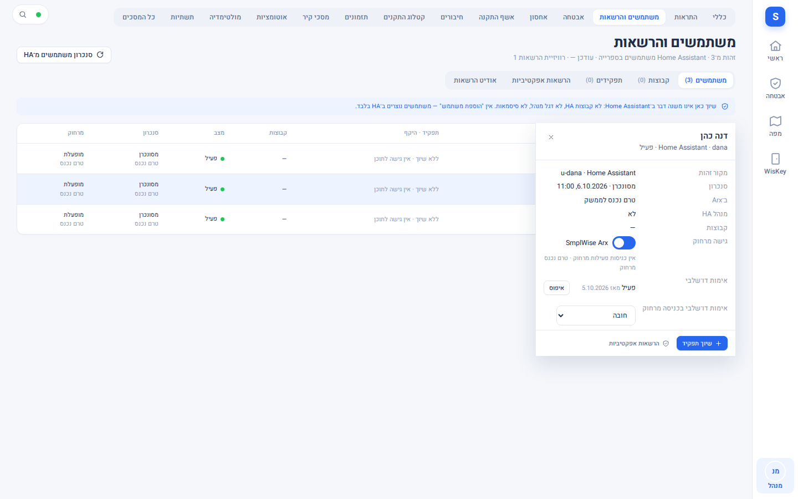
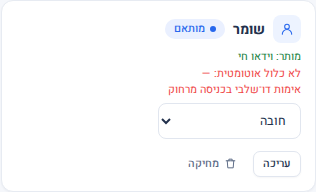
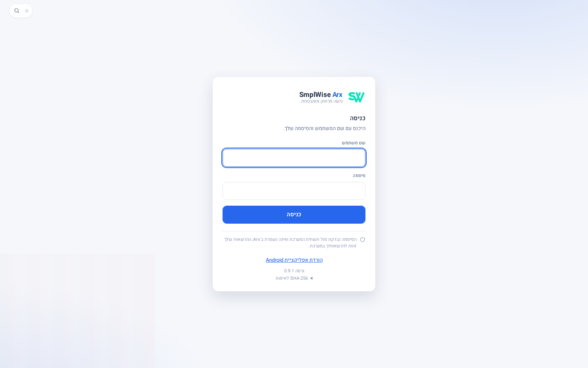

# אימות דו-שלבי והורדת אפליקציית Android

Source: original

## מה זה

שני דברים שנוגעים לכניסה מרחוק (דרך כתובת הגישה מרחוק של האתר):

1. **אימות דו-שלבי רשות.** מי שנרשם מקליד, בכניסה מרחוק חדשה, גם קוד בן 6 ספרות מאפליקציית אימות (Google Authenticator וכדומה)
   - אחרי הסיסמה.
2. **הצעת הורדה לאפליקציית Android** במסך הכניסה, למי שנכנס מטלפון Android.

**שניהם כבויים או רשות כברירת מחדל.** בלי פעולה של משתמש או מנהל, כניסה מרחוק נראית בדיוק כמו קודם.

## איך אני… (כל משתמש)

### הפעלת אימות דו-שלבי

1. פותחים את תפריט המשתמש (האווטאר) › **החשבון שלי** › **אימות דו-שלבי** (בכניסה מרחוק).
2. לוחצים **הפעלה**. מופיע קוד QR ומתחתיו מפתח להקלדה.
3. באפליקציית האימות במכשיר סורקים את ה-QR, או מקלידים את המפתח.
4. מקלידים את הקוד בן 6 הספרות שהאפליקציה מציגה ולוחצים **אישור**. מופיע "האימות הדו-שלבי הופעל".

*צילום מהדגמה: קוד QR ומפתח להקלדה בדויים (נתוני בדיקה), ושדה הקוד בן 6 הספרות.*

מעכשיו, כניסה מרחוק **חדשה** (דפדפן או מכשיר שלא מחוברים) מבקשת: סיסמה, ואז קוד. כניסה שכבר פתוחה ממשיכה בלי לשאול שוב.

### כיבוי

באותו מקום: **כיבוי**. מכבים רק כשמוכנים: זה מסיר את ההגנה הנוספת מהחשבון.

### כשמקלידים קוד

- קוד שכבר נעשה בו שימוש נדחה: ממתינים לקוד הבא (מתחלף כל חצי דקה).
- **אחרי 5 קודים שגויים הכניסה ננעלת זמנית** (10 דקות; הנעילה נשמרת גם אם המערכת מופעלת מחדש). זו הגנה, לא תקלה: ממתינים ומנסים שוב.

## איך אני… (מנהל מערכת)

1. **מדיניות.** הגדרות › **גישה מרחוק** › "אימות דו-שלבי מאפליקציה":
   - **רשות** (ברירת מחדל): כל משתמש מחליט בעצמו.
   - **חובה למנהלים:** כניסה מרחוק של מנהל שלא הפעיל אימות נדחית עד שיפעיל. כדי שלא ינעלו מנהלים מחוץ למערכת, ודאו שכל
     מנהל נרשם **לפני** שמשנים לכאן.
   (בשורה נפרדת באותו מסך קיימת גם הגנה "אימות דו-שלבי למנהלים" של תשתית המערכת: אלה שני מנגנונים שונים.)
   **חובה או רשות למשתמש או לתפקיד מסוים:** במסך משתמשים והרשאות, בכרטיס המשתמש (שורה "אימות דו־שלבי בכניסה מרחוק") ובלשונית **תפקידים**, בוחרים
   "לפי ההגדרה הכללית", "רשות" או "חובה". עדיפות: ההגדרה של המשתמש עצמו, אחריה של תפקידיו (די בתפקיד אחד עם "חובה"), ואחריהן ההגדרה הכללית.
   משתמש עם "חובה" שלא הפעיל אימות נדחה בכניסה מרחוק (גם מאפליקציה) עד שיפעיל; הכניסה המקומית נשארת פתוחה ומשמשת לכך. הגדרת "חובה" סוגרת
   את הכניסות הפתוחות מרחוק של משתמשים בלי אימות. אין "זכור דפדפן" ואין אישור בדחיפה.

   

   *צילום מהדגמה: מגירת משתמש, בתחתית פרטיו שורת מדיניות האימות (לפי ההגדרה הכללית / רשות / חובה) מתחת למצב האימות והאיפוס; נתוני דמה.*

   

   *צילום מהדגמה: כרטיס תפקיד בלשונית "תפקידים", עם אותה בחירה; נתוני דמה.*

   **מה רואה משתמש שהמנהל דרש ממנו אימות ועוד לא הפעיל:** בכניסה מרחוק מופיעה הודעה שמנהל המערכת דורש אימות דו־שלבי לחשבון, ושצריך
   להפעיל אותו ב"החשבון שלי" בכניסה מקומית ואז להיכנס מרחוק. עד אז אין כניסה מרחוק. לכן לפני שמסמנים "חובה" ודאו שלמשתמש יש
   כניסה מקומית.
   **אפליקציות וכלים שנכנסים עם אסימון:** מגרסה 2.2.1 אותו כלל חל גם על כניסה מבוססת אסימון (לא רק על כניסת הדפדפן), הן בבקשות
   רגילות והן בחיבור החי. לקוח כזה צריך לדעת לשלוח את הקוד. **התקנה שהפעילה אימות דו־שלבי ב-2.2.0 צריכה להתייחס אליו כחלש עד שהיא
   מריצה 2.2.1 ומעלה:** בגרסה 2.2.0 היה מסלול כניסה שעקף אותו. ההגדרה `security.second_factor_bearer` (ברירת מחדל `enforce`)
   קיימת למקרה חירום; `off` מחזירה את ההתנהגות הישנה ואינה מומלצת.
2. **איפוס למשתמש שאיבד את האפליקציה.** הגדרות › משתמשים והרשאות › המשתמש › **אימות דו-שלבי** › **איפוס**. הפעולה נרשמת ביומן הביקורת; אחריה המשתמש נכנס בלי קוד ויכול להירשם מחדש. המשתמש מקבל הודעה בתיבת ההתראות שלו (בלי שם המנהל ובלי שום סוד; כך הוא יודע שהאיפוס קרה ושעליו להירשם מחדש), וקודי המכשיר של אפליקציית הטלפון שלו מבוטלים: האפליקציה תבקש רישום מחדש.
3. **הצעת הורדה לאפליקציית Android.** הגדרות › גישה מרחוק › כרטיס **"הורדת אפליקציית Android"**:
   - **כתובת הורדה** - https בלבד. ריק = הקישור לא מוצג כלל.
   - **תווית גרסה** ו-**SHA-256** - לא חובה; מוצגים ליד הקישור כדי לאמת את הקובץ.
   הקישור מוצג במסך הכניסה מרחוק רק במכשירי Android, ורק מחוץ לאפליקציה עצמה.
4. **APK מובנה בתוסף (מגרסה 2.2.1).** אפשר לצרף לתמונת התוסף קובץ APK חתום, והמערכת תציע אותו מעצמה, עם גרסה, גודל ו-SHA-256, בלי
   שתגדירו כתובת. **שום דבר לא מוצג עד שנכנס APK חתום לתמונה** (זה נעשה בשחרור, לא בהגדרות): בגרסאות 2.2.1 ו-2.3.0 אין APK בתמונה,
   ולכן אין מה להציע. כתובת https שהגדרתם בכרטיס "הורדת אפליקציית Android" תמיד גוברת על הקובץ המובנה. אין מה להפעיל בצד הבעלים.

   

   *צילום מהדגמה: כתובת ההורדה בדויה (example); הקישור, הגרסה ו-SHA-256 לאימות הקובץ.*

## מגבלות — כנות מלאה

- **אפליקציית ה-Android הנוכחית היא בניית ניסוי (debug) ואינה מיועדת להפצה.** אל תגדירו כתובת הורדה עד שתהיה בניית שחרור חתומה.
  עד אז השדה נשאר ריק. ה-APK המובנה יוצע רק כשייכנס לתמונה קובץ חתום; עד אז לא מוצג דבר.
- האימות הדו-שלבי חל על **כניסה מרחוק בלבד**: לא על הלוח המקומי, ולא על אישור מחדש לפעולות רגישות (זה שלב עתידי).
- אין קודי שחזור: כשהאפליקציה אבדה, הדרך חזרה היא איפוס על ידי מנהל.
- נבדק מול מערכת בדיקה ופענוח קודים בתוכנה; **לא נבדק עם אפליקציית אימות פיזית** שסורקת את ה-QR.
- קישור ההורדה נבדק מול דמויות בלבד.

## שים לב

- האימות הדו־שלבי מגן על הכניסה ל-Arx בלבד, ולא על הכניסה של תשתית המערכת עצמה.
- הפעלת האימות או איפוסו מבטלים את קודי המכשיר (`arxd_...`) של אפליקציית הטלפון של המשתמש; רישום המכשיר, ההיסטוריה וההרשמה להתראות נשארים, והאפליקציה נרשמת מחדש בכניסה (שמבקשת קוד).
- הסוד של האימות נשמר מוצפן ולא מוצג שוב אחרי ההרשמה.
- הרשמה, כיבוי ואיפוס נרשמים ביומן הביקורת, בלי הקודים עצמם.
