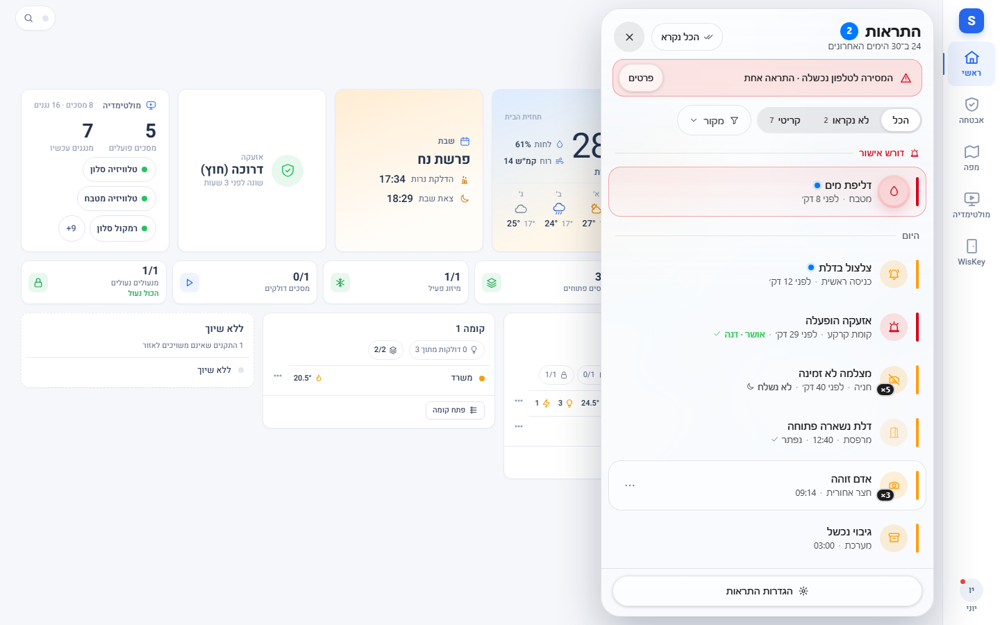
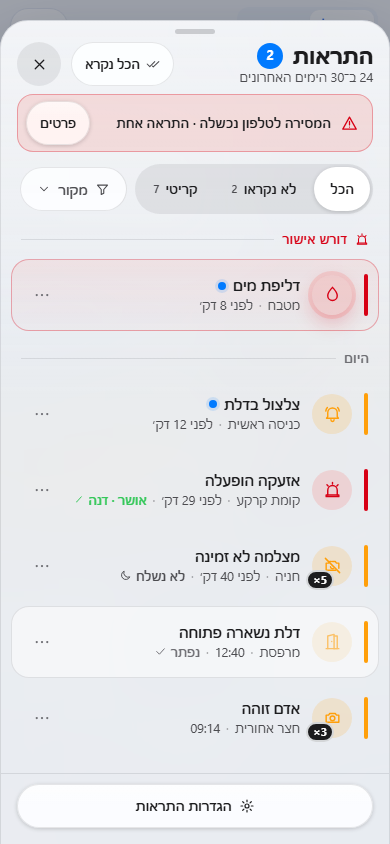
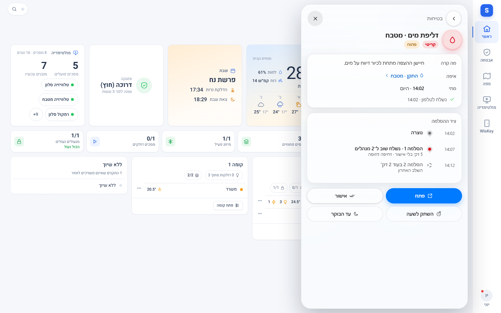
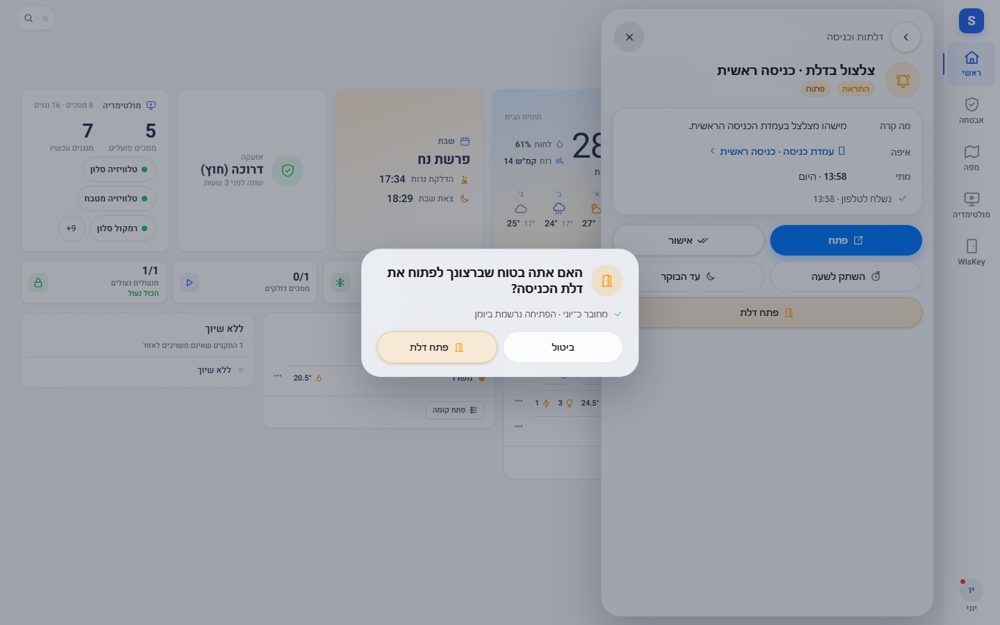
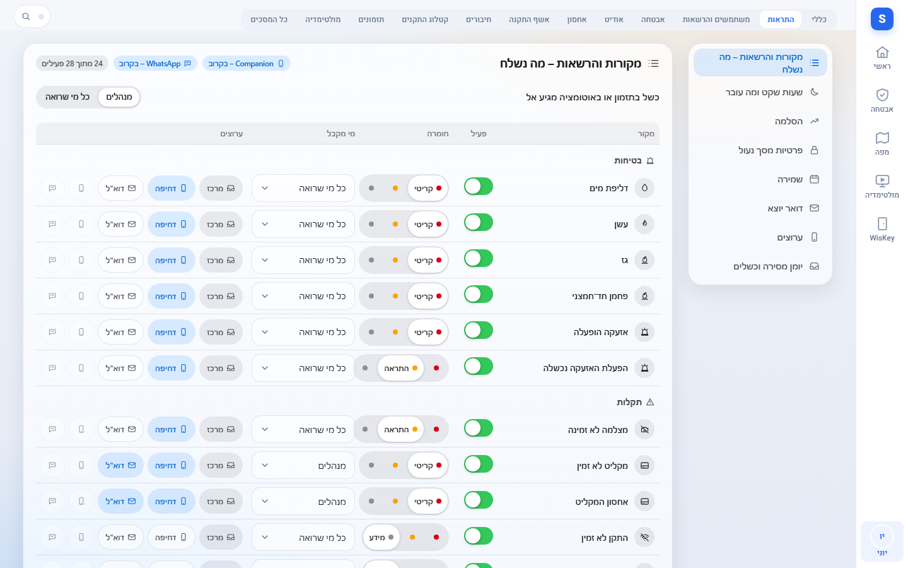
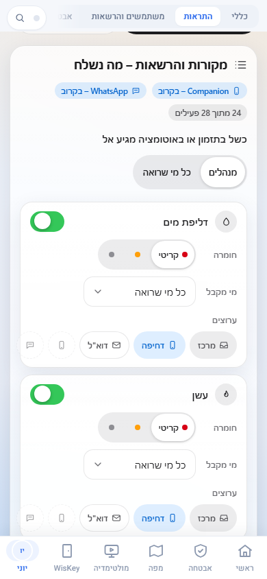
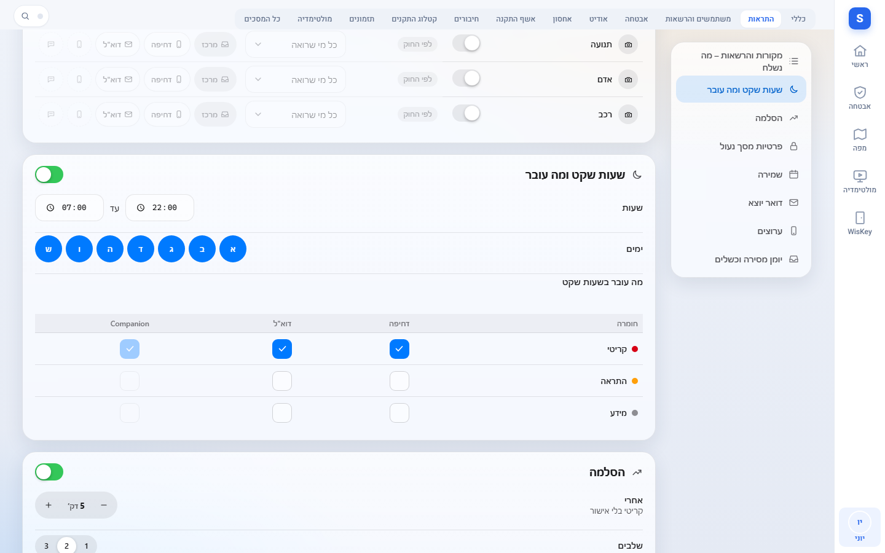
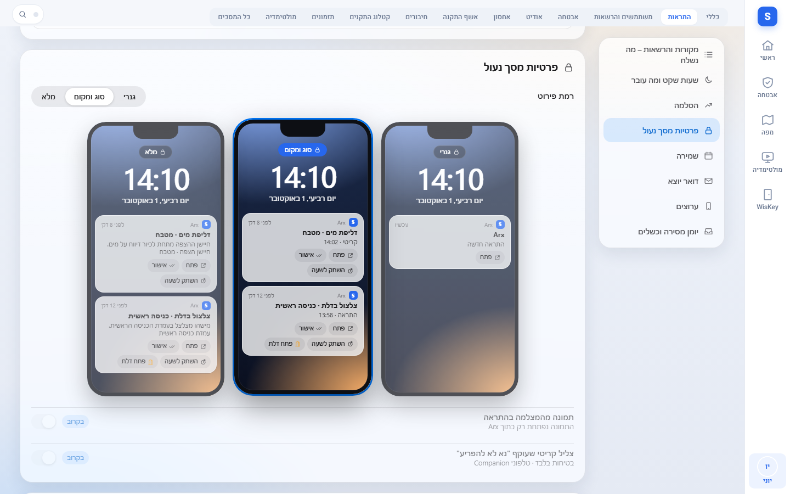
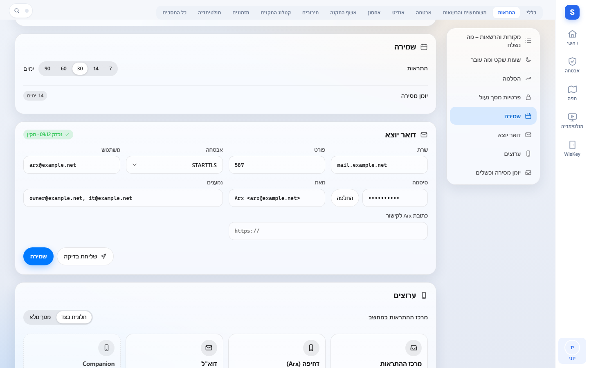
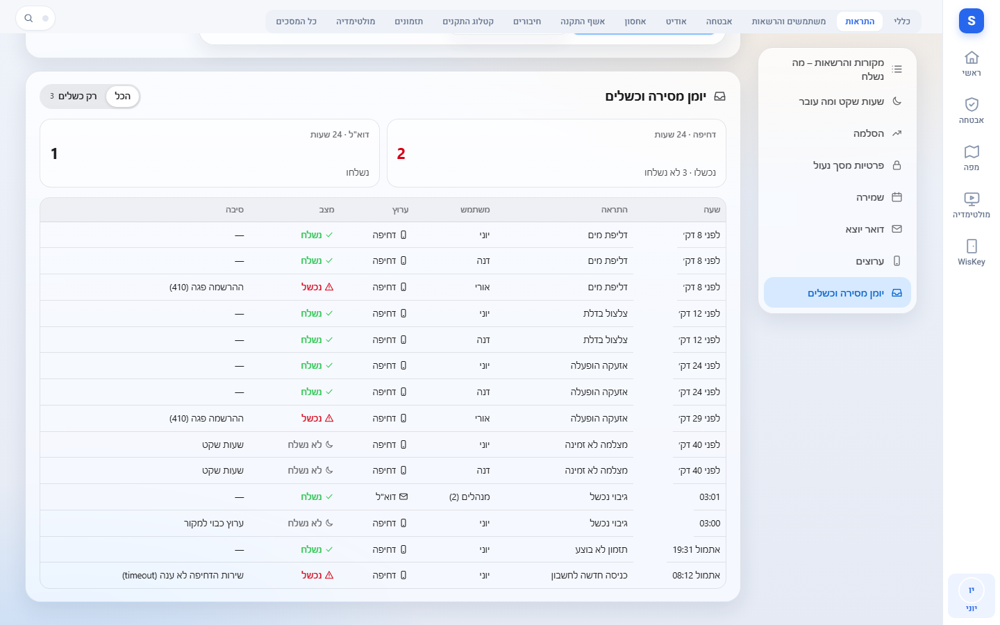

# התראות

Source: original

## מה זה

**מרכז ההתראות** הוא המקום האחד שבו מגיעות כל ההתראות של Arx: דליפת מים, עשן, אזעקה, צלצול בדלת, דלת שנשארה פתוחה, מצלמה או
מקליט שנפלו, גיבוי שנכשל, תזמון שלא בוצע, התראות מחוקים ועוד. הוא נפתח מהפעמון **התראות** בתפריט המשתמש (האווטאר), ואותן
התראות מגיעות גם כהתראות Push לטלפון ולמחשב, גם כש-Arx סגור, וחלקן גם בדואר אלקטרוני (לתקלות מערכת וגיבויים).

*צילום מהדגמה.*

*צילום מהדגמה.*

**כללים שכדאי להכיר:**

- **כל אחד מקבל רק מה שהוא רשאי לראות.** התראה על מטבח מגיעה למי שרואה את המטבח, התראה על מצלמה למי שרואה אותה, התראה על המערכת
  למנהלים. ההרשאה נבדקת כשההתראה נוצרת, בכל שליחה ובכל קריאה של הרשימה: מי שההרשאה שלו הוסרה לא רואה גם את ההתראות הישנות.
- **אין העדפות אישיות.** מה נשלח, למי, בכמה ערוצים ומתי לשתוק - מגדיר **מנהל** בלשונית **מערכת ← התראות** (בהמשך). למשתמש נשארים
  שלושה דברים בלבד: נקרא / לא נקרא, **השתק לשעה**, ו**אישור**.
- **"פתח דלת" אף פעם לא פותח דלת לבד.** בהתראת צלצול הכפתור פותח רק חלון אישור בתוך Arx, למשתמש מחובר שיש לו הרשאה לפתוח את
  הדלת. רק לחיצה על האישור שולחת את הפקודה. טלפון לא נעול אינו זיהוי של אדם, ולכן אין פתיחה ישירות מתוך ההתראה.
- **ההתראה עצמה קצרה.** על המסך הנעול רואים סוג ומקום ("דליפת מים · מטבח"), בלי תמונה ובלי שם של אדם. התמונה והפרטים נפתחים
  רק בתוך Arx, אחרי כניסה.

## איך אני… (כל משתמש)

1. **פותח את המרכז.** האווטאר ← **התראות**. המספר ליד השם הוא כמות ההתראות שלא נקראו, ונקודה אדומה על האווטאר אומרת שיש התראה
   קריטית פתוחה. בדסקטופ המרכז נפתח כחלונית בצד, ובטלפון כגיליון מלמטה.
2. **קורא ומסנן.** ההתראות מסודרות לפי יום, החדשה למעלה. התראה קריטית של בטיחות שעוד לא אושרה ולא נפתרה **נעוצה** בראש הרשימה.
   **×5** אומר שאותה תקלה חזרה חמש פעמים ואוחדה לשורה אחת. המסננים: **הכל**, **לא נקראו**, **קריטי**, ו**מקור** (בטיחות, התראות,
   דלתות, תקלות בהתקנים, אוטומציות, מערכת, אבטחה). **הכל נקרא** מסמן את כולן.
3. **פותח התראה.** לחיצה על שורה מציגה מה קרה, איפה, מתי (ראשונה ואחרונה), המצב, **שורת המסירה אליכם** ("נשלח לטלפון 14:02" /
   "לא נשלח · שעות שקט" / "המסירה נכשלה") ובהתראה קריטית גם את **ציר ההסלמה**. בהתראה על מצלמה אפשר לראות את התמונה - בתוך Arx
   בלבד.

   
*צילום מהדגמה.*

4. **משתיק.** **השתק לשעה**, או **עד הבוקר** בפירוט, מסתירים את ההתראה מספירת "לא נקראו" ומשתיקים שליחה חוזרת שלה - **רק לכם**.
   כל משתמש אחר ממשיך לקבל אותה.
5. **מאשר.** **אישור** (בתפריט השורה ובפירוט, למי שמותר לו) מסמן שמישהו טיפל, **עוצר את ההסלמה** ונראה לכולם עם שם המאשר. התראה
   על תקלה שעדיין נמשכת נשארת רשומה כמאושרת עד שהתקלה נפתרת. התראה שחוק העלה נרשמת גם ב**חקירה ← חוקים והתראות**, ואישור באחת
   משתי הרשימות מאשר גם את השנייה.
6. **פותח את ההתקן.** בתפריט השורה, **פתח את המצלמה** / **פתח את ההתקן** וכו' מעבירים ישירות למסך הנכון.
7. **פותח דלת מתוך צלצול.** בהתראת צלצול יש גם **פתח דלת**. הלחיצה פותחת חלון "האם אתה בטוח שברצונך לפתוח את ...?". **ביטול** או
   Escape סוגרים בלי לשלוח דבר; **פתח דלת** שולח את הפקודה בנתיב הרגיל של פתיחת דלת, עם האימות הנוסף, ההגבלות והרישום ביומן הביקורת
   שלו - ובו מצוין שהפתיחה התחילה מהתראה. למי שאין הרשאת פתיחה אין כפתור.

   
*צילום מהדגמה.*

8. **מקבל התראות Push בטלפון או במחשב.** מתקינים את Arx כאפליקציה (שלב 9), ואז **האווטאר ← החשבון שלי ← הגדרות התראות** ←
   **הפעלת התראות במכשיר הזה**, ומאשרים את בקשת הדפדפן. **שליחת התראת בדיקה** שולחת התראה לכל המכשירים שלכם (עד 3 בדקה).
   ההרשמה היא של המכשיר הזה בלבד; **המכשירים שלי** מציג את כולם (עד 10) ומאפשר להסיר. מה יישלח אליו - החלטת המנהל, ולכן אין
   כאן בחירת סוגי התראות.
9. **מתקין את Arx כאפליקציה.** באנדרואיד (Chrome) ובמחשב (Chrome / Edge) מופיע בתחתית המסך הכרטיס **התקן את Arx**; לוחצים **התקנה**.
   **לא עכשיו** מסתיר אותו לשבועיים. באייפון ובאייפד: ב-Safari **שיתוף ← הוספה למסך הבית**, ופותחים את Arx מהאייקון - **באייפון
   ובאייפד התראות מגיעות רק לאפליקציה שהותקנה כך** (iOS 16.4 ומעלה).
10. **לוחץ על התראת Push.** Arx נפתח ישירות על ההתראה (אחרי כניסה, אם צריך). בהתראה יש בדפדפנים שתומכים בכך גם **אישור** ו**השתק
    לשעה**, ובצלצול **פתח דלת** - שפותח את חלון האישור בלבד, כמו בשלב 7.

## איך אני… (מנהל: הרשאת "ניהול התראות")

הלשונית **מערכת ← התראות** מופיעה במלואה למי שיש לו את ההרשאה **ניהול התראות** (למנהל מערכת היא קיימת כברירת מחדל; אפשר לתת אותה
לתפקיד מותאם - ראו `81-roles_HE.md`). מי שאין לו אותה רואה בלשונית רק את רישום המכשיר שלו (שלב 8 למעלה). כל אפשרות של ההתראות יושבת
כאן ורק כאן, בשמונה מדורים לפי הסדר. כל שינוי נשמר מיד ונרשם ביומן הביקורת (שמות השדות בלבד).

*צילום מהדגמה.*

*צילום מהדגמה.*

1. **מקורות והרשאות - מה נשלח.** טבלה של כל המקורות, מקובצים לפי סוג. לכל מקור: **פעיל**, **חומרה** (מידע / התראה / קריטי), **מי
   מקבל** (כל מי שרואה / מנהלים / היוזם או בעל החשבון / משתמשים נבחרים) ו**ערוצים**: מרכז ההתראות (תמיד פעיל), **דחיפה**, **דוא"ל**,
   ושני ערוצים עתידיים (אפליקציית הטלפון של תשתית המערכת, ו-WhatsApp) שמסומנים **בקרוב** ואי אפשר להפעיל. בראש המדור בחירה למי מגיע
   כשל בתזמון או באוטומציה: **מנהלים** או **כל מי שרואה** אותם. "מי מקבל" הוא תמיד **בתוך** מה שהנמען רשאי לראות - הוא לא מרחיב
   הרשאה. בטלפון כרטיס לכל מקור.
2. **שעות שקט ומה עובר.** שעת התחלה וסיום, ימים, ו**מטריצה** של חומרה × ערוץ שקובעת מה נשלח בכל זאת בשעות השקט. ברירת מחדל: רק
   **קריטי** עובר (דחיפה ודוא"ל). כל השאר מחכה במרכז ההתראות ואינו נשלח אחר כך; בשורת המסירה כתוב "לא נשלח · שעות שקט". המרכז
   מציג לכולם "שעות שקט עד 07:00" כשהן פעילות. מ-22:00 עד 22:00 נדחה.

   
*צילום מהדגמה.*

3. **הסלמה.** התראה **קריטית** שאיש לא אישר נשלחת שוב, בדחיפות גבוהה ובעקיפת שעות השקט, **למנהלים** (או למשתמשים שנבחרו):
   **אחרי כמה דקות** (ברירת מחדל 5, מ-1 עד 60), **כמה שלבים** (ברירת מחדל 2, עד 3). **אישור או פתרון עוצרים אותה מיד.** תצוגה
   מקדימה מראה את הציר, וכל שלב נרשם גם בציר שבפירוט ההתראה.
4. **פרטיות מסך נעול.** רמת הפירוט של ההתראה על המסך הנעול, לכל ההתקנה: **גנרי** ("התראה חדשה"), **סוג ומקום** (ברירת מחדל:
   "דליפת מים · מטבח") או **מלא** (גם שם ההתקן). תצוגה מקדימה מציגה את שלושתן. אף רמה לא כוללת שם של אדם, תמונה או מזהה. **תמונה
   בהתראה** ו**צליל קריטי שעוקף "נא לא להפריע"** מסומנים **בקרוב** וכבויים.

   
*צילום מהדגמה.*

5. **שמירה.** כמה זמן ההתראות נשמרות במרכז: 7, 14, 30 (ברירת מחדל), 60 או 90 ימים. יומן המסירה נשמר 14 ימים.
6. **דואר יוצא.** שרת הדואר שאתם מספקים: שרת, יציאה, הצפנה (STARTTLS / TLS / ללא), משתמש, **סיסמה** (נכתבת ואינה מוצגת שוב), כתובת
   שולח ונמענים (עד עשרה), ו**כתובת Arx לקישור** (לא חובה). **שליחת בדיקה** שולחת מייל אחד ומציגה את התוצאה במקום ("נשלח מייל בדיקה" או
   סוג הכשל: שם, חיבור, הצפנה, זיהוי, סירוב, זמן). בלי הגדרה אין שליחת דואר; הערוץ מסומן "לא מוגדר". הדואר מיועד כברירת מחדל לתקלות
   מערכת, גיבוי נכשל, מקליט לא זמין ועדכון זמין; אפשר להוסיף אותו לכל מקור במדור 1. המייל קצר: סוג, מקום, שעה וקישור - בלי תמונה
   ובלי שם של אדם.

   
*צילום מהדגמה.*

7. **ערוצים.** מרכז ההתראות (פעיל תמיד), דחיפה (עם מספר המכשירים הרשומים וכפתור **החלפת המפתח**, שמוחק את כל ההרשמות ומחייב רישום
   מחדש - רק אם יש חשש שהמפתח נחשף), דוא"ל, ושני הערוצים העתידיים. כאן גם בוחרים אם המרכז נפתח בדסקטופ כ**חלונית בצד** או כ**עמוד
   מלא** (בטלפון תמיד גיליון מלמטה).
   **ערוץ "הכרזה" (מגרסה 2.3.0):** התראות יכולות גם להישמע ברמקול בחדר שנבחר. ההגדרות (חדר, חומרה מינימלית, קטגוריות) נמצאות
   בהגדרות › מולטימדיה › הכרזות קוליות (`42-multimedia_HE.md`). הערוץ כבוי בכל מדיניות, ובטבלת הערוצים כאן עדיין אין לו מתג.
   התראה קריטית נשמעת גם בשעות שקט של ההכרזות.
8. **יומן מסירה וכשלים.** לוח כשלים של 24 השעות האחרונות לפי ערוץ וטבלה של כל המסירות (שעה, התראה, משתמש, ערוץ, מצב, סיבה), עם
   **רק כשלים**. אין בו כתובות: לא כתובת דואר ולא כתובת הרשמה של מכשיר. אם ערוץ נכשל אצל כולם רבע שעה, נוצרת התראת מערכת
   "ערוץ התראות לא פועל".

   
*צילום מהדגמה.*

## איך זה עובד (בקצרה)

- **מקור → מדיניות → התראה → נמענים → ערוצים.** כל מקור (חיישן, מצלמה, דלת, גיבוי, חוק...) רק מדווח. המדיניות של המקור במדור 1
  קובעת אם פעיל, איזו חומרה, כמה זמן התנאי צריך להימשך (למשל דלת פתוחה 10 דקות) ולמי לשלוח. ההתראה נשלחת רק אחרי שנשמרה, ושליחה
  שנכשלה נוסה שוב (דחיפה: עד שלוש פעמים; דוא"ל: שלוש פעמים בחצי שעה), עם בדיקה חוזרת של ההרשאה.
- **קיפול.** אותה תקלה שחוזרת ממשיכה את אותה שורה (×N) ואינה שולחת שוב בכל חזרה. עלייה בחומרה כן שולחת שוב.
- **סיום.** תנאי שהסתיים (חיישן יבש, דלת נסגרה, מצלמה חזרה, צלצול הסתיים) סוגר את השורה בעצמו. במקורות קריטיים נשלחת גם הודעת
  "הסתיים" שקטה.
- **חיבור בין חוקים להתראות.** התראה שחוק מעלה היא גם שורה במרכז, ואישור בצד אחד מאשר את שני הצדדים.

## שים לב

- **דרוש https.** התראות Push עובדות רק בכתובת מאובטחת: גישה מרחוק (`https://<האתר>/arx`) או תשתית המערכת בכתובת https. בכתובת `http://`
  מקומית הלשונית מסבירה שזה לא אפשרי, ומרכז ההתראות מציג באנר "התראות דחיפה לא נתמכות במכשיר הזה".
- **דפדפן שחסם התראות.** הלשונית והבאנר אומרים זאת; משחררים בהגדרות האתר בדפדפן (סמל המנעול ליד הכתובת) ומרעננים.
- **מה נשלח ומה לא.** הודעת Push מכילה כותרת, שורה קצרה, קישור לפתיחת ההתראה ב-Arx, סוג וחומרה - בלי תמונה, בלי שם של אדם ובלי סיסמה.
  התוכן מוצפן מקצה לקצה עד המכשיר. כפתורי **אישור** ו**השתק לשעה** בהתראה נושאים אסימון חד-פעמי שחל על אותה התראה ואותו משתמש בלבד
  (תקף שעה); **אין** אסימון לפתיחת דלת, לאזעקה או לפקודת התקן, ושום כפתור בהתראה לא מבצע פקודה כזו.
- **אייפון ואייפד.** ייתכן שכפתורי הפעולה בהתראה לא יופיעו; לחיצה על ההתראה פותחת את Arx על ההתראה.
- **יומן ביקורת.** אישור, הסלמה, שינוי הגדרות (שמות שדות בלבד), בדיקת דואר, הרשמה והסרה של מכשיר ופתיחת דלת מתוך התראה נרשמים
  ביומן הביקורת, בלי כתובות הרשמה וסיסמאות.
- **מפתח ה-VAPID** (המפתח שבו Arx חותם על ההתראות) נוצר פעם אחת בכל התקנה ונשמר רק בשרת המערכת. הוא **לא** נכלל בגיבוי פרויקט של
  Arx, אבל **כן** נכלל בגיבוי המלא של תשתית המערכת - שמרו קבצי גיבוי כאלה כמו סיסמה. סיסמת הדואר לא נכללת בשום גיבוי.
- **בלי חיבור לרשת**, Arx מציג את המסך האחרון שנשמר או "אין חיבור לשרת".
